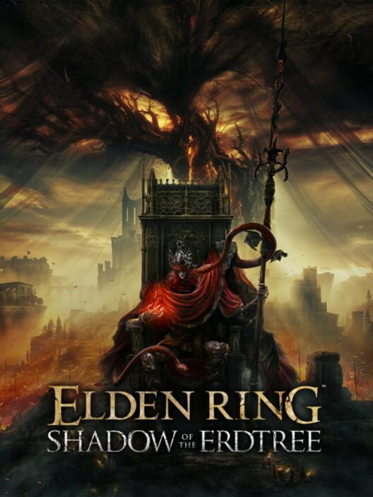
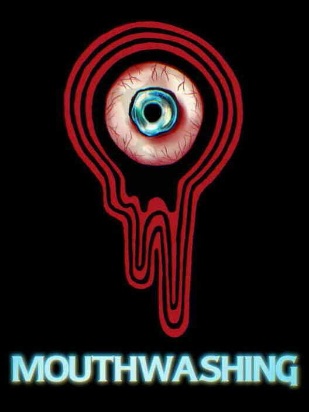
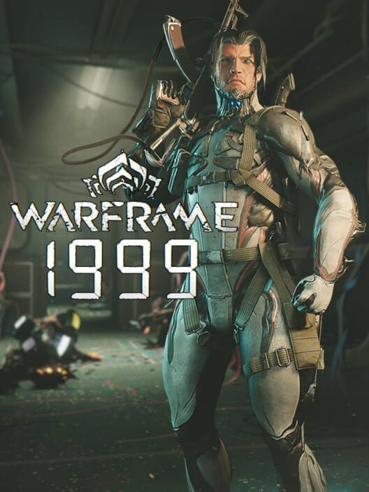

Every year I've taken ranking and reviewing things a little more seriously. I
made this website as an outlet for the opinions rattling around in my head. I've
been better organized all year, and therefore have more to say. Oh no.

The longer I thought about these lists, the more dramatically they changed.
Sometimes I'd be very confident in the placement of an entry in the list, only
for it to jump 3-4 places once I started writing out my thoughts. After all the
deliberation and thought that has gone into this post, I'm more sure of my
thoughts than ever.

This was a hefty project, but an enjoyable one. If you asked me in the middle of
the process if I'd taken on too much, I'd answer, "I'll certainly need to cut
back next year." Now that I'm done, however, I don't think that's true. We'll
see how 2025 plays out, but I could see myself doing this again.

~~I am so sorry for how long this is.~~

---

# Games

As you can probably see, the games section takes up the bulk of this post. I
ended up having quite a lot to say. It's funny: at the start of the year, I
thought this was going to be a very empty year for games. So empty that I
started [several long backlog projects](#from-the-backlog), including [playing
through the Mass Effect
trilogy](https://drowrin.com/posts?series=finally-playing-mass-effect), and
starting the
[Final Fantasy](https://drowrin.com/posts?series=final-fantasy-retrospective)
and
[Yakuza/Like a Dragon](https://drowrin.com/posts?series=yakuza-like-a-dragon)
series. Near the start of the year, before starting those projects, I posted
this:

{style="width: 100%"}

Two of the (very few) games I expected to come out never did. FFXIV Dawntrail
and Tales of Kenzera: Zau _did_ release---but even though they were some of my
most anticipated releases for the year, they didn't make it onto the list! The
only thing I was loosely correct on was Hellblade 2 releasing, but I was still
wrong because I had no confidence in it and I ended up actually _loving_ it.

At several points, I thought I wouldn't have even played enough games this year
to fill a top 10---and even if I did it, would just be a list of all 10 games I
played this year.

My, how wrong I was.

This year was full of surprise after surprise dropped on me. Games jumpscared me
from off of my radar and rocketed all the way into my
[Top 25](https://www.backloggd.com/u/Drowrin/list/top-25-1/). At the start of
this year, 9 out of the 10 games on this list were things I had no idea were
coming out, or were things I _thought_ I wouldn't enjoy. There were plenty more
beyond that, too. It ended up being really hard to limit myself to just 10.

What a weird, wonderful year for games.

## Honorable Mentions

Here's the list of games I really wanted to include in the list, but they didn't
quite make it in. At one point or another throughout the year, each of these
_were_ on the list. So, I wanted to give each of them some brief thoughts.

In no particular order:

- **Alan Wake 2: The Lake House** - This is a really great bridge between
  Control and Alan Wake 2. It's the mirror to Control's AWE expansion. In it,
  you investigate a Bureau of Control facility which was researching the
  supernatural events of the Alan Wake series. It's an interesting exploration
  of ideas from both games, and contains some of those really cool setpieces you
  can always expect from Remedy games. This is short, but sweet. It's a great
  self-contained little experience, but it's hard to put it in the same category
  as other, larger releases. So, while some DLC _did_ make it into my top 10,
  this didn't make it.
- **The Rise of the Golden Idol** - I consider this more of a sidegrade than an
  upgrade to the original. The artwork and general presentation are much better,
  but the UI is significantly worse (and buggier!). The puzzles are a little
  more varied, but the quality of some of the puzzles dropped as a result. I'm
  glad they decided to experiment more than before, but I don't think it
  _necessarily_ created a better game. Still, I thoroughly enjoyed it! There
  were just too many games to include in the list.
- **Stellar Blade** - This would be #11 in the ranking. Absolutely loved the
  gameplay, soundtrack, and the overall visual spectacle. Unfortunately, the
  character and plot writing were so flat that I couldn't justify putting it
  over any of my personal top 10. It's an absolute shame that this game got
  caught up in culture war nonsense. It deserved more honest attention separate
  from all that.
- **FFXIV: Dawntrail** - This one suffered from being the start of a brand new
  arc. People compare it to Shadowbringers and Endwalker, and of course it was
  never going to measure up. I would say this should be compared to A Realm
  Reborn, but that's a low bar rather than a gold standard. So really it needs
  to be judged on its own. It's not a flawless expansion, but I enjoyed it a lot
  more than those who had their expectations set too high. Sadly, it's also
  caught in a bit of a hate feedback loop because the voice actress for the main
  NPC is trans, and bits of rhetoric spread by transphobes has been adopted by
  the general playerbase. I'm disappointed in the community, not the expansion.
  The gameplay content is the best the game has ever had, and it's a
  phenomenally _fun_ expansion.
- **Frostpunk 2** - Yet another sidegrade sequel. Instead of "More Frostpunk",
  which many people wanted, this is "Post-Frostpunk". The first game centers on
  building up infrastructure to survive an oncoming disaster. It leaves the
  future of your civilization blank. This game fills in that blank. The scale
  grows. You now _start_ with a city advanced enough to survive the disaster
  from the first game, and those become regular occurrences. You're now managing
  multiple colonies, with multiple factions vying for political success. The
  game zooms out from colony-level to civilization-level. Many people disliked
  the less personal feel, but I enjoyed the addition of the political
  maneuvering, managing supply lines, and so on. I look forward to trying it
  again in the future and trying other strategies.
- **Backpack Battles** - A neat autobattler in which you arrange items on a grid
  rather than letting units with AI take over. The grid is formed of other
  items, backpacks, which you can rearrange and purchase more of in order to
  change the shape and size of your available space. The items all have simple,
  predictable rules, making it feel a little bit like programming rather than
  herding cats and hoping they do what you want. Items can combine into more
  powerful, but usually more niche, new items. There are interesting synergies
  and builds. There are very rare build-defining items that spark excitement and
  shake up all of your plans when they appear. It's fun, addicting, and
  low-friction.

## From the Backlog

As mentioned earlier, I played a lot of games from my backlog this year, because
I thought it would be relatively empty.

I found some new favorites in this list. I played more than this---these are
just the highlights, the best of the best that I played this year.

In no particular order:

- **Against the Storm** - This is a city-builder with a twist: it's also a
  multi-tier roguelike. It's extremely addicting, and by far my favorite city
  builder. Every colony you build is doomed to die eventually. You've got to
  make it as successful as possible before then, sending resources back to your
  home country. Before starting a new colony, you choose its place on an
  overview hex-map. Your chosen location has a huge impact on the "roguelike
  run" of playing through that city until it dies. Trade routes can be formed
  with your other nearby cities. The biomes of your chosen hex fundamentally
  change the available strategies, like playing a different character with
  different base abilities. Pushing further away from the center of the map
  causes more difficulties, but that's also your main objective. So you carve
  lines through the terrain using your cities so that each new city in a harder
  location has stronger trade routes behind it for support. Every so often, even
  that global map gets reset, and you cash in all those resources on bonuses to
  get even further on the next run. The challenges constantly change as you're
  thrown into new situations at multiple strategic levels of play. It's a real
  treat. This was a very late 2023 release, and it would have made it onto my
  top 10 for that year if I had played it on time.
- **Critters for Sale** - An interesting, surreal point-and-click game. I loved
  the tone and presentation of this. I want to explore the setting more. The
  good news is that apparently the devs are indeed working on more. There were a
  couple puzzles that frustrated me a bit, and the quality of life certainly
  could have been improved in a few places. However, I was still very pleased
  with my time. This was gifted to me by a friend, and I'm thankful for both the
  gift itself and the recommendation.
- **Chrono Trigger** - I can see why this is legendary. It's got extremely
  enjoyable characters, fun concepts to explore, and clever writing that's easy
  to digest. It's impressive that a game this old, in a genre known for linear
  storytelling, managed to pull off a non-linear time travel story successfully.
  This was one of those experiences where I could tell that this didn't feel
  mind blowing to me today, because it basically _invented_ the things I now see
  as tropes---but recognizing that has given me a lot of respect for it. This
  has set my gold standard for JRPGs going forward.
- **Mass Effect 1 - 3** - This was a mixed bag, but I'm glad to have finally
  played this iconic series. I wrote about my experiences
  [here](https://drowrin.com/posts?series=finally-playing-mass-effect). TL;DR:
  Mass Effect 2 was the peak of the series, the promise that choices would
  matter was an illusion all along, and EA's pressure to rush this series is to
  blame for squandering its very high potential.
- **Deus Ex** - A new entry into my top 5 games of all time. This game helped
  popularize one of my favorite (unfortunately named) genres: Immersive
  Simulations. Not "Simulator" games like "Farming Simulator", though that is
  unfortunately the first thing that genre name calls to mind. ImSims are the
  original "emergent gameplay" games. They have a goal of removing "video game
  logic". Everything in an ImSim should work as you expect it to, based on the
  rules of the world it's set in. For example, you can pick up _every_ object
  (as long as you're strong enough) and never be hampered by thoughts like
  "well, this is a video game, so I don't need to pay attention to the clutter
  on the desk". If you want to strap a mine to the back of a rat, and then slip
  it through the door an enemy is hiding behind, there's a good chance that
  mine-rat will take out the enemy. This isn't because the designers thought of
  this specific action and programmed it in, "hold F to deploy mine-rat", but
  because they gave you the ability to strap mines to _any_ surface and rats are
  surfaces. It's a genre of open ended puzzles and sandboxes that let your
  creative outside-the-box thinking run wild. It's also a genre that cares an
  extreme amount about honoring your choices and showing you the results of your
  actions. I love it very, very much. No game I've played embodies this genre
  more than Deus Ex. It's a flawless example of the pinnacle of the genre, with
  an interesting world and story as icing on the cake.
- **Fallout: New Vegas** - MAN. I put this one off for a long time, because my
  experiences with other Fallout games were mediocre (I haven't played 1 or 2).
  So, I thought I was just not a fan of the Fallout world. I thought that even
  if this game was legendary, it wouldn't be for me due to it being a Fallout
  game. I'm incredibly happy I was wrong. This game is truly incredible. It's
  jumped all the way up to my top 3 games ever made. It's shown me just how good
  a game of this kind can be, and it's made me even more disappointed in recent
  Bethesda works than I was before. It's just raised the bar significantly, and
  made me think about games in a new way. I realize that I've used a lot of
  words to say "it's amazing" without actually saying anything of substance, but
  there's far too much to unpack to satisfactorily condense my thoughts into a
  single paragraph for this section. It has a deep and meaningful roleplaying
  system. You can feel your actions having an impact on the world, and every
  single NPC feels purposeful instead of being full of nameless "video game
  filler" NPCs. I'm going to be replaying this for years.
- **Vampire: The Masquerade - Bloodlines** - It was a good year for playing old
  Immersive Sims. This one, similar to New Vegas, leans more on the roleplaying
  aspects than on the physics of the world. This fits the narrative, because
  Vampire: The Masquerade is all about court political intrigue and hiding
  fantasy behind the veil of the modern world, all balanced against the hunger
  of vampires for blood and power. The "rules" of the world are largely social.
  The primary one, the titular Masquerade, bans vampires from revealing the
  existence of the supernatural to mortals. If you reveal to the world that you
  are a vampire, you will be hunted down by the other vampires so that they can
  cover the incident up. However, a vampire's still gotta feed. So you have to
  walk a tight line between getting enough blood to live (unlive?) and being
  careful never to reveal yourself. The Nosferatu are an excellent example. They
  are one of the selectable vampire clans when you create a character. Nosferatu
  are _hideous_, to the point that they're clearly undead. Unlike other
  vampires, a Nosferatu can't be seen by mortals _at all_ without causing a
  masquerade violation. So you must approach the game in a completely different
  way, using all the same tools. Fantastic game, but it unfortunately ran out of
  budget towards the end. I'd love to see another game like it someday.
- **Final Fantasy I - VI** - This year I started playing through all the Final
  Fantasy games in order. You can read about that
  [here](https://drowrin.com/posts?series=final-fantasy-retrospective). TL;DR:
  FFVI and FFIV have the best stories so far (in that order), and FFV has the
  best gameplay. I'm excited to play more! The next games step out of the pixel
  art era as console generations progressed. I'm looking forward to seeing how
  the tone and identity of the series changes over time.
- **Yakuza 0 - 4** - Similarly, I began playing the Yakuza/Like-a-Dragon games
  in chronological order. You can read about that
  [here](https://drowrin.com/posts?series=yakuza-like-a-dragon). TL;DR: Yakuza 0
  is a fantastic entrypoint that's very thoughtfully crafted. Kiwami 1 is goofy,
  and I'm glad the series changed direction a bit after it, even if I respect it
  for kicking the series off. Kiwami 2 is overrated. 3 is underrated. 4 is
  solid, and the ending had me giggling with glee. I've already dipped a little
  into 5 and I'm loving the significant improvements to both gameplay and
  storytelling. I can't wait to catch up more!
- **I Was a Teenage Exocolonist** - This is a branching narrative life sim
  that's really well done. You are born on a starship destined to settle a new
  colony on a distant planet. You grow up on that planet, and witness the
  struggles the new colony goes through in order to survive. Except, you're just
  a kid. That struggle, the weird challenges of the weird world, the politics of
  the adults, and the sacrifices and hard choices that must be made for
  survival---are the background. At this stage in the game, you're dealing with
  your relationships with friends, parents, other colony members, nature---and
  hell, even yourself! You're figuring out who you are, who and what you care
  most about, and making important life choices, all while also going through
  puberty! Over time, as your generation begins to slowly replace the old, more
  and more responsibility is placed on your shoulders. Those important choices
  never stop coming, and your old choices never stop having consequences. It's
  compelling, and I was constantly impressed with the quality of the writing.
  You play through basically one event per month, which is a nice pace. It's not
  so slow that you get lost in the day-to-day, but not so fast that you feel
  like life has passed by without you. It's also got a weird sci-fi plot that's
  given more weight by all the slice of life stuff. Skill checks are handled by
  a deckbuilding minigame, which gets tedious. Thankfully, you can disable it
  and just use classic RPG skill checks, which I did for my playthroughs after
  the first. I completed this one a few times to see how different it could
  become based on my choices, and I was pleasantly surprised. Bonus points for
  having literally the best gender representation I have ever seen in a game.
- **Slay the Princess** - I'll be brief about this one, because I haven't played
  the final version yet. This is a very neat visual novel with a wild-ass, dark,
  compelling story. If you haven't heard anything about this game. Good. Go,
  look up any content warnings that may apply to you, and play it, trust me.
  It's well written, well performed, and well presented. I really need to get
  around to playing the Pristine Cut.
- **Sanabi** - Another late 2023 game that I didn't get around to until 2024.
  This is a fun action-platformer with a great artstyle and an even better
  story. Calling it a platformer feels like I'm underselling it though. This has
  the wonderful progression of movement/combat tools of a great metroidvania but
  without any of the backtracking or side objectives (THANK GOD). It all centers
  around a grappling hook, and expands from there. It feels great to play and
  even better to feel like you're mastering the tools. It has some killer boss
  design and really tense challenge rooms. Did I mention the story is great?
- **Lies of P** - One last late 2023 banger. Lies of P is a fantastic Soulslike
  that holds up to the quality standards I'd expect from FromSoft themselves. I
  love the setting and tone. Pinocchio is already a pretty dark story, but this
  takes some of those concepts and themes and twists them in a far darker,
  really unique direction. I'll be honest though, I was too lost in the
  excellent action to analyze the story too deeply. I'm sure there's tons to be
  said about it, but I just appreciated the vibes. I think this was the best
  non-FromSoft soulslike I'd ever played, at the time. ~~Foreshadowing is a
  literary device in whi--~~

## To the Backlog

I couldn't get to everything this year that I wanted to. Some was skipped due to
lack of time. Some was skipped because I wasn't in the mood for the genre. Some
are locked on platforms that I didn't feel like playing them on at the time.
Whatever the reason, I hope to get to these eventually. I have a feeling that
some of them would have made it onto the list (and made my decisions even
harder) if I had actually played them. So they deserve a shoutout!

In no particular order:

- **Astro Bot** - I tend to love these kinds of games, and I already loved
  Astro's Playroom (which served as a sort of demo for this). Unfortunately, I
  never found myself in the mood for a 3d platformer all year. This game is near
  universally loved on the merit of being "pure joy". I'll get to it eventually!
- **I Am Your Beast** - This looks fantastic, and right up my alley. Like above,
  I was simply not in the mood for it. It's a game about optimizing your runs
  through the levels to be faster, more stylish, and overall more cleanly
  executed. I've heard it compared to Neon White, which I loved. It's a
  "speedrunning game", of a sort.
- **Caves of Qud** - If this came out earlier in the year, I probably would have
  made time for it. I've remained as spoiler-free as I can manage. I know it's
  something between a longform roguelike and a story-focused CRPG. I know it's
  extremely strange and surreal. I've heard it has an incredible amount of weird
  possibilities and surprising interactions. This will probably be my Animal
  Well analogue, when I get to it.
- **Unicorn Overlord** - A strategy RPG in which you program the AI of your
  units for their skirmishes? You can approach the story in your own way,
  choosing when and how you take on any of its challenges? Sign me up! Sadly
  Vanillaware is allergic to PC ports---even when _supposedly_ Atlus offered to
  grant them more resources to get it done this time, they chose to not accept.
  I just haven't felt like setting a console and capture card back up to get
  this going. Someday!
- **Indika** - People seem torn on whether this is a brilliant piece of art or
  the most pretentious thing ever released. Maybe both! I'd be okay with that. I
  intend to find out myself, but until then I'm staying spoiler-free. I
  generally like 11 bit studios, so I _will_ get to this.
- **Persona 3 Reload** - This is likely going deeper on the backlog than the
  others. Not because I don't think I'll love it, but because of how long it is.
  I _really_ do like what Atlus makes, I need to commit a wide span of time to a
  Persona game or I'll get distracted and drop it. It's happened multiple times.
  When the stars align and I'm in the mood for a game like this at the same time
  that I have nothing else to play for multiple months in a row, I'll get to it.
- **Final Fantasy VII Rebirth** - I'm planning on playing the trilogy once
  they're all out, probably at the end of my
  [Final Fantasy Retrospective](https://drowrin.com/posts?series=final-fantasy-retrospective).
  I'm going to give FFVII Remake another try as part of that, and maybe I'll
  like it more this time around. I've heard some of my pain points have been
  patched out.
- **Romancing SaGa 2: Revenge of the Seven** - I know very little about this one
  other than it's a remake of a legendary JRPG, and it's generating a lot of
  very positive buzz. Apparently it has some really interesting time/legacy
  mechanics that sound like something I'd love.

## Top 10

And now, onto the real rankings! (oh no this is already so long)

Though none are flawless, I absolutely recommend all of these games. All of them
rose to the top in this incredibly competetive year. Some of them made it into
my [Top 25](https://www.backloggd.com/u/Drowrin/list/top-25-1/).

There were really, really difficult choices. Multiple times while writing all
this, I had to stop and sanity check my work: "Wait, a game _this_ good is my
number 9?!". Only to check, see all the incredible games under it, and curse the
limited space. If this were a tierlist, most of these would be on the same tier.
That wouldn't be particularly exciting, though. The strictly-ordered nature of a
ranking means I had to make the excruciating choice to put some absolute
masterpieces fairly poor in the rankings. So keep that in mind while you read
this. _All of these_ are **that good**.

In order, from 10 to 1:

### 10. Dragon's Dogma II {.unlisted}

**Capcom**  
_RPG_ / _Action_ / _Fantasy_

{style="max-width: 20rem"}

This one was controversial. It's a complicated, multifaceted situation. Some
hated the business decisions made around the game, such as selling an extra
fast-travel point and other in-game boosts. Some were expecting a follow-up on
the Dark Arisen release of the original game, which added a deep and unique
endgame. Some hated that a playthrough could see dire consequences from
interactions with the online systems, with only vague warnings. Some were a
combination of the above.

I ended up really liking this game. I was going to write "in spite of all that",
but actually, _some_ of those elements are what _I liked about it_.

The only thing I took issue with was the microtransaction store, but it's easily
ignorable. It's less bad than some other games, which somehow don't get nearly
the same level of hate for their microtransactions. For example, the Resident
Evil 4 2023 remake sells powerful weapons and weapon upgrades---direct player
power! Much worse than DDII's slight conveniences. Monster Hunter Rise sells
tickets to edit your character, much the same as DDII, except you can also earn
them in game in DDII. These are just examples off the top of my head. **Yes**,
these are negative things and the game would have been better without them, but
if they can be overlooked in those other beloved games, surely they're not the
_actual reason_ people hate this, right? It seems to me, that people dislike
other elements of the game, and stack this on top to try and give their case
more weight. Still, definitely a negative overall, and my biggest criticism of
the game.

On the other side of things, I quite enjoyed the rest of the game. I'm a fan of
the original game, (though I only played it shortly before DDII released). I
really, truly liked the original game content. I bounced off of the Dark Arisen
content. Endgame activities don't excite me. I'm here for the journey, and
Dragon's Dogma is designed to make that journey interesting and exciting. I'm
happy to say that Dragon's Dogma II does an even better job at that than the
first.

Unpopular opinion, I know, but I actually _prefer_ games designed without fast
travel in mind. I love traveling from one destination to another, experiencing
what twists will arise along the way, seeing how my plans and preparations will
shake out, and simply _existing in the world_. Dragon's Dogma II does an
exceptional job at this. In fact, it may be the single best game I've played at
accomplishing that style of gameplay. For me, that extra fast travel point sold
in the store isn't a case of "a game designed in a hostile way to intentionally
funnel you into buying convenience". The lack of fast travel _is the point_.
It's instead a simple case of a microtransaction **missing the point**, like the
Resident Evil 4 microtransactions that offer guns and upgrades when that misses
the point of it being a horror game. Annoying, but not game ruining.

Another hot take: I enjoy the Dragonsplague conceptually _and_ in
implementation. I **love** consequences for my actions, including my inaction or
failure to notice things. I _prefer_ when games take content away from me and
shake up my personal story. It's _fantastic_. It seems that Hideaki Itsuno makes
my kinda games. Definitely not for everyone (judging by online discourse
surrounding this game), but absolutely for me. I look forward to whatever new
game he's creating.

I also **loved** the way this game handled its ending, the meta-narrative around
the cycle and the sequel, and all of that---but that's a long topic that's
filled with spoilers and I don't have room for it here. Just know, it's
extremely clever and plays with the medium of gaming in a way I rarely see.

So why isn't this higher on the list? Performance issues, bugs, and somewhat
disappointing character classes. It felt like this game was unfinished. It
needed a few more years of work. The performance issues are notorious and were
never truly fixed as far as I know. There were tons of issues with player
characters looking different after character creation, amplified by the friction
involved in editing a character. The classes feel half-complete, as if there
were 5 more planned but never released. It's a shame. This truly could have been
an all-timer for me.

Still, even with all that, it deserves a place in my top 10.

### 9. Silent Hill 2 (2024) {.unlisted}

**Bloober Team**  
_Horror_ / _Psychological-Horror_

{style="max-width: 20rem"}

This game was so intense that I couldn't handle more than an hour or so at a
time. That single hour felt like many more, every time. I am _shocked_ that this
game only took me 14 hours, because it felt like it took at least 50. I mean
that in the best possible way. It was so rich with detail that it it felt like
it condensed the impact I usually get from games with longer time investments
down into a brief gut punch.

The atmosphere is absolutely masterful. It felt like this game was wriggling
into my skull and messing with my mind. The acting in the cutscenes, the sounds
of the world, the cleverly obscured visuals, the ways things were hinted at and
hidden---sometimes in plain sight. It's all genius. It's perfectly calibrated to
evoke dread.

This game evoked multiple kinds of horror in me, but my favorite was when it
gave me that terror caused by my brain struggling to fill in the gaps of the
vague and unknown. You know that feeling when it's dark, and you _swear_ you
feel a presence watching you? That feeling that the closet door, left slightly
ajar, has someone creeping inside? The bump in the night that sounded
suspiciously like a footstep? That itch under your pant leg that's certainly not
a bug, right? **That** feeling, of your brain making up the worst case scenario
out of miniscule details. This game has that crammed into every inch, but here's
what it does best: Sometimes, your brain is right. That shadow _did_ just move.
That sound _was_ a footstep. You _are_ being stalked. Silent Hill 2 knows when
to play tricks on you, and when the best trick is no trick at all.

There are a few things that keep it from getting higher in my list:

I think it copied just a _little_ too much from modern games. I don't say that
because it's bad to find inspiration like that, but because I some things feel
copied over "because modern games have it" and not because they actually
improved the game. For example, the introduced dodge mechanic is extremely
generous to the point of cutting some tension from the combat for me. If I heard
a sound, I could just spam the dodge button and 95% of the time I'd be safe. I
don't mind the inclusion of a dodge mechanic in general, but the implementation
was unfortunate. Similarly, I don't think so many boss fights were necessary.
Sometimes, a creepy encounter or one that you must run from (like some others
that _do_ still exist in this version!) are more impactful.

Additionally, I had some performance issues, mostly related to level traversal.
Sometimes I'd walk through a door and be reduced to 5-10 fps for about a minute.
Honestly, if tons of stuff needs to be loaded all at once, I'd rather have a
loading screen than this. I don't even have a slouch of a system, either. My
Samsung 990 Pro and AMD Ryzen 7 7800X3D should be able to handle whatever
loading/processing is required quite rapidly. Worse still is when this happened
in combat or during the introduction to a boss fight.

The rest of the game is phenomenal though. The tone, atmosphere, and story is
top notch. It absolutely deserves this spot.

### 8. Nine Sols {.unlisted}

**Red Candle Games**  
_Metroidvania_ / _Soulslike_ / _Sci-fi_

{style="max-width: 20rem"}

Remember how I foreshadowed that Lies of P was the best non-FromSoft SoulsLike I
had played **so far**? Yeah. We're here.

I'm a notorious Metroidvania hater. I hate backtracking. I'd rather explore new
content than have old content reinterpreted or recontextualized. I find the
navigation frustrating, the barriers insultingly arbitrary, and the choices
illusory. I find myself constantly wondering if I'm having trouble on a fight
because I simply need to get good, or if I missed some bit of exploration that's
put me at severe disadvantage. It makes me paranoid about my exploration in an
unpleasant way. I'm a notorious Metroidvania hater.

_I gave this Metroidvania a 9/10._  
_This Metroidvania is one of my favorite games of the year._  
_This Metroidvania is one of my top 25 all time._

To be honest, I still got frustrated by the Metroidvania aspects. That held it
back from getting a perfect score from me, but **everything else** is flawless.

The story took a bit to grab me, but once I was on board I was fully invested.
It's well presented, well told, and intriguing. It's set in a unique and
interesting sci-fi Taopunk world. It's got endearing characters that I got
attached to by the end. It's got secrets and twists that are revealed at
excellent times. It's got stakes that kept me on the edge of my seat. It's good.

The art is very good. The character designs are lovely, the art direction is
prime, and everything is very readable and distinct. I don't have many notes
about it, because it just _all works so smoothly and is pleasant to look at_.

**OKAY NOW ONTO THE BEST STUFF**. This game has _the_ best boss fights I've ever
experienced. The combat is _tight as hell_ and directly injects _all of the good
brain chemicals_ into me. The combat is Sekiro-like (the best Souls game),
meaning it's my favorite kind of action combat: parry-heavy. The difficulty
curve is also perfect. Just when you think you're feeling confident in your
skills, it finds a new challenge to dangle in front of you and dares you to
overcome it. It never feels insurmountable, but it always feels _hard_. It means
that every single fight is satisfying to pull off. This culminates in what is
literally the single best boss I've ever faced. The boss takes into account
everything you've learned. It _toys with you_ by testing the assumptions and
habits you've made about the gameplay. There were multiple times when I blinked
at my screen and asked "wh--what the fuck?", but there was always a solution
after I saw it a few more times. It never felt truly unfair, it just asks you to
_master_ it.

If you have even passing interest in Metroidvanias or Sekiro-like combat, this
is 100% a game you need to play.

### 7. Elden Ring: Shadow of the Erdtree {.unlisted}

**FromSoftware**  
_SoulsLike_ / _Fantasy_

{style="max-width: 20rem"}

This is FromSoftware continuing their tradition of massive DLC releases that are
better than their base games. Shadow of the Erdtree is _stellar_. It's so large
that it may as well be considered a complete SoulsLike game on its own, except
it's integrated well into the already excellent Elden Ring. You can bring your
favorite characters into it, already built, and watch them get absolutely
dumpstered by the new content. You can then bring all your new toys from the DLC
into the base game, and transform your approaches to the old content.

The most clever part of the integration is the unique progression system
included for the DLC content. You must explore the world to find Scadutree
fragments, which are used to purchase a stacking, permanent buff for your
character that activates only in the DLC areas. It raises your damage dealt and
lowers your damage received by a multiplier, with final values of slightly
better than double effectiveness. The content of the DLC is tuned with the
expectation that you've been keeping up with this exploration as you've
progressed through the world. This feels extremely similar to the base game
expecting you to explore nearby points of interest to level up a bit before
taking on each major boss. Additionally, since it is a separate multiplier and
base game stats hit diminishing returns very sharply, it doesn't matter much
_when_ you enter the DLC. If you can beat ||Mohg|| to enter, you're likely at
the soft caps for all your important stats anyways. More levels would be nice in
the base game, but they'll hardly help you at all in the DLC thanks to its
significantly sharper progression curve. Finally, the multiplier only being
active in the DLC means that balance in the base game content is relatively
preserved, even if you bring your new toys back.

The world is also incredible. It's extremely vertical and dense. You can't look
in any direction without seeing several interesting things to attempt to get to,
and then wonder how on earth you can safely do so. The areas and enemies are
varied. Everything is beautiful (even if sometimes beautifully disturbing).

The bosses of Shadow of the Erdtree somehow manage to one-up even the best
bosses of the base game. They're challenging. They're well designed. They push
players into new playstyles. They're fantastic spectacles. My jaw dropped seeing
some of the bosses. It dropped again when I saw more bosses later on. It hit the
floor when I saw the final boss.

This is Elden Ring amplified. All of the good aspects and all of the bad. I
still prefer the tightly-designed experiences like Sekiro, but I liked Elden
ring, and I **love** this.

### 6. Until Then {.unlisted}

**Polychroma Games**  
_Visual Novel_ / _Slice of Life_ / _Drama_ / _Sci-fi_

{style="max-width: 20rem"}

Until Then. Is. So. Good.

This is a visual novel about a group of friends and their relationships. It has
the backdrop of _wild_ sci-fi plot that slowly, lovingly _**shakes the living
hell** out of them_ to see what delicious, heart-shattering emotions fall out.

A large part of communications between characters happen through social media
and text chats. It was really cool to see a portion of the screen taken up by
the character's phone, and then the rest taken up by the character's face. I
could see a text come through on the left, feel the character's hesitation to
respond, see the emotions on their face. I could feel a little bit of emotion
even from the typing indicators from other characters. I could see my character
write something out, delete all of it, re-write and reword parts of it until
they finally land on the "least awkward" thing to say. There were also some very
cool changes in the difficulty of minigames based on my character's mental
state. It all felt very natural, and enhanced the storytelling quite a lot for
me.

Bonus points for letting me key-smash to fake-type all the messages if I wanted
to, or simply hold a key to auto-type if I didn't feel like it.

There were other clever things like that too, things that showed me the
developers really understand what makes games unique as a storytelling medium.
This starts right away: The Start Game button rings your character's alarm,
once. You have to spam it to make the alarm annoying enough to wake the
character up. Is that a very small detail? Yes, but it sets the tone of that
scene immediately, and sets expectations of details appearing like that
throughout the game. After seeing something obvious like that, I know to look
for more similar things later. Some of those later details are really
emotionally impactful, like how ||the piano rhythm game shifts in difficulty
depending on the mental state of your character, signaled earlier by the much
more obvious fair-booth minigames being affected in similar ways||. It uses
these tricks to set up emotional gut punches that work without words. Very, very
well done.

I was impressed by the game's visuals, as well. There are _so many_ unique pixel
art animations. The game frequently zooms in on characters to view them from
different camera angles. For example, snapping to a quick shot of a character's
face to reveal their expression after hearing something, or lingering on them
when they hold their hand out in the rain. Each of these scenes is uniquely
animated in a consistent style. It's an insane amount of good art.

You can see a lot of what I'm talking about through the
[trailer](https://youtu.be/BFoW4gIDbmU).

Unfortunately, it's not perfect. There are a lot of rough edges: sudden cuts in
the audio for scene changes; occasional framerate issues and freezes; an attempt
at including a ton of minigames, but all of them were pretty janky and
unreliable; and the mixed pixel art and 3d models is kind of jarring, and some
background bits of pixel art seemed pretty phoned in. There's also an
over-reliance on lighting effects that I think could be trimmed down.

I wish they went for more pixel art for the background, but I assume this was
already what took the most time in the creation of the game. There are tons of
unique and beautiful pixel art animations, but the presence of these make me
notice the cheaper background art a lot more. This game would benefit pretty
massively from a remake with a larger budget. That could also include voice
acting too! I would pay full price for that, tbh.

**The world hasn't ended yet**.

### 5. Mouthwashing {.unlisted}

**Wrong Organ**  
_Horror_ / _Sci-fi_

{style="max-width: 20rem"}

The best horror game of the year. Likely the best horror game I've played.

Mouthwashing is _fantastic_. Even if you only absorb the atmosphere and let the
vibes and terrible spectacles submerge you into deep horror, it's an incredible
ride. Once you start digging into the depths of the narrative, it reveals itself
to be a dark abyss.

It's _harrowing_. This game twisted my guts into knots and made my eyes water
with disgust. It cleaned my brain with a steel sponge and left me feeling
nothing but sweet emptiness. It felt like 7 hours, not 2.

This has content warnings you should _absolutely look up_, but if you're a
horror fan and the included content isn't a deal-breaker, I highly recommend it.
It's a 2-hour, **viscerally disturbing** experience. Saying too much more would
spoil it, and you should really just play it yourself, so I'll shut up.

10/10 I will never touch this again, but I'm glad I did.

||I hope this hurts||

### 4. Senua's Saga: Hellblade II {.unlisted}

**Ninja Theory**  
_Walking Simulator_ / _Action_ / _Dark-Fantasy_

{style="max-width: 20rem"}

There was a time, earlier this year, when I had no doubts that this would be my
game of the year. This game impacted me deeply, and I think it's a true
masterpiece, even if it has flaws.

I'll be brief about this one, [because I wrote 6900 words about it
already](http://drowrin.com/posts/hellblade-2).

The TL;DR is that it's probably **the best** _walking simulator_ game ever made.
A lot of people wanted it to be a different genre and are disappointed. I can
understand that, but as a huge walking simulator fan, it was perfect for me.

Since writing that, I've cooled down on it a little. Its flaws stick out a
little bit stronger in retrospect. I still consider it a high 9/10, and better
than everything above it on this list. This _is_ a **masterpiece**, and I want
more games like it.

### 3. Warframe: 1999 {.unlisted}

**Digital Extremes**  
_Looter-Shooter_ / _Live-Service_ / _Dating-Sim_ / _Space-Opera_

{style="max-width: 20rem"}

In July of 2022, Warframe's leadership changed amicably. The old team leads were
moving on to new projects within Digital Extremes, passing the Warframe baton to
others within the company. The new leadership has ushered in a new era of
Warframe---including multiple 10/10 updates in a row, sweeping changes to
relieve pain-points that the community has held for a long time, and a fun new
direction for the game.

I've been a Warframe fan for over a decade, and I take no issue with the old
leadership. In fact, I'm looking forward to their new game. Still, _I couldn't
be happier_ with this new, golden age of Warframe. The game is not only in the
best state it's ever been, I'm confident that it is **the** best live service
game on the market at the time of writing. If you're a fan of looter-shooter
MMO/co-op games, I highly, highly recommend Warframe.

The winning streak continues with Warframe 1999.

Last year, the "Whispers in the Walls" update kicked off Warframe's new story
arc after the previous one ended with "The New War". Last year's update teased
something incredible, something ludicrous, something that seems like it could
never possibly fit into Warframe's lore or tone: Warframe 1999. Yet, as
impossible as it seemed, it really worked well in the teaser: [Nine Inch Nails
blasts in the background while a technologically enhanced, seasoned, hot(!)
soldier played by Ben Starr fights off waves of zombie CRT monitors in a subway
filled with 1999 New Years Eve decorations, and then picks himself up for a
breather as he's clearly dealing with exhaustion and some kind of
sickness](https://youtu.be/b6NyR1Gfvr8). If that doesn't get you going, I don't
know what will. It's an infinitely creative, wild, and _awesome_ direction for
the game.

It's stupidly ambitious. It's here. **It rules**.

The story quest introduced is _hella good_. It's dramatic and cinematic,
including stuff like an _insane_ long-term payoff from previously established
lore. Nobody saw it coming, but it made perfect sense. I literally cheered when
it happened. It's the kind of story where one minute you're having a deep
heart-to-heart with a well written character, and then the next minute you're
standing in the back of the pickup truck that character is driving, shooting a
rocket launcher at enemies chasing you on bikes. It's about love and found
family and bonds. It's about supporting each other through depression, imposter
syndrome, apathy, anxiety, paranoia, and guilt. It's about accepting each
others' flaws even when they drive you crazy. It's a cheesy "power of love"
story that's grounded in quality character writing and acting.

Spoiler time:

|| You finish the quest, and everything goes wrong. Everyone's trauma's, issues,
and lack of trust in each other causes their downfall. The bad guys win. It's
the end. Your character activates a power they haven't demonstrated for a few
years, because nobody knew they could use it outside of very specific
circumstances: you turn back time. **BEGIN. AGAIN.**||

|| You try the whole year over. This brings you into the live service part of
the game. You're released into the sandbox of the new zone that you played
through linearly during the quest. That was just a tutorial. Now, you have the
chance to make different choices, to do it right this time. How? Time to bond
with these people, get to really know them. Hell, _date them_ if you want. Get
absolutely wrapped up in their deepest hopes and fears, their most secret,
vulnerable thoughts. Share those thoughts of yours with them too. Earn their
trust.||

||Once you've built up enough trust with everyone, the game asks you if you'd
like to try the quest again. It skips directly to the last part of the quest,
when everything fell apart. You psychically connect to each of your friends,
fighting off their demons, sending them the exact encouragements they need, and
helping them in any way you can. You watch each of them succeed. You absolutely
destroy this challenge through the power of love. It's unironically peak
fiction. ||

Once you're in the sandbox after the quest. You get a cozy, gorgeous loft
apartment as a new home base. It's absolutely my new favorite home base. Instead
of describing it, here are a few screenshots:

Look at all the cozy furniture! It's a great mix of a 90's vibe and little bits
of sci-fi my character introduced when they moved in. It's grungy and _lived
in_. I've got a little workshop down under the loft for the motorcycle (added by
the update) and my other gear. You can play music. You can turn on the TV.
There's a CRT computer you can use to access an in-game instant messenger or
queue up missions. This is the default look of this place, but _you can also
customize and furnish it yourself_. Also, for those less familiar with the
current state of Warframe, these kinds of "home bases" are where we spend pretty
much all of our time outside of missions. We launch missions from here. We craft
equipment and tune our builds from here. Every action in the game starts here.
It's essentially a big, 3D "main menu". Making it a nice space to exist in makes
the whole game feel nicer. This is a gift from Digital Extremes to us.

The members of the new faction are all a part of a massive, extremely well
written visual-novel-esque chat system. Every real life day, you can log on and
go through a conversation with these characters. The characters all have
relationship levels with you (not necessarily romantic) that get updated in
small ways with most of the things you say to them. Things you said in previous
conversations can come up as references and in-jokes in later conversations,
even in conversations with other characters. One character will mention wanting
to start a D&D campaign, and then you can bring that up in conversation with the
others to make his dream come true. The messages are full of lore drops about
the world and all of the characters (including your own character). The
characters are all so believable and full of personality. It's extremely
impressive. It's insane. It's multiple full-length novels of text you could
possibly see. Everyone will have a different experience with this.

I said "not necessarily" romantic, does that mean...? **Yes**. _This is a dating
game_. _**A good one**_.

They went all out on these characters. They're voiced by some incredible talent
across the board, but I'll specifically shout out Ben Starr (Clive from FFXVI),
Amelia Tyler (The BG3 narrator, Hecate from Hades II), and Alpha Takahashi
(Hanako Arasaka from Cyberpunk 2077). Neil Newbon (Astarion from BG3) also makes
an appearance in the update, but is sadly not datable (...yet). These voices, in
combination with their excellent writing, bring _so much_ personality and life
to the characters. The conversations feel natural, and are sometimes
**drenched** in emotion.

Not only is the romance aspect super touching, and super on-theme for the update
as a whole, **it still gets better**.

Once you are dating a character, they'll have cute lines for you when you
approach them in the shared hub. Stuff like, "Hey! It's my favorite person!" or
"Girlfriend tax: one kiss!". It's adorable. Sometimes those lines are spicy,
like "I found some images online we can use for inspiration... later <3" or "got
a wish? I can give you something nice, if you've got a few minutes ;)". Imagine
if you could date Destiny's Shaxx after weeks of heartfelt conversations with
him, and when you approach him in the tower he'd say stuff like "Showering after
your sweaty Crucible matches, Guardian? Need someone to wash your back?". I
crafted that example for humor---but it is like that, except that it actually
works. _It works really well_.

Once you're dating a character for even longer, _they move in with you_. That
comfy apartment? Even comfier when you've got your favorite character chilling
with you and saying sweet things. In the first screenshot above, you can _just
barely_ see her silhouette behind a curtain.

You also get a lovely cutscene of a New Year's kiss if you're dating someone by
the time the new year rolls around in the in-game calendar, or a cutscene of
cuddling with your cat if you are dating no one. It's really sweet. The
cutscenes are custom for each character, to give them more personality.

Okay, okay, surely that's all, right? **WRONG**. DE doesn't know when to stop
cooking. There are skins you can use to play as those characters, and
in-universe this is represented by you basically summoning them and becoming a
joint/shared being for a bit, which is as intimate as that sounds. The
characters have custom voice-lines while you play as them, _which change
depending on your relationship with the character_. Just--just listen to
[these](https://youtu.be/OMiAhK2YJ9s), or
[these](https://youtu.be/qoOSYL8rs4k), or
[these](https://youtu.be/Op1oTZtcr7c?t=37). **I CAN'T**. This game gives me
_all_ the Bi panic. _These are JUST THE SUMMON LINES_. **THERE ARE MORE**. This
update has me rethinking my endgame builds to include a specific character
_because I'm dating her in-game_. That's some Baldur's gate shit. In an MMO.

So, all of that is _obviously_ fantastic. All of that is essentially **just one
part** of the update. I haven't even gone into the gameplay content, which is
some of the best the game has received. I haven't gone into the music (like how
they formed an in-universe [boy band](https://youtu.be/JbDG9cyE4hI), the songs
of which can sometimes be heard hummed by the datable characters, adorable). I
haven't gotten into the new equipment, which transforms the sandbox by enabling
multiple playstyles that have never really been possible in game before.

I simply don't have time or space to sing more praises for this update. I'd give
it an 11/10 if I could.

### 2. Metaphor: ReFantazio {.unlisted}

**Studio Zero**  
_JRPG_ / _High-Fantasy_

{style="max-width: 20rem"}

At the time of writing, this is my favorite JRPG ever.

I consider myself a JRPG fan, but I've never completed a Persona game. I will
someday. They're just so long that I get distracted. Other games come out. Life
events happen. Inevitably, something comes up. It's really hard to get back into
them later, so I just abandon them.

There was no such barrier for me here. It blew all the other games I was playing
out of the way. The time I spent not playing this game was filled with me
wishing I was playing it. It is a perfection of the Persona formula that feels
aimed directly at me. I absolutely adored this game all the way through.

I love Studio Zero's take on fantasy. I'm someone who loves fantasy stories, but
is tired of the classics. These days, I don't much care for elves, dwarves, and
orcs. I want to see your fantasy story's _weird_ ideas. Show me your
anthropomorphic animals, your people born from stars, your uncanny aliens, your
fae beings. This game absolutely fulfils that. Sure, "humans with devil horns"
aren't _that_ unique, but they're a direct upgrade over "humans with pointy
ears" in my opinion. The character designs across the board are fantastic.

The art is gorgeous. The level/area design is fantastic. The enemy designs are
just the right kind of incredibly weird. The gauntlet runners are the coolest
fantasy vehicles I've seen... maybe ever? I have nothing negative to say about
the visuals of the game.

The music is also my favorite of the year. A friend who happened to tune into my
stream asked if the soundtrack was out on Spotify, because he wanted to add some
of the music to his workout playlist. The music perfectly amps you up for
exciting events, calms you down for the quiet moments, and all the other
emotions in between. It's the perfect icing on the cake for the game at all
times.

Speaking of audio, I love that is has so much voice acting. Good voice acting
adds a _huge_ amount of personality to games. Some other mediums where the
visuals are more detailed can get away with really good expressions and body
language to sell the personality of a character even without audio (manga,
comics, and graphic novels, for example). However, in games like this, the
expressions tend to be a bit on the simpler side, so the voice must do more
heavy lifting. I'm so glad the protagonist is voiced, especially. The main thing
I'd love to see improved in this game is 100% voice acting coverage. Maybe a
future edition will do so.

The gameplay also _rules_. It takes all the best things from all my favorite
JRPGs, including the stuff that I really like about the Persona and Shin Megami
Tensei games. The elemental weakness system makes it extremely rewarding to
build teams around the enemies you are facing, since it gives you extra momentum
in the action economy. The archetype system reminds me of the best parts of
Final Fantasy V, a game with such good gameplay and team-building mechanics that
it's got [an annual community-run charity event based around
it](https://www.fourjobfiesta.com/). You can quick-restart fights to try
alternative strategies without having to go all the way back to a previous save,
which is a fantastic quality of life feature. You can face weak enemies in
action combat to avoid having to do repetitive turn based combat against foes
that present no real threat. You can test yourself in action combat against more
powerful threats too, which feels like it has _massive_ stakes since getting hit
by a powerful enemy in action combat punishes you **so incredibly hard**, but
you're also hugely rewarded if you can pull it off. I also really liked the
travel and calendar systems. They pushed me to strategize and prioritize, and it
felt very good to successfully pull of plans on time.

The story is also great. It's a little long-winded, self-indulgent, and blunt at
times, and it won't be winning any awards for cleverness, subtlety, or complex
writing---but it's got fantastic characters and a lot of heart. It's got
emotional hits, crazy twists, and the high moments are ridiculously high. It was
emotional enough that I cried, and hype enough that I cheered. It was
entertaining as hell, and I was a huge fan.

When I finished it, I thought surely this was my game of the year.

_Until..._

### 1. 1000xResist {.unlisted}

**sunset visitor **  
_Visual Novel_ / _Walking Simulator_ / _Drama_ / _Sci-fi_

{style="max-width: 20rem"}

1000xResist is such a monumental game that my words can't come close to doing it
justice. I will try, because I also can't stay silent on it.

I give this my highest recommendation. This is such an impressive, touching work
of art. It displays masterful storytelling, the best I've seen in a game, which
it delivers in really clever ways that feel only possible in this medium.

It's _full_ of detail---but not just for show, every detail matters. Thought is
put into every corner, every inch. It creates a visual language and wields it
with precision, but allows you to read into it yourself rather than beating you
over the head with it. So many times, I would sit back and just _look_ at the
scene before me, thinking deeply about it until I could interpret it. I found
really profound ideas, clever callbacks, and emotional punches. The game is so,
so good at showing instead of telling. If you pay close attention, it will
reward you.

_Watcher is your function._ The game tells you this at the start. You can just
speedrun through every scene and get to the next story beat, but I wouldn't
recommend it. Look at everything. Talk to everyone. Remember. Observe. _Watch._
It **will** be worth it.

I think a major factor to this game being criminally underplayed is that it
doesn't look flashy in the marketing. It's definitely not a high budget game,
but it has some really breathtaking moments and I think the overall art
direction is genius. It felt weird to me at first too, but trust me, there's a
reason it looks the way it does. It also doesn't help that the marketing
material shows off only the non-spoiler stuff, and it just so happens that the
early parts of the game look the most jarring. The developers have also talked
about how they were inspired by oldschool games in which we all got super
attached to characters that were tiny sprites with barely any animation, so they
kept things intentionally simple in a few ways. Let the imagination and the
storytelling do the rest.

Fortunately, I'm happy to say that this game is getting a lot more attention on
it now that GotY season is here. This game is showing up on some big lists and
generating a lot of buzz. It's well deserved.

I'm _extremely_ impressed with the voice acting for this game. Once again, it
starts out sounding a bit off, but give it time. What you're hearing is
intentional. The actors really brought their characters to life. They delivered
performances that made me cry several times.

This is more like "interactive art" than a game. The gameplay barely exists.
It's enough that I wouldn't exactly call this a visual novel, but it's close.
It's got more dialogue choices than a walking simulator though. It's somewhere
in the middle. The gameplay that does exist usually serves to give you some
feeling: disorientation, the feeling of being small in a big space, the feeling
of being cramped in a small space, and so on. Every detail serves the story.

This is a fantastic experience that's left a lasting impact on me. I give it my
highest recommendation of the year.

**Six to one. Hekki Allmo**

---

# Actual Play Podcasts

According to the spreadsheets I use to track all this, I listened to over 1000
episodes totalling almost 1800 hours of podcasts this year. That's my record by
a few hundred hours. Every year, I spend more time on this hobby. Every year, I
find more to love.

## Honorable Mentions

Once again, an honorable mentions section. I listen to a lot of stuff that I
love. So much that I can't fit it all into a neat list. I still wanted to shout
out the really special stuff that didn't quite make the cut.

So here they are! In no particular order:

- **Bloom & Blight** - A fun, well produced Girl by Moonlight actual play. Great
  world concept and characters. This podcast really nails pacing. The downtime
  scenes are slow, personal, and indulgent. The action scenes are snappy and
  cinematic without getting bogged down in details. Very cool game. I'm glad
  people are using it for actual plays. Looking forward to more!
- **Critical Role** - I'm a Critical Role fan. I have been ever since it was the
  first actual play I listened to. They have great production value, fantastic
  chemistry, and some absolute banger arcs. However, this most recent campaign
  has been hit-or-miss for me. Critical Role has also felt more and more
  corporate over the years, and it long ago reached a point that's off-putting
  for me. However, this campaign has been really getting back into shape over
  the last half year or so. The recent episodes have been _especially_ good.
  They're making some ambitious moves to give this campaign a strong finish, and
  the execution is more than I could ask for. I'm here for it.
- **Souls of Stormspire** - I love these nerds. This is a D&D 5e homebrew
  campaign that is fun to listen along to. The characters are interesting,
  varied, and well-roleplayed. The DM clearly is passionate and does a great job
  keeping it fun. The group has great chemistry. I look forward to each new
  episode!
- **ZeroDead** - This group did a handful of small stories this year, using the
  Delta Green and Call of Cthulhu systems. They were great fun, but it was hard
  to fit any one particular story onto the list. I very much enjoy the balance
  of fun and serious that this group goes for. There are some terrifying moments
  but also plenty of laughs to be had.
- **The Adventure Zone Vs Dracula** - I like TAZ. They don't always release
  hits, but when they hit they hit well. This was a hit, thankfully (I don't
  even want to go near whatever their current arc is ). This is a return to
  their original wacky D&D 5e homebrew campaign formula. This doesn't top my
  favorite arcs from them, but it's very solid.
- **Homeostatis** - Nobody Wake The Bugbear is a pretty fantastic podcast that I
  really need to listen to more of. This quick Mothership story is a fun,
  well-produced arc. Unfortunately, most of the things I really want to listen
  to from NBWTB are published Mothership modules that I want to run or play in
  myself, first, as Mothership is one of my favorite games right now. So, I'll
  get to them eventually.
- **Ark-105** - Stories & Lies is represented down below, but I wanted to give
  an extra shoutout to this arc. It's a more hard-sci-fi horror arc than they
  usually do, but they pull it off extremely well, with all of the quality and
  cinematic flare that I expect from this group. Ark-105 is a Call of Cthulhu
  story in space, written by their GM, and it's well worth a listen.

## From the Backlog

In addition to all the podcasts I listened to as they released, I also listened
to some older stuff that I've been meaning to get around to. The backlog is
essentially infinite, but I at least knock some stuff of of it occasionally!

Below are the shows that rose to the top and left a big impression on me, in no
particular order:

- **You Can't Handler The Truth** - This was a Delta Green duet actual play by
  ZeroDead. Absolutely amazing, and one of my favorite Delta Green actual plays.
  It's fun that they discuss their thoughts about each module. The pacing is
  great, and the content is legitimately extremely unsettling (in a good way).
  Well done.
- **DIE** - An actual play by My First Dungeon using DIE: The RPG. I've really
  liked listening to My First Dungeon, and this is one of my favorite APs from
  them. It probably would have made it into the top 10, but it released in 2023.
  This makes me want to try the game, but I'd need a _very_ particular group to
  make it work, I think.
- **Dark Dice** - This is a legendary podcast that I'm only now starting to
  listen to. It's a D&D 5e actual play, but with a bunch of homebrew to take the
  usual power fantasy of the system and warp it into a really effective horror
  game. Extremely, extremely well produced. The DM's descriptions of wounds
  makes my stomach do flips, and his narrative style is possibly the best I've
  heard. The only detractors are the times when players don't know the rules
  super well and lag a bit. I don't mind that usually, but it sticks out even
  more when the rest of the show is so well paced and edited. Perhaps the
  editing could have stripped just a bit more of that out, and it would be a
  perfect show.
- **Sangfielle** - An actual play by Friends at the Table using of Heart: The
  City Beneath. At least, most of the time it uses the system, though I'd argue
  that the setting is half of Heart. So while it won't necessarily give you an
  accurate impression of the game, it's still an entertaining listen. This was
  _dense_ with detail and roleplaying, and a ton of players working through
  different arcs. I think it was unfortunately just a bit too much for me,
  though I'm sure it's exactly what many people are looking for. Fantastic world
  building was the highlight for me.

## Top 10

Here they are, the best of the best! Every one of these shows is at least a
9/10, and probably a high 9, at that. There was a lot of competition in this
category. Every one of these shows is well edited and produced, with great
players and GMs, and an engaging story. Everything here gets a top
recommendation from me.

In order from 10 to 1:

### 10. Pretending to be People {.unlisted}

**Pretending to be People**  
_Comedy_ / _Horror_ - _Delta Green_

{style="max-width: 250px; width: 100%"}

I found these guys in 2023 and binged everything they had, then continued
listening throughout 2024 and beyond. I love these goofballs.

Above, I put comedy before horror, because that's clearly the focus. This _does_
have some moments of really well executed horror, but it feels like that's just
the delivery mechanism for the comedy, like fries and ketchup. Still, the wild
comedy also makes those horror moments hit harder. It's a good contrast and a
good mix.

The campaign is a homebrew world that gets _absolutely wild_. The GM
occasionally inserts short adventures using other (similar) systems set in other
time periods to flesh out the history of the world---revealing secrets as they
become relevant in the main story.

If you like The Adventure Zone (especially their classic stuff), I think you'll
like this. If you also happen to like horror, I think you'll _love_ this.

### 9. Bookshops of Arkham {.unlisted}

**Chaosium**  
_Horror_ - _Call of Cthulhu 7e_

{style="max-width: 250px; width: 100%"}

This is one I recommend watching instead of listening to. Chaosium put on a
really cool production for this. All the players and the GM are in costume. They
sit in a setting-appropriate set. They have guest players come in to play key
NPCs, also in costume.

It's extremely well-done, with a killer cast. It's really cool to see Chaosium
putting on such cool productions to show off their games.

The length is accessible. The tone is perfect. It's bursting with talent.

Highly recommended if you want a more serious story to listen to, and don't care
for the "at the table" vibe of the other I list here.

### 8. Dark Thoughts {.unlisted}

**The Chaos Engine Podcast**  
_Horror_ / _Comedy_ - _Delta Green_

{style="max-width: 250px; width: 100%"}

A series of Delta Green stories that has the most "at the table" feel of
anything here. It's lightly edited, mostly to clean up the audio, but is
otherwise "raw" table vibes. They include intro "cutscenes" before some episodes
too, and those are nice.

The GMs cycle later on to give more players a chance to run the game.

They cycle people in and out of the room as their characters split up, so that
players are finding things out at the same time as their characters are. This
makes their reactions feel really authentic, and you can hear the players get
excited as they learn a secret that nobody else knows.

They crack jokes occasionally, but comedy clearly takes a lower priority than
horror.

I find this group inspiring---a wonderful group of people that are as passionate
about the hobby itself as crafting a listenable podcast out of it.

### 7. The Wildsea {.unlisted}

**My First Dungeon**  
_Fantasy_ / _Adventure_ - _The Wildsea_

{style="max-width: 250px; width: 100%"}

My First Dungeon focuses on roleplaying, including stuff like recording music
in-character. This makes their productions very pleasant to listen to, and
extremely impressive, rather than being relatable table experiences. Their
podcasts are passion-filled works of art as much as they are games.

The Wildsea as a game seems like a perfect fit for them---thanks to its strong
focus on the characters, their relationships and arcs, and dramatic twists
brought about by the vivid and chaotic world---and indeed, this actual play
really hit it out of the park.

The Wildsea (the game) is about a really unique world in which plant life has
covered the world. The tops of trees have become seas separating islands formed
by the corpses of titans. Sailors ride chainsaw-powered ships to cut across the
waves of branches and leaves. Fire is banned, as it has the potential to wipe
out entire oceans.

I really recommend giving [this](https://youtu.be/Rc_xltHKYig) and/or a few
minutes of [this](https://youtu.be/Gn3Ucr0dnRo?t=60) a listen, to see if it
grabs you.

### 6. Time for Chaos {.unlisted}

**The Glass Cannon Network**  
_Horror_ / _Drama_ - _Call of Cthulhu 7e_

{style="max-width: 250px; width: 100%"}

An actual play of the legendary Masks of Nyarlethotep campaign, for Call of
Cthulhu 7e.

I feel like a broken record at this point, but this has a fantastic cast and is
very well produced. This gets extra bonus points for Ross Bryant. I will listen
to anything including him. However, it isn't carried by him, as the rest of the
cast absolutely kills it too.

This is by far my favorite game GM'd by Troy Lavallee, and he's a hell of a GM.

This includes not only moments of absolute terror, but also very tender
emotional moments. Shows on this network tend to put comedy front and center,
but it's really nice to see the rare show where they take things very seriously.
It's a hell of a vibe, and one of the best shows on the network.

### 5. The Between {.unlisted}

**Ain't Slayed Nobody**  
_Horror_ / _Drama_ / _Mystery_ - _The Between_

{style="max-width: 250px; width: 100%"}

This is a series showing off the recent crowdfunding hit,
[The Between](https://youtu.be/WTFQJvNhKzw). The Ain't Slayed Nobody crew is
joined by the author of the game as a guest GM. It's a killer formula: An
incredible GM running his incredible game for an incredible cast.

I desperately need to play/run this game. I'm extremely excited for the full
version to release. It's a gothic horror game about victorian monster hunters
who all have dark secrets.

I haven't actually listened to anything else by Ain't Slayed Nobody, but they've
been on my backlog for a while. I really need to get around to listening to more
by them.

This game is clever, and it's potential is on full display here.

### 4. Stories & Lies {.unlisted}

**Stories & Lies**  
_Horror_ / _Drama_ - _Delta Green_

{style="max-width: 250px; width: 100%"}

The most serious horror/drama campaign podcast on the list, and it pulls it off
fantastically.

This show feels like True Detective. The horror is legitimately unsettling,
while the characters feel human. There are moments of intense action, but also
enrapturing quiet moments. You can really feel the characters become changed by
the things they witness---whether unnatural or just plain traumatic.

The players take their roleplaying very seriously, and they all do a great job.
The GM does an incredible job bringing the uncanny setting of Delta Green to
life with interesting characters and great cinematic timing. This also has
easily the best audio editing on the list.

This is a work of art, and clearly a collaborative work of passion for the whole
cast. I love seeing all the extras they create for it, from short stories to
art, and how much they love talking about their show with their community. I can
_feel_ their excitement, and it's infectious.

Well done.

### 3. Blood of the Wild {.unlisted}

**The Glass Cannon Network**  
_Fantasy_ / _Adventure_ / _Drama_ / _Comedy_ - _Pathfinder 2e_

{style="max-width: 250px; width: 100%"}

This show is food for the soul.

This is an actual play of Paizo's Quest for the Frozen Flame adventure path.
It's a story about a tribe of hunter-gatherers in the realm of the Mammoth
Lords. The players decided to turn this into a coming of age story by all
playing young characters, and it works so incredibly well. The relationships
between the characters, the drama that unfolds over the course of the adventure,
the excellent roleplaying by everyone, and my favorite ever GM Jared Logan, all
work together to create an one of the most entertaining AP podcasts I've ever
listened to.

This is _full_ of touching moments and dramatic twists. I will be inspired by
the roleplaying and character choices made on this show for a long time.

This is a premium podcast, only available through a subscription to GCN on
supercast. It's worth it. If you want that classic style of long-term fantasy
actual play driven by great character moments, it can't be beat.

### 2. Get in the Trunk {.unlisted}

**The Glass Cannon Network**  
_Horror_ / _Comedy_ / _Drama_ - _Delta Green_

{style="max-width: 250px; width: 100%"}

This is the show that originally got me into Delta Green, and opened the door to
the wide world of Delta Green/Call of Cthulhu actual plays that I love so much.
Back then, it was a handful of loosely connected adventures with a few shared
characters sometimes. That was seasons 1 to 3.

Season 4 kicked off their playthrough of the legendary campaign, Impossible
Landscapes. Last year, that season won my choice of top actual play podcast of
all time. This year, they wrapped up that campaign with season 6, and it ended
exceptionally well.

This show has cinematic flare like no other. The entire cast gets in the zone
describing and acting out scenes as if they're part of a dramatic TV show. The
group chemistry is off the charts, the character interactions are perfect, and
the horror is _deep_.

It's also an extremely funny show. The characters are fantastic, but they're
also a bit ridiculous, intentionally. As the series progresses and the
characters' sanities fall further and further, their ridiculous aspects get
amplified. Everyone involved is also very good at playing off these aspects in
ways that will be funny, without actually breaking the characters by going too
far.

I look forward to more seasons of this. No idea when they'll come out, but I
_need_ more.

### 1. The Chaos Protocol {.unlisted}

**Transplanar RPG**  
_Fantasy_ / _Drama_ - _The Wildsea_ / _City of Mist_ / _Court of Blades_

{style="max-width: 250px; width: 100%"}

The Chaos Protocol is wildly ambitious. It uses a different game for each arc,
while maintaining character continuity and an overarching plot. It's a grand,
wild, multiverse story that incorporates and blends the lore and tone of each
world into its own epic about an deific organization that strives for the good
of all. It includes well-designed and well-informed homebrew changes to the
systems, including occasionally so much that it could be considered a custom
hack, in order to fit the tone of the story better. It does all this, and it
does it damn near perfectly.

The players and GM all have a descriptive style that I find captivating. They're
all so creative and passionate. This is more engaging than the audiobooks I've
consumed, yet it also maintains an authentic, collaborative energy. It's got an
enthusiasm that's infectious. It's professional quality without feeling
corporate. It's overflowing with heart.

The show isn't afraid to dig into some really deep, human emotions. Really,
those emotions drive the show. They're complex, they're messy, they're flawed,
and they're often the cause of problems. Transplanar understands that those
things drive good, compelling stories.

It's a dark, dramatic story. Characters deal with consequences, trauma, and
complicated relationships. They struggle with fate and agency. They bear the
weight of barely-imaginable, cosmic stakes---and yet, it never stops feeling
human, relatable, believable.

It's also, as they say on the site, "viciously queer". I'm absolutely a fan of
that energy, and it makes me enjoy the show so much more. It doesn't feel forced
for effect, it just feels like it belongs. It makes me feel like I belong.

Transplanar RPG deserves to be a rising star. Please listen to it.

---

# Manga

I wrote about all of these in
[last year's post](https://drowrin.com/posts/2023-top-10s#manga), and they're
all ongoing series. So, this is more of an updated ranking than new stuff I read
this year. As such, I've cut it down to a top 5, to focus on what I was
consistently most excited for this year.

## Top 5

I realized as I wrote these that all of them are about groups of weirdos and
found families. I guess I've found my favorite type of fiction, lmao.

In order from 5 to 1:

### 5. Undead Unluck {.unlisted}

**Yoshifumi Tozuka**  
_Action_ / _Comedy_ / _Romance_ / _Supernatural_ / _Sci-Fi_

{style="max-width: 20rem"}

I don't typically like the term "guilty pleasure". One should be allowed to
enjoy things without fear of "guilt" caused by others' judgement (unless the
thing in question is exploitative or harmful in some way, but that's a tangent).
Yet, I struggle to come up with a more succinct term for what it describes.

Undead Unluck is a series I **adore**, despite recognizing that it's _kinda
slop_.

If Kagurabachi is slop designed for those who love flashy combat scenes and
personality devoid edgelords, Undead Unluck is slop for those who love seeing
dozens of heart-of-gold characters bond and grow. If you, like me, care more
strongly about character personality and development than about a well-crafted
plot, you might love this manga as much as I do.

The best term I can come up with to describe Undead Unluck is "Heartpunk". It's
about the unrelenting human spirit and defiance. It's about the power of
friendship, strength of heart, determination, and all the other similar shonen
cliches. It's also undeniably punk, as all of the main characters are literally
personifications of "defying norms". It's a story of found family and belonging
outside belonging. It's a story that feels extremely queer, despite that not
being a focus (though there are a few characters).

I can't help but love this manga.

{style="max-width: 20rem"}

### 4. One Piece {.unlisted}

**Eiichirou Oda**  
_Action_ / _Adventure_ / _Comedy_ / _Fantasy_

{style="max-width: 20rem"}

As long as One Piece is still releasing, it will continue to find a place on my
lists.

One Piece is a story that brings me endless emotions. Most of the time, it gives
me glee watching these characters I've spent so much time with go on their wacky
adventures. Sometimes, it gives me anticipation as new reveals come with more
questions than answers are introduced and the stakes are raised. Sometimes, it
gives me cathartic sadness as I watch these characters release their emotions.
Sometimes, it gives me excitement as the secrets of the world are revealed or as
I watch the crew pull off incredible feats. All of the time, it's enjoyable.

One Piece is legendary for a reason. I'll leave it at that.

### 3. Grand Blue {.unlisted}

**Kenji Inoue** (Story) / **Kimitake Yoshioka** (Art)  
_Comedy_ / _Romance_ / _Slice of Life_

{style="max-width: 20rem"}

Grand Blue is a manga about  
~~diving~~  
~~college clubs~~  
~~romance~~  
_an alternate world much like our own, except alcohol poisoning does not exist._

This makes me laugh without fail, every chapter. My favorite comedy manga by a
longshot. Pair a romance/drama author who I really like with a comedy artist who
I think has _the best_ comedic timing and delivery, and you've got a recipe for
a romcom I'll **adore**.

While being extremely funny, this manga also has some really good romance,
drama, and slice of life. It's legitimately touching. Those serious moments
shine even more thanks to all the unserious comedy. Sure, it makes me laugh to
see someone serve a "screwdriver" (a glass of vodka with a screwdriver in it),
but more importantly, it makes me smile to see these characters make up after a
fight, bare their emotions to each other, and support each other.

I'm always excited to see new chapters. I need more!

### 2. Choujin X {.unlisted}

**Sui Ishida**  
_Action_ / _Drama_ / _Fantasy_ / _Psychological_

{style="max-width: 20rem"}

I'm a huge fan of Sui Ishida. Tokyo Ghoul was my favorite manga for a long time.
Over the course of that manga, Ishida continued to improve as an artist and
author. By the end, it was masterfully done, and I still frequently think about
some of those later chapters---for the story, yes, but also because of how
Ishida made me think about art and storytelling in new ways.

However, Tokyo Ghoul is not flawless. Ishida wasn't such a good author at the
start. Some elements of the story that were cemented early became "narrative
debt" (I'm borrowing from
[Technical debt](https://en.wikipedia.org/wiki/Technical_debt)) that caused
flaws to echo throughout the rest of the story like cracks.

Choujin X is Sui Ishida at his best. He has taken all of his improved skill and
applied it to a new, fresh story. The publisher gave him space to release
chapters at his own pace instead of being forced to crunch for a specific
schedule. The result is stunning. It's a fantastic story filled with beautiful
art.

Check out this art (from the first chapter, so not really spoilers):

Every character in Choujin X is very well written, and the story is as much
about the characters' personal arcs as it is about the main events of the world.
The setting is intriguing and primed for drama. The action is incredible, and
full of as many psychological stakes as physical. Every chapter is a treat.

Choujin X is a masterpiece.

### 1. Dandadan {.unlisted}

**Yukinobu Tatsu**  
_Action_ / _Romance_ / _Comedy_ / _Drama_ / _Sci-Fi_ / _Supernatural_

{style="max-width: 20rem"}

My second favorite thing about Dandadan is that every character thinks it's a
different genre, and they all think they're the main character. My favorite
thing is that they're all correct.

The best character writing. The best romance. The best action. Some of the best
comedy, horror, and ever-expanding worldbuilding. The highest quantity _and_
quality of gorgeous double-spread pages that I've ever seen. Hype moments and
aura vs. good writing? Why not both! This manga has _everything_.

This is the intersection of Mob Psycho 100, One Piece, and Chainsaw Man.

Dandadan skillfully drifts across a multitude of genres. It feels experimental,
wild, and free---yet it never feels unfinished or sloppy. It's art from the
heart that conveys an incredible amount of emotion. It's all tied together by
Tatsu's incredible character writing and art. The amount of emotion that's
conveyed by single expressions in wordless panels is staggering.

- A cast that grows over time, full of characters with tons of personality. I
  especially love that most conversationss have other characters engaging in
  shenanigans in the background.
- Celebrations (feasts) between arcs. There's nothing more heartwarming than
  seeing these found families of characters eat a meal together and bond before
  the next arc begins.
- Alternation between humor, joy, and fun---and legitimately very dark and
  serious topics. It doesn't take itself so seriously that it can't have loads
  of fun, and it is never so light that it becomes fluff. It's a perfect blend.
- A world full of secrets that the characters are slowly learning over time. The
  world feels wider and wider as we learn more, but it never feels either
  complete or incomplete. It's always right on the perfect edge of mystery and
  anticipation.

This is my favorite manga of all time. It isn't close.

---

# Music

I got so caught up in podcasts this year that it was the year I listened to the
least amount of music in a decade. So, I won't drag this out into a top 10, as
it would just be "the 10 albums I listened to briefly this year". Instead, I'm
going to focus this down to a top 3---the albums that _really_ stood out to me
in some meaningful way.

## Honorable Mentions

This is for specific songs I want to shout out, separate from full albums.
However, none of these songs are on my top 3 albums, so they fall neatly into an
honorable mentions section too.

In no particular order:

- **"Reavers March"** - **Assemble the Chariots** - _Deathcore_ - I get this
  stuck in my head constantly. A real standout on the album for me, despite
  being one of the less popular songs according to Spotify. That chorus is just
  so catchy.
- **"Fire Inside"** - **Casey Edwards** / **Victor Borba** - _Metalcore_ - A new
  "Bury the Light" this is not. Still, Casey Edwards and Victor Borba is a match
  made in heaven and this song kills it. Shame it was made for a mobile spin-off
  game and got kinda buried.
- **"RATATATA"** - **BABYMETAL** / **Electric Callboy** - _Dance Metal_ - An
  absurdly fun combination of artists. Impossible to listen to without jamming.
- **"V.A.N."** - **Bad Omens** / **Poppy** - _Metalcore_ - I never got around to
  listening to this whole album. This track featuring Poppy is really excellent
  though (I listened to it specifically for her). I do like Bad Omens, so I'll
  get around to the whole album eventually.
- **"Ghost of Me"** - **Make Them ~~Supper~~ Suffer** - _Metalcore_ - I liked
  the other singles released around Epitaph, but this one stood out. I don't
  remember the rest of the album though, so either I never got around to it or
  the rest of the songs just weren't as memorable for me.

## Top 3

There were a lot of good albums I listened to this year, and part of me wishes I
could name them all. However, I think restraining myself to only 3 choices makes
my selection more meaningful. These are the albums that really stood out to me
this year.

In order from 3 to 1:

### 3. POST HUMAN: NeX GEn {.unlisted}

**Bring Me The Horizon**  
_~~really hard to nail down a genre, but~~ Metalcore ~~mostly?~~_

{style="border-radius: 5px; width: 100%; max-width: 20rem"}

I _really_ like Bring Me The Horizon. I also love weird, experimental-feeling
art (in any medium). This feels like BMTH's most experimental album yet, and
they really pulled it off. I respect that they swung for such wild ideas, and
the outcome is so good that I can't help but treasure this album.

My favorite tracks on the album are definitely "n/A" and "LosT", especially when
played back to back like they are on the album. Ironically, my best stab at
trying to fit this album into any kind of genre label was metalcore, but my
favorite songs on the album don't feel like they fall under that label at all.
More like emo/pop-punk. I saw someone describe these songs as "a heavier My
Chemical Romance", and yeah I think that fits.

The rest of the album is pretty great too. There are plenty of heavier songs,
and a few lighter, more emotional ones. I think the variety is part of what
makes this album so re-listenable for me. I consider this of a comfort album
despite the topics of the songs being so heavy, which is kinda funny. I throw it
on for good background noise that will keep my energy up while I focus on other
things. However, when I do sit and focus on it, I find music I love.

I don't think any of the songs on this album dethrone my favorite individual
tracks from BMTH. However, the album is greater than the sum of its parts, and
my favorite BMTH album.

### 2. The Poetic Edda {.unlisted}

**Synestia** / **Disembodied Tyrant**  
_Deathcore_

{style="border-radius: 5px; width: 100%; max-width: 20rem"}

DEATHCORE. VIVALDI.

This EP blew me away, and was frequently on repeat throughout the year. It's a
collaboration between Synestia and Disembodied Tyrant, and I think it brings out
the best in both of them.

It's heavy. It's cathartic. It's symphonic. It's got _a lot_ going on. It's a
delicious, complex sound. Also, did I mention the deathcore Vivaldi? It goes so
incredibly hard. That's definitely the highlight of the EP for me.

I really don't have much more to say, because it's a pretty short EP. You could
be listening to it right now instead.

### 1. Silver Romance {.unlisted}

**Freedom Call**  
_Power Metal_

{style="border-radius: 5px; width: 100%; max-width: 20rem"}

To be honest: I wasn't going to include a music section at all. I just really
wanted to write about _Silver Romance_. This whole section was constructed
mostly as an excuse to do so (though I did pick other albums I care about).

This one holds significant sentimental value for me, but I _also_ think it's
Freedom Call's best album in a long time.

Freedom Call was the band that originally got me into metal. I heard
[Warriors](https://youtu.be/sw9bRT-ezZA) (their most popular song to this day,
for good reason) and my music taste was forever changed. It's catchy, it jams
hard, and most importantly it's got Freedom Call's signature energy: the
nerdiest fantasy lyrics ever conceived, performed with absolute seriousness,
passion, and confidence. It's staring you in the face and saying, "yes, this is
cliche, because it _rules_". It's self aware and owning it. It's an infectious
kind of fun. It's the same reason I love Alan Wake 2's
[Herald of Darkness](https://youtu.be/uxs_HYw_mLk), the
[Yakuza/Like a Dragon](https://youtu.be/-ttBGKhhy4s) series,
[Metal Gear Rising: Revengeance](https://youtu.be/WM33Hr94SKw), and plenty more.
Freedom Call was not only my first time listening to metal, it was my first time
experiencing **that** energy which I absolutely adore. So, while there are
plenty of fantastic power metal bands that have that energy, Freedom Call will
always be special to me.

~~I spent a lot of time being very annoying trying to get every one of my
friends to listen to Freedom Call. Oops.~~ At least that shows just how excited
I was.

Freedom Call kept releasing albums I loved, peaking with
[Beyond](https://youtu.be/fwirOthZhKs). Then for a few albums, their style
changed a bit. I didn't find these new albums quite as good, and they had
[really stupid album art ](https://f4.bcbits.com/img/a0684449530_10.jpg). The
music wasn't **bad**, it just lacked the spark I had come to expect. It was less
about fantasy and cosmic powers and other poetic nerd stuff, and instead "metal
songs about metal as a topic". I kept listening to their older stuff, and they
kinda disappeared for a few years.

Enter: _Silver Romance_. It's a return to form, a celebration of their 25th
anniversary, and an all around fantastic album. Look at that album art! Rainbows
and crystals and dragons and the light of the moon over a dramatic, impossible
landscape! The songs are back to that old poetic nonsense about "riding on
starlight" I adore so much. The melodies are bright with the _killer_ bridges
I've always thought were the best parts of Freedom Call songs. We are so back.

There's been a lot of discussion in the gaming space about Astro Bot being Game
of the Year because it's "pure joy". That's what _Silver Romance_ is for me.

Highlights of the album are:

- "Meteorite" - Pure symphonic power metal bliss throughout. This alternates
  between Freedom Call's classic formula and some slightly experimental stuff
  that's positioned to feel a bit subversive if you're familiar with their
  music. This also has the punchiest bridge in the album. Short, but so
  incredibly hard.
- The titular "Silver Romance" - This is Freedom Call doing what they do best,
  and they know it. Classic symphonic power metal played straight with no
  twists. Heavenly riffs, hopeful fantasy lyrics, and a catchy tune. They've got
  a winning formula, executed with 25 years of experienced.
- "Infinity" - This song feels _rich_, like a thick chocolate dessert. The
  changes in the song give it great variety, and it feels like I'm being taken
  on a journey. It's a song of determination, hope, belonging. Not the most
  complex song, but it just clicks for me.

Another sentimental fun fact about this album: I was in a really rough spot
mentally a few years ago. Then I got into an extremely happy relationship, the
best of my life. We happen to share our birthday. Guess what single released _on
our shared birthday_? [In Quest of Love](https://youtu.be/l_brDk1IreA). It's a
celebration of how love is what gives us hope and light in the darkest times.
**Yeah.**

Sorry _\<other albums\>_.
[Truth is, the game was rigged from the start](https://youtu.be/s-1WxfsJzPM?t=35).
