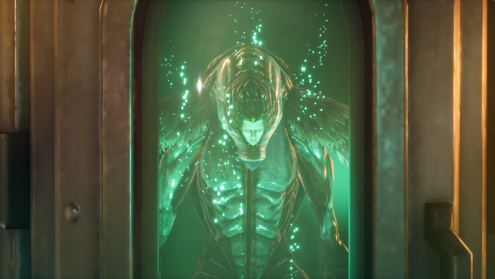
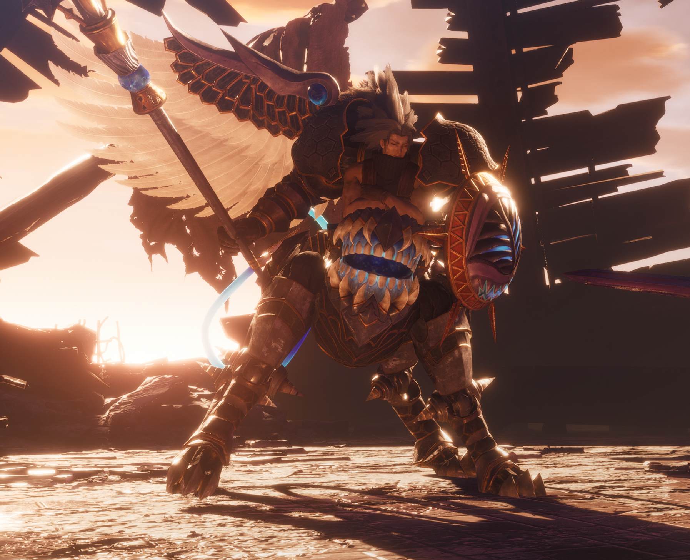
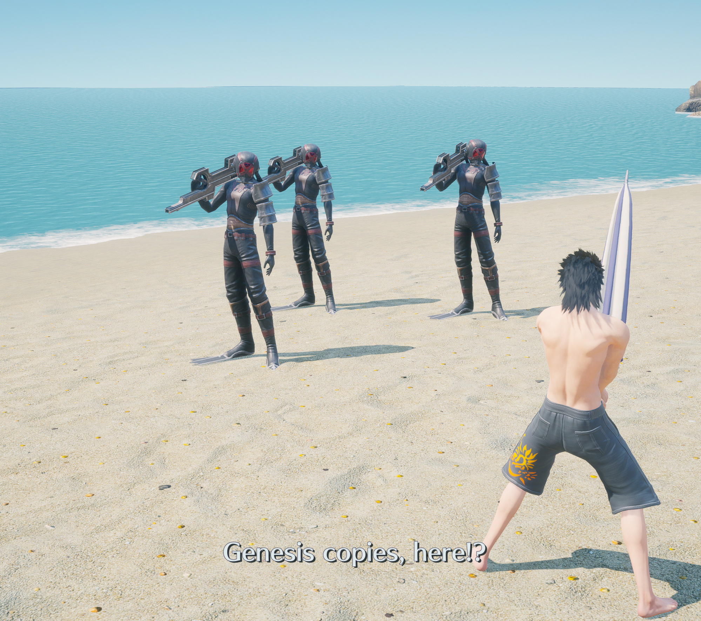
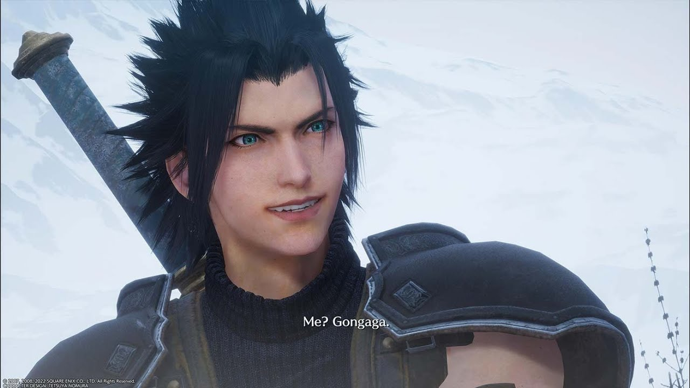

import { YouTube } from 'astro-embed'

This is the highest rated entry in the Compilation of Final Fantasy VII. Fans
praise it as the jewel of the Compilation, and it is considered by many to be
the justification for its existence. Does it live up to the hype?

**No.**

Okay, I may have opened my Dirge of Cerberus review the same way, but this time
it's different: I'm not challenging an undeserved negative reputation, I'm
challenging an undeserved positive one!

# The Review

I spent most of my time playing this wondering why it has such a good
reputation. It took me until the end to figure it out---because the end is the
entire reason. The last half hour or so of this game is fantastic. The ending is
emotionally powerful and makes clever use of the game mechanics you've been
playing with the whole time. Good endings are as important as they are hard to
get right. So I can see why people left this experience with the emotions they
did. However, I kept notes on my playthrough, and I can see the hours and hours
of time I spent absolutely loathing this game's existence. The ending does not
save it for me.

Something this game shares with Dirge of Cerberus is that both games feel like
they were created to fill a market segment, and the Final Fantasy VII brand was
slapped on later for marketing reasons. Crisis Core takes this a step further,
because it's a prequel. Prequels are hard to do correctly, and extreme care must
be taken not to invalidate the original work. This game not only misunderstands
the role of a prequel, it misunderstands the entire spirit of Final Fantasy VII.
Rather than enhancing the emotional core of the original story with new context,
it tramples over it and arrogantly inserts its nonsense wherever it can.

## The Port

The Reunion version of the game released in 2022. This brought Crisis Core into
the Remake series of games by using the same logo style as well as the subtitle
naming scheme of "Re-something." Reunion is a very important word in Final
Fantasy VII, and the first Remake game hinted that Zack was going to be more
important in the Remake series than he was in the original game. This led many
fans to expect a lot (myself included). FFVII Remake transformed the original
and truly brought it into the modern age of games. Surely this "Reunion" remake
would have at least some of that sauce, right? If not that, a few bonus
cutscenes to tie this story to the Remake in any way? Anything new, at all?

Nothing. This is a straight remaster of a PSP game.

Okay, they did change some things. While the visuals have been upgraded like any
remaster would, the character models have also been updated to be closer to
their Remake counterparts. The voice actors have also been replaced with those
from the Remake series. Gameplay was significantly reworked to make it more
modern and to inject some seriously needed quality of life, but it's nowhere
near the standard set by the Remake series. I'll talk more about some of these
things in the following sections, but what's important to know here is that
these things were all _worse_ in the original, and I expected more from this
release.

Many elements of this release feel lazy. The very first thing you see when
booting up the game is a poorly AI-upscaled FMV. Lines blur and warp during
movement, some textures are unnaturally greebled, and everything looks more than
a bit uncanny. Most FMVs in the game are like this. "Most" is an important word,
there. Some of the FMVs _were_ rerendered at higher resolutions, showing they
had the capability to do it. This isn't a situation where they lost all the
original files like so many previous Square Enix remaster projects. Upon closer
examination, it appears they only rerendered FMVs when a model changed
appearance, requiring a rerender to keep visual continuity. All others were run
through an extremely low quality upscaler. I suppose they had to save every
penny when releasing a 15 year old game for $50. There was no other way.

The original only had voice acting in some scenes, so others were designed
without it in mind. The characters displayed emotion by overacting physically.
Huge jumps, big arm movements, exaggerated facial expressions, the works. These
scenes were not adjusted for the addition of voice acting, but the actors would
sound like crazy people if they delivered the energy displayed on screen. So
they didn't. Now we have a mismatch between body language and voice acting that
is constantly uncanny, and inconsistent between scenes. Also, this small indie
company couldn't be bothered to animate lip flaps for every language. So we get
the classic 2000s dub line delivery, where actors had to pace their words to fit
the original mouth movements. In 2026.

Additionally, none of the scenes in the entire game were changed in any way
except for swapping out character models. There are lots of camera angles
clearly designed to work on very tiny screens, and it definitely feels like the
industry hadn't quite figured out how to cinematically frame things yet. There's
a real "puppet show" vibe to it all. Everything feels over-storyboarded, if that
makes any sense. That is, it feels as if storyboards were translated into 3D
directly without any consideration for how those mediums are different. You
could also drive an entire cargo ship between lines in dialogue with how poorly
paced they are.

I think the upgrades in technology actually hurt the storytelling, in some ways.
Load times are instant now, especially with simple scenes like these. It might
sound like "no load screens" is a good thing, and I agree, but nothing was
inserted to replace them. Scenes snap between tones so fast I actually recoiled
from my screen a few times. Not in a way that feels intentionally abrupt, but in
a way that feels like something is missing. There are some cuts that transition
through multiple hours or days of in-universe time with no indication or
fanfare, often directly into the middle of new events. I want to give the
original game the benefit of the doubt, that a loading screen between these
scenes might have been enough of a mental buffer, but I'm not entirely sold. It
felt more like this game had an outline of events and adapted this outline very
literally rather than filling in gaps with natural transitions.

A particular example sticks out in my head: I was talking with Aerith, a beloved
character, with pretty music playing, flowers around me, and sunlight streaming
over everything. It was pleasant. The characters said farewell to each other. I
clicked to advance the dialogue. Suddenly it was dark, I was walking on the
empty highway (for some reason?) miles away from where I was, with guns already
pointed at me and enemies flowing in from the sides. This was not combat, but a
cutscene. It's like **in media res** was the philosophy for starting _every_
scene.

The other question I have is: why release this now? This is the only Compilation
of FFVII entry to get a remaster of any kind. With the timing of its release,
the subtitle clearly fitting the Remake scheme, and the reuse of Remake
character models and voice actors, you'd think this would tie into Remake quite
heavily, or at least be important to it in some way, right? Fans certainly
thought so. As did I. But no, it does not tie into the Remake series in any way
as far as I can tell. In fact, there are continuity errors between this and
Remake, and I'm not talking about (Remake spoilers) || the Whispers/Arbiters of
Fate||. There are scenes that are shown in both of these games that are
incredibly different, without any of that stuff involved. You'd think this
rerelease would be the perfect time to line all these things up, right? Square
Enix disagrees. Further, this game has _incredibly heavy spoilers for some of
the best content in FFVII._ Fans buying and playing this **will** have a worse
experience with Revelation. I'm keeping those spoilers out of this review.

I think the unfortunate answer is that this is a very low effort cash grab meant
to capitalize on the current hype around Final Fantasy VII, even at the expense
of the artistic and narrative integrity of the Remake series. They knew that
Crisis Core is popular (for reasons beyond my comprehension), and they knew that
people would easily pay $50 for something they cooked up as fast as possible.
They knew they could manipulate people into getting more excited about it by
marketing it as part of the Remake series, even if that marketing was completely
false. But hey, what is the Compilation of FFVII for, if not squeezing Final
Fantasy VII until every drop of blood is extracted and it is nothing but a
leftover husk for Square Enix executives to use as a footstool? That treatment
of FFVII is the most faithful part of this remaster.

## Music / Audio

It pains me to say, because this is _usually_ one of the ways this series
excels, but this was a pretty poor audio experience for me.

I'm grateful that they used the Remake voice actors, because I think all of them
are perfect fits and I love their performances in that game. However, I think
they were given poor direction in this one, or they tried to stick too closely
to the original game's awkward quirks. Maybe both? These performances were not
stellar---and since this was consistent across the board, it can't be the fault
of the actors. Sometimes it felt like lines were read entirely in a vacuum, as
if the actors were handed the scripts and told to record themselves reading them
with no other direction. Even lines immediately following each other were wildly
different in tone, and often mismatched the context. Some of the actors gave
performances that were consistently neutral and emotionless seemingly as a way
to mitigate this. That has its own problems but is the lesser of two evils.
Maybe I'm imagining things. I have no idea what actually happened, but it turned
out pretty bad.

The soundtrack didn't leave much of an impression on me. The only note I took
about it, despite taking many notes about the rest of the game, is that it felt
uncanny and "wrong" somehow, almost always. This is a bummer, because it was
made primarily by Takeharu Ishimoto, whose work I have enjoyed in the past. In
fact, the Final Fantasy Type-0 soundtrack is still one of my most revisited in
the series. Perhaps the constraint of adapting Nobuo Uematsu's style to his own
didn't work out in this instance, or maybe he simply wasn't given enough time.
Once again, I don't know why, I only know it flopped pretty hard for me. To be
fair, it isn't hard to listen to, I just don't find it memorable and it's not
making it onto any of my repeat listen playlists.

There are a few standout tracks, such as
[Black Wing Unfurled](https://music.youtube.com/watch?v=R28f8T53x8A),
[The Price of Freedom](https://music.youtube.com/watch?v=TjF_V_feppI), and
[A Moment of Camaraderie](https://music.youtube.com/watch?v=9bzPlDSQNxc).
Notably, all of the best tracks are ones where Ishimoto was allowed to go wild
with his own style instead of arranging an existing track. To be clear, I love
Nobuo Uematsu's original soundtrack for FFVII, but this swing at arranging it
didn't work for me. I think the styles didn't work well together. I'm sure back
in 2007, hearing _any_ arrangement of that beloved soundtrack was a magical
experience, but unfortunately I'm now spoiled by the phenomenal soundtrack of
the FFVII Remake series.

Beyond quality, these tracks were often placed very awkwardly and transitioned
in and out very abruptly. That Moment of Camaraderie track I linked above plays
for a scene in which Zack is performing squats on the beach and a friend
casually asks him if he wants sun tan lotion. He says no, and they get attacked.
That's the whole scene. I found that to be such a poor fit that I laughed at the
screen in disbelief.

It doesn't stop there. The game is full of audio interruptions. Most frequently
and annoyingly, "Entering Combat Mode" blasting out of my headphones three times
louder than the music every time a random encounter started. There are also
countless audio interrupts in the middle of combat, notifications that you've
got new mail on your phone, and more! It's a nightmare of distractions.

## Gameplay

This is a pretty simple action JRPG. You have a single attack button, which can
be pressed multiple times for a single combo string. Holding down a button gives
you access to your equipped materia, which could be spells (consuming MP) or
special attacks (consuming AP). Your special attack power is amplified by your
progress through the one combo string, so if you attack 4 times before hitting a
special attack, it will do more damage. This encourages you to push your luck by
committing to long combo animations before cashing in for big damage. You can
block and dodge, and you always critical hit when attacking from behind.
Sometimes the game will prompt you with a button to press.

That's all you need to know to beat the game. It's trivial, but not that simple.
There are a ton of other mechanics stacked on top of each other like they kept
throwing random ideas at the wall and keeping anything that wasn't offensively
bad. But you don't really need to know about that stuff to win. You'll only
trivialize the game further.

Unfortunately, regardless of your knowledge of these topics, they won't be
ignorable. The game's gimmick is **gambling.** At all times during combat, and
entirely out of your control, a slot machine continually spins in the top left
corner. It's flashy. It has sounds. It even plays cutscenes sometimes. You
wouldn't want to miss a cutscene, would you? There are story cutscenes that only
happen if you roll them through this system. It even beats Dirge of Cerberus for
worst Limit Break system by locking them behind this layer of RNG. That's right,
Square Enix does not just limit gambling to their mobile live service games, now
you can gamble in your single player RPGs too! Had a hard time with a fight (an
extremely rare event)? It's okay, maybe your luck will carry you next time.
Sometimes the slots will give you literal god mode for a bit.

Even Limit Break damage is random. Sometimes they'll smite your foes with the
fury of the heavens. Sometimes they'll do less than a basic attack. Every limit
break has levels, and the level you get each time is rolled alongside which one
you get. Are they even limits being broken if I can deal more damage with a
basic attack, and the Limit Breaks happen once every couple minutes?

All of the Limit Breaks, Summons, and so on you get from the slot machine have
an associated cutscene. Some are good, others are pretty basic. All of them send
you temporarily to some other location. You might be fighting in a cave, but the
limit break animation shows you fighting in a field, then it snaps to another
canned arena where where all the enemies are held locked in place while the
damage happens to them, then finally back to the real fight. These Limit Breaks
interrupt the flow quite badly. It's my understanding that in the original,
these things would trigger automatically without your consent as soon as they
were rolled, and the cutscenes were not skippable.

The slot machine also constantly feeds you resources. I spammed all my strongest
attacks and rarely ran out of anything, because the slot machine would fill me
back up. The combination of that and the power of the random buffs and Limit
Breaks made me feel like the game was playing itself and I just had to hit the
same button over and over. This particular version of the game added an optional
weapon stance intended to remind players of Cloud's Punisher mode from the
Remake series. However, it's far more overpowered. It automatically blocks
everything, upgrades the damage of your special attacks as if you had done a
combo, and absorbs more resources for you. It has no downsides. I didn't touch
any side missions and I barely even touched the progression system, sticking
with the same set of equipment for 95% of the game, and still trivialized every
encounter with 2 buttons.

I'm going to choose not to cover the progression systems, because as
established, they never mattered for beating the game.

The structure of the game is also annoying. You can't walk 10 feet without
triggering a random encounter, and since that halts your camera and blasts you
with audio, it's jarring every time. It feels like the brakes are being
constantly checked throughout this game. When it's not encounters, it's random 5
second cutscenes. Even the combat itself is constantly interrupted by Limit
Break cutscenes, as explained above.

The game seems very confident in its combat with how high the random encounter
rate is. Even dramatic narrative moments were constantly interrupted. You know
what the Nibelheim incident needed? 15 combats between story beats, clearly.
Crisis Core abhors good pacing like nature abhors a vacuum. Empty space simply
must be filled, violently, all at once.

Nonsensical minigames are also scattered throughout. There's a stealth section
in which you have to perform squats to maintain your body heat against the harsh
cold, but all that movement draws attention. A barrage of missiles has been
fired at a town, conveniently all in one straight line! The only possible way to
save lives is clearly for Zack to stand in front of this line to intercept them
with his sword or his body, depending on the player's timing. This road
patrolled by robots is... littered with abandoned sniper rifles for you to shoot
them with? Who left these here? The original Final Fantasy VII was no stranger
to minigames either. Some of these are even references to those. But somehow
these all feel cheaper.

The world is _full_ of repetitive side content, and the game is desperate to
make you aware of it. You can't leave an area without several warnings and
confirmation prompts. I lost count of Points of No Return. The world is made of
many tiny interconnected rooms, most of which the story never brings you to
directly. All of them have random side quests you can get from interacting with
NPCs. The game prompts the player to find these by occasionally forcing them to
walk across the entire traversable world to get to the next story objective,
hoping the player will maximally explore every inch along the way for fear of
missing out. This is extremely jarring, because most of the time the game would
rather teleport the player between scenes and tones so fast they get whiplash.

These quests vary quite a lot, from minigames to boss encounters. All in VR,
very few having anything to do with the person you interacted with to get the
quest. These aren't "solve this problem for me" quests that open up the world in
interesting ways, they are meaningless, pointless side content added purely for
the sake of having content to grind through. Talk to some random NPC and he'll
tell you about his day before unlocking Bahamut #5. Yeah. Real immersive.
**There are 300 of these things.**

Since this was a PSP game, I assume the intention was to give you something to
do on the bus or train or whatever. Just a quick, meaningless task to distract
yourself with. You can access the full list of missions from any save point,
adding to this theory. Where are you likely to be when picking up and putting
down the game rapidly? A save point.

Unfortunately, all the interesting stuff is locked behind grinding out a stupid
amount of this content. I've seen videos and screenshots of awesome superbosses
and fun bits of fanservice. I would have had to triple my playtime at least to
see any of them. To see all of them would be a monstrous task. I completed the
main story and a small handful of side missions in 9 hours. The completionist
time is 73 hours. I gave up.

My other problem with all this side content is that the base game is already so
trivial. These side quests mostly reward meaningless fluff just so you get the
satisfaction of Receiving an Item, but aren't actually super strong. However,
some of the rewards are quite strong, and experience points will be accumulating
the whole time regardless. I saw a video someone uploaded named something like
"this is why you do side content." It was a 10 second clip of one of the most
narratively and dramatically interesting bosses in the game being killed in a
single hit. Yeah. None of that for me, thanks. I can see why that appeals to
some, but I always hate feeling like I've overpowered the difficulty curve. I
prefer a nice, challenging, curated experience over a power fantasy.

## Story

Once again, an unfortunate pattern in the Compilation so far is that story is
the weakest element. I would say that Square Enix simply didn't know how to
write Final Fantasy sequels yet, after so long writing them as standalone
anthology entries. However, at this point they had already nailed it with Final
Fantasy X-2. Perhaps that was a fluke. They did eventually figure things out
again, as Lighting Returns: Final Fantasy XIII is not only my favorite Final
Fantasy game but one of my favorite games of all time. Crisis Core (and the
other Compilation entries) fell in this awkward period of low quality cash
grabs.

### Leave No Stone Unexplained

Unlike Dirge of Cerberus, Crisis Core is a prequel, and it commits the worst
possible prequel sin: adding an unnecessary explanation for every possible thing
in the original. These explanations fundamentally misunderstand the role of a
prequel and what the audience would want to explore within one. Not only are
they _extremely dumb,_ they often assassinate the original characterization for
no reason.

Why does Zack have that haircut? Did anyone actually ask that? Isn't that just
part of his character design, showing he's a bit of a goofball but still cares
about looking cool and masculine? Well, there's an explanation for it! You're
gonna hear it whether you want to or not! You see, there's _another character_
who wore their hair like that, Angeal. He was Zack's mentor. Zack chooses that
hair style because of his mentor. It can't just be a character choice, it has to
**come from somewhere.** Where did Angeal get the hairstyle, if everything needs
to come from somewhere? His father, naturally. Where did he get it from?
Irrelevant! He never appears on screen so no explanations are necessary. The
exact same line is used for Zack's iconic Buster Sword. It's not a cool
character design element based on Zack's boyish obsession with things that make
him look strong, it came from Angeal, who got it from his father, who just...
got it for no explained reason. This pattern is _everywhere_ in this game.

Original characters aren't allowed to be the first to do anything. Zack did the
back flip off the train first. Zack fell into Aerith's church from Sector 5
first, landing in the flower bed of course. (FFVII and complete Remake series
spoilers) || Angeal first had his hometown burn down when his best friend and
fellow SOLDIER, Genesis, went mad and betrayed him. This even extends to
Sephiroth's part of the story. Genesis acts like a Sephiroth before Sephiroth.
He appears out of nowhere to give Sephiroth the revelation that caused the
Nibelheim incident. Sephiroth came to this revelation on his own in the original
game, but Crisis Core _hates_ the idea of any original FFVII character doing
anything on their own. It all **has to come from somewhere** and that somewhere
**has to be this game.** Genesis even enters the Lifestream, sending clones
across the Planet.|| Even Genesis gets all his ideas from a play called
Loveless. It's his entire personality. He spends 90% of his time on screen
quoting from it. But Loveless itself, where did it get its ideas from? Well, the
authors are long dead, so we don't need to know. Also the play is conveniently
unfinished so we can't _really_ know what it is trying to say at all! It can say
whatever the writers want Genesis to think at any moment! Convenient!

While the above examples are silly at best and annoying at worst, the treatment
of Tifa and Aerith actually made my blood boil. I think it is no coincidence
that the two main women from the original game had every scrap of agency and
intentionality torn away from them by this game. Every decision, opinion, and
even stylistic choice is made for them by a man. In a cheekier example, Zack and
some random man are talking and this gives that man an idea to create a bar in
the Sector 7 slums called the Seventh Heaven. The man even decides to create a
secret base for an anti-Shinra force in the basement. So she didn't even pick
that for herself. She's anti-shinra because she stumbled into it after a man set
it up for her. Not even a noteworthy man, just some nameless NPC. These writers
see Tifa as having less agency than a nameless NPC, because he's a man. Later in
the game, the only opinions that come out of her mouth are her feelings for
Cloud. Even during scenes that were duplicated from the original game, her
iconic lines are gone. She's not here to _have thoughts._

Somehow, Aerith is treated even worse. It's uncanny hearing Briana White's voice
come out of this character who is definitely not Aerith. It has her name and
face, sure, but every bit of personality has been sanded away. She's just a
quiet girl who only exists to be pure and innocent and desperately in love with
Zack. She hands him a list of her greatest wishes in life, and the only one we
hear, at the top of the list, is to be with him. I'm not sure why, because he
treats her like a classic Nice Guy™, assuming a single favor is enough that he
now deserves her. He even gets upset when she asks of him a _second favor,_
after also helping him out with his own issues. These authors have disgusting
views of romance.

It gets worse: Aerith is used as a blank canvas to fill with Zack's choices.
This game claims that the Aerith we meet in the original game is only the way
she is because Zack made her that way, and she was lost without him. Why does
she sell flowers? Zack told her to. Why does she wear that ribbon? Zack gave it
to her. Why does she wear a pink dress? Zack _made her promise to wear pink._
Who says that? What? And of course, it's a promise, because promises are so much
more emotional in stories, you see. Even the fun, chaotic, and flirty parts of
her personality came directly from Zack. Her promise of payment of one date in
payment for Cloud's assistance was originally a line from Zack. We've seen how
much ass Aerith can kick, and how strong she truly is, but in this game, she
cowers from every threat so that Big Strong Zack can save her. I hate all of
this.

### God is Real and Her Name is Minerva

When the game isn't being annoying about prequel stuff, it spends most of its
time inventing random nonsense to inject into the world of Final Fantasy VII. As
the name of this section suggests, one of the wildest reveals made by this game
is that there is a god, and her name is Minerva. Final Fantasy VII very clearly
and intentionally has no gods. It focuses on the Planet as the closest thing to
"divine" in its cosmology, and that is why the word "Planet" is capitalized. Not
only does it go completely against the FFVII cosmology to introduce a random
goddess, not only does she not look like a single other thing in the world of
FFVII, she's completely missing from all other FFVII content. It gets worse! You
can kill her _in a side quest._ Not even for interesting thematic or
philosophical reasons. She's just in a cave and you kill her. They introduce her
for a deus ex machina and then throw her away.

Dumbapples are a kind of apple that grows randomly throughout the year, rather
than during a specific season, thus being "dumb." They grow only in one
particular town. This lore is apparently very important, with how frequently the
game brings it up. It's supposed to be the symbol of the hometown two characters
share, but it always ends up pretty flat. Especially with a name like
dumbapples. There's even a scene at the beginning of the game with brilliant
dialogue like, "Do you know what dumbapples are?" "No." "I knew it, you're not
ready for SOLDIER First Class" and the entire logic is that so far only SOLDIERs
from that home town have made it into First Class. More like dumbwriting.

There are also events written into the timeline that are impactful enough in the
world that there's no way everyone simply forgot about them between games. This
game needed stakes, so they added world-threatening events to it. The
Compilation entries that take place _after_ FFVII are about picking up the
pieces after such an event happened. But now, _before_ FFVII, similar events
happen and we're supposed to believe they left **zero** impact on anyone? More
directly, Aerith saw some shit in this game that would absolutely change how she
reacted to certain things in the original game. The continuity doesn't make
sense.

There are important characters introduced, especially within Shinra, that
obviously had to die by the end of the game. After all, those characters are not
in the original, and they are high enough ranking that they absolutely would
have been mentioned if they were still alive. So the player immediately knows
which characters will die upon meeting them. This makes any emotional impact
they could have had completely null. Not that I think any of them were written
well enough to have such an emotional impact in the first place. I'm not even
talking about Genesis or anything yet, just high ranking Shinra scientists, the
director of the SOLDIER program, and so on. It leaves me wondering why these
characters were written into existence in the first place if they had nearly
zero impact on this story and had to be _taken care of_ before the end of the
game. This just feels like a pointless place to start writing a character.

The other main thing that was created and had to be destroyed by the end of the
game was G-Type SOLDIERs. See, Sephiroth was the first S-Type SOLDIER. That is
considered the successful branch, named S after Sephiroth. The first G-Type
SOLDIER was Genesis. Plot twist! The G is for Gillian, not Genesis, the woman
who underwent the treatment while she was pregnant with... Angeal? Not Genesis?
And then Genesis was born to another woman but he had Gillian's genes injected
into him? This is all complicated and twisted for no reason. Regardless, the
G-Type SOLDIERs have a similar but different set of abilities compared to their
S-Type counterparts. They also undergo something called Degradation. What is
Degradation? Good question. The game doesn't know either. Some characters get
old, some gain new powers, some lose their minds, some essentially become gods,
and some just die. It's entirely random. The characters keep talking about their
existential fear of Degradation and how it is very very bad and how they would
do anything to cure it. Most of the plot is about their various failed attempts
at curing it. But guess who finally can? That's right. Minerva. She shows up
just to solve the entire issue the plot revolved around, before being once again
discarded.

Small problem: We already saw Genesis in Dirge of Cerberus. He can't just die
like every other character in this story, conveniently cleaning up loose ends
that didn't appear in the original game. Genesis is a threat only slightly less
dangerous than Sephiroth. He would make a big splash that would be noticeable in
the original. So he can't be around for the duration of that game, and can't be
dead because he appears later. The answer? Coma. Yeah. They just lazily threw
him in a coma for the duration of the original game so he could conveniently
wake up after Dirge of Cerberus. Also god chose him and cleansed him in this
game. So even though he was clearly menacing and evil looking in Dirge of
Cerberus, this story also retcons him to be a hero after the events of Dirge of
Cerberus. Once again, leading up to a game that never happened.

Some of this new content is also... **really bizarrely bad.**

Look, I'm not going to spoiler tag any of this. It doesn't impact any other game
in any way, and this one is _not_ worth playing.

You start seeing monsters who are "Angeal Copies." See, Genesis gained the
ability to copy himself as part of his degradation. But for whatever reason,
despite being the same kind of SOLDIER, Angeal has a white wing (Angeal ->
Angel. Wow! So clever!) and he copies himself by... infecting monsters by
putting his face on them in a random spot. It looks so cursed. A spot on their
body will just suddenly sprout this gold and marble statue of his face. There
are no other lore implications of this other than... it happens. They're just
like that now.

When Genesis lost his mind, he started quoting from his favorite play,
Loveless---but when the same thing happened to Angeal, I guess he didn't have
any favorite media to fall back on because he just started saying shit. Look,
just... watch this minute long clip to increase your appreciation for the FFVII
Remake series tenfold.

<YouTube posterQuality="max" id="nJTL-cFTF5s" params='start=40&end=112' />

This hurts in that special way where the only response can be laughter.

Later on, he reverses the copying process, absorbing monsters for seemingly no
reason just so a boss fight could happen. We get this abomination. I took one
look and thought "this fight is going to suck ass."

His abilities are named after the seven deadly sins, grasping at meaning but not
quite getting there. It's random word association. "Defense of Lust" gave him
the effects of the barrier spell. Guess he's bringing protection? I can't begin
to guess what else is meant here. "End of Gluttony" just fired a bunch of beams
everywhere. I would say you probably get the picture, but I don't either. Not
even the devs did.

You kill him. He gives you the buster sword and the last words "Embrace your
dreams. That's an order." You're then immediately and unceremoniously dropped
into a beach episode where you fight with an umbrella instead of the buster
sword you were just given. Weird to have to tell the developers to read the room
they created. But I guess they probably only cared about this as much as they
made me care about it.

Later on, you see Angeal again---but it isn't actually Angeal, it's another
completely random character who got infected with Angeal's genes and progressed
so far into "I have Angeal's face on my body" syndrome that he just...
transformed into a gray old man version of him. This one dies too. The writers
needed an Angeal-shaped body for a few ostensibly emotional shots at the end,
and they also needed that character to die before the end of the game because he
didn't appear in the original FFVII. So they killed two Angeals with one stone.

...and all of that is just Angeal's content. There's way more. Especially
Genesis. Even fans of this game hate Genesis. But if I wrote it all down here,
this post would just be a recap of the entire game.

### Me? Gongaga.

One of the few things I knew ahead of time was this meme:

I think it has similar appeal to the Revolver Ocelot meme. Out of context, it
has a certain absurdity to it, mostly because Gongaga is one of the sillier town
names from the original game. In context, I found this to actually be a touching
scene. This is when Cloud and Zack started bonding about their hometowns. Unlike
everyone around them, they're both country boys. This is the start of a deep
friendship between them, driven mostly by Zack dragging Cloud out of his shell a
bit. I really wish more of the game was about this. The best moments are.

It's not just about Zack and Cloud, either. Zack's relationship with the Turks
is also fun and interesting. It gives me more to think about for all the
characters involved. One of the Turks from Before Crisis, Shuriken, also returns
in this game as Zack's primary Turk handler. She goes by the alias Cissnei in
this game, and while her true name is never revealed, that's at least less
awkward than Shuriken. The bond between her and Zack is much stronger than the
bond shared between Zack and any other Turk. It's pretty sweet. Tseng gets some
solid coverage as well.

In general, whenever this game focused on events that actually happened in the
original, or built up to them by adding depth to Zack's relationships, it was
excellent. There were a few minor issues here or there, but pretty forgivable
stuff. It got pretty bad whenever it inserted the new stuff about G-Type
SOLDIERs into situations where they weren't previously. It was terrible whenever
it went completely off the rails of the original. I think there was a ton of
room for them to focus on the existing characters, instead of adding new ones
for no reason like they did.

However, the ending is exceptional. I think it is the main reason this game
sticks out positively in so many players' minds all these years later. Even if
they had to suffer through some of the worst writing in the series, and ignore
some destruction of the original game's characterization. That ending was still
an incredibly emotional experience that cleverly used game mechanics to deliver
its message. The pattern holds true: the ending of this game was another scene
that was present in the original, but now it is made significantly better
through additional details.

Still not enough to save the game for me.

## In the Compilation

Here's the list of common Compilation elements so far:

- The art style has shifted to a more realistic, but stylish aesthetic.
- There’s a much greater tendency to leave things unexplained and drop vague
  hints at things, to tease and connect to other Compilation works.
- The Lifestream has light and dark parts. In general, light and darkness are
  now more of a focus than mankind’s hubris against nature.
- There is a much stronger focus on action, especially over-the-top, superhuman,
  acrobatic combat and slicing through buildings.
- There is a stronger focus on Zack, AVALANCHE, the Turks, and party members
  that didn't get as much love in the original.
- The Lifestream can grant premonitions now.
- The technology level of the world is significantly modernized.
- There are super soldier programs other than SOLDIER. Some of these are more
  successful than others. All are traumatizing.
- There are more “special” materia out there than just Meteor and Holy.
- Sephiroth has that iconic new one-winged-angel look.
- Cloud is slightly more of a brooding loner.
- Characters who died are brought back through retcons, gotchas, and all new
  lore invented for the sole purpose of bringing them back.

Pretty much all of that is still true here. However, there are a couple minor
differences from the usual: Rather than the Lifestream granting premonitions, it
is anthropomorphized as a goddess, for some reason. The wings appear on
characters other than Sephiroth this time around. Cloud is still quiet, but he
opens up a lot more thanks to his bond with Zack, and still being a bit younger
(and less traumatized). I'll count G-Type SOLDIERs as a new type of super
solider program, technically.

Now that this game has tied itself to Dirge of Cerberus by including Genesis,
Weiss, and Nero, they have technically become new common Compilation elements
rather than the hallucinations of a single entry. This game not only included
them, it (unfortunately) significantly expanded on them. So they're here to stay
now.

Maybe I'm feeling particularly uncharitable right now, but I'm starting to think
that "terrible writing" is another common Compilation element.

# Final Thoughts

**Rating: 2/10**  
_Playtime: 9 hours_

There has to be a _worst_ Final Fantasy game. One has to exist. For me, this is
it. Maybe, if I play all the even cheaper spinoffs and mobile games, it can rise
to second worst.
