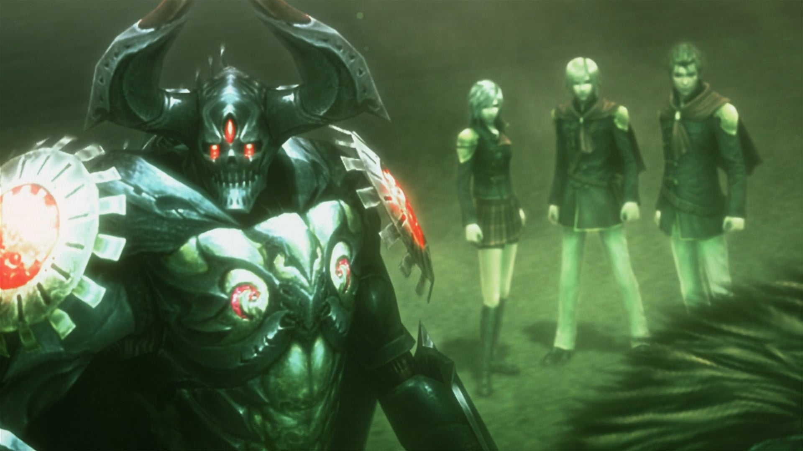
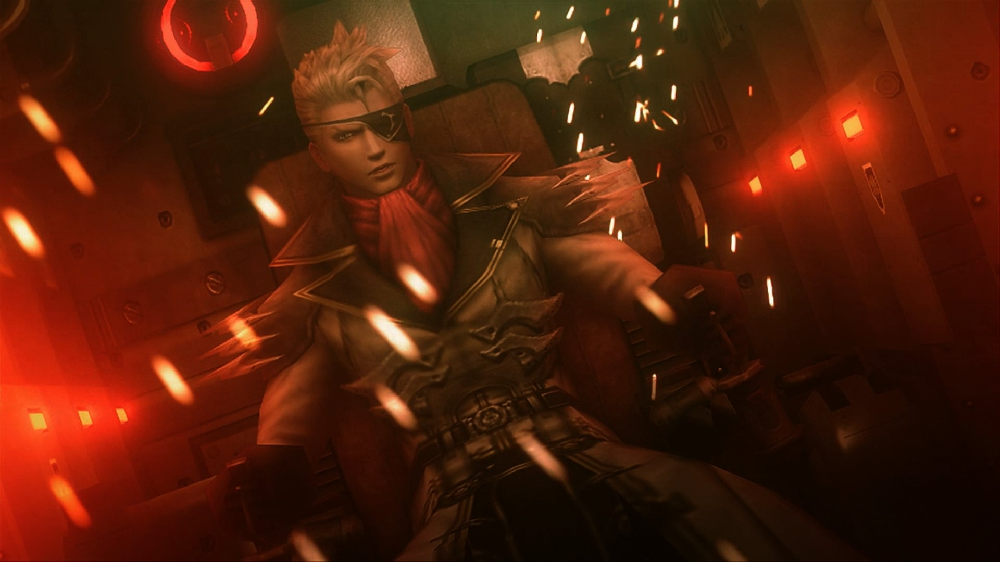
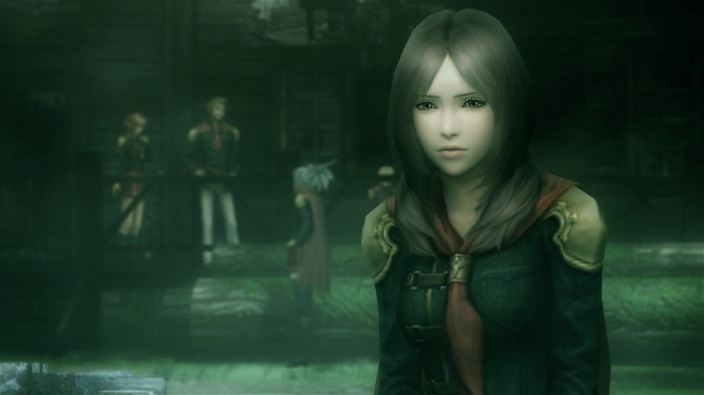

import {YouTube} from 'astro-embed'

I didn't expect to like this one. At various points during the retrospective, I
removed and then re-added it three times. I had heard that it had made some
people motion sick, and those who could stomach that only found a grindy mess.
In order to get the most complete picture of the Fabula Nova Crystallis as I
could, I gave it a shot. I'm really glad I did.

This game started development as Final Fantasy Agito XIII, one of the three
original Fabula Nova Crystallis titles. It was to be released alongside Final
Fantasy XIII and Final Fantasy Versus XIII as a series of Final Fantasy games
with disconnected stories, but a single unifying mythology. Versus XIII was
renamed to XV, and largely removed from the Fabula Nova Crystallis mythos
(though some small elements remain). Agito XIII was also renamed, and its target
platform changed from an episodic mobile phone release to a complete Playstation
Portable game, but it remained completely attached to Fabula Nova Crystallis.

This was the second Fabula Nova Crystallis game to release, after Final Fantasy
XIII. While the FFXIII sequels ended up changing terminology to more generic,
easily understandable terms such as "goddess" and "savior" due to fan feedback,
Type-0 released too early for that feedback to have had any impact on it. As
such, it still uses terms like "Fal'Cie" and "l'Cie" in its worldbuilding. That
makes it a very close sibling to FFXIII, especially due to the settings and plot
lines of the two games being much more similar than those of FFXIII and its
sequels.

Final Fantasy Type-0 was the first Final Fantasy game to receive an "M for
Mature" rating. It was more than a decade earlier than the next game to receive
this rating, Stranger of Paradise: Final Fantasy Origin. Modern Final Fantasy
games continue to dance with this rating more and more. Final Fantasy XVI made
headlines for being the first mainline entry to receive this rating. The FFVII
Remake series feels like it occasionally holds itself _just_ under the line to
maintain its T rating. Even FFXIV has started to contain extremely dark and
violent content in recent years. In this way, Type-0 feels ahead of its time.
Not because any of the characters swear like sailors---the closest is gets is
when somebody "breaks character" by dropping 17 "fricks" in under 2 minutes. The
game also thankfully stays refreshingly far away from any kind of sexual
content. No, this game got its M rating entirely because of the subject matter:

This is an extremely dark war story. Though characters are seen shooting down
jets with enchanted bows and arrows, running around in magically defensive
school uniforms, piloting mechs, and transforming into dragons---it's all
presented with utmost, deadly seriousness. The cutscenes alternate between war
documentary and gritty war movie styles. In the former, a narrator flatly
describes the cold, blunt facts of the wide-scale scenes of destruction being
displayed: casualty counts, retreat orders issued, and the scars left on the
world. In the latter, the camera zooms way down to individuals, demonstrating in
agonizing detail the extremely personal stakes of war. The game _opens_ on a
chilling, multiple minute long scene of a child soldier bleeding out in the
street, screaming that they don't want to die as the red puddle continues to
grow. It's **brutal**.

If you want to see,
[here is a recording.](https://youtu.be/g-ssNNfPgeI?si=MzDdqj6QI8F9KvY0) Fair
warning, it's pretty rough and also includes violence towards animals, which I
know can affect people in a different way.

Is it the best war story ever told? No. Is it a flawless game? Hell no. But I'm
glad I finally chose to play this game. I think it represents an extremely
interesting point in the history of the franchise, and I think it's often
overlooked. For better or worse, Square Enix games outside of the Final Fantasy
mainline series simply get less attention---even if some of the fans _begging_
for Square Enix to return to their classic style of JRPGs would be totally
satisfied if they looked outside the Final Fantasy franchise. More importantly
for me, right now, this is an extremely interesting part of the Fabula Nova
Crystallis era of Final Fantasy.

I have something to admit. I played this one a bit out of order, _after_ having
already finished the entire FFXIII trilogy. I initially skipped it because of
the reputation this game had, and because I was feeling a little bit burned out
on this retrospective at the time. But Lightning Returns refreshed not only my
enthusiasm for this retrospective, but also cemented the Fabula Nova Crystallis
as one of my favorite video game mythologies ever. I immediately jumped into
this game, craving any scrap of Fabula Nova Crystallis I could get my hands on.

That Lightning Returns review isn't out yet, and won't be for some time. I have
decided to review this one first, out of order, because I think this well help
lay the groundwork for that future Lightning Returns review.

# The Review

Final Fantasy Type-0 is not a game I necessarily recommend. It's a weird little
game that just happened to line up with some of my very specific, niche tastes.
I hope to communicate those details to you in a way that helps you understand if
this is the kind of game you'll like, too, but I think this would be a pretty
hard sell without significant overlap with the eccentricities of my taste in
games. It's pretty flawed, but in ways I happen to not care much about.

I think this is the biggest one: This is a school setting with a calendar
system. It's similar in a lot of ways to Fire Emblem: Three Houses. There's a
large cast of characters with unique mechanics. You level them up individually,
bond with them through social events, and choose who to bring with you on each
mission. Actions you take around the school cause the calendar to advance,
consuming your precious time between combat deployments. This even extends to
departing from the school to do side quests on the world map, rewarding you for
accepting multiple overlapping side quests at once for efficiency. More loosely,
it's similar to the Persona series, but the students are at a war academy and
the cast of characters is multiple times the party size.

The other big thing is that I'm a bit of a sicko for intentional gameplay
friction as part of the narrative. For example, this game will repeatedly take
party members away from you, with no regard for how much you invested into them
mechanically. This is done so that the weight of losing those characters is felt
in all aspects of the game, not just the narrative. This is something I think
many modern RPGs have started to miss \*cough\* Expedition 33 \*cough\* despite older games
like Final Fantasy VII being endlessly praised for it. Another example is that
you're usually brought directly back to the academy base after every mission,
but after one particularly sad part of the story, you're left to slowly walk
across the entire globe. The game leaves you with your thoughts, and really lets
you _feel_ how all the characters are at the verge of breaking down by straining
your resources with endless random encounters. It sucks. That's the point. You
gotta be down for that kind of thing to enjoy a game like this.

Finally, you have to be willing to take the writing seriously, even though it's
not always great. It's at least always trying to be sincere, and always trying
to say something. You'll have a better time if you meet this story where its at,
instead of hoping it meets a more objective critical standard. I want to be
clear that I'm not suggesting "it's great if you turn your brain off" or
anything silly like that. I've just seen a lot of people consume media similar
to this by attempting to poke every hole in it that they can, instead of
attempting to find the diamonds in the rough. If you can do the latter, I think
there's a lot to enjoy in this story.

## The Port

Unlike my other recent reviews, this game actually got an HD remaster. You can
still tell that it was a PSP game, especially from environment and gameplay
design, but the main cast's character models all look great. That's what
you'll be looking at most of the time anyways. It's also nice that it can
run at higher resolutions than the original PSP release could.

Unfortunately, the praise mostly stops there. This game is locked at 30fps, and
can't display at resolutions higher than 1080p. Fortunately, these are just
silly hardcoded locks in the engine. You can fix both of these with mods.

However, while _most_ gameplay works at higher framerates, there are a few
random missions during which certain triggers will not work correctly. So you
might approach a door, and it never opens, or an NPC may never finish running
over to a wall to hit a switch, or other similar issues. Though stuff like
combat always works, these bugs are game-breaking due to completely blocking
progress whenever they occur. The mod developer occasionally fixes these bugs,
but there were still about a half dozen occurrences I experienced while playing,
and they always required me to restart the game and lose significant progress.
So I stopped trying.

Instead, I ended up mostly relying on Lossless Scaling to give me 4k60. That's
the route I recommend to anyone else considering playing this.

The other annoyance was that my chosen resolution got scaled by my display
scaling. If you've got a high resolution monitor, it's pretty likely that you
have display scaling set up by default so that text is the same size on all of
your monitors regardless of resolution. Mine is set at 150%, as I have a 4k
monitor. That meant that the game was always 50% larger than I asked it to be,
zoomed directly into the middle of the screen and/or covering parts of my side
monitors. I had to temporarily alter my display settings whenever I wanted to
play this.

I think this takes the cake for worst port in the series so far, at least from a
PC perspective. I'm sure it's more streamlined on consoles, though the framerate
and resolution issues likely aren't fixable there.

The fact that I still thoroughly enjoyed this game despite those issues should
show how strongly I appreciated the other elements of the game.

## Gameplay

Outside of the social/school elements I briefly described earlier, this is an
Action RPG (not an ARPG). Maybe it's better to describe it as a Character Action
RPG, as every character plays with unique mechanics like a Character Action
game, but there are strong JRPG-like progression mechanics. Every character can
use a specific weapon type, and has an action move set unique to that weapon.
The character with a revolver plays very differently from the character with a
scythe, but both have attack combos, dodges, and special abilities.

Those special abilities are unlocked through character progression, and can be
equipped to several dedicated slots on each character that are bound to specific
controller buttons. So you might equip "Wildcard" to "Y" for example. These
slots are also used for spells, which have shared progression for the entire
party. This leaves a lot of room for playstyle customization for every unit. If
a particular unit doesn't have fantastic magic stats, you could entirely skip
spells on them in favor of equipping more of their unique abilities. On the
other hand, if a character doesn't have mechanics you enjoy, you could turn them
into a full caster and ignore their normal kit. I ended up equipping a lot of
the benchwarmer characters I didn't use much with spells, because I didn't play
with them enough to learn their real mechanics. There are also many possibilities
in-between, of course.

It would perhaps not be a great idea to skip spells altogether, however, as
elemental coverage can be extremely important. Some enemies only take reasonable
damage from specific elements, and others might only take magic damage, but
absorb specific elements as healing. Similarly, some enemies might heavily
resist magic, so you'll need heavy hitting physical units. The game rewards a
balanced approach in which you give yourself as many options as possible. Always
be prepared for anything.

Magic is also customizable. Every spell in the game can be upgraded between
missions using resources you collect in the field. This is not a simple linear
power increase, however. You upgrade individual parts of a spell, such as
casting speed, range, mana cost, and power. Generally, upgrading one of these
will come at a cost of one of the others. For example, increasing power might
increase the mana cost and casting time. However, the negatives are always less
harsh than a single upgrade to the effected traits. So with enough upgrades
spread out over all the stats, you will end up with a spell that is better in
every way. I found it way more fun to purposefully imbalance my magic though. It
felt more strategically interesting to equip one character with a big,
expensive, slow fire spell and another with a weak, rapid, spammable fire spell.

Adding a little more spice, enemies will occasionally have a big targeting
marker displayed on them, indicating that they are currently weak to all damage.
This indicator is normally yellow, but turns red of the enemy has low enough
health that you'd kill them. These markers can appear for a variety of reasons.
Sometimes, they are randomly activated, and represent critical hits. Sometimes
they appear due to special abilities as part of one of your party member's kits.
However, usually, and most interestingly, these markers appear as predetermined
windows in enemy attack patterns. Maybe they'll appear directly after the enemy
does an attack, allowing you to counterattack much harder if you cleanly and
avoid their blow and strike back with precise timing. These patterns are
different for every enemy type, and reward you for learning how to fight each of
them. It's a nice bit of skill expression that is simple and elegant.

Speaking of spice, the rank-and-file enemies are never much of a threat (so that
you end up mowing through hordes of them), but boss fights are all legitimately
very difficult. They always took me several attempts, and my successful runs
were always down to the wire. Very satisfying. The designs were also very fun
and interesting, not just big sponges of health that were difficult because of
the stats being inflated. They were difficult to dodge and ask you to learn to
defeat them.

Over the years, Final Fantasy games have flipped back and forth on attrition.
The original Final Fantasy had attrition as its primary difficulty mechanic. On
the other end of the spectrum, Final Fantasy XIII heals you up after every
encounter and has no such thing as a mana bar or spell slots, so the difficulty
is all in tactics and execution of each individual encounter. Type-0 sits in an
interesting spot on that spectrum: Every dead enemy can be looted for mana, and
every surrendered enemy grants you an item. This means that there is pressure
from attrition, but that pressure encourages you to confirm your kills as
swiftly as possible. It's a representation of the cycle of violence fueling
itself, in this case literally.

I mentioned both death and surrender in that last paragraph, and those
possibilities are an important part of both the gameplay strategy and the
metaphor the game is creating with them. Most rooms have a handful of fodder
enemies as well as a much stronger leader. As soon as the leader is defeated,
all remaining fodder enemies will surrender, granting you items instead of mana.
On one hand, you may attempt to spare as many lives as possible, targeting only
those whose death would end the fight the fastest, but doing so will be a drain
on your resources in multiple ways. Not only are you likely to expend a lot of
resources attempting to rapidly kill the leader before you get overwhelmed by
the sheer number of fodder enemies, you won't get as much mana back afterwards.
The game naturally leads you to killing as often as possible, and makes sparing
lives harder. It coaxes you into acts of cruelty, making your life easier for
every life you take "just in case." It showcases the horrors of war. It does all
this without some "morality" system that does the thinking for you.

Most missions are pretty standard Action RPG fare. You progress through levels,
moving from objective to objective. Big set piece moments happen often. An
explosion might demolish a nearby wall, a mech might jump around nearby
buildings to snipe you mid-combat, or you might have to rush to kill someone
before they reach an alarm panel. The levels are usually pretty linear, but
sometimes there are twists in the structure. I was pleasantly surprised with the
level design, especially for a PSP game.

There are also some optional, large-scale missions that take place on the world
map. These are structured as rough and simple MOBA-style real time strategy
segments. You don't control individual units directly, but you can give commands
to bases which will apply to all soldiers they deploy in the future. Squads of
soldiers constantly pour out of every base on both sides, and automatically
engage each other. They are usually pretty evenly matched, but some story events
can shake things up by deploying extra strong units on one side or the other.
You play as a much more powerful and mobile unit who turns the tide of whatever
battle you participate in. Usually, you dispatch enemy waves in a single blow.
As your forces surround enemy bases, you occasionally dive in to perform a quick
"normal mission" to assassinate the enemy leaders. This captures the base and
starts generating more units for your side. These missions offered some nice
variety, and I found them pretty fun.

During normal combat, there is no way to revive a unit. This units do not
permanently die, but they are taken out for the entire rest of the mission.
Instead of being able to recover units mid-mission, you can swap any character
from your remaining roster to replace a dead character. So you never really lose
until every single one of your characters has died, not just the current party.
There may be no badass "Last Stand of" screen like Expedition 33 has, but I
certainly felt the same pressure when I got down to only my benchwarmers
remaining. That pressure led to some really special moments when a character I
barely knew clutched an encounter for me, and I became way more attached to that
character afterwards. This happened so much that, by the end of the game, I was
a fan of every single member of the cast.

But there's still one more level of final stand. During normal gameplay, you can
sacrifice your current party leader immediately to summon an Eidolon
(essentially summons in the Fabula Nova Crystallis). This replaces your entire
party, much like other recent Final Fantasy games did, and gives you a unique,
extremely strong move set to play with for a limited time. If you want, you can
dump even more violence fuel onto the violence fire by committing a blood
sacrifice in order to hasten the demise of your foes like never before. However,
even if you never equip an Eidolon summoning ability, when you finally lose your
last party member, there's a chance that an Eidolon is summoned anyways. This is
partly the intervention of a goddess on your behalf, and partly the blood of
your party unwillingly given still being enough to summon an Eidolon. Spilled
blood further ignites the cycle of violence, whether you intend it to or not.
This was an extremely hype moment every single time it happened, and it plays
into the story in several sections. Absolutely excellent game design.

Overall, I think this gameplay is above average. I really like what they were
going for, and I _especially_ like the bold, high friction choices made in a few
places that helped elevate the narrative through gameplay. However, the core
foundation of the gameplay, the combat, is a bit stiff and flat. There were also
a few really terrible boss designs, though most were excellent. I enjoyed
playing this game, but I wouldn't recommend it on the strength of its gameplay
alone---and if you are sensitive to clunky, outdated gameplay, I wouldn't
recommend it at all.

## Audio

This is, unfortunately, another weakness of the game. There are a few standout
voice performances here and there, but _most_ are a mess. I think the actors
were directed **very strongly** to act like kids, to the point of annoyance and
playing outside the range of the actors. A few managed to handle it, but
probably 80% of the team is just unpleasant to listen to.

That's not something that bothers me too much, and I appreciated the human
quality it lent to each character. There were some emotional scenes that really
hit me hard, because I could tell the actor was putting their _whole heart_ into
it, even though they were held back by being over-directed. Sometimes, those
human flaws allow emotions to shine through even more. For example, one
character repeatedly sings a song during emotional moments. It's not very well
sung, but that's okay. It's not the beauty of the singing that makes the moment
beautiful, it's the emotional context and the fact that they are singing that
song regardless of how good they sound. The poor delivery somehow makes it more
sincere.

Combat audio is not much better. There are lots of repetitive sound effects, and
most are fairly harsh and high-pitched. It definitely sounds like these sound
effects were designed to come out of tiny, handheld device speakers rather than
headphones. Additionally, you are going to mow through hundreds of soldiers, but
they all have one of three different voices. The most common one was just Sam
Riegel yelling his lines without a character voice, and I found that both
distracting and hilarious.

### Music

Fortunately, the game's music is in much better shape. The entire soundtrack was
composed by Takeharu Ishimoto. He first composed alongside Masayoshi Soken, a
name I'm sure many Final Fantasy fans recognize. Over the years, he's worked
most closely with director Hajime Tabata and director/artist Tetsuya Nomura,
which was also the case for this game. Other things he has composed for include
several Final Fantasy VII and Kingdom Hearts titles, Dissidia Final Fantasy, and
The World Ends with You.

The soundtrack Ishimoto composed for Final Fantasy Type-0 is _full_ of human
voices. It feels like more than half of the tracks have a choir as a main
component. This was relatively rare for the series at the time. Of course, it
had been tradition for many years (at least since the systems that the games
released on could support such a thing) that each Final Fantasy game have at
least one vocal piece, usually saved for the credits or the emotional climax. A
few exceptions stand out, such as One Winged Angel, Aria di Mezzo Carattere, and
Hymn of the Fayth. Though the music of Final Fantasy was headed in a more
orchestral direction over time, choirs were generally pretty rare. Of course,
modern Final Fantasy has them everywhere. This style feels like another way that
this game was ahead of its time, at least by a bit.

Beyond the choir, most tracks are a mix between huge, bombastic orchestras and
distorted rock guitars and drums. This is fitting for its inclusion in the
Fabula Nova Crystallis, but Ishimoto's style is much more grand and cinematic
than Hamauzu's. While Hamauzu builds and releases tension with intricate
patterns and strategic dissonance, Ishimoto keeps the energy as high as possible
and favors steady builds. This fits very well with how the game plays, never
letting up for a moment, in contrast to the very spiky gameplay of FFXIII that
is all about building up to big payoffs.I think Ishimoto's style lands somewhere
between Hamauzu's and Soken's, with a unique quality all his own that I really
appreciate.

One of the most epic orchestral pieces on the soundtrack is The Beginning of the
End. This is the title screen track. Just as the opening cinematic ties the
story together by showing scattered scenes from all over the plot, this track
contains motifs from songs that are key to emotional story moments.

<YouTube id="Ov7OSp7vMmI" title="The Beginning of the End" posterQuality="max" />

Wings of Fire brings the energy back, but in an absolutely filthy way. It's
slower, but there's a detail crammed into every moment. This song is used
frequently during moments of large scale, either because of the gameplay being
zoomed out, or because of incredible destruction being shown in a cutscene. The
slow, constant, heavy beat makes it feel like a marching song.

<YouTube id="Bnh-j8SJdgA" title="Wings of Fire" posterQuality="max" />

Arms of Steel is the overworld theme that plays when you are behind enemy lines.
It is similar in a lot of ways to Wings of Fire**, **but it has an even more
military sound to it and at times even sounds mechanical. Absolutely fitting for
the location, which is similar to FFXIV's Garlemald.

<YouTube id="VEIldg-kQqM" title="Arms of Steel" posterQuality="max" />

Servant of the Crystal is on the heaver side of the soundtrack. It leans much
more towards the rock side Ishimoto's style, with the choir and orchestral parts
used as accents to keep it stylistically unified with the rest of the
soundtrack, rather than as the main ingredient. This song is used for a few
moments where a particular character is overwhelmed with power: boss fights,
crazy set pieces, and so on.

<YouTube id="AqKZowiUwJE" title="Servant of the Crystal" posterQuality="max" />

Choosing How to Die is one of the more restrained songs on the soundtrack. This
is used when the worst has happened, and everyone is somberly processing their
emotions. It's the background theme for your main base for most of the end of
the game, as things have gotten pretty sad at that point. It's the background
track for some bleak cutscenes.

<YouTube id="rxJ7HH5zjRk" title="Choosing How to Die" posterQuality="max"/>

I'll hold myself back at this point. A lot of the other songs I feel like
linking are actually arrangements of the songs I've already linked, or are very
similar in style. This soundtrack doesn't have a ton of variety. This list
covers it fairly well. I enjoyed every moment listening to it.

## Visuals

I'll keep this part quick.

You can tell that this game was a PSP game. Most models were not upgraded by the
remaster, only really the main cast and antagonists. You can walk around your
home base, stand next to a background student, and compare how you've got about
5x the polygons and at least 3x the texture resolution. I didn't mind this,
though. The upgraded models were taken from the pre-rendered cutscenes, and all
of the in-engine cutscenes focus on those same character models close up. You
have to try to force the camera to get close to any of the low resolution
models. Most of the time, they're just background details for you to glide past.

What really carries the visuals of the game is the art style. Here are a few
screenshots I took from a
[Gematsu article.](https://www.gematsu.com/2014/10/final-fantasy-type-0-hd-screenshots)
These are all from cutscenes, where the quality is at its best, but cutscenes
are also when I'm paying most attention to how a game works out, instead of
trying to survive the action combat, so it works out.

I really enjoy this style. It's a bit more stylized than something like FFXIV,
but much more down to earth than most other Final Fantasy games. I like how the
main party all have similar school uniforms (which look awesome) but each with
their own small personalizations (or lack of personalization, if the character
is a stickler for rules). I think this particular style had more impact on later
Final Fantasy games than I ever heard talked about.

## Story

This is a story about war, the cost of violence, and choosing your fate.

I'll go into some pretty heavy spoilers below as I discuss the themes I picked
up on while playing the game. First, I'd like to discuss my thoughts on the
story overall.

I was refreshed by how seriously this story took itself. I think this is
becoming a trend among the Final Fantasy games I rate most highly. A little
humor here or there is totally fine, as long as it never undermines the gravity
of the story. Some of the most community-beloved Final Fantasy games of all
time, such as FFVII, do the opposite and introduce humor and levity where it
doesn't belong. That's okay---it's just somebody else's preference, and I have
mine. It's just funny that it's taken me this long to understand that part of my
preferences in such simple terms.

I was also refreshed by the mature tone of the story and the way it handled the
very serious, sensitive topics it is about. Though "team of classmates save the
world" is a trope that usually brushes off more serious themes by focusing on
more juvenile topics and painting over combat with slapstick violence---this
game subverts the trope by... actually treating war like the terrible thing it
is.

As I said before, this is not the most amazing story ever told. I'd go so far as
saying it's not even a great one. But it's _good_, and it's good in the right
ways for me personally. The story focuses on two things: The greater political
and strategic landscape of the war unfolding on a global scale, and the personal
lives of the child soldiers at the tip of the spear. Both elements are executed
well, and are delivered with equal gravity. The alternation between the
perspectives keeps you from becoming desensitized by scenes of large-scale
destruction, and forces you to consider the true cost of fighting, even for a
good cause.

The way this story fits into the Fabula Nova Crystallis is super interesting,
but I will have to get into spoilers for both this game and the entire Final
Fantasy XIII trilogy. But first, I'll say, the only other Fabula Nova Crystallis
game that was out at the time of this game's release was FFXIII. Yet, the ideas
laid out in this game are clearly part of the full FFXIII trilogy. I think this
helps reveal to us what the original plans for the full Fabula Nova Crystallis
really were. Though Type-0 has to speedrun a few of the plot points to fit it
all in one game, it's all here.

||In both Type-0 and XIII, the grand, world-spanning war is entirely
orchestrated by divine forces. Those forces aren't even really opposed with each
other, but rather manipulating humans to fight each other meaninglessly in order
to collaboratively reach some higher goal. In both cases, they are attempting to
find the divine gate, though the details are a bit different. This game is, dare
I say, far more fucked up about it. Humanity is stuck in a cycle, constantly
being reborn and suffering through the same war. Humanity has experienced this
world-ending war 600,104,972 times. Yeah, millions. Every loop, something
changes, as the Fal'Cie attempt to hone in on the perfect circumstances to
complete their grand project. But for the most part, the same "pieces" are in
the same "places." The same soldiers are dying again and again. The same
families are going through the same grieving process eternally. It is a war of
cosmic scale and duration, with humanity paying the cost.||

||"Agito" is the name given to the ultimate life force that will fulfill the
prophecy of the gods and finally end this war by discovering the divine gate.
Agito is a Latin verb meaning stir up, move, control, or live---among many other
similar meanings. The gods are hoping to create the personification of acting,
the state of doing, and rousing. This will be their chosen savior, who will
finally end the experiment we call reality. They want to achieve this by
endlessly cycling humanity until the perfect pressure causes one human to become
so full of willpower that they ascend to become greater than the gods. This
reminds me a lot of the ending to Lightning Returns, in which Lightning was
manipulated and crafted into the perfect savior who would usher in the end of
the world, but ultimately ended up defying god with her power.||

||In Type-0, there are still l'Cie, Fal'cie, and focuses. They operate the same
exact way they do in FFXIII. Also, just like that game, humanity is ultimately
just as much of a tool for the gods as l'Cie are, but they are deceived and
manipulated into it rather than being directly controlled like l'Cie. In order
to set up their perfect circumstances, the Fal'Cie wipe and alter the memories
of humanity so that they do not remember the previous cycles. But this process
is imperfect, and many humans feel the lingering pain of past cycles building up
in their psyche.||

||Finally, this game reveals that human souls are a form of fuel for miracles.
This is how the party all casts magic. They harvest souls for mana points. In
the original XIII, human souls had a spiritual mass and momentum, such that each
one passing on to the afterlife would cause a bit of strain on the divine gate.
The weight of all human souls dying at once would be enough to force open the
divine gate wide enough for the Fal'Cie to finally access it. In Lightning
Returns, human souls willingly given were key in Bhunivelze's plan to create a
new world, and powered all of Lightning's Savior abilities, even manipulating
the timing of the end of the world. I find it very interesting how this game
included that kind of soul-as-fuel element before the rest of the FFXIII trilogy
got to it.||

That's all cool, but I think I will talk more about it in the Lightning Returns
review. This connection is the reason I am writing this review before that one,
as it will make much more sense to talk about it from that perspective. That
game is, in part, a love letter to all the Fabula Nova Crystallis games, this
one included.

I will move on from that topic by covering what I consider to be the main themes
of the game.

### The Cycle of Violence

I think this is most obvious one. It's so big that it's written directly into
the gameplay and the worldbuilding.

You essentially _can't_ inflict violence in this game without other violence
fueling your actions. It's a direct representation of how violence begets
violence. I talked about that above, in the [Gameplay](#gameplay) section.

It's also written into the world itself. ||Reality itself is just an experiment
created by the gods, with the goal of creating a being of pure willpower and
action. The world is manipulated into a war, the end of which brings about the
apocalypse rather than peace. Humanity is put into under a cosmic amount of
pressure to see if any of them turn into a diamond. When it doesn't happen, the
whole world is reset, memories are wiped, and the war begins again with slightly
different parameters. This has happened hundreds of millions of times, and the
impact on the souls and psyche of humans is clear.|| The war never results in
lasting peace. There will always be another, bigger war. The game suggests that
those who would tell you this is a war for peace are manipulating you.

### The Cost of Violence

There is an obvious cost of violence that is evident immediately after any
violence is committed: pain, lasting injury, and even death. But there is
another cost, one which this game highlights just as much as the large scale
loss of life it demonstrates repeatedly. Violence, even for a good cause, has a
lasting impact on those who inflict it.

This is shown from multiple angles. I'm expect, from reading the above, your
mind immediately jumped to the psychological trauma, or even spiritual harm,
inflicted back on those who commit violence. However, this game also repeatedly
shows this cost on a larger, societal scale. There are no perfect victories in
this story. There are no battlefields upon which one side escapes unscathed.
There are always massive casualties on both sides. There are times in this game
when you can stand still and watch as hundreds of soldier on your side charge to
their demise, taking out just as many on the other side in the process. It's
sometimes even more direct: in order to activate the most powerful weapons, a
massive blood sacrifice, given the euphemism "glorification," must be willingly
given. Here's an example (This is also a great example of the war documentary
style cutscenes):

<YouTube id="EK_E1j6ayaI" posterQuality="max" />

There is, of course, also representation of the psychological cost of violence.
The characters forced onto the front lines and see the most violence have been
stripped of most of their humanity. They have lost their birth names, instead
going exclusively by code names. They have lost their memories, their families,
and everything about them that is not a weapon. They have seen the most pain,
felt the most pain, and inflicted the most pain. They have lost most other
sensation.

The l'Cie are even worse, existing essentially as robotic puppets forced into
service by stationary gods who need mobile champions. They think nothing of
clashing with such force that their duels wipe cities off the map, leaving
nothing but a massive, smoking crater. I find it so very interesting that this
incredible scar is left on the world map, and a whole playable location is taken
away from the player, but the narrative never really draws attention to it. It's
like everyone is so desensitized that this incredible tragedy is just another
Tuesday. But to the player, it's very real, and there's some horror in that
dissonance. It's a very cool effect that feels intentionally designed.

As part of the story, two newcomers join Class 0. I think the story does this to
show contrast with the more desensitized classmates. These newcomers are full of
more emotion than the rest, to the point that they become essentially the
emotional core of the story. The rest of the class is told to shelter these new
kids, as they aren't used to the dark realities of war like the rest. We're
shown in real time how they destabilize and crumble as the war gets to them.

### Choosing Your Fate

Throughout the entire game, the characters dutifully follow orders and nothing
more. But there comes a time at the end when they are set free. They are left
with no direction, and are finally able to decide what to do for themselves. At
first, they are lost. They do not understand.

They are told that all hope is lost, and they should choose how to die.

It is so, so incredibly bleak.

The characters discuss several possibilities. Should they just wait here to die,
comfortable in their home, but with persistent dread? Should they dive out into
the apocalypse, fighting back because it's what they do? Should they challenge
the impossibly powerful divine forces at the center of the world, sure that they
will die faster and more painfully than anywhere else?

There is one character, Cinque, who is presented as less intelligent than the
rest. She is constantly asking questions, because she is constantly either
behind, or confused. But that actually isn't true at all. The questions she asks
are always extremely pointed, cut through and redefine the conversation, and
help the entire party see things from a new perspective. In this conversation,
she asks, "if we're asked to decide how to die, doesn't that mean we're also
asked to decide how to live?"

Wow. This immediately redefines the conversation. The party is now planning what
their best odds of saving the world are, and fighting gods sounds like the best
bet. Even if the odds of success are miniscule, they are higher than zero,
unlike every other plan.

This is where the spoilers begin.

||The location they enter is a testing facility for Agito. The party is put
through the ultimate challenges of the gods in order to see if they are truly
fit to become the ultimate life form. This is a gruelingly difficult, but very
fun and interesting dungeon. You, the player, must overcome increasingly
difficult challenges with more and more arbitrary rules layered on top. You get
to the top of of the most difficult challenge yet, only to find that it is
entirely impossible. You are tasked with moving through an area at a faster pace
than the fastest character in the game can travel. The game mechanics _will not_
allow you to pass. You inevitably fail. None in the party are Agito.||

||The party does not give up. You crawl towards the arbiter. It is a _long_
empty passageway. The game really makes you sit in those feelings of failure as
your characters move at a glacial pace. It makes you feel their determination to
move forward despite the extreme suffering and insurmountable climb ahead. You
enter a boss arena. Your characters can barely attack. They are one shot, one by
one. You watch the party die.||

||Then, a miracle happens. The two most powerful l'Cie in the land, friends
turned against each other by the cycle of violence, end their fight by choosing
peace and acceptance at the last moment. The clash of their power causes not a
massive destructive wave, as it has before, but an empowering wave of light that
reaches the party and revives them all. This is the first, and only, revive in
the entire game. Those l'Cie are the two newcomers from earlier, the emotional
core of the story.||

||Not only are the characters revived, they are powered up with that divine
light, now able to challenge the arbiter of fate. You play as each character one
by one, in the order you had them arranged in the setup phase. Each one gets to
work through a chunk of the boss's health, before using the "devour mana"
mechanic to eat part of god's darkness. This darkness cancels the empowering
light, and returns this character to their previously broken state. You then
switch characters and repeat.||

||Due to the way I had things laid out, Cinque was my final character. I was
crying as I saw it coming. This small, precious girl, when faced with death,
asked if she could simply choose life instead. She is now the one **beating
god's face in with a hammer** to end his tyranny forever and free humanity from
a cruel fate.||

||That darkness that the characters ate seals their fates. They will now die, in
a matter of hours, once these injuries catch up with them. They chose how to
live, which meant choosing how they die: choosing life for all of mankind. It's
a beautiful, tragic paradox. In a scene that bookends the story, mirroring the
opening scene with the dying solder I linked above, the party gets one last
conversation as their lives fade. They cry. They talk about the futures they
know they'll never have. They sing. They laugh. They cry some more. It's once
again, truly beautiful and tragic.||

This ending rivals those of Final Fantasy X and VI for me, and that's some of
the highest praise I can give.

# Final Thoughts

**Rating: 8/10** \
_Playtime: 16 hours_

This is a _weird_ little game. I love it for its weirdness. I love it for its
flaws.

I am very glad I ended up playing this. Not only did I enjoy playing it on its
own merit, but it also gave me a better appreciation for several of my other
favorite games in the series. This includes, of course, the FFXIII trilogy---but
surprisingly also FFXIV! I'll talk more about that in the Lightning Returns
review. Trust me. It will make more sense there.

I don't recommend this to everyone. It's pretty clumsy and is full of
intentional friction---but those elements hit just right for me, for some
reason. If you absolutely can't get enough Fabula Nova Crystallis, or those bold
design choices that help tell the narrative through gameplay sound interesting
to you, give it a shot. Otherwise, I hope this review gave you a good enough
picture of what this game really is, and the strengths it has despite the flaws.

~~This is another game I will get torn to shreds over ranking above VII~~
