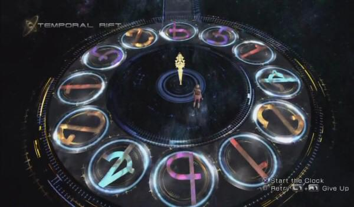
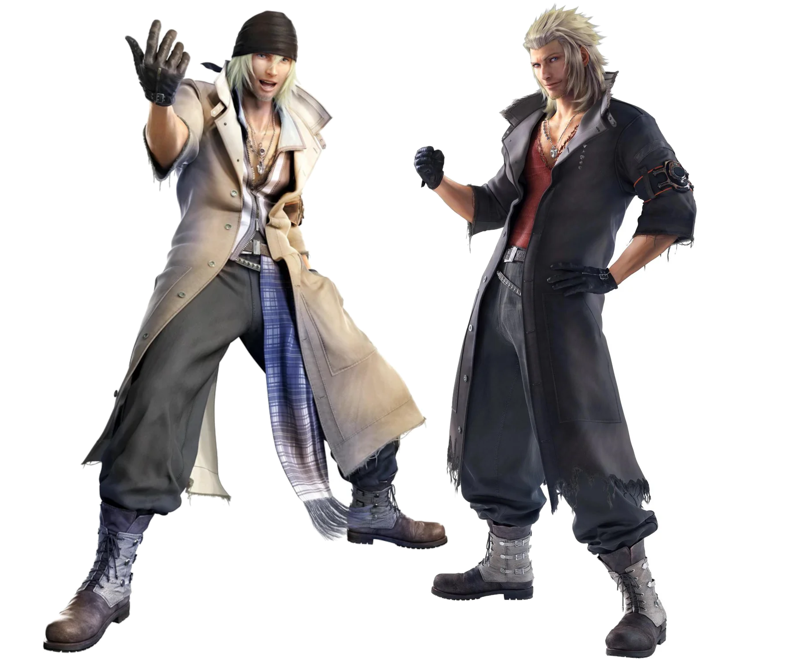
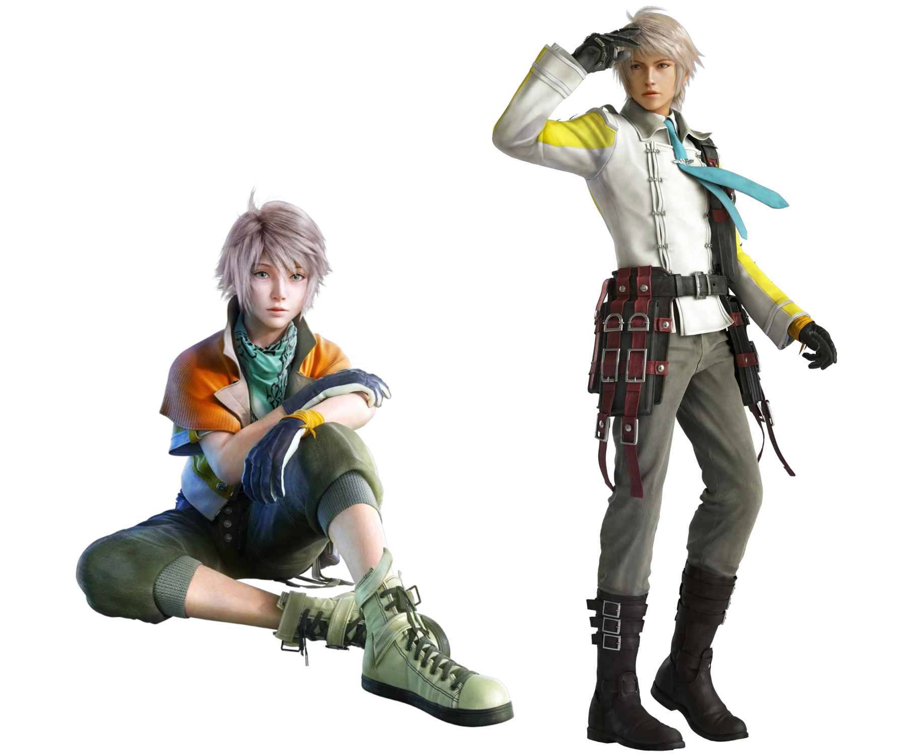
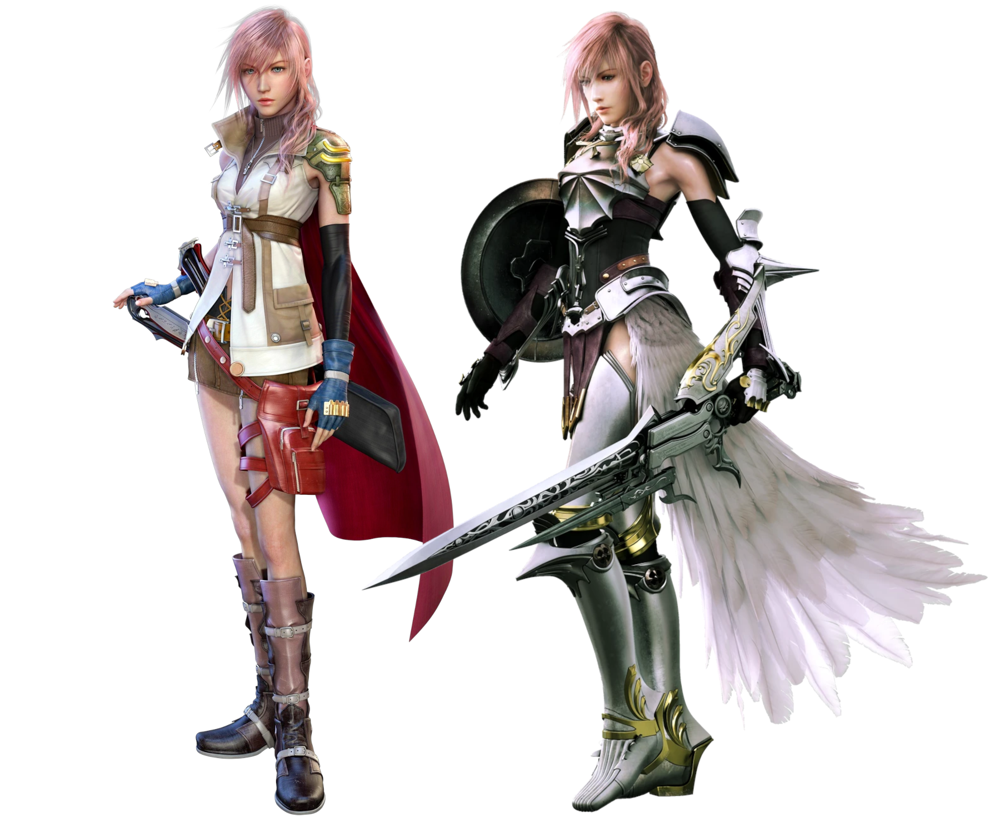
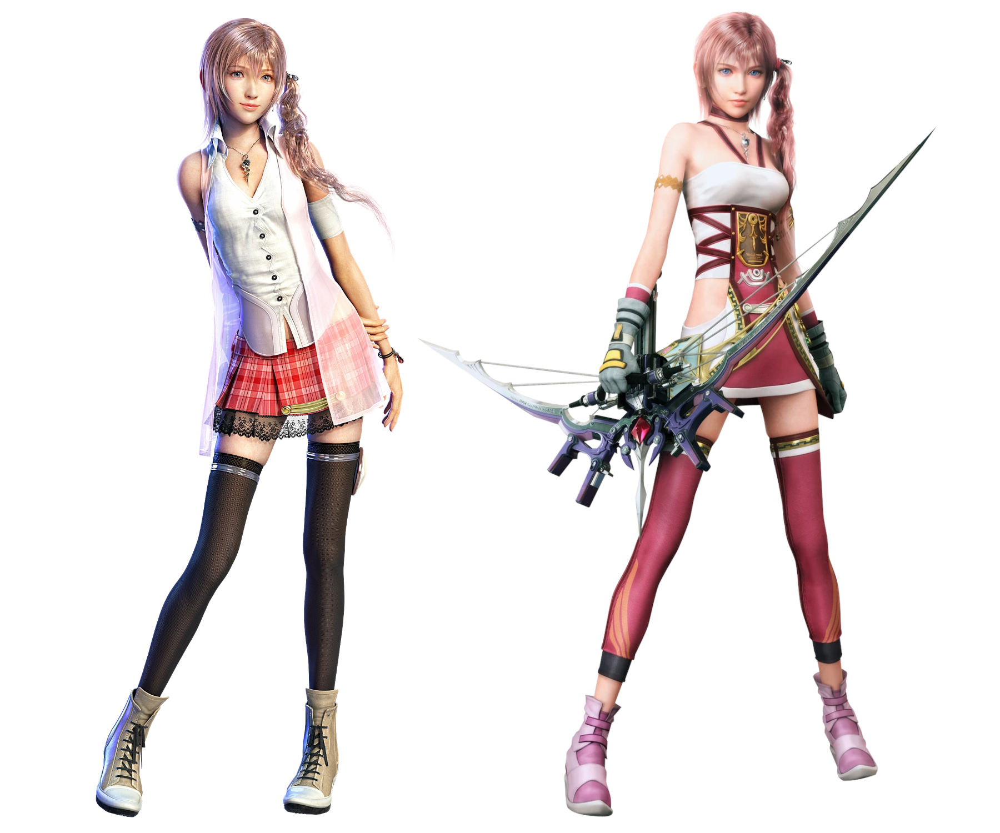
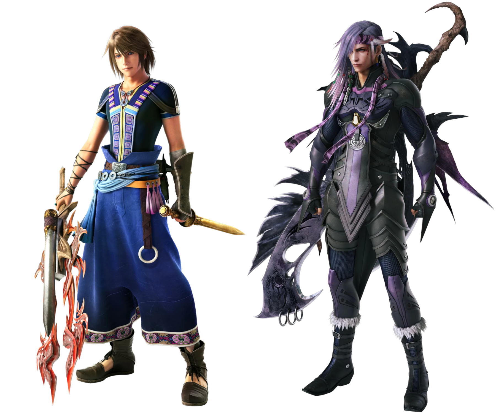
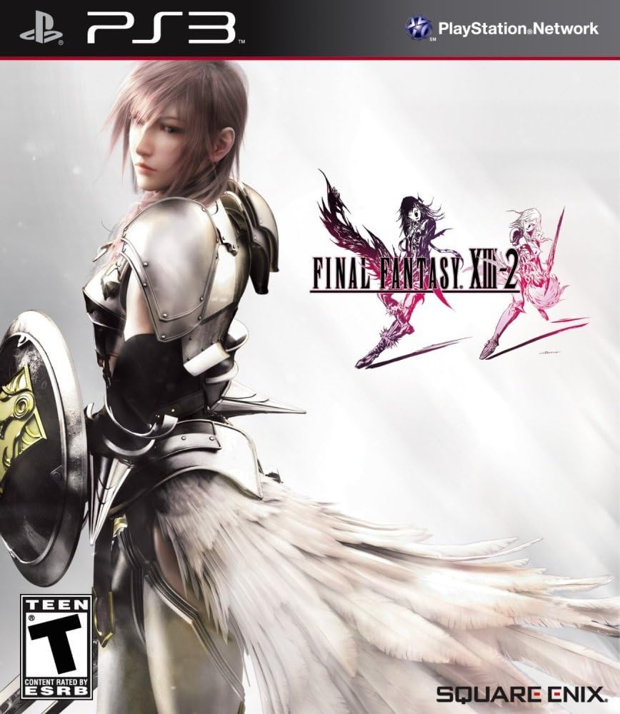

Final Fantasy X is one of my favorites in the series. I ended up loving its
sequel, Final Fantasy X-2. So, after loving Final Fantasy XIII nearly as much as
Final Fantasy X, I had high hopes for Final Fantasy XIII-2.

I was in high school when Final Fantasy XIII-2 released. I remember seeing
advertisements in stores. I remember sitting in a GameStop, reading the backs of
the boxes of all the coolest looking games while waiting for family members to
shop elsewhere in the mall. I remember seeing these uniquely designed characters
swinging from vines in a lush forest, fighting monsters with swords and bows.
_Is this what Final Fantasy is like?_ I had heard of the series before, thanks
to friends, but I had expected knights and dragons based on the name. Most of
the recent buzz had been about how Final Fantasy XIII flopped. I had laughed at
the ridiculous sound of the name "Final Fantasy XIII-2" due to it hardly being
"final" if there were so many of them that they needed **two** numbers, but now
that the game was in front of me, I was intrigued. I put it back on the shelf.
We were a Nintendo-only family.

I think Final Fantasy XIII-2 was the first Final Fantasy game I held in my hand,
and realized that the Final Fantasy series was not at all what I had assumed.
For whatever reason, those advertisements and the back of that box got very
firmly lodged in my head. That was my new picture of Final Fantasy. That idea
got quickly overridden when I finally played Final Fantasy XIV and XV, but those
memories came bubbling back up to the surface as soon as I hit Start on this
game. In a way, I feel like I have completed a journey of some kind, or
completed some kind of cycle by beating this game. The brain worms can finally
be quiet---I finally played that cool game I stumbled on in GameStop on an
afternoon nearly 15 years ago.

As I've been working on this series retrospective, I've been consuming a lot of
Final Fantasy fan content. I listen to tons of video essays and longform reviews
and retrospectives on each game after finishing it. Checking off a game from the
list means I just unlocked dozens of hours of YouTube content for myself. I
avoid spoilers, but I do often get people's impressions of various games in the
series. Maybe I'll watch a full series ranking video, or read a thread about the
FFXIII trilogy as a whole. Across almost every single source, this game landed
at the top of the FFXIII trilogy. It was rare to find anyone who liked it less
than the others. The most hyped part was the soundtrack, but many also praised
it for fixing all the issues FFXIII originally had.

Did it live up to the hype---both that of the online community and that of my
younger self, really wishing he had a PS3 instead of a Wii just to play games
like this? Well, to my younger self: I'm playing all the games I want now and
I'm really glad I got to this one, but unfortunately this one was a dud. The
pretty pictures on the box were an alluring facade over a mess of disorderly and
disconnected ideas, a product of design by committee and compromised artistic
vision. So, no. It didn't live up to the hype. The community was spot on about
that soundtrack though.

# The Review

I wish I liked this game more. I really, really do. I love what it was going
for, and I love what it borrowed from the FFX-2 playbook. I wish it borrowed
_more_ honestly. This game felt like it never quite figured out what it **wanted
to be** and so it oscillated constantly and unevenly between several concepts.

There was a lot of time pressure on this game. Fans were not happy with FFXIII.
Fabula Nova Crystallis was going to be this huge deal for the franchise. Three
games were already planned for it! This had to be salvaged somehow.

The FFXIII team switched to a completely different style of development. They
have described it as "more western," but I don't really know what that means. I
don't know if it actually means much these days. But they did this in order to
crank this game out in 2 years instead of the 5 years FFXIII took. I think that
time pressure and the new development style led to a lot of cut corners. Maybe
that's the western style: more cut corners.

You can definitely _feel_ that this game was developed differently. Some
elements just don't mesh together as well as they did in FFXIII. This feels like
a game that was mass produced by working many teams in parallel, instead of
being led by an artistic vision from the top down. I have no idea if that's
actually how the two games were developed, but that's what it _feels_ like.
Where FFXIII had a harmony of every element of the game working together
smoothly, from music to art to story to gameplay, FFXIII-2 feels like a series
of disconnected ideas bashed together because each individual idea was "good
enough."

Further, it feels like not enough time was spent planning this game. Or, perhaps
the plan was altered too many times. Not only does it not fit into the Fabula
Nova Crystallis setting at all, it had to change the setting to make it all fit
together. I've read that it was originally going to be a far-future game, it was
originally going to be a happy ending for Lightning, and it was originally going
to be a game with a solo female protagonist and carry forward the girly vibes
from FFX-2.

None of that is true in the final product. At some point, it was decided that
Serah should get some spotlight because she was barely present in the previous
game. At another point, it was decided that a girly game wasn't marketable, so a
whole new male protagonist was invented. I have no clue when it was decided that
||this was going to be a tragedy, but it certainly isn't a happy ending for
Lightning.|| Each of these changes in the plan had massive ripples throughout
the game. I wouldn't be surprised if they had to throw out quite a bit of work
several times, even if all of that work was only in the planning phase.

I really wish they had stuck closer to the original plan, and avoided allowing
market pressures dictate the artistic vision.

## The Port

Unfortunately, this port is even worse than the PC port of FFXIII. The only
upside is really just a silver lining on an unrelated downside: There are fewer
pre-rendered cutscenes, so the download size is smaller for cutscene-fixing
mods.

This was a very unstable experience. The game crashed for me far more often than
FFXIII. More than 80% of the time, hitting the save button would provide me with
no feedback that anything had happened. This made me nervous that it hadn't
actually saved. Not a great combo with a game that could crash at any moment.

Uniquely bad, this port includes all DLC, but _limits its functionality_
compared to any other release. In this release only, you are prevented from
playing any DLC content until you beat the game. Not only does this reduce
character progression options, it harms narrative continuity. These DLC episodes
are about what other characters are up to during the events of the main story.
Without the DLC story context, these other characters just arbitrarily show up
for random parts of the main story without any explanation of how they got
there.

On top of the above, this game carries forward every issue from the first game.
Unfortunately, this game is significantly less popular, so there are fewer mods
to fix it up. There are still mods to cover the issues FFXIII originally had,
but none for the unique issues of this game (outside of a few minor texture
fixes).

## Gameplay

This game is a perfect example of why design decisions should not be made purely
based on player feedback. FFXIII received a lot of criticism, with many armchair
game designers throwing out numerous suggestions for how the game should have
been. FFXIII-2 seems to have attempted to incorporate as many of these ideas as
possible in order to make those fans happy. This game was not designed as a
cohesive whole, but as a series of disconnected corrections for something else.
I don't think it actually made a better product, but memes may have tricked some
people into thinking it was.

_"FFXIII was too linear!"_ So they made this one more open. The zones are either
wide open fields (but not as open as Gran Pulse from FFXIII) or a series of
hallways that double back on each other into loops. The story itself is still
just as linear, but now it involves lots of backtracking and repeatedly going
through the same area over and over again. I don't see this as an improvement.
In fact, this new openness can actually cause continuity issues in the story by
events happening out of order. For example, I met a particular NPC, realized I
couldn't actually progress the story in the direction I was headed. Then on the
"correct" story path, the party members started talking about how they've not
seen that NPC I just met.

_"There's no side content in FFXIII!"_ So they added some. I will admit, this is
better side content than FFXIII had, but it's a low bar. People complain about
the side content in FFXVI, but this is far worse than that. They are MMO fetch
quests with even less interesting gameplay and story. The only improvement over
FFXIII is that you talk to NPCs to get the quests, _sometimes_. Often enough,
you **still** talk to weird magical structures to get your quests instead of
NPCs. You can unlock additional timelines for the areas you've been to, with
additional bits of content in each. However, in my opinion this is equal to
FFXIII's Gran Pulse endgame content at best.

The frustrating part of that side content is that it's easily confused with the
main story. This is really more of a problem with the main story structure, but
I think it's the fault of the side content. A significant part of the main story
effectively boils down to guessing which bit of side content is necessary to
complete in order to correctly move forward. At worst, guessing wrong means
making the game harder on yourself for a bit while you fight enemies far above
your level. At best, guessing wrong levels your characters up and makes the
already dreadfully easy main story content even more boring.

_"The Crystarium is too linear!"_ So they removed all structure. In my FFXIII
review, I suggested that you could view the Crystarium as just a selection of
which job you want to prioritize leveling, but the presentation gave it a worse
reputation than that. The progression system of this game is the Monkey's Paw
interpretation of that suggestion. In this game, you literally do just choose
which role to allocate each level to. However, it's annoying about it.

You get stats based on which role you select at each individual node determined
by an only-partially-visible pattern. The visible part is that when a larger
node is displayed on screen for a level up, you'll get more stats from it. The
invisible part is not worth explaining, but there is a "correct" way to do it.
Each role is capped, and by the end of the game you'll easily have progressed
enough to cap multiple roles. So, if you want to be the best Ravager, the answer
is not actually to spend all your points on Ravager, it is to only level up
Ravager on large nodes. I **hate** this. Not only is this _less_ open than the
previous system thanks to literally only having one way to properly do it, you
can permanently nerf your character with no way to respec or even grind to
overcome it.

All of this "openness" fans asked for---the progression, the level design, the
side content, all of it---doesn't actually make the game more _open_. It just
introduces opportunities for you to **be wrong**. Additionally, it ruins some of
the good things FFXIII had going for it. Since the world had to be more open,
the curated difficulty curve could no longer work. Random encounters return in
the most annoying possible way, where enemies just randomly pop into existence
near you. You no longer get to see enemies interacting naturally with the world
or roaming in packs or anything like that. There are no longer any ways to
cleverly move through the world to avoid danger. In a sense, you actually have
_less_ agency over which fights you take due to this. I think all of that
actually makes this a significantly worse game. However, because it is more
"open" (only by a terrible, barely technically correct definition), fans have
gaslit themselves into believing this is a superior game.

It's not all bad though. I'll give the game respect for a few things I
appreciated. There are actual towns now in which you can talk to tons of NPCs,
and it's nice to see them walking around and going about their business. I'm sad
that we don't get to see monsters roaming anymore, but this is a worthy trade.
Additionally, the floating terminal shop is gone, and Chocolina has taken its
place. I would have preferred if shopping was instead handled by those towns,
but this is okay. I don't like Chocolina's character design or lore, and think
both are a downgrade compared to the terminal (which has some creepy hidden
stuff I think is neat). However, I _do_ like Chocolina's personality, and I
always made sure to interact with her just to see what she'd say. That
definitely counts for something.

### Combat

Combat is where things fell apart more dramatically. All of the nuance and
strategy of the original is gone. Ironically, this game _is what fans accused
FFXIII of being_. There is no better strategy than to hit auto-battle over and
over again using a full party of attackers. All other roles were severely nerfed
and are not worth bringing, with the exception of Sentinel.

Sentinel is such a weird part of the discourse around this game. I've heard
several reviewers point to it as the reason they loved this combat over FFXIII.
Equipping Sentinel grants a character a significant defense boost, as it is the
tank role. So, if you notice a big attack incoming, you can swap to a full party
of Sentinels to "block" that attack actively, and then switch back to offense
afterwards. This is why people love this combat. Can you guess what Sentinel
does in FFXIII? _The exact same thing._ I feel like I'm going crazy hearing
people talk about this, like I live in a different reality.

What's odd to me is that I agree with them: paradigm shifts allowing you to
rapidly respond to new situations is exactly why I love this system. What's so
odd about that? FFXIII did it _better_. There are so many interesting
possibilities in the original paradigm system. FFXIII-2 reduces it all down to
just two---protect and attack. It almost feels like FFXIII is a sequel to
FFXIII-2 mechanically. FFXIII-2's paradigm system is a downgrade in every way.
Is it just that fans couldn't grasp the strategy of FFXIII, and so assumed it
had none? Then when FFXIII-2 came out they were finally able to grasp that the
system allowed them to attack _and block_ and that was simple enough to get
through to them, and it blew their minds? I really don't understand it. I think
a lot more people need to go take a second look at the combat complexity of
FFXIII if they like FFXIII-2, because it's way better than they probably
assumed.

Also, there's this bizarre feature that lets you change each paradigm to focus
on single target or AoE attacks, or to have the AI automatically select. But
it's such a simple choice that the AI will always choose the optimal choice. I
don't get the point of the feature. Once again, it only allows you to make your
party worse by choosing the wrong thing.

So, we've got a combat system that is essentially just spamming attack forever,
with the occasional extremely telegraphed block button with 5 seconds of leeway.
That's pretty bad, but that's all, right? _I so desperately wish._ No, this game
also has you catch and level monsters for your third party member. I have hated
monster raising in every single game it shows up in. I've never been a pokemon
fan. This isn't something ignorable, this monster is always the most powerful
part of your party. I hate, hate, hate non-story party members. I talked about
that a lot in my Tactics review.

Worse, these monsters are not flexible. I wanted to run an extra Ravager in my
party, so I found one. Unfortunately, after spending all of my resources
leveling it up, I found that it could only cast ice spells. So my strongest
party member was fantastic against a very small set of enemies and terrible
everywhere else. In normal FFXIII gameplay, you gradually learn about enemy
weaknesses by fighting them, so that your party members can automatically adjust
their chosen spells to take advantage of weaknesses. You can't change your
chosen monsters mid combat. Your monster party member isn't going to suddenly
start casting fire spells against a fire weak enemy. They are going to only cast
the spells they know. However, since this game has random encounters, you can't
actually strategize before a fight. You just have to guess. _The freedom to be
wrong_.

Did you catch that? Spending resources on leveling up monsters? That's right.
The only way to level your monsters is through consumable items. They level
through an entirely separate system than your permanent party members. It's a
stupid level of complicated that I really did not want to engage with. Even more
fun, every monster is capped at a different level, so you can't just find a
monster you like at the start of the game and keep leveling it. At some point,
you'll have to completely replace it and start over with a new set of consumable
items.

I don't think I've liked a party system less than this in the entire series.
FFXVI doesn't even have a party system, and I like that lack of party system
more than this one.

My last gripe with the combat is that it's either too easy or too hard, never
just right. This game took the curated difficulty curve of the first and
replaced it with a game of pure stat comparisons. If you've got good enough
stats to win, the fight will easy to the point of boredom. If you don't have
good enough stats, you lose. It's impossible. They made sure of this by slowly
chipping your maximum health bar down over time, so that healing is constantly
made worse. I'm baffled by this decision, because it throws away everything that
made the combat of the first game great.

One thing I like about this combat, which is probably a controversial take, is
that it has quicktime events. I've been a fan of QTEs for a long time now. I
would say that I've always been a fan, but I'm not confident that I never had a
phase of mindlessly agreeing with the internet's collective opinions before I
developed any of my own. I enjoyed the QTEs in this game, for the most part.
Sometimes you get to choose a plan of attack during the event, instead of just
trying to input buttons precisely. Those were the best. Sure, the outcome is the
same whether I choose to shoot a gun or cast a spell, but one of the presented
options always felt most appealing to me and I appreciated the small bit of
agency. QTEs can either show up in combat when you activate your creature party
member's "Feral Link" special attack (which was kind of boring), or at the end of
boss fights or during cutscenes (which was awesome). A slight mixed bag there,
but I'm overall positive on it.

### Puzzles

I needed a whole section to emphasize how bad the puzzles in this game are.

Look, I'm a puzzle lover. My favorite game of all time is a puzzle game. Good
puzzle games have room for puzzle mechanics to build on each other and
intertwine in increasingly interesting ways. The level of satisfaction possible
through that build up and the delight of a sudden realization is an unmatched
gaming experience.

...but none of that applies to puzzles shoehorned into games about other things.
These puzzles have no room to build or grow. They also have to be relatively
easy, as being blocked by a puzzle can frustrate players. At best, you're asked
to rotate a few statues into the correct directions or shuffle some boxes
around. In my opinion, these things are always a net negative for the games they
are in. They leave me wondering who they're for. The puzzle fans won't be
satisfied by their inclusion, and the absolute best case scenario for everyone
else is that they are quick and relatively pain-free. Why are they even
included? Because other games have done that before and it's become an expected
thing? They're a waste of time. I'm sick of them.

This game is not one of those best case scenarios. At least in other games,
those puzzles can tie into the story or world in interesting ways. Maybe it's
solving the riddle that blocks entrance into the secret base of an elusive
villain. Maybe the puzzle is a set of mechanisms meant to guard something
ancient. Maybe you're helping out some NPCs, and get to learn a bit about living
in the game's world. This game does nothing like that.

There are numerous glowing pillars of light in this game. You approach the
pillar, interact with it, and are teleported away to a puzzle dimension. You
then solve some arbitrary puzzles that have nothing to do with the rest of the
game in any way, and return. You don't get to learn anything. You don't get to
feel like you're uncovering something you shouldn't. Square Enix just says it's
time for you to do your chores.

Making matters worse, these puzzles are **bad** at best. Probably the most
pleasant are the classic "find the path across tiles that get deleted when you
cross them" puzzles. These are always extremely easy and obvious at a glance,
because there are like 4 of that particular kind in the game. No room for a
build up.

It goes downhill from there. Next up are puzzles in which you are shown a
connect-the-dots image from the top down, and then run between the dots to
connect them from memory. Except, you don't need to memorize at all. You need
trial and error. Each dot changes to one of several colors, and you can only
connect matching colors together. So it's impossible to connect the wrong dots
together. Not much of a puzzle then, right? So to make it "tricky" all of those
dots change colors arbitrarily as you move around. You might see two red dots
next to each other, and head to connect them, only for one to turn yellow as you
get close. The correct solution is to randomly guess the correct order by trial
and error. There's a timer. Yeah. There are a few others about this bad, but we
aren't done rolling downhill.

The worst of them all are the clock puzzles. These are too hard to describe, so
here's a screenshot:

Those symbols are all numbers, just in a silly font that makes them harder to
read for no reason. When you step on a number, that number gets removed from the
clock, and the hands of the clock spread from that spot a number of spaces equal
to the number that you stepped on. So if you stepped on the top-right 2 shown in
the screenshot, the hands would move to the 1 on the far left and the 5 in the
top right. You can then only choose between those two spaces. You can choose any
space to start from. If the hands land on only empty spaces, you lose. The goal
is to remove all numbers from the clock. Every time you fail, the clock is
reset.

Okay, that explanation didn't really help, even with the image. [Here's a
video](https://youtu.be/omzM_h9jUkI) (including some wonderfully salty
commentary).

This **sucks, so, so much**. This is hardly even a puzzle. It's just a grind of
random guessing. Theoretically, you could try and puzzle it out on a piece of
paper or something before locking in your guesses, to avoid the shuffle.
However, there's also a timer! So you need to make guesses instantly! The
intended solution is once again to brute force and eventually get through with
luck alone, but some of these puzzles are so complex that the chance of a
successful brute force attempt is less than 1%. These puzzles were designed by
someone who has no idea what a good puzzle looks like.

Fortunately, there are multiple websites out there made for rapidly entering the
clock positions and giving you the solution fast enough that you can enter it
before the time runs out.

These puzzles are necessary to beat the game. They block story progress. There
are like 30 of them.

Slightly less offensive (because they are optional) are the "Brain Blast"
"quizzes". Those are in separate quotes because "Brain Blast" is the name of the
activity, and they are ostensibly quizzes. I bring them up because they really
hammer in the point about the puzzle designs of this game being "brute force is
the intended solution". To succeed at one of these quizzes, you need to answer
10 questions correctly in a row. Not _too_ bad, **if** all the questions are
relevant and discoverable in the game. It could be rewarding **if** paying
attention to the game world could be celebrated by giving you access to
additional loot from side activities! Ha. Some of these questions are like
"Heads or Tails?" or "Left or Right?" and so on. You just have to guess. That's
it. That's the whole question. You can be on a streak of 9 correct,
lore-relevant questions, then get one of these and lost to RNG. Excellent "quiz"
design.

### Replayability

This started as a slightly weird topic, but it got more bizarre as I dug into it
until I thought it deserved its own section. This feature ended up being
entirely neutral for me while playing through the game, as I didn't interact
with it at all. As you explore, you can uncover "seals" for the various time
gates you've stepped through. This lets you reset each level's state so that you
can play through it again.

At first I thought that was interesting. Perhaps at some point during the story,
I'd need to go back and change a decision I made previously in order to change
the timeline to a desired state, or something. This is a time travel game, after
all. What other purpose could such a feature serve? I guess replaying the levels
in general serves as a sort of Chapter Select or New Game Plus feature, if
nothing else. Weird way to go about it though, if that's all it is.

Unfortunately, my hopes didn't pan out. I don't dock any points from the game
for this though. It was a wild assumption. Not a single choice you make in the
story at any point changes anything. It is entirely linear. So there is no
reason to go change those choices you made. This is entirely a NG+ type feature.

...or so I thought.

I need to back up a bit. This game allows you to select dialogue options. That's
pretty rare in Final Fantasy games. Especially rare is how _many_ times these
options come up. Pretty much every conversation has at least one, but it's
usually several more than that. Like I already mentioned, these don't ever
change anything in the rest of the game. They just determine the next line or
two in the dialogue. That's pretty common---not the weird part yet.

Sometimes those dialogue choices allow you to select one of several questions to
ask, so you can prioritize learning the information you care most about.
Sometimes they just allow you to express yourself by role-playing the characters
a bit differently. _Always_, there is a silly option. Usually something
involving "Kupo!" or something absurd like accusing your closest allies of being
the secret villains "again". They're just shitposting. The game even encourages
you to take these options by rewarding you with cosmetics for every silly
answer. FFXIII-2 _really_ wants to sabotage its own tone at every opportunity,
but that's a topic for later.

So, now I've found the real answer. You can replay levels so that you can pick
all the silly options this time. You can earn all the cosmetics, get all the
achievements, and so on, after taking your main playthrough more seriously. Or
the opposite. Whatever floats your boat.

However, now we get to the weird part. I stumbled across this information while
digging into the wiki for the game. When you replay a level, the option you
picked previously gets replaced with another, unique option. These dialogue
options are exclusive to level replays. Are they related to your time travel
shenanigans then? No, that would make too much sense! They are completely
arbitrary options that _would have_ easily fit into the scene during a first
playthrough. Other strangely arbitrary part of this feature: only _most_
dialogue options get replaced like this. Some are permanently available. So if
you wanted to unlock one of those alternate dialogue options, and happened to
pick a permanent option, you'd be forced to replay the entire level _again_ to
accomplish your goal. The only way to know which options can be replaced is to
use a walkthrough/wiki.

That's right. We're back to the puzzle philosophy again: Just guess! Just
fucking guess! If you get it wrong, do it all over again! This is game design!
This is content! We love brute forcing everything! We love wasting hours to make
marginal progress! Pick a card! Wrong card dumbass! The magic trick is
cancelled! You lost the 1/4 chance, so we've smacked the fun out of your hands
and pointed to the back of the line!

It doesn't stop there though, _there's another possible dialogue option_ that
unlocks _after a second playthrough to replace another option_. So to see those
final options, you may have to replay all the levels 3 times (or more if you
accidentally pick permanent options). All to get such huge differences as "How
long have I been asleep?" and "I wasn't asleep!" Clearly, crucial differences
necessitating multiple playthroughs to unlock the deepest secrets.

I am fascinated by how bizarre this feature is. All of this meant extra work for
the writers. All of this had to go through localization and voice acting again.
They probably added like 30% more work for those teams by adding this system
that almost nobody would see and that the game never explains. It's so silly
that I _almost_ think it came up because they wrote 6 choices for each dialogue
option, but then the controls changed to up/down/left/right and they ran out of
space---combined with the need to shoehorn replayability into the game after
people complained about the lack of it in FFXIII. But that would be a silly
reason, right? _...right?_

## Audio

Outside of the music, this game doesn't have a great listening experience. Audio
balance is all over the place. Sometimes the music is so loud that it drowns out
everything else. Sometimes the voices are so quiet that you can't understand
them over the environmental sounds. It's never consistent, either. Even if the
game gave me sliders for each of these different categories, every single scene
is balanced in a different awful way that would have required tweaking the
settings again. Sometimes the balance even changed mid-cutscene.

I wish I liked the voice acting more. I love Liam O'Brien and Laura Bailey. I
think the issue was more on the casting and directing side. I don't think either
of them fit their roles super well. When I think of my favorite Laura Bailey
performances, I don't think of super high pitched, ditzy, bubbly characters.
Even Jester, the D&D character she played for Critical Role Campaign 2 doesn't
fit that role. It feels like Laura was asked to play directly against her usual
strengths, and with character writing that is super uneven and inconsistent.
Liam O'Brien gave one of his deep, rich, dripping-with-evil performances which
reminded me of Grimoire Weiss from NieR. In the right context, I love that, but
in this game it gave a cartoonishly evil feeling to a villain who is written as
somewhat sympathetic: ||a father figure who was willing to tear everything down
to stop the suffering of the girl he raised for thousands of lifetimes. Imagine
if Joel from the Last of Us talked like Grimoire Weiss. Yeah.||

I've heard some other reviews praise Jason Marsden (who I best knew as Max Goof
from A Goofy Movie) for his role in this game. Similar to the above, I think he
did good with what he was given, but the material wasn't great. I don't like the
character he played, and his performance wasn't enough to sway me.

The other performances that I _did_ like were kept rare in this game. Those
characters only made very brief appearances in the story, or did minor narration
roles occasionally. These moments were so brief and so uncommon that instead of
feeling happy to have heard them, I just felt the rest of the game's voice work
stood out worse in contrast. The game dangled bits of fanservice in my face in
an attempt to give me what I wanted, but it only served to remind me of how good
this game _wasn't._

### Music

Fortunately, the music in this game is _exceptional_. It really saved this whole
game from sinking even lower for me. I have heard some call it the best OST in
the series. I don't know if I'd go that far personally, but it's absolutely up
there near the top.

There's a ton of variety in this soundtrack, for better or worse. There's
orchestral, rock, electronic, rap, metal, jazz, hip-hop, and funk in here. It's
a huge mix of everything. That's what ultimately keeps this from reaching
all-time highs for me. Even if the best parts of this OST are extremely good,
and I enjoy the variety when it works well for me, I'm just not a fan of a few
of the styles in here. I also find that, even though the variety is fun, it
hurts the cohesiveness of the overall package.

I talked for ages in my [FFXIII
review](https://drowrin.com/posts/final-fantasy-xiii/#music) about how much I
love Masashi Hamauzu's music. He's back for this game! Unfortunately, no longer
the sole lead. I loved FFXIII's music for how the whole package fit together so
beautifully. I think that will remain my favorite soundtrack to just _listen
to_, as if I were listening to an album. For XIII-2, he composed about a quarter
of the tracks. His style is still so beautiful in this game, and all of my
favorite tracks are from him.

[Wishes](https://music.youtube.com/watch?v=_JR63S_JskA) is the main theme of the
game, and I could listen to it on repeat. I am right now, writing this. As
always, I'm a sucker for emotional piano and strings. This song is so delicate
but determined. Picture this hitting during the most emotional moments of a
game. Perfect.

Hamauzu also brings back his fast paced style with [Etro's
Champion](https://music.youtube.com/watch?v=-y90muoNzS4). This is one of my
favorite tracks in the game. Unfortunately, it's not used very much. But I loved
every second of it whenever it appeared. The particular way the strings are
played here reminds me of Blinded By Light, which is super fitting.

[An Arrow Through Time](https://music.youtube.com/watch?v=bi3C5UPAd2A) plays
exactly once in the game: at the very start, when a plan is formed, a promise is
made, and intertwined wishes are answered by a single miracle. It's such a
beautiful song for a one-off moment like this. It reminds me of the ending of
FFXIII, which is absolutely intentional.

The bulk of this soundtrack was composed by Naoshi Mizuta. He had previously
worked on a huge variety of other games, from Resident Evil to All Star
Pro-Wrestling to Final Fantasy XI. FFXIII's director, Motomu Toriyama wanted
this soundtrack to have lots of variety, and Naoshi Mizuta was perfect for the
role. He ended up composing more than half of the soundtrack. His style has a
lot of jazz influence, but he tries to fit each piece into the context it will
be heard in.

The track [Full Speed Ahead](https://music.youtube.com/watch?v=mTHzYWtdU_Q) made
a very good impression on me near the start of the game. After all the crazy
events of the opening hours, full of Hamauzu's angelic, orchestral music, this
song kicks in at exactly the moment you are finally playing the free, open art
of the game. It's a turning point in gameplay, and a turning point in the music
at the same time. It signaled that we've left XIII behind and we're doing
something new now. It's also just a great, energetic track.

[The Last Hunter](https://music.youtube.com/watch?v=A-vpJRskhx4) is a pretty
solid battle track that is used in numerous locations throughout the game. It
doesn't quite live up to the battle music of FFXIII itself for me, but it's my
favorite "normal battle track" in this game. It incorporates Noel's Theme, much
like how Lightning's Theme is used in Blinded By Light. Unfortunately, I don't
like either Noel or his theme nearly as much as Lightning or her theme, but it's
still good.

[Serendipity](https://music.youtube.com/watch?v=fRlSyReYfs0) is one of the most
unique songs on the soundtrack. It's an 80s track. Nothing else in the
soundtrack sounds like this. It's the background track for an area that is
completely separated from any timeline. Cool theme for that.

Mizuta also wrote some of the big, bombastic boss tracks for the climax of the
game, along with Yoshitaka Suzuki. [Heart of
Chaos](https://music.youtube.com/watch?v=49q7zHcULXM) has a little too much
going on sometimes, but that fits for the chaos theme. There are a couple
_really strong_ moments in there. Overall a big fan of this track. [Promise to
the Future](https://music.youtube.com/watch?v=81boqe2yX9U) plays immediately
after it, as the events after the fight unfold. This one really goes on a
journey. I love pieces like this that are designed to sync up with very specific
moments. I can picture the exact game scenes that accompanied this track, and I
think a lot of that is owed to how well this track is designed.

Mitsuto Suzuki composed most of the rest of the soundtrack. He brought synth and
pop to the soundtrack, which I found really pleasant. He also composed some of
the heaviest tracks in the game. So he covered both extremes. He spent a lot of
his time working with guest artists, such as Origa (who performed the Ghost in
the Shell opening song), Shootie HG (who did a number of Devil May Cry tracks),
and Aimee Blackschlegger (who has performed for Attack on Titan, Kill La Kill,
and the Xenoblade series), and more! It's a pretty fun mix of guests.

One of the earliest Suzuki tracks you hear in the game is [New
Bodhum](https://music.youtube.com/watch?v=o2y3FjL7a6o), with vocal performance
by Origa. This is a beach town, and the vibe fits really well. Something cool
this game does it play an alternate "aggressive mix" of every zone theme
whenever enemies are present. The transition is seamless, and the vibe changes
pretty sharply. Here's [New Bodhum - Aggressive
Mix](https://music.youtube.com/watch?v=gXuvvFFYbW8) as an example.

Another Suzuki and Origa combo piece is [Historia
Crux](https://music.youtube.com/watch?v=P4WZLTDcBVE). It's probably one of the
best songs in the game. Give it time. The build alone is insanely cool, but then
it drops into this absolutely wicked jam. This goes so unreasonably hard for
what is effectively just level-select menu music. _TIME. AND. SPACE. TIME. AND.
SPACE._

[Unseen Intruder](https://music.youtube.com/watch?v=VMFj9izFgjE) is composed by
Suzuki and has vocal performance by Aimee Blackschlegger. It was one of the fist
tracks composed by the game, and set the tone for a lot of the rest of the
soundtrack. The lyrics are a bit silly for a basic zone track. You'll be just
walking around handling random side quests, listening to this lady rap about how
you shouldn't be "ashamed of your race or the place that you're from" or that
she "finally knows what the rain was for" or had a "feeling wash over me; turn
me into a higher being." It's all over the place. I'm not sure what they were
going for, but with such a scattershot approach, they probably nailed it in
there somewhere.

Suzuki worked with Shootie HG on a couple heavy tracks, which were requested to
"be like death metal." [Crazy
Chocobo](https://music.youtube.com/watch?v=cmT9qyhLkFI) is a metal version of
the Chocobo theme, played when you ride certain kinds of wild Chocobos. I kind of
love it just for how silly it is. [Limit
Break!](https://music.youtube.com/watch?v=YUX3rocJOiQ) is also pretty iconic.
It's a repeating boss fight theme. They had fun making this one. I don't love it
as much as the rest, but it's very fun to have something like this in a Final
Fantasy game at all.

## Visuals

This was a mixed bag for me. Some character designs were improved, but I think
this was otherwise a step back. The whole game feels like it had a much lower
budget, which makes sense. However, I think there were a few easy changes that
would have significantly improved how the game looked.

One of those changes is the way cutscenes are presented. There are still some
pre-rendered cutscenes, which look just as amazing as they did in FFXIII, but
there are far fewer of them. Instead, most cutscenes are rendered live in-game.
Normally, not a bad thing. However, they really didn't handle the implementation
well. I don't mean in-engine, I mean in-game. NPCs would still walk around and
talk, nearby loot would still emit sound effects meant to help you find it, and
environmental effects would be louder if the cutscene camera happened to overlap
with them. Almost every cutscene had an issue with an NPC walking through the
middle of it, a child falling and crying in the background, or an unopened
loot-sphere floating distractingly over a character's shoulder.

The other thing I think could have been improved was art direction. FFXIII had
very strong, intentional-feeling art direction. FFXIII-2 is chaos. They cover so
many different regions across so many different timelines that no two maps feel
like they are from the same game. I'm sure that this is part of the charm for
some, but it just made everything feel incohesive for me. This extends to the
character designs, too.

Some characters had an insane glow up. The designs I liked the least from the
first game improved the most. The best example is Snow:

It's an extremely Nomura design. He looks straight out of Kingdom Hearts, but
I'm fine with that. It's such a huge improvement over the original. I like how
the coat, pants, and boots appear to be the same as the original but weathered
and sporting new (much more dramatic) colors. The torn red shirt is one thousand
times better than the loose striped shirt. Most importantly, he's finally
ditched the stupid bandana.

Due to this being a time travel story, we also get to see Hope in his 20s:

Again, massive improvement. This design is way more cohesive and actually paints
a picture of the character's personality instead of just throwing some colors
together. In this game, Hope is the charismatic and intelligent leader of the
world's best scientific organization, and he looks like it! I like the small
touches in this design. His tie is the same color as his old scarf, and he's
still got that ribbon around his wrist.

Beyond that, we've got a few that I already liked:

Lightning was already one of the best character designs of FFXIII. She's _even
better_ here. This design is based on a Valkyrie, and everything about it
screams divine knight. Even her iconic transforming gunblade got a holy
makeover. Her cape has been transformed into a half skirt of angelic feathers.
The armor is detailed and interesting, riding just along the line of being too
over-the-top without quite crossing it. I think this is one of the best
character designs in the whole series.

I don't feel so positively about Serah's new look:

I already liked her original design. Though she didn't appear in FFXIII for very
long, I think she had one of the best character designs in the game. The design
doesn't go overboard, and the outfit works really well.

Motomu Toriyama requested that her design draw inspiration from Evangelion
plugsuits. With plugsuit-ification of the original design being the goal, I
think this design succeeded. It's got the same overall color scheme and there
are tons of little crossover details. However this is a way more skin-tight and
revealing, sci-fi inspired outfit. I think this is overdesigned needlessly
sexualized. I don't understand where the crest came from or why she's wearing
those sci-fi gloves. I also feel like they took an already impossibly skinny
character and made her even more of a twig. It's like they took her character
model and scaled it horizontally by -10%. Maybe it's just that this outfit is so
skintight that it emphasizes this aspect of her original design more, but
there's something uncanny about it. I swear it's even more obvious in-game.

Then we get into the new character designs that I just don't like at all:

I don't say this lightly: I think these two character designs knocked a whole
point off of my rating for this game, since they are so prominent in the story
and I dislike how they look so much. It was really hard to take any of the
emotional beats of the story seriously when I was so distracted by awful these
are.

Noel's design doesn't make any sense to me, especially his weird swords. He's
supposedly the last human alive, from a desolate future with no resources, yet
his clothing is so complicated that it's _this_ overdesigned? It seems to mix in
some traditional elements with some sci-fi elements, but I don't understand how
he got his hands on those sci-fi elements. Worse, those elements clash with each
other really badly. The dumb sword is the worst part.

Caius is close to being good. He's a warrior of Chaos, and most of his armor is
super fitting for that role. The purple, black, and silver are fantastic
choices. For the most part, it's a sick design that contrasts with Lightning's
new design really well in multiple ways.

What kills it for me are the bits that look transplanted from a different
character, like his headdress, hair ornaments, and fur-lined boots. I think the
intention was that these are design elements from his character from before he
got turned into this Chaos warrior, like how so many other character design
changes in this game incorporated little details from their previous versions.
However, that only works for those other characters because we have experience
with their old designs. Not only do we not have any such experience with Caius,
we never even get to see such a design! Not only that, but Lightning's design,
which went through a change for similar story reasons, _doesn't_ include such
details. This just leaves these elements feeling out of place and incohesive.

These characters are extremely important in each other's arcs, but their designs
clash so much that they look like they are from different games. The only thing
they share is that they both have extremely dumb looking swords, but the _way_
those sword designs are dumb is still different.

Overall, even the character designs I praised above don't fit very well with
each other. Again, could be part of the charm, but it didn't work for me. The
single unifying factor is that just about everyone wears gloves. The character
models in FFXIII had a weird sausage-finger thing going on, and I assume gloves
were added to every character to hide this issue.

I wish I could say that the visuals landed well for me more often than not, but
that's not the case. The environment designs are varied, but that's more of a
weakness than a strength. The highs of environment design are higher than
FFXIII's highs, but the lows are so much lower that I don't think this game
comes out on top. The character designs that I did like are used extremely
rarely, and all the designs I didn't like are the ones that appear most
frequently. Not even Valkyrie Lightning can make up for how disjointed the rest
of the game looks, but at least this game gave that design to us.

## Story

This is a story that unwrites itself.

Final Fantasy XIII had a beautiful ending. I've even heard some players who
overall disliked the game say they thought the ending was one of the best in the
series. The first act of Final Fantasy XIII-2 is to unwrite that ending. I don't
mean that it introduces some new element that makes the events of FFXIII's
ending pointless, or anything like that. It's more literal. FFXIII-2 presents an
entirely different series of events as fact and gaslights you about it.

You very quickly learn that this happened because somebody has been running
around tying knots in the timeline (will have been? is currently? always was? Do
we have a time-travel tense?). It's your job to untie all those knots and
restore the original timeline. Every new situation written in the game's story
is unwritten by its gameplay, as the player characters prevent anything new from
happening. The ultimate goal of this story is for it to never have been born.

This gives the story a non-canon spinoff vibe. It's "something that could have
happened, but never did" or "something that happened so hard that it never
happened" or some other nonsense. There isn't even any character development in
here that transfers out of this story, as far as I can tell. None of it matters.
It's just extra fluff to be mindlessly consumed. Brainrot.

In that spirit, I've unwritten the story section.

>! ||All right fine, here's the rest||
>

Jokes aside, that's not entirely true. It's true for the entire _middle_ of the
game, but the very beginning and very end actually do matter.

The beginning: ||In the process of FFXIII's ending being unwritten, Lightning
was brought to Valhalla to become Etro's Champion. Also, Chaos changed the rules
of magic so that anyone with natural talent for it can use it, instead of being
only a l'Cie thing. Though that second one feels more like a retcon for gameplay
purposes, since the battle system still uses magic and the story no longer cares
about Fal'Cie. Still, it technically is a lasting change on the world.||

The end: ||Caius wins. Etro dies. Chaos floods the world, or something. It's not
super clear. Serah dies. Lightning takes Etro's throne, crystallizing herself so
that she can preserve Serah's memory for eternity. Oh, and Cocoon falls too,
just to top it all off. To be continued!||

The rest of the game, >90% of the content, is spent running through the timeline
trying to ||stop Cocoon from falling, over and over. Whoever tied a bunch of
knots in the timeline did so by inventing new ridiculous ways for Cocoon to fall
every hundred years or so. It's all random, unexplained nonsense too. For
example, there's a giant Flan dissolving the crystal pillar, weakening it! The
original timeline didn't have it, and it's too big to simply kill. So the
solution is to figure out why it got here. Turns out, in an entirely different
part of the timeline, a dragon suddenly showed up and ate all the Flans in the
world by opening up its mouth and vacuuming them up in one big bite. Its stomach
is a portal to that specific time and place with the giant Flan. Don't ask how
it lives like that, or why this magic doesn't follow the established rules of
the world at all, or what the other implications are. That's just the solution,
okay? Go kill it. The entire game is like that---a series of random, illogical,
inconsistent schemes played for shock value.||

||Yeah, the ending to FFXIII, which was so wonderful? Let's just repeat the
stakes of that one over and over with no buildup or logic. Themes? Who needs
those. Our studies have already shown that players got emotional when we almost
dropped Cocoon. Clearly, that's all we need. There was certainly nothing else in
that writing that contributed to the players emotions in any way. We just need
to keep hitting that same "emotional stakes" button and it will keep working
without us doing anything! Genius!||

I mentioned earlier that the story literally unwrites itself, but it also kind
of does it in spirit. It loves to throw out random twists for shock value, only
to retcon them into nothingburgers later on. For example, ||Caius randomly shows
up in one of the levels you visit, with ridiculous cartoon villain monologues
about how "you can't find the real truth of this world, I'll kill you first." He
also apparently turned everyone in this level into Cieth, the mindless zombies
of FFXIII, which are created when a l'Cie fails to complete their Focus. What is
he talking about? How does he have Fal'Cie powers? Why is he so crazy and **so**
unbelievably evil all of a sudden? Up to this point, he's just been weirdly
mysterious and has opposed the party with relatively honorable tactics even if
his goals are different. Turns out, he was an illusion, a fake person created by
a computer program. In a completely different timeline, we defeat that computer.
All that stuff he was saying, all the powers he displayed? Made up by the
computer.||

After the third time the game pulled something like that, I stopped
taking any twists or stakes seriously. I was right every time. Every single
twist and every single threat were piles of dust waiting to be blown away by
convenient wind later on in the story.

That disconnected feeling is constantly present in this game's writing. It feels
like a pulpy TV show that throws out random ideas every season and attempts to
retcon everything back together later on. New twists need to be constantly
invented and left unresolved so that a nice supply of loose threads are
available for season finales to take advantage of. Who cares if a few get left
unresolved permanently? They were never _intended_ to be resolved in the first
place, only to shock the audience and make them wonder what a resolution **might
look like**.

### Characters
 
- Serah was more of a MacGuffin for FFXIII than a real character. All of her
  characterization was delivered in flashbacks to benefit other characters'
  arcs. In this game, she has three ~~personalities~~ stereotypes that feel
  written by different people, which pop up at random times in a failed attempt
  at making her seem complex. At any point in time she's either a ditzy airhead,
  a scolding grade school teacher, or she matches Jack Garland's parody-level of
  obsession in ~~KILLING CHAOS~~ finding Lightning.
- Noel was invented as a marketing tool to keep the game from being too girly.
  Square Enix apparently specifically didn't want this to be too much like
  FFX-2. I see that as a major mistake, because FFX-2 kicks ass. So they added a
  character with the personality of a fish trying way too hard to be manly.
  Great.
- Hope's character is essentially entirely rewritten. He's now just the
  stereotypical nerd who supports the main cast. He randomly invents new
  technology whenever the authors wrote themselves into a corner.
- Alyssa basically shouldn't exist. ||She exists only for shock value that she
  disappears in the "correct" timeline, but you only even learn this if you dig
  deep.||
- Caius is incredibly inconsistently written, flip-flopping between cartoonishly
  evil villain seeking the end of the world and sympathetic villain who just has
  a different worldview.
- Yeul is this game's Serah. ||Which makes it a bit on-the-nose that their fates
  end up intertwined.|| Yeul made such a non-impact on me that I actually had to
  go look up her name while writing this.

That's pretty rough. One of the reasons I love FFXIII so much is that the
character writing worked really well for me. The characters' arcs wove together
in interesting ways, and I really cared about every one of them. The character
arcs of FFXIII-2 are shallow and simple, exist entirely isolated from each
other, and contradict themselves. It feels like the writing work was split
between multiple teams that each worked on different parts of the game
simultaneously without much communication.

What really gets to me about the main characters is that  
**nobody on the dev team cared either.**

Let's take a look at the game's official cover:

It's Lightning! In her new outfit! As a smaller part of the image, on the right,
you can see the game's logo. Who's that? Lightning again! Also Caius, the
villain, so small on the cover he can barely be seen. The supposed main
characters, Serah and Noel are nowhere to be seen.

To be clear, I'm not complaining about this cover or the logo. They're both
great aesthetically. It's just funny that Lightning appears in this game for
about 5 minutes, but she's so prominently displayed. It's kind of fitting. Those
5 minutes of screen time she gets are more important to the world than anything
the main characters do during the entire game. This is really Lightning and
Caius's story, but we go on a spinoff adventure that amounts to nothing from the
perspective of unimportant characters instead.

### Tone

I mentioned above that the writing feels like that of a pulpy TV show. I think
that was intentional, or at least they were aware of it while making the game.
The tone constantly feels like a Saturday morning cartoon. Sections of the story
are separated into "episodes" with a new paradox to be untangled every week.
Every time you load a save, you're greeted with a "Previously on FFXIII-2..."
supercut of recent cutscenes. You've even got a cute team mascot.

It ended up impossible for this game to maintain any sense of stakes with this
tone. Any time it tried to take itself more seriously for a moment, the tension
was assassinated by an out of place joke or villain dialogue suddenly becoming
cartoonish. Any time a mature theme (or anything resembling a theme at all,
really) peeked out from behind cover, it got sniped by a bullet with "Kupo!"
written on it. Any sticky situation the party found themselves in was dismantled
with a sudden new invention or a new property of time magic we'd never heard of
before (then the characters would turn to the camera and explain this new
magical property as if they had understood it perfectly all along, of course).

I don't hate that tone, by itself. The problem is that this game tries to have
its cake and eat it too. It tries to make big swings at the Fabula Nova
Crystallis setting. It tries to set up emotional stakes. It tries to be
dramatic. Worst of all, ||it tried to pull off a depressing, tragic ending.||

I'm puzzled when I compare this game to FFX-2, a game I love. It also went for a
silly tone, and it also had some extremely good moments of emotional payoff.
It's even got the magical girl transformations and (far more) girly tone. I
think that the difference is that FFX-2 never undermined itself, and it also
played with the existing themes and emotional stakes set up by FFX instead of
trying to invent everything on its own.

### World

It seems weird to talk about the world of FFXIII-2, since I already talked about
how much I loved it in FFXIII. However, this is really me expanding on the last
point of the previous section: FFXIII-2 doesn't build on top of FFXIII, it
throws as much of it away as it can in order to tell its own story.

Fal'Cie? No longer relevant. They show up as a tiny part of a story arc here or
there, but in the same way "magic exists in the world" does, not as a critical
part of the themes and storytelling of the game. Everyone can just do magic now.
Humans can just create super-factories in the wilderness with no Fal'Cie
resources now, despite having relied on Fal'Cie for all manufacturing before.

Political factions and intrigue? Nah, everybody just gets along now. There's one
central government dedicated to science. They've had the same leader for 600
years. Not because he's immortal, but because he goes into stasis for hundreds
of years at a time and nobody has any problem with this. Every new generation
simply waits on the leader with plot armor to come back.

Oh yeah, the Goddess can bestow parts of her body onto mortals? Some body parts
are good, and some are bad, but she always means well. She's trying her best.
Unfortunately, with all of her omnipotence, omnipresence, and omniscience, she's
very eepy right now.

There's time travel now. Always existed apparently. Just somehow the timeline is
only malleable or something after the events of the first game. Convenient.

Look, this story could have taken place in any fantasy world. It could have
taken place in its own fantasy world. All it really needs is an eepy goddess and
magic. They didn't _have_ to use FFXIII to tell this story---it doesn't use any
of the unique and interesting parts of the setting, not does it play with any of
the original themes at all---but they did. What's funny is that FFXIII actually
_didn't even fit the requirements_ because magic is only for l'Cie, so they had
to change FFXIII's world to fit this new story. Hell, even the **characters**
that were brought back from FFXIII had to be changed to fit this new story.

It all started making more sense when I learned that Jun Eishima joined the
writing team for this story. She wrote the FFXIII novellas. I didn't much like
those books. They _also_ throw away FFXIII lore in order to inject random ideas.

In one of those stories, Snow goes off on an adventure and befriends a Cactaur.
It later turns out that the Cactaur was a Fal'Cie all along, despite not at all
looking like a Fal'Cie. It then does a whole bunch of magic that has nothing to
do with Fal'Cie magic, and decides to stick with Snow as a companion despite
_the whole Fal'Cie thing_ being sticking to a specific task they were ordered to
do. It's like she just wanted to tell a story about having a Cactaur buddy, and
took a hammer to it until it fit the FFXIII world. It's bad fanfiction. Guess
what idea was abandoned in FFXIII-2? Yeah. Snow appears, but not his Cactaur
buddy. I guess she lost interest in that random idea.

I'm really disappointed that this was how Fabula Nova Crystallis was treated. It
was one of my favorite Final Fantasy settings by far. It's rough to see it paved
over by random whim. I'm hoping Lightning Returns will bring back some of the
good stuff.

## The Illusion of Agency

This doesn't really fit under Gameplay or Story, so it has its own section.

This game tries _really_ hard to make the player feel like they have agency. I
think this was a response to the "linearity" of FFXIII. However, I don't think
it accomplishes it at all.

The closest it gets are those quicktime events that let you choose which attack
you want to use. There is an exact linear order you are expected to visit every
level in, and choosing incorrectly leads to both narrative and gameplay issues.
No dialogue choices change anything. There is precisely one solution to every
scenario. Well, sort of...

After you've beaten the game, you can go back and get all sorts of "paradox
endings" that are non-canon. These are usually little "what if?" scenarios that
break the story and would prevent you from progressing if they occurred. They
aren't all necessary "bad" endings, but they all would block you from reaching
the true ending for one reason or another. For example, due to an important
character dying. If the game was really trying to give the player freedom and
agency, why not unlock these endings right away? Just show them as dead ends and
put the player back before they did those things. I would have found that a lot
more engaging, and stumbling into them and then trying to figure out the right
solution would have been fun.

But that's not the worst it gets. The worst moment in the entire game is right
at the end. ||At the end of the final boss, you are given a quicktime event
finisher sequence like normal. However, at the end of the sequence, in the same
format used to ask you what attack you'd like to use, it presents the options
"Mercy" and "Kill." If you hit Mercy, Noel stops his blade before it stabs Caius
in the chest. Caius then leans forward and kills himself on Noel's sword
anyways. Wonderful, the choice meant nothing. Might as well just go for the kill
right away then, right? If you choose kill, Noel takes the mercy option anyways,
leading to Caius killing himself on your sword again. It's not just a pointless
option, it's a nested, double pointless option! I wish I was joking. By the way,
Caius being killed by Noel is how he wins, and apparently whatever magic
involved in that somehow doesn't care that Caius actually killed himself. It
only matters that Noel was holding the sword. Makes me wonder why Caius never
did something like this in all the years he helped raise Noel. Apparently,
because Noel wouldn't have been "strong enough to reject the heart of Chaos" or
some nonsense like that. Oh yeah, then Serah dies to a magic heart attack. Man,
this ending is a mess.||

# Final Thoughts

**Rating: 6/10**  
_Playtime: 22 hours_

As I wrote about FFXIII, I loved it more and more. As I applied deeper analysis,
it not only stood up to it, it kept revealing new things for me to enjoy. I dug
deep into the worldbuilding and found only beautiful, consistent gold.

I had the opposite experience with FFXIII-2. I played FFXIII-2 in a haze, hoping
it would all come together later. I really gave it a good shot, even playing as
much side content as I could stomach in order to give it more chances at
interesting story beats. I really _wanted_ to like it. The first impression was
very strong, and I had heard so many people claim it as the best in the trilogy.
But as I played the game, and further when I was writing this review, my score
continued to drop.

It probably has something to do with how I actually enjoyed FFXIII, and how this
game was designed exclusively with the FFXIII haters in mind. The pendulum swung
back too far for me, and left me behind. The worst was how they tried really
hard to add more player freedom into the game, only for the monkey's paw to
curl, leaving us with the "freedom to be wrong."

The final nail in the coffin was when I tried find narrative themes to talk
about in this review, and I failed to come up with a single one. This story is a
bubble. It's got no substance at all. The main plot events are very minimal, and
then everything in between is filler.

Something that builds on the foundations of FFXIII could only be _so bad_, but
this game gets pretty close to that limit.

It's a shame. If I consider the outline of the basic ideas this game was going
for, I like the concept. If someone gave me an elevator pitch of this game, I'd
be extremely interested. The execution just fell completely flat for me.