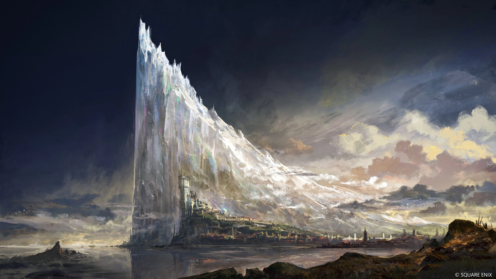
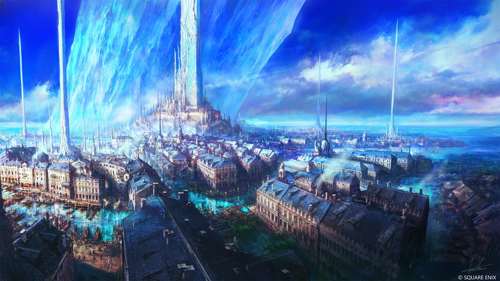
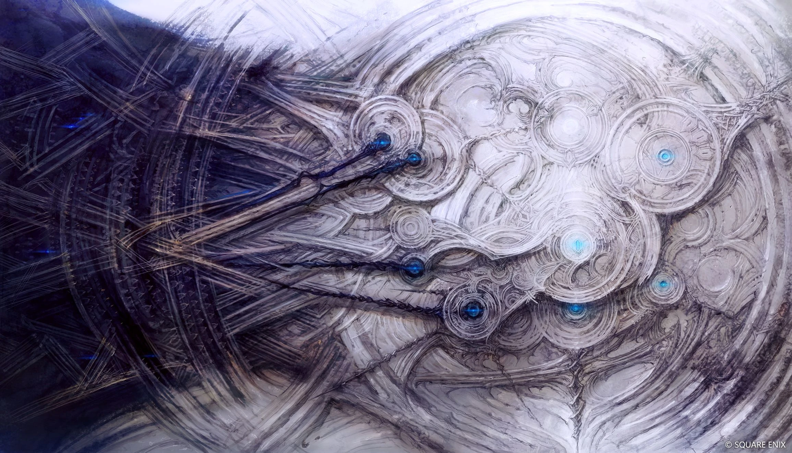
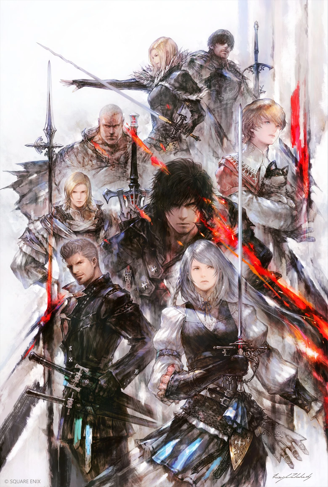
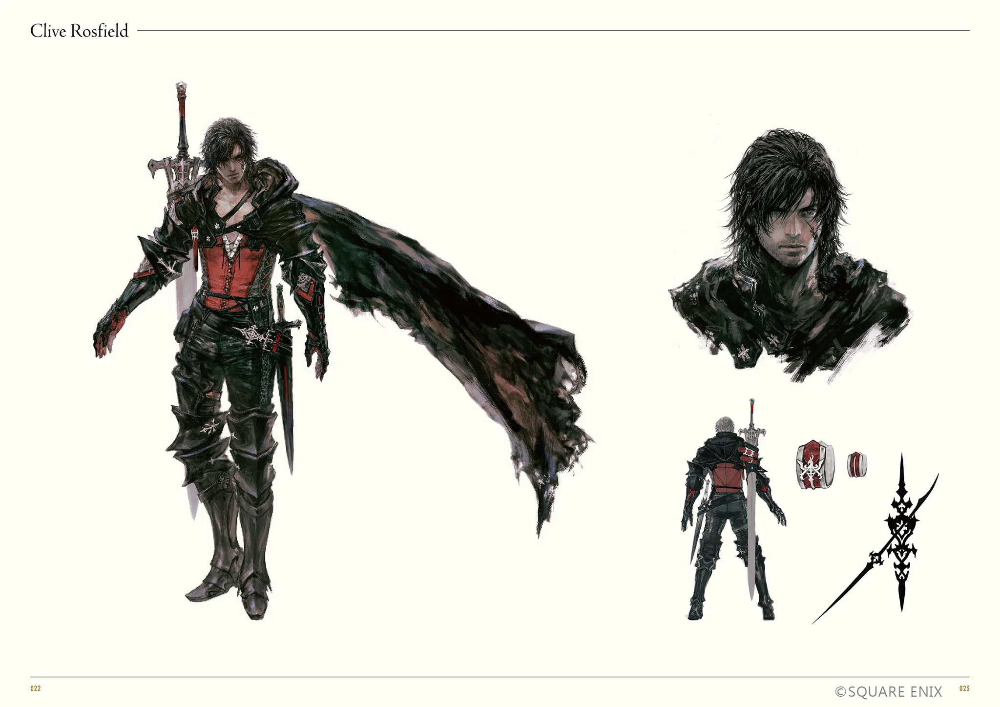
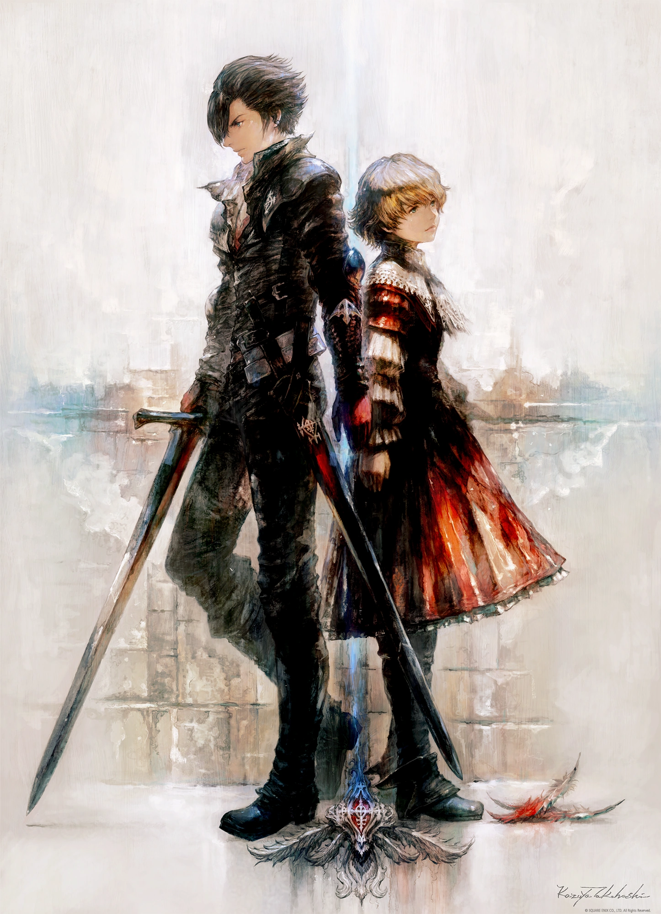
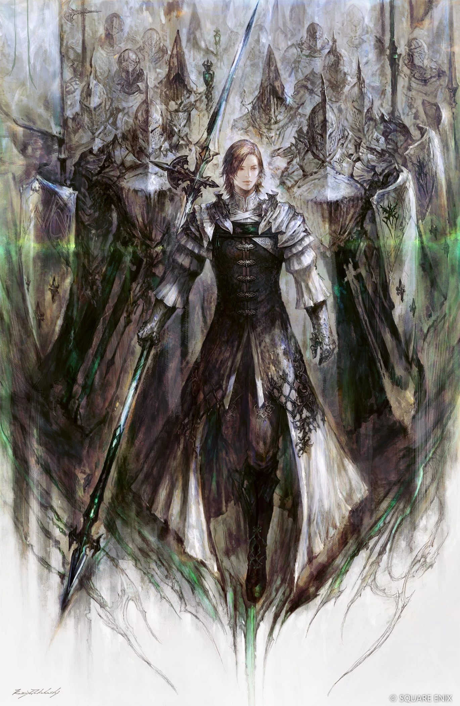
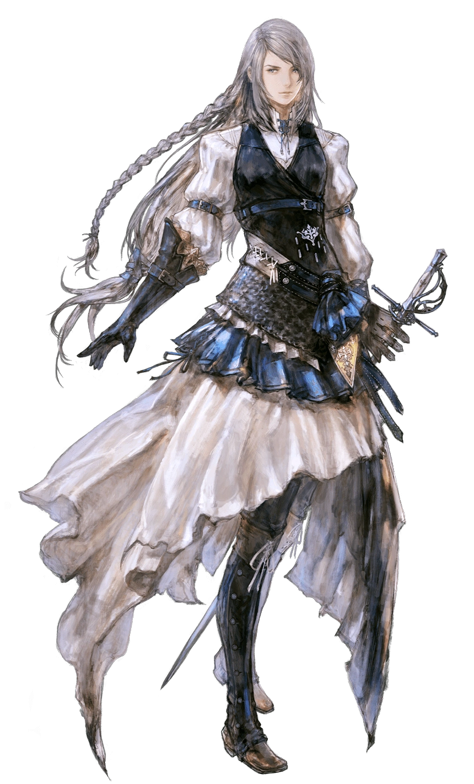
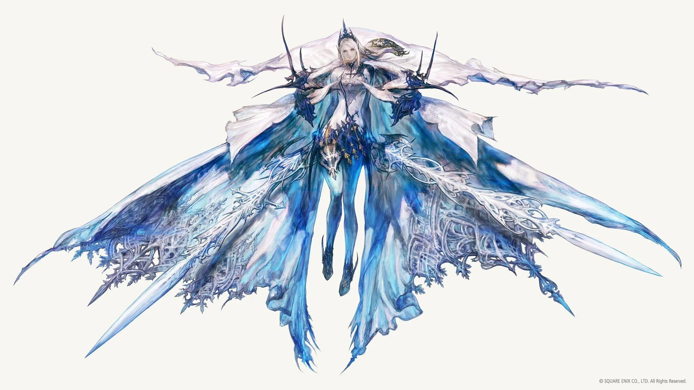
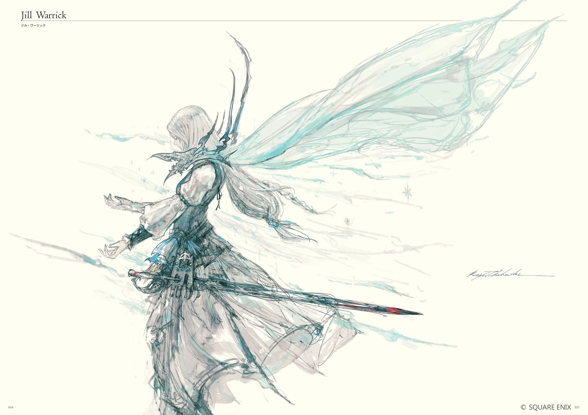

Three years ago, Final Fantasy XVI convinced me to play the rest of the series.
Today, I am a different person, with different taste in games. Does it hold up?
Not quite, but I still think it's better than it gets credit for.

This game was created by Square Enix Creative Studio III, and it is exceedingly
apparent. Creative Studio III's main production is Final Fantasy XIV. This is a
_very_ Final Fantasy XIV game. From the music, to the writing, to the pacing, to
the boss fights, all the way down to core game design philosophy. This is
perhaps the most similar two mainline Final Fantasy games have felt since the
SNES era.

Obviously, there are some pretty major differences. This is a high budget, high
fidelity, console oriented, single player action game with some light RPG
elements. FFXIV is much lower fidelity, so that it can run on a wider selection
of hardware. It is playable on consoles, but is clearly PC oriented. Though the
main story can be completed almost entirely alone, it is an MMO. Tab targeting
and hotkey mashing are very different from this combat system inspired by Devil
May Cry and God of War. Yet, I still find these to be incredibly similar games.
They have the same heart.

Final Fantasy XVI's production began in 2015, shortly after the launch of Final
Fantasy XIV's Heavensward expansion. Learning that information finally made
several things to click for me. Kazutoyo Maehiro was the lead writer for both
that expansion and this game. The style of Final Fantasy XIV's writing saw a
dramatic shift after Heavensward. It struggled to find a voice for a while, but
eventually found solid enough footing to give us not just one, but two extremely
beloved expansions with excellent writing as the core attraction. So what
changed? Maehiro moved to XVI.

Given this, I think it is funny that I am less of a fan of Heavensward than the
average Final Fantasy XIV fan. It is my least favorite expansion, ranking above
only the base game for me (also led by Kazutoyo Maehiro). On the other hand, I
am more of a fan of Final Fantasy XVI than the average Final Fantasy fan---but
mostly _in spite of_ the writing, not because of it. I think I'm, sadly, just
not a fan of Kazutoyo Maehiro's style.

I think this game has the best chance of being enjoyed by those who have already
played and loved FFXIV, and also like character action games. You're going to
need to love this combat to enjoy this game, because **so much** of it is combat
(though that's true of most Final Fantasy games). Additionally, this game is
overflowing with FFXIV references. In fact, this game draws from modern Final
Fantasy games just as much as the classics. Outside of specific crossover
events, FFXIV and FFXV kept their references largely constrained to the older
games. FFXVI legitimizes the modern Final Fantasy games by giving them equal
weight.

There was a time when I called Final Fantasy XVI one of my top 5 games of all
time, but after this second playthrough I'm finding it extremely difficult to
rank or rate this game. Part of that is due to the much more critical eye I've
turned upon the game, but it's more than that. Playing through (and writing
about) this extremely varied franchise has helped hone my taste in games. When I
think about this game now, I recall all the moments I nearly jumped out of my
chair from the rush of excitement or joy I was feeling---but also all the ways I
was disappointed.

# The Review

I like Final Fantasy XVI.

This review will likely contain a lot of negativity. That's just because it's
easier to point out the flaws in something like this, and the descriptions of
such things can be far wordier. The good parts can be adequately described with
the much shorter "perfect." However, even with flawless ingredients, how they
are put together matters. That, unfortunately, is what I find most disappointing
about this game.

But before I get into that, I'll talk about my favorite parts.

## Audio

I think the most impressive part of this game's presentation is how it sounds.
It's far from the first Final Fantasy game to have good music or good voice
acting, but the orchestration of it all is perfect. Many earlier Final Fantasy
games had audio balancing issues, inconsistent volume levels, or sound effects
that trampled all over each other. Not this game. Everything is engineered to
layer perfectly together. The music is timed precisely to the spectacles
unfolding on the screen and the emotions delivered by the actors. The sound
effects cut through the rest of the soundscape to clearly provide audio cues
without being harsh on the ears. It's an absolute auditory feast.

If I have to complain about one tiny thing, it's a gimmick. Like many
Playstation exclusives, this game was encouraged to utilize the unique features
of the console's controllers. This included sounds played through the
controller's speakers. I always find this annoying. Why play sounds through the
crappy controller speaker instead of whatever device I'm already listening to?
If I'm in a call with someone while playing, now they get to hear random
gameplay sounds like I'm playing on a handheld. It's always a surprising
feature, in a negative way. Fortunately, this can be easily disabled in the
settings. I exclusively blame Sony for this.

### Voice Acting

There is not a single voice in this game that I do not like, even among random
side NPCs. Every actor did a phenomenal job, and they were all well-cast for
their roles. The chemistry and emotional delivery helped sell so many scenes
that I do not think would have worked nearly so well without this talent to
carry them.

The absolutely wonderful elephant in the room is Ben Starr. He stole the show,
and gave a performance more than worthy of a Final Fantasy lead. It makes me a
bit emotional to hear him talk about how much Final Fantasy means to him, how
excited he was to get the role, and how much love he poured into this project.
I'm so glad that this game catapulted his career to such new heights. He had
been in other roles before, but he finally has the recognition he deserves.

This blurs the line between writing and performance a bit, but I appreciated all
the regional dialects and accents scattered through the game. I could very
quickly tell where someone was from just by hearing them talk. It added greatly
to the immersion. It is a little funny that it's all a single language, though.
I wish they leaned into cultural and language differences a bit more, especially
with the emphasis on unity and the fact that people are just people no matter
who they are or where they're from. Still, I appreciate what we got.

### Music

**I. Love. This. Music.**

The soundtrack is absolutely the best part of the game. But that's no surprise,
as the same is true of Final Fantasy XIV. Masayoshi Soken simply doesn't miss.
He is one of my favorite video game composers of all time. If you like Final
Fantasy XIV music, there's a very high change you'll like this, too. These songs
would fit right in with the XIV soundtrack. In fact, some of them are
arrangements of songs from that game.

For example,
[Against the Wind - The Eye of the Tempest](https://music.youtube.com/watch?v=trdVLphGs8M)
uses a slowed and muted version of FFXIV's Garuda theme,
[Fallen Angel](https://music.youtube.com/watch?v=itfj1PUmpiU). Apparently, The
Ifrit vs. Garuda scenario was the first part of the game to be built, used as a
prototype and benchmark for the creation of the rest of the game. Do you think
they were trying to tell us something with Shadowbringers'
[Primal Angel](https://music.youtube.com/watch?v=-VQAJ_PQsI4)? Another of my
favorite examples is that the FFXIV Azys Lla theme is used in the Echoes of the
Fallen DLC (my favorite example is
[Eikonoklasm](https://music.youtube.com/watch?v=5MMKIrkVcOg)), drawing parallels
between the Allagan Empire of FFXIV and the Fallen of FFXVI. There are countless
more, and it feels awesome to recognize them as an FFXIV fan.

There are references to other Final Fantasy games as well---most often the
original Final Fantasy, even beyond the tracks that have become series staples.
I think the most interesting example is the
[Final Fantasy Main Theme](https://music.youtube.com/watch?v=LqATxEW0JmU). This
is originally an adventurous song of hope, but FFXVI always turns it into
something dark and conflicted in its emotions, like
[Bloodlines](https://music.youtube.com/watch?v=0lyeHeU3t10). This motif
represents the influence of ||Ultima||. That has some implications I'll talk
about later. Another example of this is the track
[Fighting Fate](https://music.youtube.com/watch?v=tpB7ER7dV4A) which paints the
main theme of Final Fantasy in shades of melancholy. Even the main leitmotif of
||Ultima|| itself (concisely shown in
[Found](https://music.youtube.com/watch?v=hLvCFN-xnDM)) resembles the first half
of Prelude, left unresolved.

The musical references are not kept external. Soken _loves_ a good leitmotif.
FFXIV is full of them, and so is this. But this game develops its musical
language several steps beyond that of XIV. Some places are more obvious than
others. On the more blunt (but awesome) side are the scenes in which multiple
characters are having a moment of heightened emotions, usually lethal combat.
The music during those scenes is composed of an arrangement of both of their
leitmotifs. A great example is
[Shattered](https://music.youtube.com/watch?v=h6Tnzjnw2Jg), which combines the
motifs of Titan and Shiva for their battle at the very start of the game.
Possibly my favorite example is
[The Battle of Belenus Tor](https://music.youtube.com/watch?v=20vp_oJjbFY),
which blends the themes of Bahamut and Odin together in such epic, adventurous
ways. The final boss theme,
[All as one](https://music.youtube.com/watch?v=IBMUZR14TZc), contains both
[Find the Flame](https://music.youtube.com/watch?v=IBMUZR14TZc) (this game's
main theme) and Final Fantasy's classic Prelude. All of this presents the legacy
of Final Fantasy as an antagonist. I'll bring this up again in the story
section, but it's so cool how well this is represented through music alone.

But it goes beyond that in much more subtle ways. I love when a leitmotif is
incorporated very softly to indicate that the concept or character represented
by that leitmotif is influencing the situation. Most often and most sneakily,
this is ||Ultima||. It's very powerful storytelling.

To talk about the soundtrack more generally, I'd like to rattle off some of my
favorites to demonstrate its range.

[Ascension](https://music.youtube.com/watch?v=oLm40DaQ5YE) is an incredible
orchestral piece for an incredible boss fight. It's so perfectly timed with the
way the fight plays out. It incorporates the themes of the characters involved,
and it backs one of the most memorable moments of the game.

Fittingly, one of the first times the music takes a sharp turn in style is with
[Catacecaumene](https://music.youtube.com/watch?v=Tt2zeMyPzIw). This is played
during the first moment where the curtain is pulled back and it is revealed that
the world is not as it seems.

[Titan Lost](https://music.youtube.com/watch?v=dkGwV5Hreb8) is such a sick style
twist on Titan's theme. It's so heavy, perfectly fitting the Eikon of stone.
Once again, one of the most iconic parts of the game, and the music plays a
significant role in it. Slightly earlier,
[Do or Die](https://music.youtube.com/watch?v=HzYfIIegbZs) plays for a lower
stakes early phase of the fight. These two songs are so different in style from
the rest of the game, but they still fit in, especially in context. They remind
me of the music from FFXIV's Alexander raid series. I wonder if that's Koji Fox
on vocals.

I found Odin's theme to be haunting throughout the game, but
[Furor](https://music.youtube.com/watch?v=enX7ogjvSzo) is **just so god damn
rich.** Give it time to cook. The buildup is worth it. It goes through so many
emotions. The resolution of that resigned melancholy into the euphoric
expression of glorious determination that is
[The Riddle](https://music.youtube.com/watch?v=OPHfnRUs-P8) gets me unreasonably
hyped up every time.

Like all my favorite Final Fantasy soundtracks, there's an emotional piano
rendition of the main characters' theme.
[Who I Really Am](https://music.youtube.com/watch?v=ucRssvvSPrg) is a very
delicate piece, and is played during a moment of vulnerability that directly
contrasts the violence that usually accompanies the main version of this theme.
The title of the track emphasizes one of the game's core themes of self
discovery and self assurance.

And of course, as is tradition for Final Fantasy games since FFVIII, the credits
roll to an emotional vocal version of one of the tracks we've been hearing for
the entire game. In this case,
[My Star](https://music.youtube.com/watch?v=F7-bBVIKCnE), which is Jill's theme.
In context, this made me cry during both playthroughs. Even listening to it now
and picturing the scenes in my head, I'm getting goosebumps.

This soundtrack is _massive_. Between the main game and the DLCs, there are
almost 200 tracks. Many are one-offs used for very specific scenes and designed
to align perfectly with what happens on screen, similar to a movie soundtrack.
It's hard to pick out favorites, as so many tracks are variants of each other.

I do have to offer some criticism, but I don't think it was the fault of Soken
or his team. There are a few very emotional scenes in the middle of the game
that are ruined by ill-fitting music. Most notably, ||Cid dies. While he is
bleeding out in the arms of his friends and saying his last words, the theme
that plays is the upbeat and comfy
[Hide, Hideaway](https://music.youtube.com/watch?v=h3heYo8SSzY). This is the
theme of his home and the place he worked incredibly hard to create and defend.
In some ways, it represents his dreams and his hope for the future. But... it
just doesn't fit the tone of the moment. I get what they were going for, but
with so many one-off tracks and custom versions of other themes in the
soundtrack, they couldn't have made a sad version? Hell, there are already other
versions of this theme that would have fit better, and they chose the worst one.
Missed opportunity.||

Minor things aside, this is one of the best soundtracks in the series.

## Visuals

This game looks great. I remember gushing about it when it first came out. At
the time, it was one of the best looking games I had played in a long time. Only
a few years later, it is starting to show its age, but it still looks fantastic.
I love the semi-realistic style they chose for this game. It was an excellent
choice for its tone and themes.

Unfortunately, the quality level of the visuals varies quite a lot. On the low
end are "cutscenes" that just flip a camera around from speaker to speaker with
basic lip flaps, canned animations, and flat lighting on top of it all. These
scenes remind me a lot of FFXIV. My friends and I jokingly try to guess if each
cutscene will be "budget" or "no budget", and "no budget" wins most of the time.
This makes the higher quality cutscenes feel like treats, but **man** it would
be nice if everything was consistently good. I don't feel like that's asking too
much of these games. Especially since there's a lot of fluff that could be cut
to fix budget issues in another way, focusing on quality over quantity.

Fortunately, the high end is _extremely high._ The level of spectacle in this
game is truly insane. There has not been a single game that has inspired the
same level of awe and excitement in me as this one. When it pops off, it is
overwhelmingly good. It feels like I'm on the other end of those "feeding
Doritos to a medieval peasant" memes. The emotional performances are stellar.
The sense of scale is incredible. I don't think we'll get another game that
reaches these heights for a long time.

Stepping out of raw graphical fidelity: I love the UI. The pause menu goes
through numerous changes depending on your story progress and current situation,
and it's packed with fun little details. Also the world map is one of my
favorites in any game. It looks like a carefully hand crafted diorama, and it
too changes over the course of the game.

### World Design

This is the first mainline Final Fantasy game to be rated M, and it was planned
that way from the start. This is a game aimed at older audiences, covering
mature topics and taking inspiration from media like Game of Thrones. The
realistic style adds weight and a feeling of groundedness.

But realism isn't the only style present here. While realism provides the
backdrop, there are elements of fantasy that pop out explosively. These aspects
twisted out of proportion and blown up to be larger than ever or darker than
ever. Eikons and crystals are symbols of the franchise at this point, and in
this game they tower over everything else, dominating any scene they are present
in. Even the particle effects of magic shine intensely in front of the mundane
landscapes behind them.

This contrast is intentional. The game constantly pits elements of fantasy and
realism against each other. This theme is worked into the art direction from the
foundation up.

The various architectural styles present in the game impressed me. This game
always looks good, but the details in the world building are incredible. They
remind me of how you can piece together the story of the world of a FromSoftware
game from the architecture alone. This adds greatly to the feeling of discovery
and awe.

My favorite examples are the architectural changes that happen as you dig into
ruins or start exploring around Mothercrystals. Getting to the heart of each
Mothercrystal reminded me of classic Final Fantasy games, especially the NES and
SNES eras. The crystals have these mystical and religious ruins around them,
clearly built so long ago that no modern civilization has accurate records of
who built them. It's like you're stepping from reality into myth, and find it to
be a place of reverence.

The Fallen ruins are even more interesting. You first explore surface level
ruins that are so destroyed and worn down that it's hard to piece together what
they once were part of, but there's always this vague sense of machinery to
them. This machinery must have been massive in scale. What could have caused
their downfall? Then you explore better preserved ruins, and discover yet
another layer to the mystery: Though the ruins are clearly mechanical, they now
bear a striking resemblance to organic material, perhaps even angelic. The
defenses within are slumbering creatures made of cogs and magic. It's like these
places were built by a civilization obsessed with creating artificial life,
challenging God by daring to engage in the act of creation. Then you dig deeper
and find true life forms more powerful than the artificial ones you faced so
far. This is an inverted Tower of Babel. That's why they fell.

Even creepier, these true life forms, clearly sent here to destroy these places
and ensure they never rise again, are very similar to those artificial life
forms in function, if not design. These are biological forms of life, existing
only to serve specific purposes as tools. These lives are mere cogs in a grand
machine, tools to be discarded when their purpose is complete---to be left to
rot with no consideration of their wellbeing. These themes are worked into the
world design itself.

### Character Design

This is by far my favorite set of character designs in the entire franchise.
There are very few Final Fantasy games that don't have a few character designs I
like, but most have at least one or two I strongly dislike. I think the more
realistic art style and the more mature tone helped craft a cast of characters I
truly love. Second place goes to Final Fantasy VIII for similar reasons. It also
helps that the closest we get to a mascot character is Torgal, and there are no
comic relief characters.

I also love that all of these characters are attractive in their own ways, but
it doesn't feel like any of them were exploited or over-sexualized to accomplish
that. I think an attractive cast like this is fitting for a fantasy tale, but
there's also decent variety. They don't all share a pretty face.

If I have one criticism, it's that there could be a bit more diversity. The
internet was quick to point this out, and I mostly agree. Some people take it a
bit far though. I saw articles and comments along the lines of "this game about
slavery has a very white cast" and I think that is both needlessly reductive and
not even correct. That's just one of the many aspects of this story. But still,
a game that supposedly spans its entire world could have done better, and we
should expect better.

The stars of the show are the Eikons and their Dominants. Like the rest of the
world design, these characters have more fantasy going on than other characters
so they are allowed to "pop" a lot more. Their designs are exaggerated, but
through the inclusion of more detail rather than making them more anime or
disproportionate. You can still play a game of "spot the protagonist" if these
characters were in a crowd of normal NPCs, but only because of their patches of
bright color and fantasy elements that stick out. Not because they are
overdesigned to the point of impracticality. The ways their character designs
stand out from others are also very well representative of their personalities,
ability sets, and relationship to Final Fantasy history.

Kazuya Takahashi was the lead character designer for this game, and I look
forward to more of his work. I believe this was the first time he has taken up
such a position, and he absolutely killed it. He has mostly done art for FFXIV
previously, which makes a lot of sense. I hope he gets to continue creating
characters for the future of Final Fantasy, because he's easily my new favorite.

I have to start with our main protagonist, Clive. It isn't even a contest. He
**is** the best main character design in Final Fantasy history, in my opinion. I
know everyone has their favorites for various reasons, but Clive hits all the
right notes for me, even if he isn't my favorite _character_ in the franchise or
even this game.

His visual design represents his narrative arc well. He can't forget where he
came from or the promises he made. Those things are displayed clearly in his
outfit. He _literally_ wears his heart on his sleeve. He has been through a lot,
and bears a ton of darkness, but there is a strong element of willpower and
passion. I don't think it's a coincidence that the parts of the story during
which he is most emotionally vulnerable, dejected, and ready to give up on
everything are when he is stripped of this attire. This armor is not just
physical, but emotional as well. This makes it even more impactful when he
removes it in an act of trust and emotional availability.

It's also a brutal outfit. There are tons of sharp edges and points, multiple
weapons, and a cape torn ragged. The armor looks extremely heavy duty, ready for
the most intense violence. Yet, the torso and head, the most vulnerable areas,
are left exposed. This is the armor of a brutal warrior who puts their life on
the line every day. It's black and red, and overall looks like a villain's
design, not that of a hero.

Clive has Dark Knight energy, and that leads me into my next point.

I love the contrasting designs of Clive and Joshua. Both share some similar
design elements, representing their bond of brotherhood and their shared origin,
but they are almost parallel opposites.

Joshua is bright and light and innocent, but bears a heavy fate. His design
resembles that of the Red Mages scattered across Final Fantasy history---and
indeed, the flames of the Phoenix can be used to harm or to heal. His hair is
light and warm. His features are smooth. His attire is ruffled and frilly, later
torn and tattered, bringing to mind the feathers of the Eikon he bears---the
grand fate he was born into.
 
Meanwhile, Clive is dressed in black leathers with only some small elements of
red to tie him to his brother. Even his hair is dark. He resembles a Dark
Knight, trained in the violent and brutal art of combat and blessed with some
minor magic to better serve the realm. He bears a different kind of
responsibility: to throw his life on the line to protect others. Yet, as all
Dark Knights do, he has a vulnerable heart. Even in this concept art we can see
him reaching back to his younger brother as a comfort for them both.

I have to bring some attention to **my boy** Dion and his Dragoons. Combining
Dragoons and Knights all under one Holy Order is extremely cool in both concept
and in aesthetic. It's the best part of FFXIV's Heavensward expansion, and one
of the strongest indicators that this was developed by the same people directly
afterwards. Not only is it a great way to bring one of the series' most iconic
jobs to the forefront, it's a perfect fit for the Dominant of Bahamut. It also
sets Dion up as a foil for Clive by giving him a restrictive combination of
duty, responsibility, and power that is the parallel opposite of Clive's
circumstances.

Dion is one of my favorite characters in all of Final Fantasy. Not only is his
arc the best written in this game, it's one of the best written in the series.
Though the way it played out could only be done since he was not the main
character. He is also one of the very few openly gay characters in the entire
series, and the _only_ one to be featured so prominently in the story. This was
handled in a very mature and delicate way, which I loved.

What I find interesting about his character design are the parallels drawn
between him, Joshua, and Clive. He has the frills and flowing robes of Joshua,
emphasizing his Eikon's ability to fly, but no feather-like patterns. He is
covered in heavy armor and ready for violence like Clive. His colors are dark
and light in contrast. He share's Clive's conviction of duty and complicated
parental relationship, as well as Joshua's grand fate, responsibility of power,
and noble upbringing.

Jill's design is also awesome. Her look is feminine but adventurous and
practical. She looks ready to kick ass, and she's confident in her abilities,
but she hasn't given up on looking pretty just for that. Like Clive, she bears
significant darkness, but she's far more hopeful. Once again like Joshua, her
flowing robes indicate her Eikon's ability to fly, and evoke iconic visual
elements of Shiva. She even looks a bit like a Red Mage, but blue, indicating
that though there are similarities between her and Joshua, she has a different
role. I appreciate the long braids as a nod to the many designs for Shiva that
have had them across the series.

Speaking of Shiva, this is by far my favorite design for her in the series, and
she is my favorite Eikon design in this game. Shiva has had an unfortunate
history of being extremely scantily clad. Often enough, she's just a blue lady
in a bikini. This was not always the case, but it was by far the most common
design. Ironically, the robotic Shiva of FFXIII was the best dressed so far.
Final Fantasy XIV did a little better by putting her in a leotard, but it was
still cut to be as revealing as possible. FFXV took the biggest step back in a
long time with its design. So I'm very happy to see FFXVI take this direction.

Look, I'm not a prude, and I don't think all revealing character designs are bad
or anything like that. When done with a narrative, thematic, or empowerment
purpose, it can work very well! Bayonetta is a good example. I just think the
old Shiva designs were a bit boring. They appear to me to have been designed
with sex appeal in mind at the cost of other interesting possibilities, and that
strikes me as a very unfortunate (and a bit problematic) reason to make that
kind of decision. Just look how much cool design space is possible with more
clothes!

This Shiva has icicles and snowflakes, rolling snow and flash frozen waves. It
has light fabric that flows through the air as she gracefully glides as if on
ice skates. The whole design screams cold and power and grace. This is the look
of an ice goddess. Even her stare is cold.

This is a good opportunity to bring up semi-primed character designs. Dominants
can call on part of their Eikon's power without fully transforming into them
(which would be full priming). They stay human-sized, but they take on some of
their Eikon's visual elements, fusing the two character designs together. These
are always a treat, and they were such a smart thing to include. They serve as
excellent gear shifts for both narrative and combat. Boss phases are obvious,
but Clive can also semi-prime for a temporary power boost, adding another set of
timing-based tradeoffs to the combat system. Out of combat, a semi-primed
character ramps up the stakes because this drains their stamina faster but
allows them to pull off greater feats. No matter why it happens, it's always
cool.

## Gameplay

Gameplay is one of the main reasons I fell in love with this game and still love
it so dearly to this day. I don't replay many games, especially not ones so full
of combat. Hell, other games in this same series annoyed me on a _single_
playthrough thanks to all the combat. Yet, I looked forward to getting back to
this game the whole time. Even though the story would hold no more surprises,
even though it would take me 60 hours, it was the reward at the end of the
journey. It paid off. I thoroughly enjoyed it.

Combat is largely the reason why. I've got a subsection for that below. But it
isn't flawless, and neither are the rest of the gameplay systems. In fact, I'd
say it's all downhill from there. Many of these systems were pulled straight out
of the FFXIV MMO, and don't work super well in a single player game (I'd even
argue some of them don't work very well in the MMO, but I'm not reviewing that
here). Other systems were clearly included because of expectations created by
the gaming landscape, rather than what would actually work for this game.

A great example of a tiny thing that is entirely superfluous and only harmed the
game at best: Adaptive Trigger support. There are a few games that use the
gimmick well, but this is not one of them. Most of the time, I don't think a
button press should even be necessary to enter doors in games like this. This
goes in the opposite direction, causing you to slow down and hold a pointless
button to really **feel** that door open. Stupid. Sony's gotta get that feature
in every exclusive somehow, though.

Another thing this game struggles with is progression and item economy, which
I'll bundle together into one topic because I think they are linked and have the
same impact in this case: almost nothing! These things could have been cut from
the game and it would have been slightly better for it, though they were only
tiny downsides for my experience.

The level system and access to new abilities are entirely decoupled. Leveling up
just improves your stats across the board in a flat and uninteresting way.
You're shown a screen of something like a dozen numbers increasing, but they
don't really matter. Everything just boils down to your level being a basic
multiplier of everything you do in combat, and it improves at glacial speeds. It
takes ten or more levels of difference to impact how the game feels to play.
This could essentially be brushed off as nothing more than a cute nod to other
Final Fantasy games that work the same way, but it's a little too integrated for
that.

It's made worse by the fact that you can't really over-level challenges. Most
story bosses have invisible thresholds during which story events happen. This
could be a new phase, a shift in the arena, or just a QTE to shake things up.
These interruptions block your damage until the boss gets up from stagger. So
over-levelling just allows you to hit that threshold sooner and be forced to
wait out the stagger timer. You can't actually kill the boss any faster. This is
a weird criticism for me to make, because I don't _like_ over-levelling
challenges to begin with. I'd rather have a well tuned and curated difficulty
curve. Additionally, I vastly prefer a system like this over a game that allows
the player to accidentally overpower a boss so hard that they miss lines of
dialogue or other cool story moments. However, this does bring into question:
Why bother with a leveling system at all? You can't realistically grind for
levels in this game, and it never throws you into situations where you could be
significantly under-leveled. It feels entirely pointless. Yet it's plastered all
over the game so you can't forget it.

You might think that more levels at least give you a buffer against fights you
are not good at, so that you can complete them without too much trouble. But no!
There is a hidden mechanic that makes every fight easier to survive every time
you fail it. This is similar to FFXIV's echo system, but unlike that game it is
never revealed to the player. If this were a purely cinematic action game with
no progression systems, I would actually be a fan of this. I love a good
challenge, but sometimes getting blocked from story progress can be frustrating
and kill pacing. In this game, a feature like this just makes the progression
system even more pointless.

Equipment is in an even worse state. None of it really impacts your gameplay in
any significant way. The best you'll see are stat improvements one way or
another that amount to a percent point or two here or there. You could reduce
your defense by ten points out of five hundred to increase your maximum hit
points by three out of three thousand. Such meaningful choice! How does defense
actually work again? Who cares, just pick the equipment with the biggest number.

The most impactful pieces of equipment are accessories, but those have even more
problems. Most increase the damage or decrease the cooldown period of specific
abilities. If your strategy _really_ leans into one ability or another, you
could technically optimize for that. Even then, these are tiny adjustments. Yet
again, a few percentage points here or there. Also, you tend to equip up to nine
different abilities at once (in addition to your standard move set), and only
have three accessory slots. Even the strongest accessories will only upgrade one
ability at a time, and that's only a tenth of your build. Later on you can find
accessories that generically boost your damage by 5% and similar things like
that. I don't like these either because they are the obviously correct choices,
_and still_ don't do much. So there's neither build crafting nor meaningful
impact.

Worse still are the accessories that boost the rate of acquisition for
experience points, currency, and other resources. I dislike when these show up
in any game, but it's even worse here. These are trap options. The game ensures
you'll never ever be left without enough money, levels, or anything else. So
getting more just means you'll hit that invisible progression barrier mentioned
above even faster.

It's not all bad out there, though. A much-discussed accessory, the Berserker
Ring, gives you a mini limit break after every precision dodge. This
meaningfully changes the gameplay! Finally! Unfortunately I don't like it very
much. I think many people, myself included, just threw it on because it finally
feels like _something_ changes when it is equipped. But the animation that plays
for the effect is a bit annoying and gets old after a few combats with it. It
starts to make all the fights feel more samey since the enemies' attacks get
interrupted with time stops so frequently. It turns the game into dodge slop.

Fortunately, the DLC chapters include much more interesting pieces of equipment
that change the game in new ways, but that strikes me as too little, too late.
You can only really play the DLC content and _one_ main story boss with that
equipment. Still, it shows they are learning and will do better with this stuff
in the future.

The other half of item economy is picking stuff up off the ground. There are
_tons_ of crafting materials scattered throughout this world. By the end of the
game, I had hundreds of surplus of everything. I crafted everything I wanted to,
and had nothing to do with the rest. I sold it all for gil, then bought
everything I wanted with gil, and still had loads leftover. It feels like they
had a plan for this to be something more interesting, but decided to reduce the
friction to the point of pointlessness. This makes exploration usually
unsatisfying, but still compulsory. Sometimes, exploration would reward you with
a new piece of equipment. Sometimes that equipment could be pretty significant,
as far as equipment goes. 99% of the time, you'd open an ancient chest and find
10 wolf pelts and sadness, instead. But that tiny chance of something
interesting compelled me to check them all. I found lots of wolf pelts and
sadness.

Amongst the equipment and materials are consumables---almost always healing
potions. After FFXV had an issue with players being able to stock up on nearly
infinite healing potions to trivialize any encounter, they imposed potion limits
for FFXVI. That's... fine, workable even. It could have been so much better,
though. This is a largely linear game. You fight an encounter. You move on. You
fight another encounter. You're not really pushing out into the world until your
resources run out, forcing you to return (as is the normal point of attrition in
these games). You just follow the rails with relatively curated difficulty
curves. But wait! What happens if you run out of potions before a hard
encounter? The difficulty curve is ruined! The ground is littered with healing
potions everywhere to ensure you always have a minimum count for each encounter.
This is a band-aid on top of a band-aid on top of a poor-fitting design,
included without understanding of the purpose it served in the games it was
copied from.

Unlike much earlier Final Fantasy games, this isn't really a game of attrition.
Potions don't really fit anymore. Final Fantasy XIII already solved this, and
that solution would have worked extremely well here. Just heal everyone up
between fights, and allow magic to be used for healing during combat. This would
have fit so perfectly that I'm puzzled why they bothered with potions at all.
It's like they assumed gamers need potions to live. Or, maybe they wanted to
re-introduce some challenge by giving you limits... but then we get back to the
hidden catch-up mechanics that go directly against that. Puzzling indeed.

Overall, I think this game would have played significantly better if they had
not even tried to include RPG elements. There's a lot of pressure on the Final
Fantasy franchise to return to RPGs, but I think in this case that pressure
truly led to a worse game. Now, they could have simply not made an action game
at all and returned to RPGs for this one, and I'm sure many players would have
preferred that. It was the inability for them to pick one or the other and lean
into it that was the problem.

### Structure

We've arrived at the topic that is likely the most controversial part of the
game among people who actually played it. The true most frequent complaint is
likely "Final Fantasy should be turn based" but most of those people did not
play the game. To be clear, that's fine. They know what they like and they did
not buy something that they knew they wouldn't enjoy. Completely understandable.
However, many people did give this game a shot---whether because they like
action games, were willing to give them a shot, or for some other reason. The
critique I hear most often from this group is that the game has pacing issues.
Sometimes, the pacing issues got so bad they caused people to give up on the
game. While I did not have the same negative reaction to the pacing, I do agree
that it was executed poorly.

I think this happened due to a combination of issues. First, this game basically
rips off the Final Fantasy XIV structure with only very minor changes, and that
simply does not work for this kind of game. Second, this seems like a game that
wanted to be a multi-part series, but was forced into a single game. Let's start
with the FFXIV connection.

Looking back, it's sometimes comical how much this game adapts elements of FFXIV
without considering that maybe it would be better off without them. The funniest
examples are all the NPCs in the world you can talk to. Final Fantasy as a
series is no stranger to filling its worlds with NPCs that you can interact
with. Usually they'll have a line or two about what's going on around them, the
state of the realm, or just some silly joke from the developers. It adds life to
the world. FFXIV has this too, but not _every_ NPC can be interacted with.
Instead, many have canned animations to add some variety to an area, and maybe a
speech bubble or two pops up as you walk by. But the ones you _can_ interact
with have a few lines of dialogue, sometimes even whole dialogue trees. FFXVI
does the same thing. NPCs have voices now, but they just rattle off the kinds of
side dialogue that would be in speech bubbles in FFXIV. Many more are just
silent. There _are_ a number of NPCs you can interact with. It's about the same
ratio of interactable to non-interactable that FFXIV has. However, the vast
majority of these NPCs say things along the lines of "Why are you bothering me?
Go away." This makes the entire interaction pointless. Why _did_ I bother them?
Why did the game _prompt_ me to? It feels like they had some kind of internal
quota to fit the same pattern as FFXIV, but no interesting ideas of dialogue to
place there.

A ton of other structural details are straight out of FFXIV. The world is
divided into big chunks, each with one or more teleport crystals for fast travel
purposes. Your band of allies operate out of a central rebel base, which changes
location based on your story progress. From there, you initiate hunts, deal with
endgame vendors, accept quests, and so on. The Hideaway essentially acts as the
endgame hub towns of FFXIV. There are quest markers with plus signs on them to
indicate that they unlock a feature, and one such quest unlocks the ability to
ride a chocobo. The sheer number of side quests is another similarity.

That's just a collection of comparisons I make to point out how similar these
games are, but that doesn't explain the pacing issues. This _story_ is also
paced like a FFXIV story. That game _also_ has exceptionally high highs with
slow burns and filler tasks in between. This game is an amplification of FFXIV.
The highs are higher. The burns are slower. The filler is overfull. Not everyone
likes a slow burn to begin with, so those slower burns are pretty tough on some
players. The filler sections in FFXIV feel relatively skippable by just skimming
dialogue, but voiced cutscenes lead players to believe these quests will be more
important than they turn out to be.

That leads me to side quests. I think the side quests in both games are very
similar. There are some great stories in both, though some side quests are
clearly just excuses to get you to interact with the world a bit more. They are
_just_ as optional in both cases. Yet, more players find themselves overwhelmed
in FFXVI, compelled to complete everything before moving on. I feel this way
too. Why? I think it's because FFXIV players have confidence that the main story
will give them everything they need to complete the battle content ahead of
them. Plus, you can't unlock abilities early due to the level sync system. On
the other hand, FFXVI has relatively unbounded ability progression. Completing
all these side quests might mean you enter the next main mission with an extra
ability upgrade or two. Additionally, when players aren't satisfied with the
main story, but they hear others talk about their enjoyment of the side quest
stories, they look to the side quests to fill the gaps in their own enjoyment of
the main story. Unfortunately, this is not how the side quest stories are
designed, so this leads to disappointment. It also doesn't help that the game
tries to advertise side quests to you in multiple places, constantly reminding
you of them. Whatever the case, these side quests feel less optional for some
reason, and that hurts pacing.

The other half of the pacing issues have less to do with FFXIV and more to do
with the scope being too ambitious for a single game. This, unfortunately, is
exactly what happened to Final Fantasy XV, so there's precedent for it. Plus,
this game was in development before that one came out. So it would not shock me
that they hadn't yet learned this lesson. At the very least, it was far too
ambitious a project for the time they had available. I wonder if years from now
we'll uncover the history of this game's development, mirroring FFXV.

One of the things that leads me to this conclusion is that the game constantly
fails to show things that very obviously should have been shown. It glosses over
what would have been massively important scenes, sometimes worthy of game
finales. This is getting a bit into story discussion, but I think it is a
structural problem at its core. The biggest example is || the destruction of the
original Hideaway by Titan. We're shown all this build up to it, including the
spycraft that led to Titan learning its location. It's a huge part of the
emotional arcs of most of the cast. It's entirely off-screened during a time
skip. || Other things get stretched out to fit the narrative flow of a single
game, even though the timescale doesn't make sense. || That same time skip
includes Jill and Clive working as partners for five years. They had a very
early, but quickly developing romance before this time. We pick up after the
time skip to see this romance was entirely paused for those five years,
conveniently resuming as soon as the cameras started rolling again. || If this
game had been split into multiple parts, || the Titan Eikon fight || could have
been the finale, and the || romance || could have developed during the right
points in that first game's narrative. It would fit so well.

The other thing that makes me believe this would have been better as multiple
games is that it is not very consistent with its themes, and each of those
themes could have been relegated to a separate game. Is this about integrating
your Jungian shadow? Is it about fate versus free will? Is it about the bonds
that tie us together? Instead of picking one, they're all clumsily mixed, in
often contradictory ways.

One final note on pacing: FFXVI sometimes has pretty awful timing and blunders
its pacing completely unprompted. The game drops side quests on you at the worst
times. The main story is telling me that someone will literally die if I don't
go save them now. But hold up, a chocobo side quest just popped up over there.
Worse, the main story does it to itself! The worst example is when || The
Einherjar, famously the world's fastest ship, is escaping with Jill held
captive. They only need to cross a small strait to escape. But oh no! Mid's ship
won't work without one more part! (Just one more part for Mid bro I swear this
time bro one more part...) You have to travel back _across the continent_ to
pick up that part, do some puzzles and chat casually with some NPCs, return to
hand it over, and then defend the ship while the part is being installed. Then
the game tries to jump straight back into action and drama by having the ship
leave port without you because there's no time for you to board normally! Surely
any time advantage we could have won was entirely wiped out by _traveling on
foot across the continent,_ no??? This was probably the dumbest quest in the
game and I have no idea how it made it into the final game in that state.
Unfortunately, as much as I enjoy Mid as a character, I think a significant
number of pacing issues can be traced back to her. It's like they wrote the
story without her and then twisted things to make her fit later on. ||

Another thing that I think structurally held this game back was its adherence to
the elemental wheel from FFXIV. The six elements are here---fire, water, ice,
lightning, earth, and wind. The two poles are also here, umbral and astral,
represented by light and darkness as additional elements. This totals eight, and
the game sticks to that (with the exception of Leviathan being cut for DLC). Our
hero needed to collect them all on his journey, and that's a lot of elements.
This created some pretty significant narrative restrictions. I appreciate that
they did so in order to incorporate a wider set of classic Final Fantasy
summons, but I think they could have gotten away with a smaller set that focused
more on mythological aspects than elemental.

For example, Odin has the power to cut anything. We're even shown that he can
part the sea with a single slice. That kind of power has little to do with
darkness, but is _awesome._ The Phoenix is ostensibly the Eikon of fire, but has
more to do with healing and rebirth. I would have loved to see all of the Eikons
have some kind of mythological powers like this. Some felt oddly weak and out of
place due to lacking this, but needed to be included so that the elemental wheel
was complete. The elements also don't have much to do with any of the themes of
the game, but the power of myth and legend certainly does. A smaller set could
have also helped them focus more on quality over quantity. Trying to fit a
specific number quota like this strikes me as a poor choice.

With the game constantly switching what it cares about in jarring ways,
accelerating and slamming on the brakes enough to cause whiplash, and repeatedly
asking you to go back out for just one more part for Mid bro (she'll totally be
done with just one more part bro please), I don't blame anyone for finding this
pacing unbearable. If I wasn't so enamored with the combat, I would have bounced
off the game, too.

### Combat

My most controversial opinion about Final Fantasy is that this game has **by
far** the most fun combat system in the franchise (though I need to revisit the
FFVII remake series). This is what kept pulling me back to the game. At a
certain point, quests and story were irrelevant. I enjoy just wandering around
and getting in fights for the sake of it. If every other element of this game
was _terrible_, I would still love it for the combat.

This combat system allows you to express yourself in so many different ways.
There are multiple kinds of offense, multiple kinds of defense, and multiple
ways to combine each of these elements into unique combos. I played through the
game twice with entirely different playstyles, and every encounter felt fresh.
On my first playthrough I focused on defensive options, ensuring I always had an
answer to every attack my opponents threw out. On my second playthrough I was
much more aggressive, with a strategy tuned to deliver enough stagger pressure
to quickly reach staggers and max out the damage multiplier, while still packing
enough raw damage to take advantage of that multiplier. By the end of the game I
was hitting 250k+ staggers. It was satisfying every time.

I found it especially fun to try and string together aerial combos. There are a
lot of tools for launching enemies into the air, and even more for keeping them
there. However, many combos will end with slamming the enemy down. Normally,
this is exactly what you want, because you've got great slam options to follow
them down, and even better follow up options. But if you want to keep enemies in
the air, you need to know which parts of your combos send them tumbling down so
you can interrupt those parts and switch to other combos. Add in the various
charged abilities, stomps, and air stalls, and you can cook for a long time.

Speaking of, charged attacks are one of the best parts of this combat system.
Holding down the melee or magic button begins charging that attack up. Many
games have something similar, but far more rare is the ability to begin that
charge at any time, even during other animations. There isn't even a wind up
animation for it. When you push the button, the uncharged version of that input
happens immediately and the charging begins in the background. You're not a
sitting duck while you charge. It isn't a tradeoff of safety versus damage. It's
a way to push your skills harder to get more output. This one feature is so
simple and elegant but it can impact literally every combo you perform if you
want it to. The flexibility is insane. You can even charge both at once.

This combat system is full of simple but powerful tools like that, and they flow
into each other so smoothly and play off of each other so interestingly. You can
time a magic input to perform a burst attack after almost any other action. This
is already flexible and interesting on its own, but its true potential is
unlocked when used alongside the other features. As I already mentioned, when
you begin charging an input, the short version of the input happens immediately.
You can time the start of your charged magic input to trigger a magic burst,
getting extra value out of that input. You then get to choose when you actually
release that charged potential. Maybe you fire it right away to hit the enemy
that you just blasted up into the air, but maybe there's an even better moment
for it later in the combo. The only limit is your imagination.

Eikonic abilities are the larger, more explosive parts of your move set, with
individual cool down times. These are the parts that really define your "build,"
as they can be customized more than anything else. They also have a much bigger
impact on your total damage output than anything else, by dealing more direct
damage or stagger damage. Even so, they don't have to steal the show, and I
don't think they should if you're playing optimally. The systems I mentioned
above integrate well with this one. You can follow up these abilities with
bursts, and of course, begin charge attacks during the animations. The extra
interesting thing is that these attacks are triggered by button combinations
that include the same face buttons that trigger melee and magic attacks. Since
you can assign these abilities to whichever face button you like, you can plan
around which buttons you may want to be holding while triggering other eikonic
abilities. There are so many ways you can subtly tune your playstyle to become
the most efficient, well-oiled combo machine.

The variety in the Eikonic abilities is pretty insane. Honestly, I think it is
deeper than the job systems of many of the older Final Fantasy games. You can
equip multiple Eikons at a time and switch between them rapidly in combat, and
they each have a very different playstyle. You could make a caster build in this
game, if you wanted. You could go all-out on becoming a parry god. You could
lean into zoning and controlling enemy positions to get more value out of
everything else you do. You could focus on your moment to moment sword skills,
saving your Eikonic abilities for the most explosive staggers possible---or all
but abandon the sword in favor of cramming every low cooldown Eikonic ability
into the build to become an elemental master. There are endless possibilities.

But of course it doesn't end there! One more layer of inputs on top of all of
this is your ability to command Torgal, your canine companion and certified good
boy. You can push those buttons whenever you want. They're on the D-pad. Torgal
can perform basic attacks, throw enemies up into the air or back down towards
you, and even heal you up a bit. Torgal doesn't do a ton of damage or heal much
of your total hit points, even when significantly leveled up. He does, however,
deal a pretty decent amount of stagger damage, and the enemy repositioning
effects are the most useful part of his kit. Torgal's true potential is unlocked
with a bit of timing. After _any_ other input, you can issue a Torgal command
with similar timing as a magic burst. You can even time it after a magic burst.
This powers up Torgal's abilities. If you perform this timed input at the end of
a combo, after a charged input, or after an eikonic ability, Torgal's abilities
are enhanced even further. Since Torgal acts independently of Clive, this can
extend your combos over gaps where Clive must undergo a recovery animation after
a large attack that would normally end a combo. It's just one more way to
express your skill and to customize your playstyle.

This system would already be very cool if it were just about hitting the enemy
and avoiding attacks, but there's an additional element of strategy and timing
thanks to the stagger system. I've already briefly mentioned it a few times
without explaining it, but it's hard to talk about this system without leaving
something temporarily unexplained due to all the interlinking parts. Smaller
enemies generally get tossed around by your actions like they're in a Dynasty
Warriors game, but larger foes need to be worn down. They have a yellow bar
under their health bar that is reduced much more quickly. Different abilities
impact this bar in different ways. Some deal tons of damage but barely move the
stagger bar at all, some are the opposite, and some are in the middle. When this
bar drops to zero, the enemy is staggered for a limited time. During this
window, attacks which normally drain the stagger bar now increase a damage
multiplier that affects all damage you deal during this stagger window.

When a stagger happens, you're immediately in a race to build that multiplier as
much as possible and then dump as many high damage abilities as you can into the
enemy. There's an art to this, as all of your abilities take precious time, and
you need to make split second decisions between building the multiplier or
taking advantage of it. Trying to strive for perfection in this system is
extremely fun. I constantly tweaked my builds to try and achieve better stagger
results, taking note of what could have been improved from my last attempts.

This system reminds me, in all the best ways, of the Final Fantasy XIII stagger
system. Wait... A Final Fantasy game with a stagger system, in which you control
a single protagonist, who rapidly switches between different customized ability
sets mid-combat, occasionally accompanied by AI-controlled NPC party members,
and rides a white chocobo through a world full of side quests---Lightning
Returns, is that you????

Unfortunately, every system that allows so much expression also allows people to
play _as boring as they want._ I've seen people spam ranged attacks (the weakest
in the game) because it allowed them to "cheese" fights by staying out of
danger. I've seen people spam so many time stopping ultimate abilities in a row
that they weren't really playing the game anymore, just watching timers tick
down and entirely disregarding boss mechanics. I've seen people repeat the same
basic combo over and over without learning a single new skill because they found
a single thing that worked. _I do not blame any of these people._ The game can
be extremely frictionless at times and some people just don't get any joy out of
pushing this kind of system any harder than is necessary. However, it does make
it hard for me to take anyone seriously when they claim this combat system is
boring. _My brother in Christ,_ **you made the sandwich.**

That said, I do think this game has a difficulty problem, and that likely
contributes to a feeling of complacency and a failure to encourage players to
push the game or themselves harder. Many small enemies will just sit around and
wait for you to attack them, and when they do, they swing in pitiful, clumsy
ways. This is not only immersion-breaking, it completely strips the sense of
danger from many encounters. Even for boss fights, any kind of moderately
optimized setup with even the tiniest bit of skill expression will very quickly
run up against the invisible progress barriers that I mentioned earlier. On the
other hand, the game will tune itself to be easier every time the player fails,
at least until they next succeed. If the game won't reward _or_ punish a player
no matter their skill or build, what's the point in exploring the possibilities
the combat system provides? I happen to find it fun. That's the only reason for
me. Unfortunately, plenty of people don't find this fun, or they are demotivated
by the difficulty problem. That's not their fault.

There are harder difficulties in the game, but they are locked behind new game
plus. This is extremely lame. I hate this trend. I will not give this game a
pass for it just because I like it. The harder difficulties remove the issues
with passive and clumsy enemy I described earlier, making them much more
immersive and dangerous. They also introduce more complicated and difficult
mechanics to many encounters, and replace the enemy placements and group
compositions. You might fight against far more foes or groups of much stronger
types of enemies when these harder difficulties are active. I would have loved
to play that version of the game during both of my playthroughs. Unfortunately,
all the enemy levels are boosted to the endgame levels of a first playthrough,
so it is not possible. I find this to be an entirely unsatisfying excuse. The
level system is already pointless, and enemy levels could just be scaled down.
Stop trying to coddle me and just give me the harder experience!

Fortunately, there are pockets of good difficulty if you go looking for them.
The S-rank hunts, in particular, were awesome. These fights are already very
interesting mechanically and impressive in spectacle, but even better, they are
offered to you ten to fifteen levels early. This level gap allows them to be a
rare level of challenge for this game. You can finally go all out and have an
absolutely perfect stagger window, seeing a number higher than you've ever seen
in the game before---and witness it take a satisfying, but not fight-ending,
chunk out of the boss's health bar. Additionally, these fights do not have story
moments interspersed within them, so you are never interrupted or blocked from
performing your absolute best. This is when the combat system truly sings.

There's a whole side to the combat system I haven't talked about yet. You don't
only fight on the ground as a mere mortal, but also as the Eikon Ifrit. These
massive kaiju fights are incredible spectacles that got me extremely hyped up
every time. It is rare that any piece of media gives me the feeling these fights
gave me, and most only achieve it once if at all. This game did so repeatedly
throughout my time with it, even during a replay. This is a large part of why I
love it so much.

Eikon fight mechanics start simple, but they eventually ramp up to a roughly
similar state to the normal combat mechanics. As Clive learns to integrate his
shadow, he becomes more familiar with Ifrit and more in tune with that part of
himself. He becomes more agile, more powerful, and unlocks more of Ifrit's
magical potential. By the end of the game, Eikon fights are very interesting,
difficult encounters. These fights don't interact with the progression systems
at all, so the difficulty can be perfectly curated. In fact, one of the most
difficult and satisfying fights in the entire game, in my experience, is an
Eikon fight from the DLC.

Regardless of which kind of combat is currently happening, the game makes
frequent use of quick time events. These are hit or miss based on personal
taste. I fall into the "hit" camp. I love 'em, and I never really understood why
so many people dislike them. If you don't like them, then you likely won't like
that this game includes them. Personally, I'm happy to see them and I wish more
modern games stuck with them.

That was a lot of words to say _damn this feels good to play._

### DLC

I originally played the game before any DLC was released. I never went back for
it, preferring to wait until I played the full game again, so that I could play
the DLC with the story fresh in my mind. The time finally came, with this
playthrough!

My main complaint about the DLC is how late in the story it unlocks. I think
this is another FFXIV similarity thing. All of the content is designed for
endgame, since they assumed players would return after beating the game to play
the DLC on existing saves. So it's all locked until _literally the last quest._
You pack up, prepare to head off to the final fight in the entire game, say your
goodbyes, and... stop to go on two completely different adventures. It's
jarring, and entirely avoidable. Also, these DLCs give you some fun gameplay
altering toys to bring back to the base game, but you can only use them for
literally one fight and then the game ends. It would have been awesome to
integrate them into the natural flow of the story. They aren't so different from
the rest of the base game content.

The Echoes of the Fallen DLC is akin to a FFXIV raid series. You enter a tower,
exploring a new, self-contained location, and fight your way to the top where
the ultimate challenge awaits. The final fight is Omega, and it is easily the
best Clive boss fight in the game. It's so fun and so cool that it makes up for
any other issue I have with the DLC as a whole. The scenario leading up to the
tower was... not great. It's a long chase during which enemies keep getting
thrown in front of you while a character you've never really met before
continues to escape. The DLC then tries to bring this character back at the end
for an emotional payoff, but it just doesn't work with the tiny amount of screen
time he's gotten. However, the content once you've entered the tower is awesome.
It doubles down on the Allagan parallels, and contains tons of body horror.

The Rising Tides DLC is more extensive. It's similar to a FFXIV expansion,
though much smaller in scope. More like 1/5th of an expansion. You get one new
zone to play with, full of side quests and things to explore. There are two new
playable "jobs" (Eikons) that are some of the best and most fun in the game. The
story content here is pretty good, and I enjoyed exploring the region and its
culture. The real highlight is the Leviathan Eikon fight though. Much like Omega
is the best Clive fight in the game, this is the best Eikon fight in the game.
It is tuned so perfectly and the spectacle is incredible. This took me a dozen
or so tries, and really asked me to play flawlessly to win. It felt like the
developers heard the feedback about difficulty loud and clear, and this time
they nailed it. The emotions behind it are also set up in a surprisingly
satisfying way for how short the story content here was compared to the base
game.

The Rising Tides DLC gives you the Leviathan Eikon ability set pretty early,
which is exactly what I hoped for. This gave me time to play with it rather than
just giving it to me at the end. It's clear that tons of the fights in the DLC
were made with that ability set in mind. It gives you significantly improved
ranged offense options, while also providing a longer range double-dodge. The
fights were so dynamic that it was a perfect match. I could still do great
damage to each boss even while they moved around the arena more than any other
FFXVI boss had previously, and the double dodge was great for getting out of the
sea of FFXIV-style incoming AoE markers. I kept it on for the rest of my
playtime.

## Story

I am someone who highly values the story of the games I play. That story could
be told without words. In fact, I prefer when gameplay helps tell at least part
of it. The potential for _that_ is the unique thing about this medium that makes
me love it so much.

The story of Final Fantasy XVI is... a bit of a mess, and some parts are worse
than others. However, there are salvageable parts. I believe that every moment
of high spectacle in this game is accompanied by a moment of excellent narrative
execution. It's the connective tissue that gets sloppy. Very sloppy. That sloppiness
often undermines the narrative moments around it severely.

To me, the important aspects of a good game story are how it makes me feel, and
how well it delivers the message it was trying to get across. It was in the
latter aspect that Final Fantasy XVI let me down. It often felt confused about
what it was actually trying to say, and the gameplay systems often conflicted
with the narrative of the moment.

I have heard, though I can't confirm, that Kazutoyo Maehiro has mentioned in an
interview that _he doesn't believe games should be written with themes. Instead,
characters should be written, and a story should follow. Otherwise, the gameplay
would be impacted by the themes, and that would be bad!_ I can't find a proper
source for this unfortunately. It was in an interview that was never officially
translated, and all fan translations have been taken down for one reason or
another, and now it's very hard to search for the original, because I don't know
the Japanese words to use as search phrases. _If_ it's true, I would be
incredibly disappointed. This is exactly the **opposite** of how I think good
stories are written for games. Unfortunately, thinking about Final Fantasy XVI
with that thought in my head makes things line up depressingly well.

What is this game about? Is it an exploration of free will versus fate? Is it
about the strength granted to us by the bonds we form with others? Is it about
the cost of being a hero? Is it a journey to self-actualization? Is it a
desperate, meta plea for fans to accept the new direction of Final Fantasy? It's
kind of all of these things. It's kind of none of them. Which of these themes
dominate the story varies wildly over time. Whenever the game tries to include
all of them at once, it shakes itself apart. But maybe, it wasn't actually
_trying_ to do any of that.

The main things that are consistent and well written throughout the story are
the individual narrative arcs of the characters. This tracks with the
paraphrased Maehiro quote above, if it is correct. This is the very thing that
makes me think it is indeed. Looked at from this angle, the story starts to feel
like Maehiro took all these delicately well designed characters, put them in a
cardboard box, and shook the hell out of it before pointing at it and saying,
"Look, isn't it sad?" and that's art. I won't claim it isn't. It just isn't
particularly what I'm looking for.

To talk about the story in any depth beyond this, I'm going to need to get into
heavy spoiler territory. Rather than covering everything with dozens of black
boxes you must click, I'm going to put it all behind one big spoiler toggle. If
you skip the rest of this section, just know that while I have criticisms of
this story, I still overall liked it well enough to give it the positive score
you see below.

Spoilers!

I'll get some of the major problems out of the way. These are not the only
offenders. For each of these, there are several other similar occurrences in the
game, but I think these are the best examples. Even beyond the categories these
examples represent, there are additional flaws with this story, but again, these
are the things that spring to mind for me.

There are some genuinely clumsy bits of storytelling, especially around the
finale, that imply messages that I doubt the authors intended---but are hard not
to see. The solution at the end of the game is to erase fantasy from the world.
No more magic. No more crystals. Now mankind simply exists in a world like our
own. After all, magic was a tool of Ultima and something that was very bad for
the planet and everyone on it. The problem is that the game spends a significant
amount of time on the brutal, systemic oppression of the **people who can cast
magic.** So the solution to oppression of a minority is to take away what made
the minority different? Oof. There had to be a better way to write that.
Especially when the spell Ultima originally prepared was one that would fix the
flaw in magic and make it no longer problematic for the world or the people on
it. It's an unforced error not to use that somehow.

The first half, or perhaps third, of the story has the best reputation. Early
on, mysteries were being set up constantly. A tower of narrative potential was
being built, and we were all waiting to see how high it would climb. It set so
many threads in motion, but unfortunately tied them together with execution
equivalent to cramming everything under the bed. There are very few neatly tied
bows here. There are far more awkward dumping grounds of plot points that needed
to fit _somewhere, anywhere._ One of the worst examples was the gang's return to
Rosaria to face Kupka. We needed Clive and Kupka to duel We needed Clive to
return to see his home in ruins. We needed to see Gav save everyone. We needed a
reason for Torgal to transform for the first time. How do we do this? We have an
entire platoon led by the largest and least stealthy man you've ever seen sneak
up behind our heroes to suddenly clap them in anti-magic irons we've never seen
before. Not only is that dumb, arbitrary contrivance on top of dumb, arbitrary
contrivance, it actively undermines the skills of the supposedly ever-vigilant
Torgal and Gav that it was trying to pump up!

Another clumsy bit, more on the symbolism side: Throughout the game there is a
symbol in the sky that the game constantly focuses on. It is a small red star
(or some other celestial body) that can always be seen in the same position near
the moon. This is Metia. People pray to it, and that's an interesting bit of
lore, but it never seems to go any deeper than that. Yet, any scene that takes
place at night will focus on it repeatedly as if trying to say something. But
it's spammed so often that it's never clear what is being said except "pretty
star looks good on camera." Then, in the finale, this star fades just as Clive
seems to die. The first and last time we saw the star, it seemed to represent
Jill's wish for Clive's safety, and that moment of fading fits that idea very
well. But it's also shown during so many other moments that have nothing to do
with that idea.

The presentation of the story is full of stuff like this. There are many red
herrings that sometimes turn out to be completely irrelevant, or more
frustratingly, relevant in a way that had nothing to do with the setup
throughout the story. It seems that when positioning the virtual camera, they
prioritized evocative shots over meaningful ones. This fits in unfortunately
well with the tendency for the story to leave details open and vague with
invitations for the audience to make up their own interpretations. Is death of
the author _enforced by the author_ just the author's refusal to write anything
meaningful?

The theme I find the game most confused about is the "bonds give us strength,"
"power of friendship" type stuff. The game continues to throw in tropes that
reference this, but it never really pays off. My favorite is how, in the finale,
you do a big cinematic clash with every Eikon against Ultima's version of that
Eikon, and each Dominant of that Eikon says a line to cheer you on. Except, you
get many of your Eikon abilities from enemies. It would be weird for them to
offer words of encouragement. So for those Eikons, other random allied NPCs are
the ones to speak. It doesn't tie together well, but they were obviously
_trying_ to lean on that classic trope. Meanwhile, a significant part of Clive's
arc, which is never truly resolved, is that he has a character flaw that causes
him to take everything on alone instead of leaning on others. How does Clive end
up at the end? He takes on everything alone and doesn't lean on anyone. An
attempt to turn that into a power of friendship thing could only be caused by a
deep and fundamental misunderstanding.

All of that said, I do think there are some very interesting themes that are
much stronger and more coherently presented. I just had to get the bad stuff out
of the way first. Now it's time for a much more favorable word.

### In the beginning was the Word

I've alluded to this a few times throughout the review: Final Fantasy XVI, from
the foundation of its world to the songs that shake it, represents an argument
about Final Fantasy, the way it's headed, and the responses of its fans. It's
not very positive about that last bit, or any of it, really.

The elements of fantasy in this world are positioned as the twisted, malformed
sins of their creator. More than that, they are alien intrusions, brought to a
world that didn't need them, to curse it and exploit it. The crystals, ever an
icon of Final Fantasy as a series, are in this game the instruments of
manipulation, oppression, and war. The aptly named Eikons are the same. Magic
itself takes the role of FFVII's Shinra---It causes great suffering and death to
the planet and all inhabitants of it. At the same time, these aspects are
amplified. They are larger, darker, and more brutal than ever so these signs may
not be missed. The death of each is accompanied by a wistful, mournful rendition
of Prelude.

Ultima has a very particular vision for this world. His magic, his fantastic
utopia, is a failure of the past. Yet he would inject it into this world at all
costs. He is cold and uncaring for anything else. He would reject all of the new
life, the new art, that grew out of his old creation. He would deny them
everything, and destroy them, just to have one more chance. Surely, this time
the old ways will work. Surely, we can bring back the past.

Ultima is an unflattering metaphor for the legacy of Final Fantasy, and the
expectations of fans who want the series to return to its roots. Hell, they made
one of the oldest tracks in the series the leitmotif of his manipulation. Now
that I've played the rest of the series and I'm back for a second playthrough of
this game, it feels very unsubtle.

Final Fantasy XVI argues that the past of the franchise should remain in the
past, though it should still be referenced, for fun. Ultima's final wish is for
the world to become the shape he's always wanted it to be. Clive's is for the
world to make its own path. He says, "The legacy of the crystals has shaped our
history for long enough." He ends up taking all the "sin" of magic in the world
into himself to cast the final spell, banishing all magic, all Eikons, and all
crystals. The final scene we see is of a world without fantasy, and the legacy
of the franchise is contained in a book---a thing of the past, referenced by the
nearby make believe of children.

I... don't love this aspect of this game. I don't enjoy these kinds of
self-referential themes about the act of creating the very art being created.
Especially not when it's a sort of "woe is me, it's so hard when fans have
expectations" type message. _Even if I'm not one of the fans it's talking
about_---I love modern Final Fantasy! Though I'm sure it's a very real emotion
that comes from a very real place, I find it very hard to relate to. It strikes
me as a self-indulgent theme to put before such a wide and varied audience. It's
also a bit self-defeating to proclaim you are treading your own path while
looking back like this. It would be better to prove that path by forging ahead.

Still, even if I disagree, it's fun to think about. I enjoyed the subversion of
the series' icons, and the dark tone brought with it. I just hope, whatever
identity the franchise chooses for itself, it wears that badge with pride.

### ...and the Word was with Clive

Throughout this game, Clive takes up many mantles, sometimes involuntarily. I
can't think of a better word for it, but there are all these pieces and
representations of identity that are placed upon him or that he takes up
willingly, even to his detriment. Importantly, as he grows, he begins to to
reject some and more consciously choose others.

The most frequent, and smallest, of these are the vast number of badges, pins,
and insignia Clive picks up over the course of the game. Just about every
location he visits will impart one upon him. Sometimes multiple! These symbols
represent that Clive has been brought into someone's inner circle---he has
become part of something. He wears them outwardly, where he wears his heart
according to his character design, integrating them into his external persona.
Normally I would write this off as nothing more than a cute gameplay system, but
the mechanics don't actually go deeper than that, and it happens so frequently
and consistently that I think there's meaning behind it.

Much earlier and more obviously is the brand Clive receives on his face. It
represents his oppression, his loss of freedom, and the failure that changed his
life so many years ago. Interestingly, the design of the brand is an ornate
crystal with a diagonal line striking through it, representing being bound to
the crystal. Clive receives this brand after Ultima discovers that he is Mythos,
the fated vessel and centerpiece of the plan that saw the crystals constructed
in the first place. For Clive, that symbol of binding is literal, and it took
everything from him. But eventually, he replaces that symbol with another, of
his own choosing.

Clive has the symbol removed[^rejection] through an extremely arduous and
painful procedure, and takes up the name of his late mentor and the man who
helped him take the first step down this path, Cid. Taking on a name like this
is an even bigger shift in external identity. It's no coincidence that this
happens as soon as Clive is informed that he is called "Mythos." He doesn't just
reject the brand that binds him to his past and symbolically to Ultima's plans,
he also rejects the name and fate chosen for him.

[^rejection]: || As a callback to the previous point, the rejection of fantasy
from the world through painful cosmic surgery and suffering on a global scale
mirrors Clive's removal of his brand. It is a rejection of a binding identity
unwillingly bestowed, and a new identity chosen. ||

Bookending Clive's tale is his role as the First Shield of Rosaria. One of the
earliest memories we are shown of Clive's is willingly taking on this role,
bestowed onto him by his brother. His failure to uphold that oath is inciting
incident of the story. It is what marked him and hung over him until the end,
even as he changed these other parts of himself. The final mantle he takes at
the end of the game is to once again be chosen as Joshua's First Shield. This is
the final piece of him as a person, and is what allows him to reject the fate
forced upon him once and for all.

All the while, these changes to Clive's identity cause the world to respond to
him differently. The biggest changes are that, despite taking the mantle of _the
outlaw_, Clive no longer has to hide after removing his brand. The residents of
the hideaway look to him with respect, and those outside it see him as a normal
(if not more effective than normal) mercenary. As Clive accepts the many badges
and insignia that mark him as part of something, whole new conversations open
with the various NPCs in the world. These badges are signs that Clive has
reached out to these people, and they have stretched out their arms in return.
He has incorporated them into his identity and become part of theirs, so that
they might see themselves in each other.

The ultimate battle of identity that Clive undergoes is Mythos versus Logos.
Mythos is the identity Ultima had for Clive, a vessel for his magic and the
result of a plan millennia in the making. It's no coincidence that Ultima's
Mythos plan involved filling the world with traditional fantasy elements. By the
end of the game, Clive becomes Logos, representing the transition from tradition
and myth to philosophical reasoning and conscious consideration. This is Clive's
ultimate rejection of the past and all of the burdens of tradition, proving that
he can choose for himself.

Final Fantasy XVI strongly supports the idea that we should reject external
identities that are placed upon us, especially those of historic, traditional
nature. However, it also strongly supports the idea that we can accept external
elements into our identity, as long as we consciously choose them. The crucial
ingredient is volition.

To prove it once and for all, Clive had to become Logos, the Word, the ultimate
representation of individuation.

### ...and the Word was Clive

This story is also one that is very personal for Clive. While the external
forces seek to control him, his internal struggles are made manifest as
conflicts of massive proportions. He faces demons, internal and external.

Every Eikon fight represents one of Clive's internal struggles.

- Phoenix demonstrates the pain his unrestrained shadow causes to others, and
  the pain he receives in turn, both internal and external.

- Garuda represents his struggle with an unwanted and unexpected awakening.
  Clive's life is changing, but he is lost and confused. She is also wild and
  driven by instinct.

- Ifrit represents the acceptance of truth so dark that the defense mechanisms
  of the mind try to avoid thinking about it.

- Having taken the first step towards choosing his fate and Identity, Typhon
  represents Clive's first big rejection of an externally assigned identity in
  favor of a mantle of his choosing. Though Clive fights Typhon, it is Ramuh's
  identity that Clive incorporates.

- Titan represents a struggle to overcome grief as well as the blinding madness,
  and unrealistic indulgence, of revenge.

- Bahamut shows him a mirror of himself[^dion], had he given in to pure
  destructive instinct. It gives him an opportunity to step in as a mentor to
  tame the beast within someone else. This reminds me of how Cid tamed Clive
  during his awakening against Garuda.

- Leviathan is from DLC, but it mostly draws from the same well as Bahamut.
  There is even more emotion here which is even less tamed.

- Odin asks Clive to think about his place in the world, and if free will is
  inherently virtuous or sinful[^odin]. It forces Clive to hone the blade of his
  will to leave zero room for doubt in himself.

- Ultima once again shows Clive a mirror. However, this time, it is not one of
  pure instinct, but acceptance of an identity assigned by all of the greatest
  external forces.

[^dion]: || Dion is my favorite NPC in this game, and one of my favorites in the
series. I love the parallels that are drawn between him, Clive, and Joshua, as
sort of a midpoint between the other two. I talked about that a bit in the
[Character Design](#character-design) section already. But in the narrative, it
goes deeper. The wyvern tail flower is the symbol of Sanbreque, and the symbol
of Dion's duty. It is used so beautifully throughout the story, and is the best
use of symbolism in this game by far. It is central to Dion's arc. However,
there's another detail that often goes missed: the brands put upon Bearers are
made from wyvern's tail extract. It is the poison that makes them dangerous to
remove. Dion may not bear a brand, but he is still bound by the same flower. He
suffers under Anabella in a similar way to Clive. His father pins the flower on
him whenever commanding him to do something terrible. He loses faith in the
flower, but it is always brought back to him. It is finally redeemed at the end
when he is brought a wild wyvern tail, representing his newfound freedom and
ability to thrive. ||

[^odin]: || I think it's very cool that during the Odin fight, Barnabas begins a
process of "quieting", attempting to achieve a state free from his own will so
that he may be able to better hear the voice of the Almighty. This fails, and
his suppressed will explodes stronger than ever, making the fight far harder and
more spectacular. It is through this failure of the suppression of free will
that Clive wins the fight. ||

I am far from an expert on Jungian psychology, so please bear with me, but I see
the following pattern emerge. I believe that the word Logos is used to describe
Clive not only because of its contrast to Mythos, but also because of Jung's
concept of the stages of Logos development. First, Clive is a man of strength
and violence, unbridled. In order to overcome this, he must face and integrate
his shadow. Then he becomes a classic hero with huge ambitions, aiming to save
the world and solve all of its problems. I do not think it is a coincidence that
his uncle, Lord Byron, is most active during this part of the story. Then he
becomes a mentor for others who are struggling with what he went through. But
this proved to not be enough. I believe that all along, Joshua was a spiritual
guide to those around him. It was through his power combined with Clive's that
Ultima first recognized Logos, and through Joshua's death and passing of the
torch of identity that Clive achieved this stage of Logos in himself.

With this clarity achieved, this is Clive's final interaction with Ultima:

> > Ultima: What do you imagine will befall this world, now that you gained your
> > precious freedom?
> >
> > Clive: I honestly don't know. But I doubt it will be pretty. A sorry tale of
> > sin and suffering. Hardship and pain.
> >
> > Ultima: And it was for this you fought so fiercely? Why?
> >
> > Clive: It's who we are. We fight. We survive. We endure. We don't need a
> > reason. We are imperfect creatures. When we stumble, we reach for a shoulder
> > to lean on. When we fall, we stand back up. We see the horizon ever out of
> > reach and still we march on... certain the answers lies just beyond it.
> > Because that is our way.

Clive is then prepared for death. He goes peacefully. He accomplished what he
set out to do, and did not compromise on his ideal of free will. In accordance
with his mentor's final wish, he lived and died on his own terms, and ensured
humanity would always have that choice.

# Final Thoughts

**Rating: 8/10**  
_Playtime: 60 hours_

Final Fantasy XVI was the most difficult game for me to review, but also the
easiest to write about. I think there's something funny about how I stubbornly
championed this game for the last three years, refusing to accept the truth
(L3+R3). At the same time, I allowed the consensus to get to me, passively
altering my perception of the game to allow some critiques to land while denying
others. "Well sure, there are some pacing issues and the side quests are boring,
but the story is incredible."

This time around, I found myself disappointed in the story and actually enjoying
the side content. I suppose I previously found the side quests to be easier to
blame, masking my insecurity about the story I didn't want to admit was _not all
that great._ I think if I'm to be fully honest, there was some contrarian
element to it as well. I enjoyed a thing. I saw people trashing the thing. I got
increasingly defensive about the thing, until I cared more about that defense
than the thing itself.

The silver lining is that untangling this knot in my head has allowed me to see
past these insecurities to reveal the things that didn't need to be hiding
behind them in the first place. It all kinda got lumped together previously, and
there was doubt in my mind causing me to wonder if the other parts of the game
were also kinda bad and I didn't want to see it, so I avoided thinking about
them. I can say with confidence now, no. The absolute spectacle this game
demonstrates is still insane. The performances of the dramatic scenes are still
incredible. The combat is still some of the most fun stuff I've done in a
videogame. The world design and art are still some of the best in the series.

Most importantly, _I still love this game, flaws and all._

This is a game that shot for the moon. It was so ambitious that I'm surprised
they tried to fit it all in one package. Especially when this was the first game
of its kind that this studio produced. It's messy and broken, but it has heart,
and that's so raw and human to me. It tried its hardest, attempted to push the
limits of the medium, and ended up not pleasing everyone. If that's not the
spirit of Final Fantasy, I don't know what is.

> > But I'm not alone. These burdens I carry---my sins, my pain, my sorrow---I
> > see now that they are all a part of me.
> 
> --- Clive Rosfield

Thank you, Final Fantasy XVI, for getting me started on this journey. You
deserved better, but I will always be a fan.

> > Don't forget, Clive. We all choose our own path. Believe in yours.
> > 
> > I do.
>
> --- Jill Warrick
