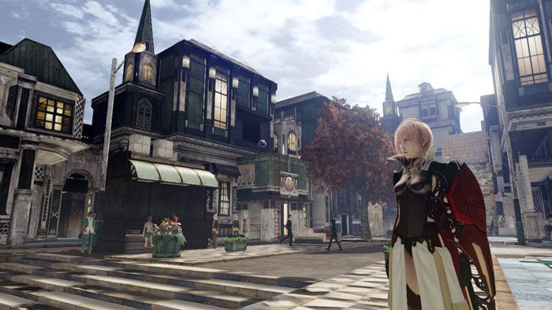
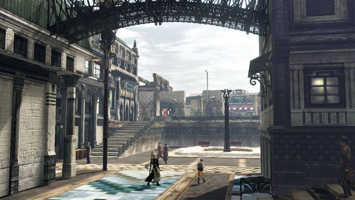
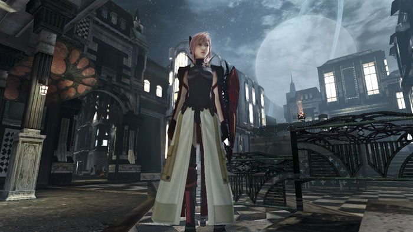
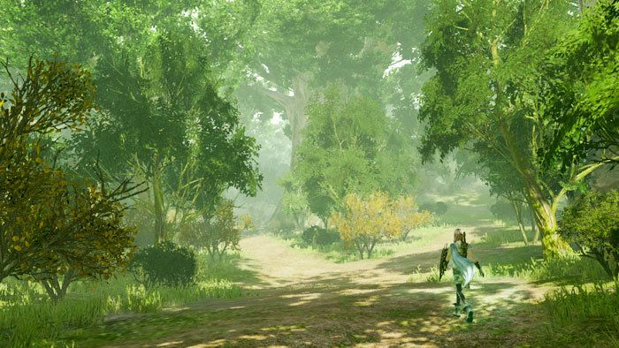
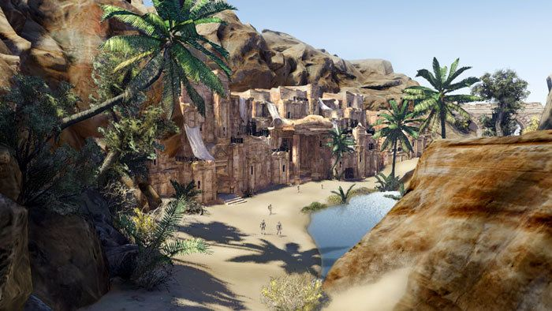
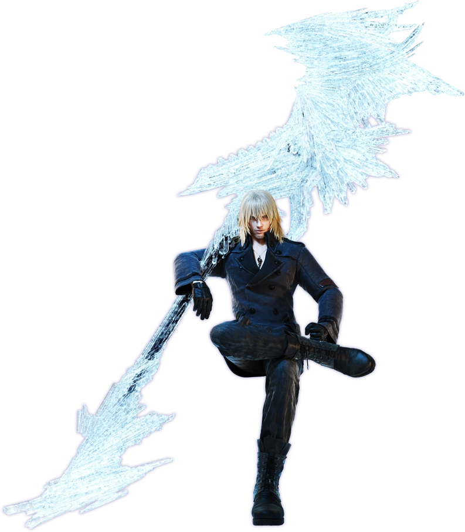
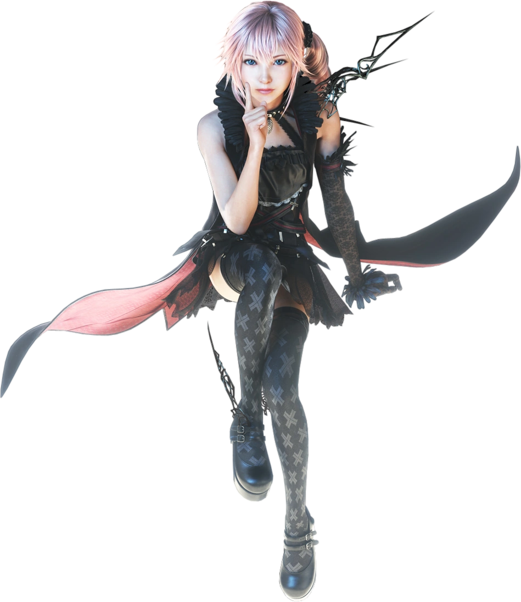

import { YouTube } from 'astro-embed'
import { Image } from 'astro:assets'

I'm shocked by how much I like Lightning Returns. Not only is it a fantastic
sendoff and a fitting tribute for the trilogy, it caters to my taste in games
nearly perfectly. It's got everything I want from a Final Fantasy game. Is this
sequel, to a spinoff, of one of the most hated games in the franchise, perhaps
the best one?

> I've put together a playlist of my favorite songs from the game. If you'd like
> to listen along while reading instead of waiting for the music section,
> [here it is!](https://music.youtube.com/playlist?list=PLKf-mXZAT29WelbxS_Tduks-xYOY9LhDu)
> This has more than just the songs I'll talk about below, and is realistically
> far longer than the amount of time it will take you to read this.

Fabula Nova Crystallis was meant to be a shared mythology with multiple very
different stories told within it. It was the "New Tale of the Crystal." Much
like how previous Final Fantasy games had shared elements like crystals and
elemental deities, and shared names like Cid, Bahamut, and Ifrit, Fabula Nova
Crystallis was going to have its own set of references. It would have those old
references, too, of course---that's what makes a Final Fantasy game a Final
Fantasy game. This new stuff was meant to lean into that self-referential nature
even harder.

Unfortunately, it didn't work out so well. Fans found terms like Fal'Cie and
l'Cie confusing. The games were not received well, and are commonly mocked to
this day. Projects were cancelled, and the most infamous release in the entire
series, Final Fantasy XV, pivoted away from the Fabula Nova Mythology before
release. This was not how Square Enix hoped things would play out.

This muddy history has led to some bits and pieces of misinformation floating
around online. See, Final Fantasy XIII was not originally meant to be a trilogy.
There _were_ originally going to be three Fabula Nova Crystallis games, but
those were Final Fantasy XIII, Final Fantasy Agito XIII, and Final Fantasy
Versus XIII. The latter two became Final Fantasy Type-0 and Final Fantasy XV
respectively. Though, the history of FFXV is even muddier---we'll get to that in
its review.

So, while three XIII games were originally planned, they were _not_ intended to
be a linear trilogy. They were going to share with each other about as much as
any other Final Fantasy game shares with each other: name, themes, and some
occasional aesthetic similarities. The original ending of Final Fantasy XIII was
very, very good and also extremely final. It didn't leave any loose threads from
which sequels could be woven, because it was **supposed** to be a single entry
just like all other Final Fantasy games. Still, even though FFXIII has a bad
reputation online, there was enough fan demand for more content that Square Enix
decided to develop a sequel. They then ended that sequel in a way that made it
clear another game was required to continue telling the story.

Thus, a trilogy was born. Not from hubris-driven pre-planning, as some portions
of the internet would have you believe, but from fan demand.

What's really weird **and wonderful** about this trilogy is that, in a sense, we
got it both ways: This _is_ a linear story told in three parts, but it's _also_
a set of three incredibly different stories that only loosely share the same
mythology. This is the original dream of Fabula Nova Crystallis, realized in a
way nobody saw coming.

Final Fantasy Agito XIII, now known as Final Fantasy Type-0, did release. In
fact, it came out before even Final Fantasy XIII-2. Versus XIII remains the only
original Fabula Nova Crystallis game to never release, as Final Fantasy XV
changed directors and became an entirely different product. At the time of the
release of Lightning Returns: Final Fantasy XIII, it was known that it would be
the final Fabula Nova Crystallis game.

So what else could they do but make it the ultimate tribute to that dream? This
game is an fantastic send-off for, and wonderful celebration of, the Fabula Nova
Crystallis mythology. It's also a love letter to Final Fantasy as a series, and
a literally perfect final arc for Lightning as a character. I really could not
be more happy with it.

The era of Final Fantasy known as Fabula Nova Crystallis is a graveyard of dead
dreams. Especially if we include XIV and XV in that era. There were so many
cancelled projects, releases that flopped, and poor management decisions. And
yet, it's my favorite era in the entire franchise. This game is _rich_ with
those feelings. This is not merely a tribute to that era, it's a funeral for a
dream. It's a celebration of life, a party at the end of the world, a yearning
for possibilities never realized, and wholehearted acceptance of one's own flaws
as a part of natural life.

It's incredibly cathartic. It's a masterpiece. It's my favorite Final Fantasy.

# The Review

I'm going to jump ahead a bit to say that I gave this game a 10. That's probably
already clear from me calling it a masterpiece and my favorite Final Fantasy,
but I think it's worth stating outright. What's interesting is how I came to
that score.

There's currently only one other Final Fantasy game which I have given a 10/10,
and I originally gave it a 9 before talking myself into a 10 while writing my
review. It was a hesitant 10. Though it stood significantly over every other
Final Fantasy game for me, it had enough rough edges that I had to take my time
weighing those negatives against the positives. That game was Final Fantasy X.
For Lightning Returns, I didn't experience the same thing. I immediately awarded
it a 10, and that 10 has only been strengthened as I have written this review.

That doesn't mean I think this is a perfect game. Nor do I even think it's an
objectively good one. This game just hit all the right notes for me, personally,
in a way few games ever have. I am very precious with my 10s. I don't give them
out very often. I _certainly_ don't give them out so immediately and so firmly
as I have in this case. This is the kind of incredibly rare rating I give only
to the very small set of my favorite games of all time---and indeed, it's
currently in my overall top 5.

While I recognize that this game took a few steps back in some areas compared to
other games of the time, and it has some objective flaws, that all happened to
land in areas that don't bother me much personally. Does this game look much
lower fidelity than other games of its generation? Absolutely, but some of my
other favorite games of all time look even worse. Fidelity doesn't matter to me
nearly as much as art style, as long as it plays smoothly, and this does! Is
there a boatload of fairly simple side quests? Yes, but as with FFXVI, I enjoyed
each and every one and they only enhanced my experience. In fact, this is the
first Final Fantasy game in the retrospective series that I nearly hit 100% on,
simply because I was enjoying the side content so much---but I suspect that
anyone who took issue with FFXVI's side content would have the same issues here.
The game does have a few issues that annoyed me personally, but I'll talk about
them in the relevant sections.

So, this game is a bundle of issues that I don't care about (but recognize) and
stuff that is exactly aligned with my tastes. There are some very specific game
mechanics, narrative tropes, and game design principles that people either love
or hate. Because of this, they tend to be somewhat rare, but gather cult
followings around whatever they appear in. It's even rarer for a game to include
multiple, but this game included so many of the rare ingredients that I love,
that it feels like _it was made for me._

## The Port

This was a weird one. It took several steps forward, but also a few back.

There are actual settings now! Though they don't appear in-game anywhere. The
in-game menus were left exactly as they were on consoles. Instead, the game
window itself has dropdowns along the top, where the file menu and so on usually
appear on other applications. This bar disappears in fullscreen mode, but you
can still access it by hovering your mouse over the top edge of the screen.
Thanks to these settings not being in in-game menus, you can switch them back
and forth while looking at live gameplay to see the differences, even in
cutscenes. This is mostly useful because the options are very vague. Every
option only has "basic" and "advanced" settings, but some of the "advanced"
options actually look worse, and there are three settings related to
"resolution" that don't do what they sound like they do.

This port also required by far the fewest mods in order to get everything
working. I only needed mods to unlock some old DLC content that exists in the
game files but was previously platform exclusive. Unfortunately, I get the
feeling that it _could actually use a few more mods,_ but nobody has made them
yet.

The game frequently went through periods of rough framerate stability, dropping
into the 20s and 30s. I couldn't find any pattern for what triggered this, but
it always lasted several minutes (potentially up to a half hour). It usually
happened soon after launching the game, so restarting the game was just queueing
it up to happen again, rather than actually solving anything. So I usually just
gave the game a few minutes to collect itself while I got up to grab a drink or
whatever.

The other weird issue was also a problem with Final Fantasy Type 0: the game was
scaled by my display scaling settings. I usually set mine to 150%, so that text
is the same size on all of my monitors, despite one being 4k. This meant that
the game was zoomed in 50%, directly into the center. Not an ideal experience.

Overall, passable. Better than other recent games in the series. At least this
one natively supported 4k60 and was relatively painless once I figured out the
settings I wanted.

## Gameplay

I'm going to have to break this part down into further sections. There's too
much to talk about, and I don't want this to be a nightmare wall of text with no
breaks that is impossible to navigate.

I wanted to start this section out by saying that gameplay is the main reason I
love this game so much. But as I started typing that out, I realized that it
isn't true at all. I love the music and narrative just as much. It's just that
the way this gameplay clicked with me so much felt like it had to be from a game
that was _only_ good because of the gameplay. It would be too good to be true if
a game I enjoyed playing this much was _also_ incredible in all the other ways I
care about, too.

Lightning Returns: Final Fantasy XIII is, at the same time, very similar to past
entries in the XIII trilogy, and incredibly different from them. It incorporates
tons of traditional Final Fantasy elements, but in an entirely unique way. It's
a very open and freeform game with tons of playstyle customization, but it also
maintains a very satisfying difficulty curve. Because of that, it feels like it
takes the best of the other FFXIII trilogy games (and to a lesser extent, the
entire series), without having any of their drawbacks. It manages that, while
_also_ feeling innovative in its own right, rather than purely iterative.

### Combat

This is an action game.

Previous FFXIII trilogy games were toying with the idea of action gameplay, but
weren't _quite_ there. They just had significant use of timing-based planning
and reflex-based damage avoidance. They were still closer to classic Active Time
Battle systems from earlier in the franchise than true action games, even if you
could instantly swap to a defensive paradigm to "block."

In this game, you freely move your character around. You time dodges and blocks.
You perform combos that are timing-dependant, and can be pivoted and branched
into other combos at any time. You've got limited space for healing items, but
refresh that stock at major rest points.

What I find very interesting about this action combat is that it is _actually
still an RPG at its core._ There are plenty of other Action/RPG hybrids out
there. It's an incredibly popular combination. Many of those games feel like an
action game with some RPG structure added on top. For example, special abilities
on cooldown, tweaks to damage numbers and/or resource usage, and so on. This is
the opposite, and that feels pretty rare.

I think the most foundational combat mechanic in this game is that you always
have three schemata (gear sets) equipped at once, and you can switch between
them rapidly in combat. I'll talk more about schemata in the Progression
section, but I need to talk about the combat switching for any of the rest of
the mechanics to make sense. This switch is so fast that you can do it between
attacks if you want to, multiple times per attack, even. It immediately happens
upon a single button press, which feels very responsive. Each schema has its own
ATB bar, which fills faster when it is not currently active. Though you play as
a single character, Lightning, this rapid switching system makes it feel like a
three-character party was condensed into a single character.

That last bit is important. A point of criticism I've heard leveled at another
modern Final Fantasy game, Final Fantasy XVI, is that it's not a game with a
party. Gameplay revolves around a single character, and maybe some side
characters exist at the same time but don't meaningfully contribute to the
gameplay. Final Fantasy has historically been a party-based series, so I think
this point is entirely legitimate. Lightning Returns has the same issue.
However, I think this story simply could not be told if there was a party
involved. It is such a lonely, personal, introspective story about Lightning,
that other party members would either feel tacked on without meaningful
development of their own, or spread the story too thin by distracting from the
central story about Lightning. This rapid-switching schema system is genius
because it allows Lightning to remain a single character while _feeling_ like a
full party during gameplay.

Each schema is equipped with four abilities. These could be spells, attacks, or
even defensive options like blocks or dodges. Those attacks and defensive
options have just as much variety as the spells. For example, there are blocks
that are less effective at reducing the damage you take, but continually heal
you as you hold down the button. There are also attacks that sit at different
points on the speed/damage balance spectrum, attacks that take advantage of
special circumstances like the enemy being knocked down, or even series classics
like Jump.

Those abilities consume different amounts of ATB. This is similar to the
previous games in the trilogy, but the ATB bar is far more granular this time
around. While previous entries had bars cap out at five or six segments,
Lightning Returns is a points-based system that starts at 100 max points for
each bar. Some attacks take only 5 points, while other expensive abilities take
50, and everywhere in between.

There is a very important timing element to using these abilities. Unlike the
previous games, you do not queue multiple abilities and wait for your character
to execute them. Instead, Lightning performs every action the moment you press
the button. If she is already in the middle of another animation, the button
press gets buffered like most action games. Though you want to avoid that
buffer, because if you hit the button for your next attack at the exact moment
that your current attack hits the enemy, that next attack gets a damage boost.
Spells are a little different: the timing for the next action is the exact
moment the spell leaves your hand. This rewards you for knowing your combo
timing. There's also a delicious sound effect and golden glow whenever you
perfectly time an action, and it feels amazing to land a string of them in a
row. There is a similar "perfect block/dodge" mechanic for defensive abilities,
which reduces the ATB cost in addition to improving your defense. That's right,
this is a parry game. In fact, it's a "combat as rhythm" game.

There's also a stagger meter in the game, similar to the other FFXIII games.
This one is better, though. The way stagger builds up on each enemy is unique.
For example, one enemy takes massively increased stagger from getting hit
directly after it finishes an attack of its own, incentivising you to dodge
around the attack rather than blocking so that your counterattack lines up with
the stagger window. Others only stagger from parries, and so on. The
element-based system from the previous games returns as well. Another thing that
makes this system more nuanced and interesting is that there are no
Commando/Ravager roles. You must piece together your own stagger setups through
build-crafting. This makes every single encounter feel like a unique combat
puzzle.

This is one of those games that almost _requires_ you have good
elemental/physical damage-type coverage at all times. It doesn't **tell** you
this directly (as far as I can remember), but it becomes apparent pretty
quickly. It only takes one slog of a fight with an enemy that has 90% damage
reduction to all damage types except the one you forgot to bring, to never make
that mistake again. However, thanks to other systems in the game, failing a
fight for this reason doesn't send you to a game over screen or back to your
last save or anything like that. It's all just part of the learning process. It
will work out.

Finally, you have a limited pool of a resource called "Energy Points." This is
generally earned by defeating enemies, but it can also come from consumables.
This resource can be spent on all sorts of special abilities both in and out of
combat. But this is the combat section, so I'll focus on that for now. In
combat, EP can be used to "Overclock" for a limited time. This gives you a brief
window during which the enemies are frozen in time (including stagger windows!)
and you have unlimited ATB on all of your schemata. You can also use _even more_
EP to end an Overclock window with Lightning's iconic Army of One Limit Break.
The uses for EP outside of combat are arguably just as strong, if not stronger,
but sometimes you need that extra push to get through a tough fight faster. I
enjoyed having to consider whether to use EP in combat or save it for some other
utility, instead of it being a generic "super meter."

My only complaint is that the controls for switching schemata are a little
awkward. You tap shoulder buttons to switch up and down the list, wrapping
around at the top and bottom. This is _fine,_ but sometimes I would forget the
relative layout of my setup, and pick the wrong direction. For example, if I set
up my schemata with a warrior, tank, and mage, and got used to hitting RB to go
from warrior to tank, I'd often hit RB on mage and end up on warrior instead.
Not ideal for a mechanic I want to hit very rapidly during tense situations. A
better solution would have been what Final Fantasy XIV has (which was already
out by the time this released): Holding a shoulder button activates that set of
buttons as long as you hold it, and then you return to a default set of buttons
when neither shoulder button is held. That way, I could hold RB to consistently
bring up my tank set, for example. It's not the end of the world, but I wish
they did something like that instead.

This all comes together to form a very engaging combat system. There are a lot
of mechanics to balance for the sake of long-term strategy and attrition, but at
any given moment, you are thinking about the next few moves and the timing of
your current actions. It reminds me of Monster Hunter or similar, but with
Monster Hunter's intense combo system that feels fighting-game inspired being
replaced by one that is firmly rooted in JRPG gameplay. Weaving between schemata
rapidly to extend combos, mix-and-match playstyles, and work flexibly around the
demands of the current encounter all felt great. It's a very rewarding combat
system to learn, and incredibly unique---I don't think I've played _anything_
else like it.

Boss fights were a particular highlight. They were all designed so that you
_really_ have to learn their unique mechanics and attack timings in order to
succeed. Having better stats helps, but in a way that allows you more room for
error rather than overpowering the challenge. Conversely, you can beat any fight
in the game with minimum stats if you are good enough at timing all the
skill-based parts of the combat. The speedrun for the game is only about 2 hours
because they just rush down every story boss immediately and overcome them with
pure skill. I really enjoy this kind of difficulty curve. It was always
satisfying, and if I wanted to, I could allow my stubbornness to win any fight
with enough repeats instead of retreating to return later.

### Game Structure

Usually this topic requires a couple paragraphs at most, but the structure of
this game was so fundamental to my enjoyment of it that I felt I needed a
dedicated section for it.

This is a calendar game---sort of, it's a time-tracking game. You don't have a
limited number of "actions" to perform every day, but rather limited **time**
for a full playthrough. The timer pauses during certain events, like combat,
cutscenes, and menus. So it's really "running around time." That's why my
playtime totals 37 hours despite there being a time limit of 12 hours. It's also
a little more complicated than that. I'll get into that later.

Every day is 24 hours of in game time, which is equivalent to 1 hour of real
time. Lightning needs no sleep. You start each day at 6am, and finish at 6am.
The game considers a new day to begin at dawn, not midnight. At that point, you
return to a home base of sorts where time doesn't pass. It's a spot to regroup,
refill on powerful consumables, check in on your progress, and access rewards
for the work you've completed.

Some areas, NPCs, quests, and mechanics are only available at certain times of
day. This can impact both main quests and side quests. You can skip time by
staying at an inn, but that's a terrible waste that I only ended up using at the
end of the game once. Time is the most limited, precious resource you have in
this game. It should always be spent on something worthwhile. That sounds
stressful, but I think what the game finds "worthwhile" to be beautiful. Again,
more on that later.

Another interesting element to those progression blockers is that they are all
unique. Falling back on "only available during these hours" is the most common,
but also the easiest to work around. Other blockers might include the need to
traverse the world and collect some specific resources, defeat powerful enemies
blocking the path, visit several scattered locations, complete very challenging
dungeons, or do enough side content in an area. All of these encourage you to
explore and complete side content (especially that last one, in a very direct
way). I appreciated that things never felt stale. I never had a moment where I
thought, "Oh no, here comes another time blocker again. Gee, what a surprise!"
The progression blockers always made enough sense in the world to not break
immersion, and enough variety to avoid getting stale.

I mentioned earlier that the time limit is complicated. I also mentioned that
there are important ways to use Energy Points out of combat. One of those ways
is Chronostasis. This ability pauses the clock for one in-game hour, giving you
a bit more time to get to a location before it gets locked off, before an NPC
heads to bed, or whatever. It can also be extremely important in long dungeon
runs, to extend the amount of time you have available without having to progress
through the same areas on the next day to catch up to where you were.

There is a bleak limit on this ability. Energy Points are earned from combat,
but there are a limited number of each enemy in the game. Once you kill them
all, that enemy type stops appearing in the game, anywhere. You've wiped them
out from the world. The last one of each is a special boss variant of that enemy
with special loot and increased difficulty. It's quite possible to completely
run out of enemies, and therefore your source of Energy Points. No matter what
you do, even if you literally fight as hard as possible, you can't stall the end
of the world forever.

An interesting element of that enemy limit is that the enemy types are unique to
each part of the map. If you spend a _lot_ of time in one area, fighting
everything you see while chipping away at the nearby quests, you're more likely
to wipe out all the enemies in that area. This makes the area safer and more
easy to navigate, but also prevents you from pausing time in that area. There's
only so much Lightning can do. Eventually she'll have to move on. The game
**never** lets you forget it.

So, what do you do while waiting on a task to become available? Other tasks, of
course! This is a non-linear game. There are five main quests, which can be
completed in any order. In all likelihood, you'll be completing at least a few
of those in parallel at any given time.

The game is cleverly structured to get you to weave between tasks like that, but
there's a problem: the main quests are spread out across the entire game map,
just about as far as they can get from each other, and it takes some of your
precious time to travel. It would be terribly inefficient to hop back and forth
like that, especially on a blind playthrough, since you wouldn't even be aware
of what time blockers exist for those other quests. Maybe you'd travel across
the world to make progress on another main quest, only to learn that this one is
currently blocked, too.

### Side Quests

It's far more efficient, and interesting, to complete side quests instead---and
these are quite good! As I mentioned earlier, I basically stumbled into nearly
hitting 100% on this game because I couldn't stop doing side content. There was
one side quest I missed during a main quest, and a couple that involved endgame
grinding that's intended for New Game Plus. Those endgame challenge quests were
the only side quests that didn't interest me.

In addition to normal side quests, there's a bounty board system that is unique
to each part of the world. These are pretty minor tasks to take care of if you
happen to be in the area. They are bite-sized side quests. No long stories, just
a few sentences at most, in pure text form instead of voiced. The rewards are
much weaker, but add up if you just chip away at bounties as you play. The
objectives are usually things that are easy to get done passively and
accidentally, such as collecting a specific resources or killing specific
enemies. There are a few larger bounties that are a bit more interesting that
serve as midpoints between bounties and side quests, which I appreciated for
adding more variety.

The reason it feels right for Lightning to go on all these side quests is that
she's here to save souls. She's tackling everyone's final regrets, their failed
dreams, and their deep anxieties. Rarely does Lightning save anyone from
violence in this game. The ultimate goal is to reunite an estranged father and
son; to help a teenage girl come to terms with feelings she doesn't understand;
to comfort a child who has lost a pet; to kill the beast who took the life of a
hunter's partner; to find forgiveness for a lifelong grudge; to help a man
accept that the mistakes of his past are part of the good man he is today; to
get a man to stop punishing himself for an accident that happened decades ago;
and more. These are matters of the heart, and each one touched mine.

That's why I think what the game presents as the most optimal use of your time
is so wonderful. Time is precious and limited, so spend it on community, helping
others, and making the world a better place. In turn, you'll be helped as well.
Violence is a waste of time, but we should fight to protect. This might sound
like the game is encouraging you to sacrifice yourself for others, but I've got
more to say on that later.

The other thing that made it feel so right to do all these side quests was the
time limit. I know that the pressure from a timer is an instant turn-off for a
lot of people, but this is the kind of situation that makes it shine for me
personally. In many other games, when the pacing of the story is really intense,
it feels strange to me to stop for side content. Why would my character, who has
days to live and people to save, spend multiple of those days on stuff like
stealing records for collectors? That's an example from Cyberpunk, which is one
of my favorite games---so it isn't a deal breaker, but I always feel some
dissonance from it.

On the other hand, when there _is_ a timer, _if_ I can fit side quests into the
schedule, then why not? I might as well get as much done as possible. Spending
time this way is an expression of what my character finds important, and I feel
more invested when spend a limited resource on a cause. The decision of what to
prioritize when given a limited budget is not only a very interesting thing to
think about, it's also a very cool way for game design to be used as a language
to speak to the player. Finally, it makes every side quest feel like more of an
accomplishment when it took such an expenditure of effort and resources to
complete on time.

Side quests are enticing for a few reasons beyond their story content. First,
they give you more time. Due to reasons I'll explain in the story section,
Lightning adds points to an invisible tally for every person she helps. At the
start of each day, that tally is checked, and you earn an additional day if it
has passed a threshold. I liked that system quite a lot. It was very effective
at making me want to complete every side quest I could. Not knowing whether or
not I had passed the threshold encouraged me to engage with the systems to
squeeze in as many side quests as possible, just in case I hadn't done enough
yet. Seeing that success always felt good, and encouraged me to redouble my
efforts for the next day. _I did it today, I can do it again! And now I have
even more breathing room!_

At the start of the game, you're told that even with this time extension
mechanic, the hard limit is 12 days. However, if you are so thorough that you
complete most of the side quests, you unlock a hidden 13th day. On this day, a
final dungeon opens up. In this dungeon is the "last" variant of every enemy in
the game. Killing them wipes that enemy type out, as if you had killed all of
them individually. If you've already killed the last of an enemy, its fight is
replaced with an empty floor. It's an odd feeling (in a good way).

On this special day, time no longer pauses in combat. This means you have a hard
limit of 1 hour to complete this entire dungeon. With extremely limited sources
of Energy Points, the choice between Overclock to finish a fight faster, or
Chronostasis to extend your time becomes very difficult. Normally, defeat in
Lightning Returns is a minor setback, as you either spend Energy Points for a
revive or lose 2 in-game hours to use an emergency escape. In here, both of
those options are huge hits to your most precious, limited resources. As the end
of the world approaches, and borrowed time is stretched as thin as it can
possibly go, the threat of death suddenly becomes extremely heavy, even for the
immortal Savior.

The final floor of the dungeon is a superboss. It's essentially impossible, as
far as I can tell, and you only get one shot at it. I'm sure it's doable on New
Game Plus, but I think it is more interesting as an impassable wall on a blind
playthrough.

I find it interesting that if you show the determination to do everything you
can and push the end back as far as it can go, the final moments of that push
are filled exclusively with a glut of violence. You are no longer saving anyone.
All you are accomplishing is _not going quietly._ The only thing left to do is
to fight as hard as you can. I said earlier that no matter how hard you fight,
you can't delay the end. The game reinforces this through its mechanics. The
reward for pushing this hard is only that you can push **harder** until the
entire universe is spent, or you hit a challenge so hard you can't push past it.
There is a limit to raw willpower.

On the opposite side of things, there's empowerment in the quests the game
offers to you over time. At the start, you are on God's Quest to Go Forth and
Save. You're investigating murders, heading into the woods to find missing
people, and saving people from monsters. All important stuff, to be sure, but
it's all quite on the nose. This is Lightning following God's orders literally,
which works, but it could be so much deeper than that. Then, you start saving
people by reconnecting families, putting the thieves on the path to redemption,
and helping ghosts find closure. Eventually, you're helping someone create a
sentimental dish, humoring a child who challenged you to a race, and going on a
date with a man who is sad he got stood up.

The quests get more and more emotionally-driven. Some of them are even
follow-ups on previous, less-emotional quests. They continue to feel more like
Lightning's own choices, interests, and whims. See, God doesn't actually
understand humanity. He's a cold and uncaring machine, only interested in saving
them because of the utility they provide him. So of course the kinds of things
he would ask Lightning to do would be more literal and direct. It's through her
own growth as a character, and her own reunion with her humanity, that she
begins undertaking such quests.

In fact, your God-given ally nags you about these quests when you go on them. He
doesn't understand the value in what you are doing, and sees that time as
wasted, when time is very precious. But every time, it turns out to provide
exactly the same power to Lightning as anything else. This game equates putting
someone's emotions at ease, helping others fulfill their passions, and literally
saving lives---all at the same level! They are all ways to save someone.

It is my head canon that this is how Lightning gets that extra day. God told
her, early on, that she had a hard time limit even if she saved every soul. I
assume that he knew how many souls could be saved by _his_ methods, and only
factored _those_ into his estimates. He underestimated Lightning, and it was by
these emotion-driven methods of saving people that she surpassed his
expectations. It was through these efforts that Lightning became more powerful
than God was prepared for. It was through the power of reaching out to others
and caring for their individual needs that Lightning truly saved the world.

### Progression

The second way side quests are enticing is through their rewards. They sometimes
grant unique equipment or consumables, but always raw stats. There is no level
system in Lightning Returns. Instead, every quest you complete, main or side,
gives you a proportional amount of stat boosts. This means that no matter how
you spend your time, Lightning will always improve at the same rate, as long as
you are efficient. There's no reward for violence. You can't grind random
encounters for levels. Lightning improves if and only if she helps people. She's
the savior, after all.

I'm a big fan of character progression mechanics such as this. There is a
permanent boost to a character thanks to the actions I've taken, as them, in the
world they inhabit. It's not gear. It's not a generic level or class/job boost.
The character is _directly_ getting better due to their experiences. A classic
example of this is The Elder Scrolls V: Skyrim. In that game, you get better at
individual skills specifically by using those skills. You can be tutored, but
that's significantly limited compared to just getting out there and getting
experience. That mechanic is one of the reasons I went back to Skyrim for
hundreds of hours over many years, even though I didn't much enjoy the actual
narrative or combat elements (Kingdom Come Deliverance has now taken that spot,
with similar but significantly improved mechanics).

This game is even better than that. Instead of generic skills that are _mostly_
combat related, the character gets directly stronger in the most fundamental way
an RPG allows: modifications of base statistics. The statistics changed can be
dependant on the quest granting the reward. It might make more sense for a
particular quest to reward bonus magic power, rather than strength, for example.
The real genius here is in Lighting Return's refusal to grant character
progression from violence of any kind. The actions you take in the world that
make you stronger _must_ be to save people. It's an immersive and meaningful
design.

Of course, there is an equipment system, as well. The most basic pieces of
equipment are weapons and shields. Every weapon has unique attack stats, and
every shield has unique defense stats. Sometimes they cross over a bit, so that
a shield could grant you some additional magic power, for example. Many weapons
and shields have unique abilities that transform the actions you equip, or cause
temporary buffs when certain circumstances arrive. For example, a dragoon's
lance might turn a bruiser type ability into the iconic Jump ability.

Over the course of the game, you unlock stronger versions of the pieces of
equipment you already have, as well as sidegrades that are equally as strong
but fit into your builds in different ways. Most of these come from shops, but
they can also be rewarded from quests and boss fights. No piece of equipment is
random. It will always drop from the source it comes from, and will always have
the same stats in every playthrough. Boss weapons tend to be the strongest and
coolest, which I appreciate.

The most important part of gear progression is playing dress up.

I found it difficult to find an accurate count of the total garbs in the game,
but it seems to be just shy of 100. Many of the garbs are references to other
Final Fantasy games (and a few other franchises that had crossover promotions).
Each has multiple dye channels for customization, which is an entirely free
thing you can do at any time. No consumable dye items. Weapons and shields are
not dyable, so I often used matching sets of weapons and shields, and then
changed the garb colors to match.

Garbs have unique victory poses and animation sets for certain activities, and
the crossover garbs are even better. When you complete a fight using a crossover
garb from another Final Fantasy game, the victory pose will be from that game
and that game's victory music will play in place of this game's victory music.
It's a nice touch, and shows that the developers wanted to show appreciation for
the other games in the series. I didn't always intentionally end combat as one
of those garbs, so whenever I accidentally did, it was a nice bit of variety and
a pleasant surprise. It's cute, and I love that they did it.

I often found myself altering my builds to prioritize fashion. Sometimes it was
because I wanted to build around one of the garbs that referenced another game,
such as Cloud's outfit. Other times it was because I found a weapon that would
synergize with an outfit, but the styles clashed too much. So I would opt for a
less powerful, aesthetically pleasing option. Other times I would design around
a theme, such as paladin-style gear for my hybrid healer/tank build.

Garbs are by far the most core, defining part of how you build Lightning. I
mentioned earlier that you equip Lightning with 3 schemata that you can switch
between rapidly. Each schema is composed of a garb, weapon, shield, and
accessory. Each garb has a unique set of stats, passive ability, and usually a
few locked active abilities. For example, a garb with high HP that appears
heavily armored might come with Heavy Guard locked on it. Garbs are as close as
this game gets to a jobs (or roles, in the other FFXIII games), but rather than
upgrading each garb, you simply unlock more options.

The only random part of progression is the slottable ability system. These
generally come from random loot drops, and sometimes have random bonus stats
rolled on them. The bonuses are minor, so I mostly ignored them. You can combine
similar abilities together to strengthen them, and level them up through
resource expenditure. Building synergy between equipped abilities, and learning
how to do that over the course of the game, was quite enjoyable.

I enjoyed tinkering with this system. I think it's the best build-crafting has
been since Final Fantasy V. There are an insane amount of possibilities to play
with, but it's relatively simple and elegant to work with, and the vertical
progression is well-bounded and finite. So the difficulty curve was always
perfect. The progression system felt like a pure representation of my own
playstyle and roleplaying expression as Lightning, thanks to the fashion
elements and the way my actions in the world molded her stats.

### World Design

Lightning Returns is split into four main regions: The City of Yusnaan, The City
of Luxerion, The Wildlands, and The Dead Dunes. The two cities are designed as a
network of alleyways and bridges that connect clusters of districts and
landmarks. The wild areas are far more open.

Each region is composed of multiple unique sub-regions. For example, the
wide-open wilderness regions each contain multiple small settlements and biomes.
Even within a single region, these settlements can be as different as a death
cult living inside ancient ruins, and a pastoral village nestled in a vibrant
green valley. The same map contains a community of scientists scavenging from a
centuries-old airship crash site, and a luminescent moogle village hidden deep
in a forest behind passageways concealed by magic vines. The same city contains
an abandoned industrial area full of autonomous construction equipment gone
rogue, and a grand stage surrounded by eternal fireworks celebrating the best
performance of all time, at the end of time.

Each region---and more specifically, each sub-region---has a unique culture
which informs the kind of quests you'll go on within it. The hunting village is
has a quest that sends you on a grand hunt to get revenge on a killer beast, for
example. More interestingly, some of these quests play _against_ the local
culture in a way that evokes additional meaning. That same hunting village sends
you on a foraging quest that spirals into a story of guilt and forgiveness of
long-held grudges. Both quests are about deep pain from long ago, and about
finally finding closure---but both go about finding that closure in very
different ways. It's not a coincidence that these two quests start right next to
each other.

Similar examples are all over the place. The city of endless revelry, Yusnaan,
has quests that are celebrations of art and personal expression, but also
stories of imposter syndrome, and dread compartmentalized and masked by
festivity. The quests in the city of Luxerion are obsessed with death. You help
a child grieve for a pet. You speak with ghosts, and return sentimental mementos
to their families so they can finally peace. You see magic go awry when someone
attempts to reverse death; a warning of its finality. You help someone ensure
that every clock in the city is working properly, because they are obsessed with
knowing exactly how much time they have left, and are projecting that fear onto
every other resident of the city. But there are also quests here about avoiding
the death of emotion, the death of your past self and transforming into
something better, and how love lasts beyond death.

This makes each region feel thematically distinct from the rest, but they still
fit into the greater themes of the story. Luxerion is obsessed with the
future---mostly fear of it. There are clocks everywhere, so that nobody is ever
more than a few steps away from being able to see exactly how much time they
have left. Yusnaan revels in the present, ignoring everything else in a way that
feels like avoidance and escapism. The Wildlands are about the past---the
avoidance of it, exploration of it, and the inability to let it go. The Dead
Dunes are a place of extremes in either direction: The distant future after
everything has died, and the remnants of the distant past that led to similar
destruction long ago. The Dead Dunes are also a place where we get a peek behind
the curtain. We get to see the records of divinity, examine the miracle machines
that set up this world, and witness the final plans of the gods. Each of these
places are wildly different, but they are all about time and responsibility in
some way.

What's even more interesting is how the themes of these regions interact with
and respond to each other. The two cities each represent very different anxiety
responses. The Wildlands humanizes the past while the Dead Dunes deify it.
Luxerion is a city obsessed with death, while the Wildlands are lush with life.
Yusnaan is a city of dreams yet to be pursued, while the Dead Dunes are a
graveyard of dead dreams. These locations are connected physically just like
they are thematically. It's excellent storytelling through world design.

I'll talk more about specific side quests later, but I thought the way these
quests were organized in the world fit better in this section. It's extremely
well done, and subtle enough that I didn't realize it until I was nearly done
with each region.

Out in the open maps, wildlife can be spotted running around the world again,
and it's wonderful. Gone are the weird, hybrid random encounters of FFXIII-2
that would just spawn enemies directly on your head with some bullshit time
magic excuse. The open areas constantly feel like the the Gran Pulse maps of the
original FFXIII. You aren't constrained to corridors in such a way that
encounters are unavoidable, like in FFXIII. Instead, violence is something to be
avoided, if you can help it, and you're given tons of freedom to do so. The
enemies roaming the world also interact with it, rather than simply exist in it.
They can get in fights, attack NPCs, and move through the world in
natural-feeling ways. Those NPC attacks gave me another reason to dive in and
feel like a badass hero. There's no benefit or consequence for saving NPCs or
not. It's entirely up to your conscience and how immersed you are in the world.
I love the way they handled that. It feels, perhaps paradoxically, much more
meaningful to choose to step in, put myself in danger, and "save someone" when
there truly are no game systems telling me to do so. That choice is _all on me_
and nothing else.

The maps you run around in are not static, nor are they completely open to you
from the start. Some places change based on the time of day. Others change based
on what objectives you've completed in the area. There are also locations that
contain static obstacles, but your ability to traverse those obstacles changes
over the course of the game, metroidvania-style. These features create shortcuts
that make a massive difference in your travel speed (something very important
due to the time limit), grant powerful loot, or even open up whole new areas to
explore. There's a lot of variety in the map design, which I appreciated
greatly. It kept exploration fun and interesting.

Crucially, those features never felt too artificial. There were obvious clues
built into the map design, but it still felt like natural discovery. For
example, in the Wildlands, there are gaps too wide for Lightning to jump over.
Through progression, you unlock a Chocobo mount that can jump very high and
glide for a short distance. It's also much faster than you. This makes the
entire map open up massively, and recontextualizes so many portions of the map
you've already seen. Of course, the clue was present and obvious: the fact that
I couldn't make the jump meant I'd eventually unlock the ability to do so. But
again, it felt natural.

That sense of the world continually opening up and becoming more connected hit
an extreme high point near the end of the game. For most of the game, the main
way to travel between regions is to take the train. There's at least one station
on each map, and not all stations can go to all other stations. So you may have
to plan a route that involves a few stops and wandering across a few maps. Since
each station connects only to specific other stations, the game gave a sense of
those stations being closer together on the world map (which checks out).
However, this is restrictive and you have to plan around it. If you wanted to
travel between Yusnaan and the Dead Dunes (an example that comes up more than
once in quests), you'd have to travel to Luxerion, cross the city, and then take
the train to the Dead Dunes. This would take several hours of in-game time as
well as several loading screens, and you'd always end up on the south end of the
massive Dead Dunes map. If you needed to be on the north side, you'd have even
more walking ahead of you. Later on, you unlock the ability to open highways
between each map, and everything changes.

These highways stretch between each map from completely different angles than
the train stations. You could travel from Yusnaan to the Dead Dunes by making a
much, much smaller stop in the Wildlands, and end up on the north side of the
destination! Walking these roads takes a comparable amount of time to taking the
train, but it's a massive upgrade in flexibility and can shorten travel times by
providing more straightforward routes. There are also powerful enemies and loot
to discover here. _Wait, back up. Walk? Enemies?_ That's right, and that's the
best part. These highways are not loading screens. You literally walk down the
entire highway yourself, and you can see the landmarks of other maps around you
while you travel. When I first started walking down one of these highways and it
clicked that this was the case, it blew my mind. I kept waiting for a loading
screen, putting one foot in front of the other, until I saw my destination on
the horizon. The entire world **suddenly** felt _so much more_ connected. It
redefined how the world felt to me, and brought everything significantly closer
together. I honestly had a bit of an emotional moment over it.

### Anxiety and Empowerment

These systems all come together to form a powerful message. Allow me to paint
you a picture of my experience.

The game starts at maximum pressure. You have limited time. Everything is on
your shoulders. The world is ending, and no matter how hard you fight, you can
only push it back so far. Every second you spend takes you one step closer to
the end. Every tiny time loss feels like a major blow. Got a little turned
around on the map and ran into the wrong corner or a dead end? That's gonna cost
ya. Forgot a quest objective and have to run back across the map? The day is
ruined. If you just fight a little harder, you can make up for these mistakes.
But oh no, you lost track of time in the fray and missed a timed quest
objective. Now you'll have to wait until tomorrow, but how do you spend the rest
today? Is it just, wasted?

The game is a constant ball of anxiety at first, intentionally. It immediately
throws you into a situation that makes you feel like you're in over your head,
with multiple quests starting up all at once and an overwhelming number of
options.

Then you get to the end of the day. Maybe a bit sore over not completing
everything you had hoped to. Maybe you stopped early, paralyzed by the the
rapidly dwindling timer, because what could you really accomplish in 10 minutes
anyways? This was a bad day, no point in trying to save it at this point. Too
many mistakes. You did a bad job. You're going to pay for that later.

All those thoughts swirl in your head while you wait for the end-of-day results
screen... and, it's good? Wordlessly, with warmth and understanding, the game
hands you another day. _The end is not as close as you think,_ it silently
indicates, _you have time._ Okay, whatever, the first day is the tutorial, you
guess. They just handed that to you. This time, it's real. This time, you need
to get need to get your act together.

This world is weird, and you have a lot to learn. Try as you might, you don't
get anything major done on the first several nights. You ran down a hallway that
looked like a good route on the map, but it had a massive shadow dragon in it.
NPCs warned you about it as you approached, but you figured that was just flavor
to hype you up for a fight, not a serious warning. You died, twice, losing all
your Energy Points and several hours of in-game time. No progress was made.

Night after night, the game softly repeats without judgement, _Tomorrow is a new
day, you've got this._ The game gets a bit easier. You learn. You start
understanding the rules of the world. You start mastering the ability to plan
your day. You find optimization tricks. You learn routes. It starts to feel like
you've got your feet under you.

Over time, you feel less pressured. You find traction---finally in control. You
start using inns more, which had seemed like such an indulgent waste of time at
the start of the game. You have time to rest. You had that time all along, but
now you can see it. You can stop and smell the roses. You can admire the views.
You can go on dates for the hell of it. You can chase the things that interest
you personally, without feeling guilty for the work you aren't getting done. You
didn't have to constantly be on the move. You're finally confident that you have
enough time.

This is how the game pulls off a fantastic trick: It was never easy, but it was
also never hard. It was realistic. The first day was not a tutorial. The game
was not being light on you by giving you those extra days. You earned them,
yourself. Well, sort of. It's definitely true, but I think there's a deeper,
paradoxical message. Your success is entirely the result of your own effort, and
it's also entirely the result of the help you've received.

As you help people in this game---the primary activity the game passively but
firmly encourages you to do---they help you in return. The world gets easier to
navigate, not just because you've learned about it, but because it's becoming a
better place. It's becoming safer, filled with fewer dangers. Obstacles that
used to block you have flipped entirely to become shortcuts. You've become
stronger thanks to the impact your community has had on your life. You've made
their lives better, they've made your life better, and you've grown as a person
from the experience. Those people are as much to blame for your success as you
are, and they have been saved by you. Everything is connected.

That's why I got so emotional when I opened up the highways. It was the final,
most direct representation of the world becoming easier to navigate. It was the
largest and most visible impact I had made on the world. It shifted my entire
view of the world, all at once, to show me just how connected it had
become---how close everyone already was, without me noticing it. I had gone on a
journey in this land, and now I could finally, literally see the long road
behind me and how far I had come.

This is the kind of artistic expression I don't think you can get in any other
medium. This is why I love games. This shit was therapy to me.

## Visuals

Unfortunately, this is probably the weakest aspect of this game, at least at
first glance. It's clear that this game had a smaller budget than the others.
Perhaps more impactful: this game contains a vast open world that can be
approached from many angles rather than the curated linear designs of other XIII
trilogy games. There are significantly more NPCs, which can appear in quite
varied group sizes. It all combines to leave most models with fewer polygons,
lower resolution textures, and blockier, more empty hallways. I think the art
style really saves it though, and that matters much more to me than pixel count
and shader quality.

Similarly to FFXIII-2, The pre-rendered cutscenes look absolutely incredible,
but there are depressingly few of them. In fact, I'm relatively certain there
are only about 2-5, depending on how strict you are about cuts between scenes.
Gone are the days of FFXIII in which nearly every single 15 second story moment
was rendered in extreme detail. Still, what we got here is extremely impressive.
I think these might be my favorite pre-rendered scenes in the trilogy. Check out
the opening scene:

<YouTube posterQuality="max" id="x7Qy_jTK74M" title="Lightning Returns: Final Fantasy XIII - Opening Cutscene" />

Youtube compression really killed that video, but I promise it looked much
smoother in game. Still, it should give you a good idea of the insane detail. I
love the direction of this cutscene. It drops us into the world with no
information and some vague ideas, then jumps right into an action scene
containing some of the most important characters in the game. Being dumped into
the world without context was something that the original FFXIII was criticized
for, but was something I quite enjoyed. The combat choreography is extremely
well done and just as flashy as I like it. The visual spectacle of the location
it's set in is insane. The parallels to moments in previous games tell you right
away exactly what this game will be: a love letter to the series.

Interestingly, there are a few details in that scene that don't line up
perfectly with the game. I think the process for rendering this FMV was started
before the rest of the game's design was locked in, and they didn't have the
budget to go back and fix it. Mainly, Lightning seems to force some souls out of
people, early on. She never does that in game, as the game is extremely clear
that the only way Lightning can save someone's soul is by helping them with
their problems, not through force or violence. It's not terrible---at least it
introduces the idea of Lightning gathering souls, as that's a crucial part of
the game and is important to include as early as possible, even if the details
are wrong. It also adds a lot of intrigue and doubt to Lightning's character
right out of the gate. Upon seeing this for the first time, I wondered if
Lightning was perhaps on the wrong side in this one. I wondered what could have
driven her to that. That doubt is an important theme of the game, so it works
well. Even with its flaws, I love this scene.

The switch from the incredible CGI scenes back to the mediocre PS3 gameplay
rendering is more than a bit jarring. Fortunately, since those scenes are rare,
that feeling doesn't happen often. Instead the crunchiness of the low budget
graphics starts to fade as you get used to it. This works out much better than
FFXIII-2, which swapped back and forth more frequently, despite looking overall
higher fidelity during gameplay segments. The way this game looks really grew on
me. It's not a bad looking game. It just looks like a more _average_ PS3 game
instead of an _outstanding_ example like the original FFXIII.

I'll be using a few promotional images from the Playstation store as reference,
though they are a little bit crunchy and low resolution.

While many models, especially distant ones like the tops of buildings, are
incredibly simple in structure, Lightning's model always looks great. That's
important, as she's always closest to the camera. Also, the game's focus on
fashion and customization would fall flat if the models involved didn't look
sharp.

This first shot also showcases how muddy the ground textures can be at lower
angles like this, especially in urban areas. The ground models in such areas are
extremely blocky, and there's not enough variation or clutter to help break up
the patterns. Anisotropic filtering is also poorly implemented, failing to help
with the problem.

Another thing that's pretty obvious in this first shot is that the buildings
only exist one-deep. As in, there are no other buildings behind the buildings we
can see. Most camera angles you'll naturally encounter will hide this pretty
well and maintain the illusion that this is a dense city, but occasionally, the
negative space peeks through.

At a wider angle, things look pretty good. Some areas, like this one, clearly
received more love than others. It's not a console-generation-defining look or
anything like that, but it's easily passable and pleasant to look at. I think
this is where the art style really carries it. There are areas far, far worse
than anything I'll show here, because those worse areas would not make it into
promotional material.

There's plenty of light in a world that never sleeps. The world never gets too
dark at night, but there are still some nice bits of contrast. Since time is an
important factor in this game, every map had to be made with multiple times of
day in mind. Not just day and night, but intermediate steps in between them. I'm
sure this added a lot to the development time back then, and further stretched
the limited budget. But I think they did a great job with what they had.

The game contains more than just cities. The wildlands is a place where nature
has successfully reclaimed the land, and the people live wild and free. This
organic look works much better for the game, in my opinion. The foliage looks
extremely solid for the time, and the colors are gorgeous. There are a few spots
where you can kinda see the polygons that make up the ground, but it's much
harder to notice while actually running around. That goes for most of this
game's other graphical blemishes as well, to be honest.

The most empty area is the Dead Dunes. It's by far the area with the least
attention given to it. While it does house not just one, but two banger
underground dungeons, the surface is mostly sand. It's not a huge deal, since
you don't end up spending much time there, but it's noticeable. Humorously, the
game draws attention to this. Upon arrival in this place, the train announcer
questions why anyone would ever stop in a dump like this. The first NPCs you
talk to call it a hell-hole and lament ever coming here. But with enough
persistence, you can find interesting stuff buried under the surface.

I found the world and character designs in this game much more appealing than
those of FFXIII-2, despite that game having a higher budget and significantly
better overall fidelity. There's not a single set piece here that I didn't like,
and there's only one character design I didn't like. For some reason, Hope has
returned to his child design from the first game, becoming de-aged by 20 years.
I don't really understand why they did it, because Hope's adult design was a
massive improvement.

Lightning in particular has tons of possible outfits, so she wins the glow-up
award because there's _bound_ to be at least one outfit you love, but some other
characters look great too.

This is Snow's best look yet. In this game, he's the Lord of the Night. He runs
the city of endless revelry, Yusnaan. Though he's constantly putting on a show
and maintaining a perfect, professional, luxurious atmosphere, he's hiding a
deep pain, depression, and guilt. He's the man who has everything, but also
nothing. He's in this position not because he wants it, but because it needs
him. This character design fits that concept well. He looks like a wild man
forced into a suit that barely contains him, while also covering nearly every
inch of his skin to indicate that he's hiding something.

Lumina is a wonderful antagonist, and her character design _rips._ She resembles
Serah Farron, Lightning's sister---but perhaps younger? Regardless of
resemblance, she acts entirely different than Serah, and there are both major
and minor hint of this in her character design. Most obviously, her outfit is
far more dark, goth, and chaotic than anything Serah has ever shown up in.
There's far more asymmetry to her design, and her hair isn't quite right. It's
spikier and sticks out to the sides more. There are details I can't talk about
without getting into spoilers. There's a dark magician vibe to the design. She
feels like an agent of chaos itself. Extremely well done and fitting for the
character.

Unfortunately, basic enemy designs are often repetitive and bland. It's not a
major problem since I'm usually way more focused on the fluid action and the
particular mechanics of each encounter's combat puzzle than the visual designs
of my foes. Still, it sticks out. Most enemies are copied directly from previous
entries with only small palette swaps. The "last" variant of each enemy is
especially lazy: just a hot pink coat of paint, FFIX Trance style. Thankfully,
there are some great new designs, too. I'm a big fan of the Arcangeli.

<figure>
  
  <figcaption>
    I couldn't find a higher res picture of an Arcangeli. So he's just a little guy
  </figcaption>
</figure>

My other main complaint is that several character designs from the original game
either didn't change at all in the best case, or had silly things added to them
in the worst case. This was especially bad on character designs that were
already a bit too busy and mismatched, like Vanille.

<figure>
  <Image
    src={import("../../img/LRFFXIII_Vanille.jpg")}
    alt="An image of Vanille from Lightning Returns: Final Fantasy XIII"
    style="max-width: 50%"
  />
  <figcaption>
    Yeah, this headdress really doesn't do it for me.
  </figcaption>
</figure>

Sazh in particular got done dirty this time. They paid nearly zero attention to
him. He's had basically nothing interesting happen with his character design or
narrative arc for the last two games. It's all just repeats. My poor boy. He was
easily one of my favorites in the first game, and had some of the most powerful,
emotional scenes. Now he's been reduced to a punching bag.

Overall I think these visuals hold up pretty well even today, as long as you're
willing to be a bit understanding when the budget becomes obvious. Not every
single angle of every single model in the entire world will be perfect, but I
don't need that to have a good time. As long as the art speaks to me and conveys
emotion, that's all I need, and this game more than succeeds at that. I said
that this is the weakest part of the game, but really that's only because the
rest is so strong.

## Audio

This is a great sounding game, for the most part. I'll dive into my favorite
parts below, but first I've gotta get some complaints off my chest.

While this game has a much better and more balanced soundscape than FFXIII-2, it
still struggles in a few similar ways. It's clear that this engine wasn't suited
for the kinds of open-world soundscapes the team was going for in both games, or
perhaps that the team wasn't yet very good at making that work. At least this
game maintains a consistent volume balance, unlike FFXIII-2.

There are a number of annoying and repetitive sound effects that you'll hear
over and over again as you move through the world. Sometimes its chatter from
nearby NPCs or just noises they make as they go about their lives. But all NPCs
are on a loop. So the sound effects just keep happening. It's a much less common
issue than FFXIII-2, thankfully.

Much more annoyingly, there are sources of random music in the world. That's not
a bad thing on its own. In fact, some of them are pleasant and make the music of
the world diegetic in a way that both serves as a fun easter egg and has
interesting lore implications. The problem is that the game never fades out its
normal background music while this is happening. You'll hear multiple songs
playing at once, clashing horribly. Worse, only some of those in-world music
sources actually sound good. There are some truly awful trumpet players
scattered around that sound like MIDI files slapped together in 5 minutes. Ah,
budget constraints.

One of those awful trumpet songs gets used in what would otherwise be a touching
quest. It was hard to take it seriously. Sure, the player in-world was a kid,
but he was dancing around and trying to jazz up the song so much that it was
barely recognizable, while Lightning and all the nearby NPCs were shedding tears
over it and talking about how somber and beautiful it was and how it reminded
them of the distant past. It just didn't fit the vibe.

Realistically, that probably only affected 5% of my time with the game. It just
stood out in contrast with how much better the rest of the game sounded. So much
so that I felt I had to point it out. Now that the complaints are out of the
way, I can talk about the good stuff.

### Voice Acting

The voice acting is easily on par with the original game. Both are done
extremely well. Even characters I previously hated in FFXIII-2 sounded great in
this one. I assume the voice direction improved a lot between games, or they
brought back the voice director from the first game. Either way, I approve.

The main cast is all fantastic. Every single member of the original party,
FFXIII-2's main cast, and all the new main characters in this game did a
wonderful job. It's not "Game Awards Best Performance" level or anything like
that, but everyone did well. There are some emotional performances that really
got me good.

This game has been criticized for a few characters having very flat line
delivery, but it's all intentional. It's part of those characters' arcs. Give
them time. I have to assume that those who made this claim either only played
for a few hours, or took note of the voice acting in those early hours without
changing their opinion as the game progressed. Either way, it's a shame. I don't
think this game works nearly as well without the voice acting being this good.
So anyone who came out of this experience with a negative opinion of the voice
acting must have had a much worse time than I did.

Most impressively, this is the Final Fantasy game with the most side content out
of any so far (excluding MMOs), and **all** of it is voiced. These performances
are not up to the same quality as the main cast, but still, I appreciated the
effort that went into that. Even Final Fantasy XIV, which makes enough money to
essentially carry all of Square Enix, doesn't voice all of its _main quests,_ to
say nothing of side content. There are, once again, some solid, emotional
performances in there. There are also occasions where the voice acting just
"does the job" and didn't impact my emotions much, but I'll take what I can get.

### Music

Now **this** is the good stuff. This is my favorite soundtrack in the series.

The music for this game was composed by Masashi Hamauzu, Mitsuto Suzuki, and
Naoshi Mizuta---the same powerhouse team from the last game! A lot of people
praise FFXIII-2 for having the best music in the series, but I think Lightning
Returns is even better. The main difference is that the style is overall more
consistent, while FFXIII-2 was allowed to deviate a lot thanks to the more
ridiculous nature of the story. That can be a positive or a negative depending
on your taste, but I definitely prefer consistency in this case.

There are far, far too many tracks I want to talk about. I've had to trim this
section back quite a lot. Not only do I think this has the best original
soundtrack in the series, it also has the benefit of pulling the best songs from
the rest of the trilogy into it. I'm not going to talk about those here, as I
already did in the reviews for their respective games. I just had to mention it,
because in reality this soundtrack is _even better_ than just the collection of
original tracks I give a sample of here.

I have so many songs to talk about that I'm going to need to split this section
up by composer.

#### Mitsuto Suzuki

<YouTube posterQuality="max" id="z6dBViSCy6o" title="Lightning Returns" />

As the name suggests, this is the main theme. It's what plays immediately upon
loading up the game, and often during battle when things are tense. It's an
extremely good song, and very good at representing how the game feels to play.
It's hectic and fast paced, never slowing down for a moment and only adding
additional layers. It continues to change parts of its style without changing
the core, which feels to me like a representation of both the variety of
distinct-feeling gameplay areas you'll visit as well as the style-change battle
system.

<YouTube posterQuality="max" id="lDL-qCA0noY" title="The Dead Dunes" />

Speaking of area themes, the Dead Dunes theme gets stuck in my head all the
time. It starts off slow and wide, but it builds detail as it goes, and lets it
all fall away before coming back harder than ever. The song rises and falls like
the dunes that it is named after. The particular part that I can't get out of my
head comes in about halfway through the song, and makes up the central theme
that is used in all other Dead Dunes-related tracks in one way or another. I am
not music-literate enough to know what this kind of pattern is called, but I
find it very pleasing. The main melody is a bit too long to fit within its own
rhythm. So it continues to overflow into the next repetition of itself, such
that the same musical pattern is repeatedly recontextualized. It's also damn
catchy.

<YouTube posterQuality="max" id="1mOvwHA0vfA" title="K.O." />

K.O. always plays in one specific set of circumstances:

- You are fighting a boss that does not have its own theme
- The boss is close to death
- You have staggered the boss

This is a preemptive victory song. It always felt like a reward, and it always
gave me a rush when it came on. This signals that the end is possible right now
if you just give it everything you've got.

Since staggers against bosses can be hard to get, and the bosses for which this
theme tended to play were difficult optional fights, this always felt excellent
to hear. I land that last parry, or that last elemental attack, or whatever the
stagger condition is for the fight I've been working on for 10 minutes... and
this kicks in? It feels like they're playing _my music,_ time to kick some ass.

<YouTube posterQuality="max" id="lWMZqVl6KvM" title="Awaiting the Celebration" />

Awaiting the Celebration is the morning theme for the city of Yusnaan. I could
have put _all_ of Yusnaan's themes here, but I decided to limit myself to one.
The others are styled similarly, but have slightly different energy. This song
makes an incredibly good first impression for the area.

Fair warning, this next one is 13 minutes long. I have hidden the title because
it is the final boss theme.

<YouTube posterQuality="max" id="0YAY46twyeU" />

This is absurd in the best way possible. It feels like a Hamauzu track, due to
how many other songs it incorporates and the way the orchestra is full of so
much incredible tension. There's just so much here. It's not 13 minutes because
of repitition, but because the song has _that_ much to say. Overindulgent
doesn't begin to describe it, and I love that. For those who have played FFXIV,
this is the equivalent of the track for the final boss of Endwalker in every
way. It's a medley of other songs from the most intense moments of the
trilogy---a fitting climax for an insane story.

There are some parts of this song that feel like reality itself collapsing
inwards and tearing to shreds. Those parts are barely music, more like an
auditory experience meant to wrench some primal part of your brain into a
particular emotional state. But there's always some distant echo of music
waiting to return. It's such a cool effect.

Mitsuto Suzuki has incredible range.

#### Naoshi Mizuta

<YouTube posterQuality="max" id="as2Qu95A1ds" title="The Wildlands" />

Much like the Yusnaan theme above, I chose to limit myself to a single one of
the Wildlands' many excellent themes---and what better representative than the
track named directly after it. This is the afternoon theme for the region. It's
grand and wide open, with huge impacts but also flowing beauty. it is an
extremely fitting theme for the region.

<YouTube posterQuality="max" id="HbxG9qcyCQ8" title="Divine Love" />

I mentioned the final boss theme before, but that's actually just the theme for
the _final phase_ of the fight. Divine Love is the theme for the **multiple**
phases before that one. This one doesn't dive into the deep end like the other
one. It knows it is simply an introductory track. It hints to the player that
this fight is going to be much longer than what they can currently see, and that
this is only the beginning.

I find Divine Love extremely interesting as a boss track. Many parts of it sound
almost _positive,_ as if the boss is the hero, not you. But there's always a
tone of anticipation and anxiety underneath it, as if something is wrong here.

<YouTube posterQuality="max" id="UrnG0b3MyEI" title="Chaos" />

Chaos is another interesting track. This plays for some of the most intense boss
fights in the game. The latter half serves the same purpose as the K.O. track
does above: it's a "victory in sight" theme. I love how the halves play with
intensity. The first half has a ton of driving energy and almost an alarm sound
to it. It does an excellent job at representing how tense the situation is
whenever it plays. The second half then feels like all the weight has been
removed and now it's time to move decisively. It represents how incredible it
feels to finally be near the end of a difficult fight. It's that rush of relief
and premature celebration that urges you to be greedy for that one last hit,
because you've already got this in the bag.

#### Masashi Hamauzu

I have to start with Crimson Blitz:

<YouTube posterQuality="max" id="Mg3Kp5mIqYk" title="Crimson Blitz" />

This is an arrangement of Blinded By Light, the main battle theme of FFXIII and
the leitmotif representing Lightning. Crimson Blitz is the battle music for the
very first area you start in. Since you'll hear it so much and so early, it does
an excellent job communicating to players that Lightning is back (Returned,
even). Lightning's arc begins and ends with this theme, and it's a banger every
time. I previously said that Blinded By Light was my favorite battle theme in
the series, but this one easily tops it. Hamauzu took what was already a
fantastic track, said **more tension, more power,** and the madman was right.

But just like in FFXIII, Hamauzu did not compose only high-energy bangers. He
left most of those to his co-composers. In fact, most of the tracks he composed
for this game are orchestral pieces which build tension through restraint and
release.

<YouTube posterQuality="max" id="tDdTrQDwjq0" title="A New World" />

A New World is a song of hope. It is gentle and restrained, but swells with an
incredible amount emotion, and then absolutely erupts at the end into delightful
chaos. It appears exactly once in the entire game, during an incredibly powerful
story moment, and it fits perfectly. This song contains important leitmotifs
from across the trilogy---of course, always showing up at the appropriate time
for what is happening on screen. I wish I could say more, but this happens
literally at the end of the game, and I highly recommend you just get there
yourself to feel the real emotional weight. I hope the beauty of this song gives
you a spoiler-free taste, at least.

The next two are _long_, over 10 minutes each, but if you want to feel how
incredible the music of this trilogy can be at its very best, I recommend
listening to them back to back. That's how they appeared in the game. These
songs are, collectively, a love letter to the FFXIII trilogy. It might not hit
as hard if you haven't listened to all the soundtracks for as long as I have,
but I get goosebumps and a swell of uncontrollable emotion listening to them.
Masashi Hamauzu is a true genius.

<YouTube posterQuality="max" id="9VdFOVik5NY" title="Humanity's Tale" />

This is an arrangement of Blinded By Light, The Promise, The XXII-2 Overture,
and Miracles. Four of the most important songs in the trilogy, which form the
emotional core of Lightning and Serah's intertwined arcs. This is what plays as
everything ends, and the story comes to an incredible conclusion. More on that
later. A more literal translation of the Japanese title for this track is "Her
Story Begins When the Myth Ends." I love that title so much more, and I wish
they kept it. After the arrangements of the tracks I listed above, this track
ends with a driving, hopeful beat that carries on into the future. Lightning's
work is done, and she can finally rest. The Fabula Nova Crystallis, The New Tale
of the Crystal, might be over, but we continue.

<YouTube posterQuality="max" id="81CRA-lz3zk" title="Credits - Light Eternal -" />

After that incredibly emotional ending, Hamauzu reflects on the entire trilogy.
This track is **loaded** with leitmotifs. It contains the themes of every main
character across all three games, the villains, the most important locations,
and the songs representing the themes that have been present in the trilogy
since the start. You can definitely feel the jump between each referenced song
rather than a natural blend between them, but it's impressive that _so many_
songs were included here and that they work so well together. This is a perfect
credits song. I was already sitting there, thinking about the trilogy as a whole
now that I've completed it, and it was like Hamauzu knew exactly what I was
going to be thinking about. Extremely beautiful, triumphant arrangement.

Hamauzu remains the greatest of all time.

## Story

We've arrived at the third section that I felt a strong impulse to begin with
"**This** part is so good that it is the main reason I love this game."
Gameplay, music, and story. Any one of them could have carried this game high
into my all-time favorites. Having all three is downright unfair to other games.
But, while I adore those other parts of the game dearly, _this truly was my
favorite part._ So get ready for some walls of text.

Not only did this story speak to me on a deep emotional level on its own, it
also serves as a fantastic wrap-up of the FFXIII trilogy. It's _also_ a love
letter to the Fabula Nova Crystallis as a whole, but I'll talk about that in the
[next section.](#a-love-letter-to-fabula-nova-crystallis) It's really hard to
separate my analysis of this story into sections, due to how intertwined it all
is. I'd love to break down side content and main story and character arcs
individually, but I'm just not going to be able to. Instead, I'm going to focus
on the themes harder than ever and pull from all sources at once to support that
effort.

Our real world is confusing and muddy. Social pressures, physical and resource
limitations, anxiety, and cultural norms all weigh us down. It can be easy to
get lost in it. It can be easy to forget to take a step back to get some
perspective. It can be easy to get stuck in that muddy mess and keep going
through the motions without considering how things could change.

The world of Lightning Returns is an exaggeration of all that. The people of
this world are not just lost, they've been lost for 500 years. They aren't just
anxious, but dreading the rapidly approaching end of the world. Their dreams are
long dead. Their resources are dwindling as the space around them shrinks.
Nothing new has been created in centuries. Lightning herself has gone through
ridiculous trauma over the last couple games.

Though it starts in a bleak place both mechanically and narratively, Lightning
Returns suggests some ways to find the clarity needed to escape the mire. It is
ultimately a profoundly hopeful game, and it embodies that hope through both its
storytelling and gameplay in harmony.

As usual, heavy spoilers throughout this section. I'll spoiler tag details, but
the general topics of some sections can give a lot away (especially for the
previous games). You can skip to
[the next section](#a-love-letter-to-fabula-nova-crystallis) if you like.

### Receiving Help

A stubborn insistence on attempting to do everything herself has been part of
Lightning's character arc since the beginning. She's taken steps forward and
back on that issue over the course of the previous games. By the end of Final
Fantasy XIII, she was pretty thoroughly on board with the idea of working
together with her new found family. In Final Fantasy XIII-2, she had more lone
power and authority than almost anyone else, but delegated some responsibility
to Noel and Serah. This resulted in ||Serah's death and the current ruined state
of the world,|| which hurt Lightning so deeply that she put herself into an
eternal stasis. This story begins shortly after she was woken up from that
state. After trauma like that, it's no surprise that she's once again attempting
to carry the world on her shoulders.

The very first moment we see Lightning in the opening cinematic, she is alone,
looking in on a massive celebration from the outside. We then see her brashly
enter and immediately get into a fight. She forcibly "saves" several souls
through violence, accomplishing her objective at all cost, no matter who else
gets hurt along the way. This is very similar to how she attempted to charge
alone towards Eden in Final Fantasy XIII, killing soldiers as she went. Her
dramatic entrance into this party put her into conflict with an old friend,
Snow, who has also resigned himself to a dark fate as penance for his perceived
failure. Their clash endangers many nearby innocent people. By turning their
emotions completely inwards, these two old heroes inadvertently inflict harm on
those around them.

Only, it isn't true that she was alone in that scene. Though not physically
present, Hope was present remotely as her "guy in the chair." There's some
obvious symbolism there---she _literally has Hope,_ and hope is what gives her
strength and motivation to get through this, but I'll talk more about that
later. For this topic, I think it's more interesting that she's already
receiving help from the start, just in a less visible way.

I mentioned earlier, in the gameplay section, as Lightning helps people
throughout the game, she receives help in kind. It's not only her primary goal
and the main way she grows in strength, but her life is made easier by making
life easier for those around her. This often centers around the time limit in
one way or another. Slow traversal in some areas can be a massive time drain,
but the assistance of another can make traversal in those areas a breeze.
Shortcuts could be unlocked, new methods of travel can be opened up, and so on.
Sometimes that help is a little more direct, such as a temporary pause on the
timer or a powerful consumable item. Plus, every time Lightning helps someone,
she gets a little more time on the clock. Lightning _has_ to accept this kind of
help to have any chance of beating the clock.

Though that message is delivered powerfully enough through gameplay mechanics
alone, that delivery is secondary to the main story's inclusion of this theme.
There are several main quest chains that must be completed before time runs out.
Importantly, despite Lightning being God's chosen Savior, she can not accomplish
a single one of these tasks alone. Without fail, in every region, she must seek
out assistance in order to accomplish her goal. The game does not paint
Lightning as weak for requiring this assistance, but rather strong for pushing
past the task of acquiring that help, which is a personal struggle for her. Of
course, she also generally helps the people helping her, first.

In classic Final Fantasy fashion, this culminates in a grand finale in which
||everyone Lightning helped along her journey shows up to lend her a hand during
the final battle.|| Everything would have worked out very differently had she
had been missing the assistance of even a single person. Perhaps most
importantly of all, Lighting is spared the fate of ||becoming the Goddess of
death and continuing the cycle|| thanks to this.

It's not limited to the main story though. Some of the side quests are _really
good._ There's one in particular that I keep thinking about, that so beautifully
fits into the this theme during an early part in the story, before Lightning had
completely learned this lesson:

||There is a girl who cries for others. The people of this world have had their
emotions so dulled by time and the confusing mire of anxiety and stress that
they don't feel anything anymore. They no longer cry for any reason. This girl
fills that role. She cries for those who can't cry for themselves. She helps
others process emotions that they couldn't alone. Lightning asks if she ever
cries for herself, but it turns out that this girl has been unable to do so for
as long as she's had this calling. This girl is selling a part of herself: her
ability to process her emotions, but her heart needs healing too. Lightning buys
her services, but asks her to cry for herself. When the girl attempts to do so,
she is unable to. She has spent so long building walls around the pain in her
heart that she is unable to access that pain even when she wants to. When
Lightning suggests that the girl has finally lost her heart after all these
years selling it... the girl breaks down crying over the thought that she'll
never cry again. This proves to the girl that she _can_ cry for herself after
all, and reminds her of what it's like to cry for real.||

||This girl was sacrificing her own emotional wellbeing in order to support the
emotional wellbeing of others. She was their Savior, called to help them.
Lightning finally stepped in to give her the help she needed, but had to trick
her into it. The girl was resistant at first, and in denial about her situation,
even though it really was what she needed. Once she finally received that help,
it became clear that she needed it all along, and she was relieved. There's some
poetry to the situation. Notably, Lightning does not receive help from this
interaction, outside of the usual gameplay mechanic stuff and perhaps the
catharsis from helping someone else through a tough emotional state. Lightning
sees herself as a Savior, who steps in to save a girl who sees herself as a
Savior, who steps in to save others. This entire side quest is a condensed
version of Lightning's character development during this game, except not all of
that development has happened yet for Lightning. I think the real help that
Lightning received from this interaction was getting these ideas planted in her
mind for later, when she would finally reach out for help willingly.||

Spoilers for the end of the game: ||Throughout the whole game, Lightning
remained a stoic wall, never showing any emotion other than determination. There
are reasons for that which we'll get to later, but it's that emotionless state
that's important here. She had shut herself inwards, always trying to take on
everything alone. She accepted being lonely because she thought she didn't
deserve anyone else's love, help, or any kind of connection. She had to be self
sufficient. Other people needed her, not the other way around. One of the last,
most powerful moments in the game, just before the emotional climax. She
_finally_ broke through that emotionless wall, and cried out in desperation with
a voice full of pain and fear, "Don't leave me! I need you!" She finally allowed
her emotions through, and suddenly those emotions could not be stopped.
Lightning gets that help, that love and human connection, and that is the true
power of her victory.||

### Moving Beyond the Past

At the very highest level, this is a story about the end of the world. Yet, as
mentioned above, it is relentlessly hopeful about it. You are not here to fight
against the end of the world, but to ensure the next one starts off as well as
it can, and to make this passing as comfortable as possible. You do not fight
for the sake of the past, but against it, so that the future may be as bright as
we can make it.

I do not mean that we should forget history, nor do I think the game suggests
that. In fact, out of all of the Fabula Nova Crystallis games, this one gives us
the deepest dives into the past. We get to uncover ancient secrets and dig
through ruins older than any calendar. The game spends a ton of time on the
history of the world, the cultures in it, and the individual lives of its
inhabitants.

If it spends so much time on the past, how can it advocate moving beyond it?
Lightning Returns uses the past as pieces of its other arguments, but never as
the thing being defended. The past is shown as something that should be learned
from, accepted as part of the path that brought us here, but never the _reason_
for the future. In other words, "this is how it's been done" is not a strong
reason for something to continue to be done, such as a tradition. But if
partaking in that tradition could bring someone joy or peace, _that_ is a
compelling reason. This game doesn't advocate for forgetting the past, it
advocates for being careful about what we choose to bring with us into the
future, and why we make that choice.

The game shows, in nearly every quest, the value of letting go of a grudge,
healing from trauma, correcting long-held misconceptions, and freeing oneself
from old, unhealthy obsessions. On the other side of the coin, it shows the
suffering caused by any of these values being ignored.

The Yusnaan main quest is an excellent example of this. ||Snow takes on the
weight of the city all alone. He is the last l'Cie, chosen to perform a specific
duty, and bound by fate to accomplish it or be forever cursed. From the very
first moment we saw him, back in FFXIII, Snow's goal was to protect Serah, his
love. Not just once, but _multiple_ times he has been branded a l'Cie in order
to better pursue this goal. He would put not only his life, but his eternal soul
on the line in order to gain any advantage for this task. Ultimately, he failed.
At the end of FFXIII-2, Serah dies. Snow was not even _present_ for that moment.
He had to find out later. Now he is cursed with aimless power. Power that will
inevitably rot and contort him into a living manifestation of that failure, just
as his soul is warped by the emotional torture it inflicts upon itself. This
failure was Snow's past, and he let it define him. He saw it as his new duty to
eternally sacrifice himself, not even out of atonement, but as punishment.||

||This culminates in his choice to become a vessel for the chaos festering in
the heart of Yusnaan. He can sacrifice himself, finally become warped beyond
recognition, and give up entirely on his future. In doing so, he'll save many
lives. But this is ultimately a false dichotomy. He does not _need_ to sacrifice
himself in order to solve this problem, he is merely seeing it that way because
he believes he deserves it. He was never truly beyond hope, not even at the end.
Even after _going through with it,_ absorbing the chaos and undergoing a
transformation, Lightning refused to allow him to give up. She reminded him of
Serah, and what she would think of this sacrifice. She convinced him that not
only was it still possible to save him, it was still possible to save Serah, and
she needed his help to do it (Another moment of Lightning being vulnerable and
asking for help actually being demonstrated as the ultimate good). In order to
do so, Snow would have to give up on punishing himself over his past, and would
need to focus on what he could do in the future. In an emotional scene of two
hearts, both grieving over the same loss, finally opening up to each other, a
miracle occurred that undid even the most hopeless situation.||

There was an extra bit in there that was important: The past didn't need to be
totally rejected, but the focus needed to be shifted from the negative to the
positive, from pain to joy, from loss to love. Together, they decided what the
future would be _about_---what they were doing it all _for._

This is also a story of endings leading into beginnings. This is not only a
story about the end of the world, but about the creation of a new one. Lightning
is tasked with _saving people so they can be brought along._ It's a literal
representation of the theme I've been talking about. Every single person
Lightning saved, she saved by helping them get over regrets, easing their
concerns, knocking free the nagging thought stuck in the back of their head,
resurrecting dead dreams, and so on. She's preparing them all to face the future
head-on, without needing to be concerned with the past. _That,_ is how every
single person is **saved,** so they can move on to a better future. It doesn't
really get more clear than that.

It's also interesting what Lightning chooses to leave behind. Spoilers for the
very end of the game: ||Of course, you fight God at the end. Bhunivelze is the
orchestrator behind everything that happened in this trilogy. He created the
Fal'Cie. He rejected Etro for what he perceived to be imperfection, and in so
doing created the goddess of death and chaos and human emotion. But he, himself,
never understood humans. Bhunivelze thinks in cold, calculating terms. He may be
in control of everything, but he is no more than a machine operating to achieve
a fixed goal. This cold, bureaucratic puppeteer is one of the few things
Lightning leaves behind, along with the history of all his machinations. Though
inarguably one of the most important facets of the past she is leaving behind,
he represents emotionlessness and inflexible rationality.||

||I want to emphasize that this wasn't _easy._ I use words like "left behind,"
but this cold rationality was persistent and needed to be **actively fought
against** in order to leave it behind. Lightning Returns does not suggest that
any part of this process will be simple or straightforward, but that it will be
worth it, in the end.||

||The other notable people Lightning left behind were Caius and the sea of
Yeuls. They represent loss and grief never healed. Caius had to watch Yeul die
countless times, but could himself never die. Yeul was faced repeatedly with
unavoidable, looming death, and could never actually live with Caius. They were
trapped on opposite sides of a cosmic war larger than either of them. Neither
could let the other die, and so neither could move on. I believe that they were
left behind not to be forgotten or because either of them didn't deserve the
future, but as a representation of both of them finally moving on from the grief
of losing the other. They would both move on by passing away, together.||

The song that plays during this time, when Lightning is moving into the future
and leaving the past behind, is called "Her Story Begins When the Myth Ends." I
described it above, but it is a song of the defining moments of her past,
followed by a song of endings, followed by something new.

I can't possibly praise this game enough for the poetry of its writing.

### Identity and Self Discovery

Lightning has had _many_ identities over the course of this trilogy. She was
first a young girl dealing with the pain of the loss of her parents. Then she
was a soldier, putting her life on the line to provide for and care for her
sister. Then she was a protector and avenger, when Serah got mixed up in
something over her head. Then she was a rebel against the order of the world
itself. Then she was the champion of the goddess of chaos and death, existing
outside of time. Then she was an eternal guardian of memories. Then she was
God's chosen savior. She's been all over the place. Who even is Lightning,
anymore? Is that young girl still in there? How much of her identity is actually
hers, rather than forced on her?

Thankfully, this game spends a lot of time exploring these questions. Though,
interestingly, mostly through means other than the narrative itself. A lot of
this comes up _because_ of the narrative (it's a story game after all), but this
is not _often_ the focus.

We're gonna start with fashion, so I need to inform you that this exists:

<YouTube posterQuality="max" id="HxCr4q1lUa0" />

I talked in the [Gameplay](#gameplay) section about how this is a dress-up game.
I am possibly one of the furthest things possible from a fashion expert. So I'm
not at all in a position to talk about the topic of fashion in games. However, I
do believe that what one chooses to wear is a valuable form of self-expression
and one of the many ways we can outwardly demonstrate our identities to each
other. I think it was very intentional that this game leans so hard into that.
It's not just a side thing or "for the girls" or anything like that, it's a
critical facet of the experience and part of the thematic core of the game.

While I might not dress myself up very often or very well, I do love to do that
in games. So I feel comfortable saying I can tell you whether or not a game does
a good job at it. The verdict: this one does! Surprisingly well, for the time.
There are countless different outfits with parts that can be mixed and matched,
multiple dye channels, so many accessories that I didn't bother counting, and
the ability to save all your favorite outfits. This beat the capabilities of
FFXIV at the time, which only caught up on multiple dye channels very recently,
and MMOs like FFXIV are _extremely heavy_ on self-expression.

I already talked about that a lot in earlier sections. What's important here is
how much detail was poured into this relative to the rest of the game. This game
had a much smaller budget than other Final Fantasy games of the time. But they
still found time and money to generate an incredible amount of art assets to
fill out this feature. There are custom animations, voice lines, and music for
these outfits too. Such an expensive feature would surely not be prioritized in
such a constrained project unless it was critical for the vision.

That last bit about animations, voice lines, and music is important---it takes
things beyond just outfits. Each outfit is designed as a different role. One
might be better at healing while another may be better at tanking, for example.
They are so different from each other that they essentially function as the
game's party system, allowing you to fill a party with 3 different "characters"
of your choice, but they are all Lightning. She gets to pick and choose her role
at any time, changing her personality _literally_ like she changes clothes. This
reads to me like a journey of self discovery.

It naturally plays like one, too. Over time, new outfits become available, and
you'll likely be swayed to try a few of them as soon as you see them, while many
others won't even get a second glance from you. This could be for a number of
different reasons, from aesthetics to flexibility to function. Inevitably,
you'll start gravitating towards a few favorites. At least, I did. These are the
facets of Lightning's personality that you are discovering resonate with you
most, and since you are playing as her, you are discovering those facets that
resonate most with her, too. You are honing in on _who your Lightning is_
through gameplay. Very well done.

I think it's interesting to compare this game to FFX-2. Both games were directed
by Motomu Toriyama, as was the rest of the FFXIII trilogy. Though it seems he
was allowed to be less restrained while making the sequel games. All of them
share some similarities. It's no more than 10 minutes into FFXIII-2 that Serah
undergoes a magical girl transformation, and FFX-2 and LR:FFXIII are all about
that. Though I think the specific detail of a magical girl transformation is
more superfluous than anything in this trio of games, and just something
Toriyama personally likes. The FFX-2 comparison goes far deeper.

In both FFX-2 and LR:FFXIII, the main character is a woman trying to find a new
path after dealing with extremely difficult loss and grief, after having carried
the weight of the world on her shoulders, and finding herself carrying that
weight once again. Both have had their identities tied up in responsibility, and
both had to suppress their emotions in order to see their tasks done. Now they
are both trying to pick up the pieces and figure out who they really are, under
the heroic facade. I just think it's interesting that in these similar
circumstances and going through similar character arcs, both Lightning and Yuna
star in games that have a primary mechanic of changing clothes, trying on new
identities, and experimenting with new roles.

Another interesting element of the Style Change Active Time Battle System is how
it contrasts with the Command Synergy Battle System from FFXIII and FFXIII-2. In
those earlier games, switching up your active combat styles was called Paradigm
Shift. In this game, it is a Style Change. I didn't touch on it very deeply in
my FFXIII review, but the name Paradigm Shift is aligned with the narrative in
an important way. A paradigm shift is a sharp change in belief or thinking
thanks to new evidence or challenges of faith. I choose to interpret that this
means that the characters are who they are, but their relationship with the
world around them is changing based on external circumstances. Also,
mechanically, paradigms are predefined setups. Meanwhile, this game has
Lightning choose how she presents herself _to the world_ with completely
personal and custom setups. It's more introspective and self-expressive.

This theme is part of the main narrative, as well. There is a persistent set of
questions right from the start of the game: Who is Lightning? Has she changed
since we last saw her? Has Bhunivelze altered her to fit his plan in some way?
Is she really Lightning at all, or something new? I don't think it is a spoiler
to ask those questions, because the game asks them almost immediately. However,
I will leave the answers behind spoilers.

||She is Lightning, and God did not change her, she did. A long time ago, when
Lightning chose to be Serah's protector, she cut herself off from her emotions
in order to focus on that task. She took on the name Lightning to distance
herself from the young emotional girl she used to be, and to instead choose the
identity of a fierce warrior. By the end of the game, she finally accepts those
long lost emotions back into herself, and accepts herself, reclaiming her
original name, Clair. At the same time, she does not reject the identity of
Lightning, as it has become just as much a part of her as Clair. It's a
beautiful moment and the climax of this arc of self-discovery.||

The Yusnaan main quest has a set piece that toys with this theme while also
paying homage to classic tropes from earlier games in the franchise: ||Lightning
stars as the main role in a play. In fact, she _takes up the role of "Savior."_
Very interesting. Now we're playing with multiple layers. Claire, who has donned
the role of Lightning, who has donned the role of the Savior, now dons the role
of an artistic representation of the Savior. Through this, we get to see how
Lightning consciously views the role of the Savior by how she portrays it, and
how the world around her sees that role by how the script is written. It also
gives us one more signal that this whole Savior business is just another
identity Lightning wears---one which the world has chosen for her, but which she
accepts and expresses herself through.||

||This set piece also gives us some foreshadowing of the events of the rest of
the game, and how Lightning would reinterpret her role as the Savior in the
future. Lightning only participated in this play in order to accomplish another
goal, saving Snow---much like how she is participating in Bhunivelze's plan in
order to save Serah. However, while participating, she sets into motion her own
plans cause chaos to erupt, shutting down the operation she took a leading role
in. In this case, she sabotaged the fireworks show to cause an explosion as both
a diversion and a way to breach a wall. Until her plans worked out, she
outwardly followed the script. This mirrors exactly how she eventually
undermined Bhunivelze. As if punctuating the point, just before the explosion,
Lightning goes off script: "I am the true savior. I was made to serve God. But
if that God lies to me—then he dies!"||

### Focusing on the Right Hope

Lightning returns shows repeated cases of characters fighting for a particular
future that turns out to be the wrong hope. Sometimes this was because that hope
was false, never possible to begin with, but more often it was because of a lack
of perspective, having locked on to the first hope instead of the most correct
one. Some examples:

- Sacrificing yourself to save others when there are better options available.
- Choosing to do something terrible in order to be with a lost loved one, when
  that loved one would hate the course of action that got you back to them.
- Causing indiscriminate harm just in case it eliminates a single problematic
  individual.
- Trying to save loved ones from the pain of watching you suffer by hiding that
  pain from them or leaving them altogether.

I could say some things, but Yuna put it best:

<YouTube posterQuality="max" id="F4_D07Y3oNk" />

There are a lot of much smaller examples with lower stakes, too. Such as
attempting to become successful in order to impress a crush instead of just...
talking to them. The _real_ hope there was entering into a relationship with
that person, but the hope of becoming successful got in the way and became a
replacement for that hope---a proxy for it. A step towards a goal should not
itself become a goal, or it loses its purpose.

The solution to all of these cases was for the individuals involved to take a
step back, reassess things with more perspective, and challenge their
assumptions. That perspective generally came from the same place: Following the
path of the false hope to its hypothetical natural conclusion, and seeing how
that impacts the true hope.

One of the earliest and most clear examples comes from the Luxerion main quest
line. ||Noel has been on a journey to save his lost love since the start of
FFXIII-2---a journey that has so far resulted only in tragedy. But between that
game and this, he has found a spark of hope: a prophecy showing that if he kills
Lightning, he can be with Yeul again. So he dedicates his life to this task. He
is not the only one. A cult forms around the prophecy, killing any woman who
bears even a passing resemblance to Lightning in hopes of preventing the end of
the world. Noel despises this, and ends up teaming up with Lightning in order to
stop them. He witnesses first hand the suffering caused by the very hope he has
clung to, but he stubbornly persists. Eventually, he and Lightning get into a
fight to the death so that either Noel can get what he wants or Lightning can
stop his interference with her work to save the world. At the last second, Noel
gives up on this hope. He realizes that Yeul would not want him to take this
path, and he would have to find another way. He is not giving up on his hope of
seeing Yeul again, only his hope of following this particular path. This turns
out to be very wise, as the prophecy was fake all along, meant to manipulate him
into these actions. More on that later.||

||Vanille is also in Luxerion. She has been blessed by Etro with the ability to
commune with the souls of the dead. The church has taken her in as a saint in
order to make use of this ability. Vanille hopes to take on the pain of every
dead souls at once in order to bring them peace, and the church urges her down
this path. Vanille's true hope is to bring peace to those souls, but the methods
that have been presented to her would cause those souls to simply stop existing.
Eventually Vanille betrays the church and finds her own way, managing to
accomplish her initial goal without needing to destroy a single soul. She could
only do that by altering her path when it became clear that the hope she had
been following was false.||

Finally, near the end of the game, ||it is revealed that Hope, the character,
was false all along. A bit on the nose, but I dig it. He was a puppet for
Bhunivelze, created as a proxy to manipulate Lightning into following
Bhunivelze's plans. Bhunivelze sought to wipe humanity out, seeing them as
imperfections not fit for his new world. Lightning was gathering the souls of
humanity all in one place so he could easily snuff them out for good. She did
so, because he promised Lightning that she could see Serah again if she followed
his orders, but she was unaware of his true intentions. Noel's arc above served
as a mirror of this same arc of Lightning's.||

||During the final fight, Bhunivelze _literally dangles Hope in front of you._
Once again, extremely on the nose, but I once again dig it. However, the real
Hope is actually there. Lightning's hope of saving humanity is still very much
alive, just as her friend Hope is. Once she rejects the false hope and focuses
on the real one, she is able to finally accomplish that goal. The false hope is
defeated _by the real hope:_ When Lightning finally kills God, she does it by
casting **Hope's limit break from the first game.** This game fucking rules.||

### Self Acceptance

This is the theme that I think truly sets this game apart from the others in the
trilogy. Most of the other themes are continuations of arcs from the other
games. I do not say that to disparage them---they are wrapped up _extremely
well_ in this game. It's just that **this** feels like Lightning's main arc, and
this is her game. Not only is it incredibly important to the plot, it hit me so
hard in the heart that I'll be thinking about this game for years.

Unfortunately, this one is going to be very hard to talk about without heavily
spoiling the entire trilogy, as it is the culmination of it. Even as I say that,
I don't think I'll be able to do this one justice. If this at all interests you,
I urge you to stop reading and to go play the games for yourself, even FFXIII-2.
This often overlooked masterpiece is worth it.

For those of you sticking around, I'll try to keep this part short. This is not
something that can be easily represented with a few examples. It is woven into
the fabric of the writing across the entire game. Basically every interaction
contributes to it in some small way. I can't possibly convey all of that, so I
won't even attempt it. Instead, I'll just cover the basics and show how that can
be extrapolated across the game.

||We are introduced very early to a mysterious character named Lumina. She is a
sassy, chaotic gremlin who looks like a much younger, goth version of Serah. She
seems to do nothing but cause trouble wherever she goes, and she seems to be
sticking close to Lightning. Questions pile up as she continues to intervene,
causing many headaches for Lightning. By the end of the game, we learn that
Lumina is a manifestation of the feelings Lightning has been suppressing since
she was young---since she took up the role of Serah's protector, since she fist
experienced loss, and since responsibility fell on her shoulders.||

||Lightning had rejected this part of her because she perceived it as weakness.
At least, that's what she says---but it's deeper than that. Lightning rejected
those feelings, because... they hurt. That pain is not weakness, but rather, it
takes strength to experience that pain and continue on. It is only when
Lightning reaches out and accepts that part of her that she achieves true
strength, and that was the most difficult thing she's had to do in this entire
series. Those bottled up emotions continued to harm her and those around her
more and more as she continued to bottle them up. This led to growing resentment
towards those emotions and that part of herself. She would only accept what she
perceived as perfection. But she had missed that to feel, is human. To be
flawed, is human. To have made mistakes, too, is human. Interestingly, this
rejection of, and inability to see, the emotional nature of the human heart is
extremely similar to Bhunivelze's worldview. Not only did Lightning defeat this
self-destructive apathy within herself, she defeated the cosmic representation
of self-destructive apathy itself.||

||So, the way we extrapolate this over the whole game is simple: Any actions
taken by Lumina are a representation of the harm Lightning causes to herself and
others by bottling up her emotions and her self-destructive tendencies.
Similarly, whenever Lumina is in a scene, she represents that part of Lightning
bubbling up and attempting to burst out while Lightning struggles against it.
It's that very struggle and her refusal to accept Lumina that actually causes
the damage time and time again. Lumina's actions represent the flawed, human
part of Lightning that sometimes acts irrationally, which Lightning not only
fails to account for but refuses to acknowledge. This is dangerous, for her and
others. This element of Lightning's character is part of nearly every single
scene in the game, though sometimes indirectly. As I have thought about this
game more while writing this review, this one theme has caused me to reinterpret
_so many_ scenes in the game.||

||A fantastic example of this is the interaction between Noel and Lightning
during the Luxerion main quest. Noel was manipulated into seeking Lightning's
death _by Lumina._ It's like Lightning's guilt over Serah's death and Noel's
loss of everything made her feel like she deserved for him to be angry at her.
She thought she deserved for him to kill her for her mistakes. So her emotions
lashed out, acting against her rational goals, hurting both her and Noel.||

I think the reason this one hit me so hard is that it resonated deeply with me.
I have, at many times in my life, struggled with avoiding my emotions. I bottle
them up, and ignore them. The pressure builds, but the anxiety caused by that is
yet another emotion to be shoved out of sight, only increasing the pressure
further. This inevitably explodes---but even before it does, it causes pain for
me and those around me. I become distant, emotionally unavailable. I lose the
energy to join my friends and family in the things they love. I avoid patching
things up with people because I feel like I deserve for them to be angry with me
and it would be presumptive of me to attempt to fix things, even though I badly
want to. I become snappier, with less of a filter. I lose passion for the things
I enjoy, and others who care about me feel pain watching me go through that.
Yet, when I'm in that situation, the last thing I want to do is open the damn
bottle. I beat myself up. I tell myself I would be weak. I let the fear of
letting go control me. Every time, it's the worst pain I can conceive, but every
time, I can't let it end.

Similarly, I was incapable of learning about some very deep and critical parts
of myself for a very long time. I'm queer in more ways than one and I have a
handful of neurodevelopmental disorders, but I was raised in a way that was not
only fundamentally incompatible with those things but actively hostile towards
them. I didn't _want_ to peek behind the curtain of my mind because I was afraid
of what I would find. Even years later, after I grew as a person and changed my
view of the world to accept and appreciate these things in others, that
deep-seated fear within me was lodged too tight. It took a lot of time and pain
to free it.

This is not meant to be a sob story for me. This is something that used to
happen to me a lot more when I was younger. I'd love to say it never happens
anymore, but mental health is a never ending journey. I'm in a much better place
than I used to be, and that's something I'm extremely thankful for. But I'm sure
this is a relatable story, in some way, to most people. We've all got our
struggles.

So, it sounds silly, but to see a larger-than-life anime goddess fighting fate
at the precipice of reality... go through a crisis of identity, imposter
syndrome, guilt over things that aren't her fault, and a struggle to reconcile
with the chaotic swirl of ignored emotions inside her---it resonated with me.
Putting it on a cosmic scale and elevating personal struggles to the level of
divine warfare and the fate of reality... is really what it feels like when
you're going through it. This is far from the only story to do this, but I love
the particular way Fabula Nova Crystallis does it, and Lightning's specific
story resonated with me on a deep, personal level.

Is it any surprise that I love this story so much?

# A Love Letter to Fabula Nova Crystallis

Another thing I love about this game is how it incorporates the shattered pieces
of Fabula Nova Crystallis and accepts them as part of itself. I _really_ enjoy
the premise of Fabula Nova Crystallis. I think it's my favorite set of
worldbuilding pieces and principles across the entire series, and perhaps across
the RPG genre. Unfortunately, it's a bit of a tragedy. The Fabula Nova
Crystallis project suffered from terrible interference from the top-level
executives. Projects were canceled after being mostly completed, funds were
mismanaged and misused, and corners were cut in order to release some games
early at the expense of others. Fabula Nova Crystallis is a graveyard, but the
passion behind the project was in the hearts of the creatives at the company all
along, not the executives.

The original project aimed to create three games: Final Fantasy XIII, Final
Fantasy Agito XIII, and Final Fantasy Versus XIII. Only those first two ended up
releasing, with the latter being renamed to Final Fantasy Type-0. You can read
more about that one in [my review](/posts/final-fantasy-type-0/). Final Fantasy
Versus XIII was possibly one of the most hyped projects Square Enix had ever
announced, outside of possibly only the FFVII remake. It was eventually
cancelled and cannibalized in order to create FFXV. I don't have a review for
that one yet (soon!), but I will talk about that topic when I discuss that game.
For now though, it's worth noting that the Versus XIII content was very firmly
part of Fabula Nova Crystallis, and though it never made it into its own game,
those concepts ended up filtering back into other games that released instead.
Mostly Final Fantasy Type-0.

The other FFXIII games, FFXIII-2 and Lightning Returns: FFXIII came later. They
were approved in order to keep _some_ games releasing while FFXV had repeated
setbacks in development.

This game is full of references and homages to the other games in the Fabula
Nova Crystallis mythology. Without ever betraying its own themes or cheapening
its own world, it includes a grab-bag of elements from all of those other
worlds. Calling it a big theme park of a game would be underselling how
seriously it takes all these elements while marrying them into it's own core
principles. This is a celebration, a love letter, worked into the art.

I'm not a huge fan of FFXIII-2. I think it is a story with potential that should
never have been part of the Fabula Nova Crystallis project. It is a story that
doesn't interact with the rest of the world or mythology at all, and instead
bastardizes the existing world to tell its own story that had very different
requirements. Once again, you can read more about that in
[my review](/posts/final-fantasy-xiii-2/). What's important for this discussion
is that, even though FFXIII-2 is a flawed part of this trilogy, Lightning
Returns accepts it with open arms.

While FFXIII-2 rejected the characterization of its predecessor and invented
totally new personalities for everyone, treating faces as nothing more than
shallow marketing materials---Lightning Returns takes all of the characters of
FFXIII-2 seriously. It accepts the world that FFXIII-2 created, and gives all of
its characters meaningful places in this new world without rejecting a single
premise laid out before it. The two stories that preceded it were so incredibly
different that it should be impossible to combine them without breaking
something, but Lightning Returns manages it with masterful care.

I mentioned it in [my Type-0 review](/posts/final-fantasy-type-0/), but that
game feels like a speedrun of the Fabula Nova Crystallis timeline, crammed into
a single game. It released several years _before_ Lightning Returns, yet both
games contain a lot of the same themes and structures near the end. So Lightning
Returns had the opportunity to pull stuff from that game for its own ending, and
it was very cool to see that play out across both games. I think the coolest
example is this: ||In both games, after entering the final temple at the end of
time and space, the area splits into several different hallways that loop back
into a central area where the final fight is located. These hallways are full of
windows, which look out over scenes from earlier in the story. For example, one
is the Hanging Edge, where FFXIII begins. Another is the remnants of a
devastating battleground from FF Type-0. These hallways serve as reminders of
the journey you've taken to get here, as you literally walk in laps around the
ending. These are victory laps. These are celebrations.||

# Fabula Nova Crystallis Never Dies

I am a big fan of Final Fantasy XIV, the MMO.

I am an _especially_ big fan of the Shadowbringers and Endwalker expansions.
These are two of the best JRPG stories ever told, and they combine into a
single, massive, emotional tale. This tale technically begins with the initial
release of FFXIV, but in my opinion, it didn't really begin _earnestly_ until
Shadowbringers.

FFXIV is a Final Fantasy theme park MMO. It's full of references to other games
in the franchise, even if just names and rough outlines. Many things in the game
are pulled directly from other games and recontextualized in brilliant ways.
They've pulled something from just about every game in the franchise at this
point, some more than others. You can see a massive, fan-curated list
[on the final fantasy wiki](https://finalfantasy.fandom.com/wiki/Final_Fantasy_XIV_allusions/Final_Fantasy_series)
but a few entries are noticeably thinner than the others. A lot of the suggested
allusions to FFXIII and FFXV are merely "this looks similar to that if you
squint" or "these characters go through similar character arcs if you've never
heard of character arcs before" rather than any serious, intentional-feeling
reference.

I had long thought that FFXIII was snubbed by FFXIV, due to the reputation
FFXIII has online. Perhaps they thought that fans would be less enthusiastic
about purchasing access to new content that was based on a game that gets so
much hate, regardless of how deserved that hate is. But now that I've gotten
through all of this, I don't think that's actually the case. The creatives have
tricked FFXIV fans into enjoying the story of FFXIII without ever revealing
their hand.

In an [interview with GamerBraves](https://youtu.be/jbrBjFZabUE) Naoki Hamaguchi
mentioned that it is common for younger Square Enix employees to say that Final
Fantasy XIII is their favorite entry in the franchise. This sparked very sane
and normal conversation online, as you might expect, showing that FFXIII still
bears an unreasonable amount of hate. It's the kind of hate that is contagious.
That is, merely associating with FFXIII draws hate for you from that crowd. It's
no surprise, then, that Square Enix does its best to completely ignore that game
and avoid referencing it directly in their other titles. At the same time, if
employees of the company enjoy that game so much, they might reference it (or at
least be inspired by it) without formally announcing that they are doing so.

I have a hunch that this sentiment is especially strong within Creative Studio
3, creators of FFXIV and FFXVI. I won't dwell on it long, because it has its own
review coming, but FFXVI _might as well be a Fabula Nova Crystallis game._
||Giant crystals that make civilizations prosper but are secretly draining the
land and are manipulating humanity to serve the machinations of a being above
what was previously understood to be godhood? You mean Fal'Cie? Blessings of
magic that grant great power but also immediately cast the blessed into a
persecuted class? You mean l'Cie? Incredibly powerful divine beings summoned by
those blessings and intense forces of emotional willpower? You mean Eidolons? An
oppressive state power that is a proxy for divine will? Like Eden?||

I could go on, but I think you get the point.

The parallels are even crazier for Lightning Returns and the
Shadowbringers->Endwalker combo. Spoilers in this section include only up until
the release of Endwalker, not the patches or expansions that came after.

||The earliest big reveal in Shadowbringers happens when exploring ancient
ruins. You uncover history indicating that the beings you've assumed were the
ultimate gods of the universe, locked in an eternal war of divinity, were in
fact only pieces on the chessboard of a larger game. They operate not on unique
principles beyond what you've seen so far, but higher power versions of the
summoning principles that have been commonplace in the game since the start.
This moment is mirrored in Lightning Returns. The secrets of the universe are
laid bare during an expedition into ancient ruins. The origins of the gods and
humanity are described as part of the plans of even higher beings.||

||The endings are the most similar of all. Both take place at the precipice of
reality, in a place that is a cosmic emotional dumping ground. Both final fights
are against apathy of cosmic proportions threatening to wipe emotion from
reality entirely. Both involve a 1v1 at the end of the world, space, and time.
Both set you up with your friends at your back and the belief, hopes, and dreams
of all of humanity as the winds in your sail propelling you towards victory.
Both involve a division of magic into the rational and emotional. Both involve
you traveling the world in order to defeat apathy in the only way it's possible:
by helping each other, reaching out to each other, and saving each other. Even
the final areas, boss arenas, and boss designs bear striking resemblance to each
other. Final Fantasy XIV: Endwalker is just Lightning Returns, the MMO. It's the
ultimate love letter to what has now become one of my favorite games. Having
done such a deep dive on this game, I've found a new level of appreciation for
Endwalker.||

There are, once again, countless allusions, references, and parallels. But I
don't want this to be even longer. Those are the most striking points of
similarity, and I love both games more because of them.

It's funny to me that the stories of Shadowbringers and Endwalker are considered
peerless masterpieces to their fanbases, while the Fabula Nova Crystallis games
are among the most hated in the franchise, despite the stories being so similar.
This game was truly ahead of its time. The Final Fantasy fans were not ready for
it yet. But now they are. I hope more people go back to revisit them with a
fresh perspective.

I am happy that these stories have been smuggled into more successful games,
because they deserve to be told, and more people should experience them. It's
just a shame that Fabula Nova Crystallis had to die, for it to truly live.

Perhaps, this is yet another way _Her Story Begins When the Myth Ends._

# Final Thoughts

**Rating: 10/10** \
_Playtime: 37 hours_

This is a new top 5 all-timer for me. I have placed it just above Kingdom Come:
Deliverance II, and just below Disco Elysium. If you've spent enough time
talking with me about games or reading what I've written about them, you
probably know how special those two games are to me. This placement is one of
the highest honors I can bestow. If my many, many words above haven't yet
convinced you of how much I love this game, perhaps this placement will help put
it all in perspective.

Yeah, the writing is corny and the limited budget is extremely clear. The game
is objectively flawed in obvious ways. It's also full of mechanics that some
people love while others hate. I would not blame anyone for trying this and
finding it not at all enjoyable. However, this feels tailor-made for me, in
particular, and I couldn't be happier.

I really poured my heart into this post. I cried a few times, just thinking
about certain parts of this game, and this series. I'm struggling not to do so
now as I write this send-off. This took me three months to write, as I chipped
away at it in my free time. At times, it felt incredibly daunting to distill a
game that felt so massive in my head to mere words on a page. It's rare for a
game to make me feel _like this one did._ I don't know when this will happen
again, but I'm hoping the next few reviews will be much shorter and more
straightforward. Then again, if another game comes along and hits in the same
way, months of work are a small price to pay.

However much of the above you read, thank you for giving more meaning to the
rambling, outpouring of passion that was this info dump. I recognize that this
was a lot to get through, so it means a lot to me that you gave it your time and
mental energy. If it sparked any thoughts in you, I would love nothing more than
to discuss them with you.

Onwards, to the next adventure.

> > This journey is over now.  
> > I wonder when the next will begin.  
> > I only know that soon, we'll be together.
> 
> > -- Claire 'Lightning' Farron
