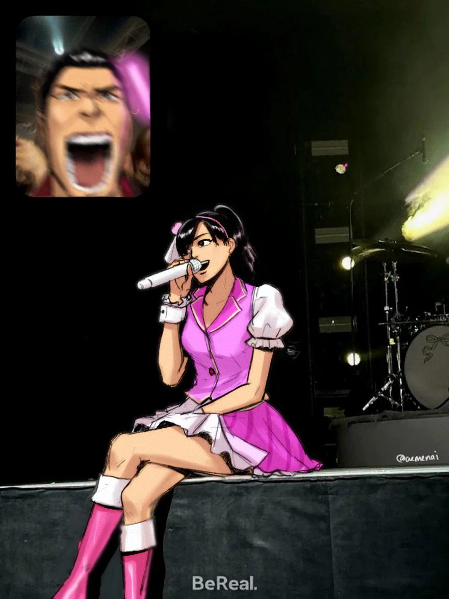

The most ambitious. The most explosive. The most ridiculous. The most
experimental. The most content-rich. The most twists. The most... everything.
Maybe a bit too much?

This released in a somewhat turbulent time for the series. At least, that's what
it looks like in retrospect.

The Yakuza series had received a few flops in the last few years. Both were
spinoffs. One was a PSP exclusive that gained so little traction that over a
decade later it still has not seen even an international release. The other was
a zombie-horror third person shooter (if you can even call it that with its
bizarre control scheme) that was so bad that it is the community's favorite
punching bag for memes to this day.

So, it was time to refocus.

Previously known as "New Entertainment R&D", the studio took on the name "Ryu Ga
Gotoku Studio", named after their iconic series, _Like a Dragon_. No longer
would they split their focus with _Super Monkey Ball_ games. They could direct
all of their effort towards sweaty, shirtless men punching each other while
screaming about honor and brotherhood. **At last**.

To celebrate this, it was time for the biggest, most grand Yakuza game ever. It
was time for a refresh of the series. RGG Studio considered it a "New Yakuza" or
a "reboot" (without rebooting the story). This would be beyond a culmination of
everything so far, it would boldly and firmly plant a foot in new territory. All
other Yakuza games up to this point were developed in a single year window,
which frankly seems insanely low to me today. This grand project was given _two
whole years_---which still seems insanely low to me, but it was huge at the
time. Additionally, the game engine was enhanced to the point that it was
effectively a whole new engine. The story was also given new direction: a
stronger focus on thematic foundations and cinematic storytelling (such as
scenes of "what the villains are doing" without a protagonist being involved).
It's still undoubtedly a Yakuza story, but it's clear that the writing process
and direction was changed significantly.

It's funny to see all of that looking back. I'm jumping ahead a little bit, but
Yakuza 6 would go on to overhaul the game engine and gameplay _again_. It would
also completely change storytelling patterns and tone of the series _again_. It
would change the way content was designed _again_. The changes made by Yakuza 6
would stick around for a while. The engine created for it is still used in the
most recent games almost a decade later.

Yakuza 5's "reboot/New Yakuza/ultimate Yakuza experience" would last only for
itself and Yakuza Zero[^1], which was a much better implementation of the
formula Yakuza 5 set up. For all its bluster, Yakuza 5 was less of a revolution
in the series, and more of the first stepping stone on the turbulent path of
experimentation the studio would take for a short time.

[^1]:
    Technically the Yakuza 5 engine was also used for _Like a Dragon Ishin!_,
    but at the time of writing, Ishin has been remade in Unreal Engine 4, with
    gameplay deviations that take it away from Yakuza 5. The original based on
    Yakuza 5 never saw a worldwide release. So, it feels like it wasn't part
    of the lasting legacy Yakuza 5 left on the series.

So, did it work? Was this really the best Yakuza game ever? Did the big swings
turn into big hits? It's... complicated.

The short answer is _yes_.

I like Yakuza Zero more, but I think this was the best at the time it released,
though only **barely** above Yakuza 4. It's a seriously mixed bag of a game. It
has some of the highest highs the series had seen, but also some incredibly low
lows. Some of those big swings turned into massive fumbles. It was too big,
lumbering and clumsy, tripping over itself sometimes. It had a few too many
twists, and tried to make a few too many characters important.

Still, _I loved it_.

I found myself **sobbing** near the end of the game. This story is truly
touching. I can legitimately picture myself looking back at this game in the
future as one of those pieces of media that inspires me to get through tough
times. This ridiculous soap opera masquerading as a crime drama about sweaty,
shirtless men taking any possible excuse to beat the shit out of each
other---actually brought me to _tears_.

The Haruka sections were refreshing, peak gaming and peak fiction. The best
stuff in the series so far. I unironically love that they said, "You know who
else is _just_ as vicious as the yakuza? The idol industry." It works so well.
Not just for this game, but for the series as a whole. Haruka is the first
playable female character in the series, and she's done so well. It's shown time
and time again that she is every bit as brave, determined, and dependable as the
men of the series.

{style="max-width: 15rem"}

This game also deserves some credit for setting up Yakuza Zero to be such a wild
success. All of the best parts of Yakuza 5 were used as foundations for Yakuza
Zero. They found what worked, what didn't, and perfected the formula. Even if
Yakuza 5 didn't revolutionize the series by leaving a mark on the future games,
it revolutionized the series by causing the community to grow explosively thanks
to the perfect prequel. Myself and many others never would have tried the series
without it, and that massive success has allowed the series to bloom better than
ever before. **That**, is a hell of a legacy.

---

# The Review {style="display: none"}

## Visuals

This was a significant step up from the previous entries. It still shares the
old "look", but it's the absolute peak of what they were able to squeeze out of
that old look. Textures and models are significantly better. There are more
cinematic shots than ever.

I don't have as much to say about this. The style hasn't changed pretty much at
all since Yakuza 4, it's just been perfected. It's pretty much exactly how
Yakuza Zero looks.

What I was impressed by was that it continued the trend 4 started by making the
game more cinematic than ever. I know that word is overused when describing
games to the point that it has been reduced to buzzword nothingness. I just
can't think of a better word for it. It feels like this was directed like a TV
Crime Drama. There are fewer and fewer of the cheaper style of cutscenes. The
high-budget, cinematic scenes have even more camera angles per scene. More time
is dedicated to pacing the scenes and letting tension linger when it needs to,
without ever dragging out. There were multiple times that I was so engrossed in
the story and it had been running for so long that I was interrupted by my
controller automatically shutting off and the game pausing to warn me of that.

Yes, this is a game. It has gameplay. It's also a full season of TV.

## Audio

This had by far the best soundtrack yet. I found it _really_ hard to narrow a
list down to a few tracks. If you want to, I highly recommend just finding a
playlist with the whole soundtrack on it and seeing what sticks for you. These
songs are what really stuck for me, after multiple rounds of narrowing things
down:

This is one of the [Random Battle Themes](https://youtu.be/oF0xZPQ9XG8) you can
get. It's an absolute banger every time it comes on. Unreasonably good for a
throwaway combat theme. It's chaotic. It's a jam. It's high energy. Everything
you want for a chaotic street fight in which you're grabbing anything not nailed
down to beat the shit out of each other with, all while remaining as stylish as
possible. They understood the assignment.

The [Final Boss Theme](https://youtu.be/AhfqIAPMbHQ) is absolutely killer. As
the name suggests, it's a battle for dreams. It's violent and aggressive, with
rising tension, but it's also hopeful and optimistic, and maybe a touch sad that
it has to be this way? Just picture those floaty guitar riffs while two dudes
hit a slow motion cross counter and then tumble away and spit blood on the
ground with a look of determination. It's that kind of song. It's so fitting.

Another of my favorite [Boss Themes](https://youtu.be/k1qwZG7-4Zw) comes up in a
moment that mirrors the ending of Yakuza 4. Four warrior legends stand on top of
a skyscraper and fight each other without holding back, out of respect. Trust
me, the presentation is _so_ bad-ass. This one is full of determination and
fighting spirit, but it's also beautiful. It's got a high/rush feel to it, like
"this is what we do this for". Killer.

The [Ending Theme](https://youtu.be/xZQHVN2rEN0) will never fail to yank an
emotional response out of me like it's got hooks in my soul. It's _so_ full of
hope and spirit. I love that it's broken into multiple parts that start to
align. It feels like it represents the story of the game itself beautifully.
Each of their Dreams twist together into a touching story. It ends with an
explosive finale that gives me chills.

## Gameplay

Gameplay is easily the best so far. They've really perfected this formula.

Something I noticed right away and I was very thankful for is that transitions
into combat are now seamless. No longer is there a jarring load screen or
cutscene between running around and being in combat. Combats just form up right
in the street you're running through. Enemies can also call for nearby backup or
run away. This all leads to the combat experience feeling far more grounded in
the world you spend the rest of your time in. It's nice!

Much like Yakuza 4, Yakuza 5 has multiple playable characters that have
different playstyles. Those styles are refined from their previous versions, and
they have a new twist! Each character has some unique twist to their moveset.
Kiryu can temporarily enter a state in which he is immune to damage, deals way
more damage, and has a much faster moveset. Akiyama upgrades his technical
moveset that's good at juggling enemies with a series of special moves that
literally air-juggle enemies like it's a Devil May Cry game. Saejima can pick
people up and use them as weapons. Shinada is just a regular dude, so he has an
ungraceful tackle similar to the one some basic enemies use, but can be quite
powerful when leveled up. The different playstyles were already fantastic for
keeping gameplay fresh, but these unique additions make them even more fun and
refreshing.

This game also had character select for some moments. This seems like a small
thing, but it's actually fantastic. Sometimes the choice was actually really
hard. Like, which character has more poetic relevance right now? Which
character's moveset do I feel more like using right now? Do I want to precisely
dismantle this place with Kiryu's legendary moveset, or do I want to just go
apeshit throwing people as Saejima? Even more fun, sometimes you'd have those
protagonist vs protagonist fights, and you'd get to choose which character to
play as. There's so much to think about there, and it also means the
powerscalers can finally shut up because the answer is "whoever the player is
controlling".

Shinada's playstyle is unique to this game, and I love the details of it. So
I'll spend some more time talking about it. Shinada is an ex-professional
baseball player. His moveset is all about his hand strength, raw athleticism,
and batting. He's not refined as a fighter, he's just got crazy reflexes and
coordination. His special move is a tackle that can shove people into walls or
tumble through other enemies. His attacks all look like he is _begging_ for a
bat. Some of his swings look like he is literally performing a baseball swing,
but with nothing in his hands. Some other strikes are wild, forceful swings, and
others look like he is swinging his arms like they have weapons in them and then
just hitting enemies with his fists instead. His grab attacks are fantastic. He
can combo his finishers into grab attacks, which is almost always the best
choice. Then, everything changes when he gets a weapon in his hands. Shinada is
the best weapon user in the game, possibly in the series. When other characters
hit a single time, Shinada lands 3-4 hits. With how powerful weapons are, that's
insane damage output. It's also insanely expensive, because that drains weapon
durability multiple times faster. Coincidentally, Shinada is always broke. This
leads to picking up every random object you can, as anything is an advantage.
His home city is perfect for this, with by far the most clutter available to be
used for this purpose out of any city in the series.

My favorite part about Shinada's gameplay is that baseball bats are occasionally
scattered throughout all the clutter he could pick up. The first time I saw one,
I thought this is _perfect_. Shinada can finally go all out with some crazy
baseball bat swings. Other characters can use baseball bats to great effect, but
Shinada must have some crazy unique abilities! If you pick up a bat as Shinada,
he looks at it with pride, turns it over in his hands a few times and feels the
balance of it. Then puts it back on the ground with a smile. Shinada respects
baseball bats too much to use them as weapons. It's _such a thing he would do_.
It's perfect.

Of course, I **have** to talk about the Haruka sections.

Haruka doesn't fight with violence. She has several different rhythm games that
she uses for street dance battles, battle-of-the-band concerts, solo concerts
and more. The rhythm games aren't flawless, but they're better than most
rhythm-games-embedded-in-another-game that I've seen. It's also impressive that
there are multiple of them for different circumstances. They all have different
vibes, while maintaining similar mechanics. Street dance battles are more
chaotic and feel more like keeping several plates spinning, with shorter song
lengths and the ability to cut the fight short by being _way_ better than your
opponent. Concerts feel like more traditional rhythm games in which you chase a
high score and/or go for a full combo. Concert contests feel like a competetive
variant of the traditional rhythm game experience.

It's also very cool how much main Yakuza mechanics are translated into rhythm
game mechanics. For example, Yakuza combat has special moves called Heat Actions
that consume a special meter that you build up during the fight. Haruka's
gameplay features similar special moves triggered in similar ways. In concerts,
it's like Rock Band's Overdrive, but really special circumstances can lead to
Haruka pulling out a quick-change outfit at just the right moment in a song,
equivalent to the slowly-recharging ultimate abilities the combat characters
have access to. In street dance battles, Haruka can activate special moves that
affect the fight in different ways such as boosting her multiplier, healing her,
doing direct damage to her opponent, and more. The rhythm games are all more
advanced versions of the karaoke minigames that have been in the game since the
start, which is a fun way to bridge things in-universe.

Further, Haruka can level up in multiple stats: singing ability, dancing
technique, appeal, and overall skill. These all have different effects during
her gameplay, and can be trained in different ways. She can also level up and
unlock active and passive skills just like the other characters. Customization
of Haruka's playstyle is just as deep as that of the combat characters, which is
really impressive for a rhythm game.

I also found myself doing optional content as Haruka more than any other
character in any other Yakuza game. I generally only do a side story if it
catches my interest---either it seems like my kind of humor, or it seems like it
will be a nice story moment for the character I'm playing as. As Haruka, I was
doing almost all of them. Most of them either helped Haruka advance her stats in
some way, or had really touching story content. Sometimes both! It was also
enjoyable just to get more rhythm game time. I like rhythm games.

All this training made me feel very invested in Haruka's abilities. I could test
myself against a challenge equal to the final challenge of the game and see how
my current stats would hold up. With lower stats, I'd have to land perfect hits
on every note for the full song, but with more stats I could give myself more
wiggle room. I did not want to halt the game at the end to try the challenge
multiple times. I wanted to ace it first try, just like Haruka. So of course I
wanted to train as much as I could stand to ensure I could ace it. Some really
good ludonarrative harmony there. It also made me feel actually proud at the end
when I flew by the challenge effortlessly and took a victory lap. I really felt
like Haruka was out there killing it.

I would play an entire game as Haruka.

Best gameplay in the series so far!

## Story

I'll be covering important spoilers in ||spoiler blocks||. I consider important
spoilers to be things like twists, big reveals, character deaths (if any), and
so on. Stuff that's advertised on the cover of the game like playable characters
and locations are things I don't consider important spoilers. I'll also be
talking in broad strokes about character arcs, without details, outside of
spoiler blocks.

### The Bad

I'm going to start with my criticisms so that I can end this section with
everything I loved.

This story was massive. This was more than double the length of the second
longest game in the series so far. I'm having a hard time fitting its entirety
in my head to write this. I don't necessarily mind long games, but this felt
long because it needed to reach arbitrary quotas. There was a lot of fat that
could be cut. It could have been perhaps 2/3 of it's current length, and it
would still be the longest Yakuza game to date while keeping all of the
important story beats. I'll give some examples:

Saejima has _another_ prison arc. This arc was the worst part of Yakuza 4---can
you guess how well it fits into this one? During this section, you are sent on
random fetch quests by other prisoners so you can trade items, information, and
favors around to get what you really want (usually information). This is exactly
how Yakuza 4 already had it play out. It didn't need a repeat. Just give me the
information in a more convenient way, and move on. This section is made even
longer because the developers felt like players wouldn't like a section of a
Yakuza game where they can't access all the minigames and side-content like the
others. So they give you some daydream sequences in which you explore one of the
game's cities and are forced to partake in some of those minigames. It's like
the devs heard that the Yakuza 4 prison section was a low point for the game,
and "fixed" it in all the wrong ways and somehow made it worse.

Then, Saejima breaks out of prison (again) and is stuck in a blizzard. You fist
fight a massive man-eating bear. It's an utterly ridiculous, incredible boss
fight, culminating in what has to be the single best final knockout blow in the
series thus far. Alright, I'm on board now! ...Then you spend the longest
chapters in the game being part of a hunting village, trapped here because the
snow has forced all nearby roads to close. You play out this long arc helping
this hunter get revenge on the same bear you just had a fist fight against.
Except, now you're a hunter. You've got to sneak through the snow at a glacial
pace, slowly reload your two-shot rifle, and play an incredibly clumsy attempt
at a first person shooter. **That's** how you take out the bear. Oh, but first,
gotta learn how to set traps and hunt deer and stuff. It's _so slow_. This could
have been a great chapter if we were allowed to simply chase down the bear and
fist fight it again, then head out.

Man, I love Saejima as a character, but he just can't catch a break with the
worst arcs of every game he's in.

There's also a lot of time spent getting all the characters caught up to speed
with what's happening in other characters' stories. This could have been
replaced with more cut-away "...so that's what happened" moments (like the game
already does in a few spots).

There were also some arcs where a minor villain was set up only to reveal that
they were only a proxy for a greater villain. This isn't so bad, but it happened
so frequently that it felt like the game could have been way shorter with a few
less proxies and more screen time for the main bad guys.

Beyond feeling long, many things felt very recycled. Some from the rest of the
series, fine, but some from earlier in the same game. They were probably going
for thematic parallels, but it got old when the same twist was played out for
the 4th time. I won't mention those twists here for spoiler reasons, but the
pattern will become extremely clear if you play the game.

Some arcs got recycled, as well. This is possibly what the dev team meant when
they said this was a "reboot" of the series. For example, Saejima has a prison
escape arc, again. Kiryu is trying to hide from his Yakuza past and gets dragged
back in, again. Akiyama discovers that one of his debtors is involved in a
string of murders, and his good nature gets him roped into the plot, again. A
man well-known by his local community digs into the past when he was wronged and
discovers a yakuza plot that involves and endangers his community. The conflict
between the Tojo Clan and the Omi Alliance is at the forefront, again. Some of
these are running themes throughout the series, but some of them were introduced
only in Yakuza 4. It's weird to see repeats so soon afterwards.

This story also had a few twists too many. The Yakuza series is known for its
crazy, dramatic twists. You expect that going in. It's okay if a twist isn't
absolutely perfect as long as it's fun. Some logic can get thrown out of the
window, as a treat. I'm here for the ride, as cheesy and pulpy as it gets.
Yakuza 5 being "the ultimate/new Yakuza", it _had_ to have the most twists ever,
right? Yakuza 5 weaves a beautiful, delicate construction of a story. The twists
are generally within expectations for the series, and they connect together in
interesting (even if pulpy) ways. Then, right at the end, one big twist gets
turned too hard and the entire structure collapses in on itself.

In short ||Aizawa|| is the problem. His entire character arc is so incredibly
stupid. This is definitely spoilers, but it's such a pointless background
element that I refuse to admit is part of the story. I recommend reading it just
for the absurdity. ||You have a character who is introduced as a naive young
punk in over his head, Aizawa. His sworn brother and mentor, Morinaga, is
fatally wounded and Aizawa tries to save him. Morinaga is proclaimed dead.
Morinaga later reappears, betrays the clan, and says that he has killed Aizawa.
A body is found, unidentified, but we know Morinaga killed Aizawa, so it must be
him. Aizawa later reappears, searching for Morinaga because he wants to
understand why he betrayed the clan. So, Morinaga never killed him? Who was the
body? Aizawa ends up committing murder in trade for information on Morinaga's
whereabouts, but is denied the information because it was a test and refusing to
commit murder was the correct answer. This sends him into a deep spiral where he
feels like he has failed everyone. Saejima inspires Aizawa to pick back up his
search for Morinaga, as long as he never crosses the line of murder. He
disappears until the end of the game. He reappears by beating up and killing
many Tojo clan members to provoke Kiryu into a fight so that he can prove he is
the strongest. He reveals (shocking twist) he is the son of the enemy faction
leader (no one thought to background check him before making him the bodyguard
of the head of our faction). He also reveals that the unidentified body is
Morinaga. So, lets get this straight: Aizawa saves Morinaga's life, then later
murders him, then spends tons of time searching for the man he murdered and goes
into a depressive spiral due to failing to find the man he murdered, and is
inspired to find the man he murdered without ever crossing the line of murder.
He then choses to prove himself against Kiryu, despite already losing every
other fight he is depicted in (including a two-on-one against Kiryu).||

All of these twists are dropped directly at the end of the game, to introduce
the final boss. It also ruins || Kurosawa's || arc by refusing to let it end
when it should, and instead extending it to this nonsensical, desperate play. I
don't consider this the ending of the game. I consider the game to have ended
just before this, and the rest of this is a dream Kiryu had due to exhaustion.
It's such a pointless retcon that adds nothing and only ruins the rest. It can
be entirely ignored and the story suddenly improves tenfold. It's equivalent to
taking a masterpiece of a painting and then taking a literal dump on it before
calling it done. They were too cowardly to go for a Haruka finale (which would
have been perfect), and instead invented a final boss for Kiryu out of thin air
with no regard for the impact on the rest of the story. It feels like management
stepped in and ruined the art with focus-group-tested nonsense applied in the
wrong places. This is the game's greatest sin, possibly the worst writing in the
series so far, but thankfully it can be safely removed from the story without
issue. If they do a "remake" of the game in the future instead of a remaster, I
imagine all of this will be entirely cut. It's just a shame that it tarnished an
otherwise perfect ending.

That was a lot of complaining, but I really do love this game. That should show
just how much I enjoyed the rest of the experience. I'm glad that it's time to
talk about that stuff now:

### The Good

I absolutely adored the intro to this game. ~~Kiryu's~~ Taichi Suzuki's whole
section was fantastic from beginning to end. We start with Daigo Dojima having a
tense Yakuza meeting, then getting in a random taxi with a driver wearing a mask
and sunglasses. Still, it's pretty easy to tell who's under there. Daigo talks
about "work" to this taxi driver, clearly looking for advice. The driver stops
the car and lets him out, and Daigo takes the hint that he'll "have to find his
own way". The taxi driver takes off the mask to reveal that it was Kiryu all
along, and he's in hiding, with the name Suzuki (which I've heard is the
equivalent of a "John Smith"). We see on the news that Haruka is an idol, and
it's a sore spot for Kiryu, though he clearly supports her. We soon learn that
Kiryu is in hiding specifically to distance his past from Haruka so that she can
have a shot at her dream.

It's a brilliant opening. It tells us so many things about the game and sets the
tone right away. There are conspiracies afoot. There will be tons of intrigue,
and nothing will be as it seems. Most importantly, this is a story about dreams,
and what we sacrifice to see them come true. So important that the Japanese
version of the game is subtitled "Fulfiller of Dreams".

Of course, Kiryu's time in hiding doesn't last long. The conspiracies unfolding
involve him whether he wants them to or not. Once again, his past haunts him.
What follows is my favorite Kiryu arc so far. Kiryu wants nothing more than to
fade into the backdrop, but people keep digging up his legend. Kiryu shows them
_why the dragon is a legend_. || Kiryu prevents a war by drifting his taxi in
between two armies, looking at the better-equipped side, and saying "If I beat
the shit out of every single one of you alone, then there's no war". Then
proceeds to pull off the most incredible feats the series has seen so far,
including [the most casual dodging of heat seeking
missiles](https://youtu.be/pD9SOMkGTKM). It's such a powerful feeling fight. You
routinely get ganged up on and trapped. It repeatedly feels like maybe Kiryu has
finally taken on too great a task, and then he manages to find a way out
repeatedly. You get to fight through _so many_ enemies, in the longest fight in
the series, as you watch the reserves of enemies fall dwindle more and more to
show your progress. || It's the pinnacle of bad-ass. It's perfect. It could be
the ending to another Yakuza game, but we're less than a quarter of the way
through.

Then we get Saejima's section. I love Saejima as a character. He's got this
stoic wisdom born from his unwavering spirit and his heavy experience with tough
times. He will shoulder any burden, and hear anyone out. Then he'll tell them to
project their depression onto himself and fight him to find their determination.
He's a wildly selfless and heroic character. This section may have dragged on a
bit, but Saejima carried me through it.

Saejima's section serves to reinforce the themes of the game in several
interesting ways. The prisoners dream of being free. Even those who initially
feel like their hard time is deserved and do not seek parole, eventually have
this dream passed on to them. It becomes their dream too. Once out in the woods,
Saejima takes on the dream of the hunter who rescued him: to kill the legendary
bear that's terrorized the village for years. These themes were kicked off
lightly in Kiryu's section, but while it focused on the greater conspiracy,
Saejima's section focuses directly on what dreams mean to us and those around
us.

**Then we get to peak gaming**. It's Haruka time. We're shown the dark
underbelly of the Idol industry. We're shown Haruka's determination and passion.
We're shown that her dream is aligned with those around her. We see the dreams
and the conspiracies start to twist together, tying the major elements of the
story to each other. More on Haruka [later](#the-excellent).

I very much enjoyed Akiyama's inclusion in this section. He's the perfect fit
for the kind of intrigue going on, and his roguish charm is a great foil for the
dark, serious villains it contains. He lightens up the scenes he's in, and his
warm, comforting nature is great for reassuring the cast of Haruka's section.
He's also a blast to play as, in this game more than ever.

Akiyama is also an excellent example of the dream fulfillment theme. He has no
real stake in the game. No family ties. No debts or other finances wrapped up in
the situation. He just gets enchanted by a dream, and puts his life on the line
repeatedly to see it fulfilled.

Okay, everything is starting to come together here. All the plot lines are
converging and we're starting to see the overall shape of this mystery, but the
mystery has yet to unravel.

Enter Shinada, the final playable character of Yakuza 5. He's a man down on his
luck with a heart of gold. He got screwed out of his promising baseball career
15 years ago, but never blames anyone else. He would rather live in poverty than
reveal any dirt that would cause fans to lose the dreams they've entrusted to
the team. Though desperate for cash, not enough to even feed himself, and loan
sharks literally snatching paychecks out of his hand, he'd never fail to get
someone back their change. It turns out that this guy's backstory is also tied
into the grand conspiracy, because of course it is.

Shinada's section is full of some of my favorite character writing in the
series. They all feel so human. The story dives into their flaws, the lies they
tell themselves to stay sane, their dreams and what they'd give up for them, and
the power of found family no matter how unusual.

While the other sections are about how dreams spread and intertwine, what we
sacrifice for dreams, and how dreams give us the determination to carry
on---Shinada is a man whose dream was robbed. He runs from it. Hides from it.
His dream brings him pain but he can seemingly never give it up, no matter how
hard he tries. Despite "avoiding" baseball, he keeps track of detailed baseball
statistics as a hobby. He competes at the batting center for cash prizes to feed
himself. What a metaphor, huh? His dream, even as he claims to avoid it, is
literally what is feeding him and keeping him alive. It's all he really needs.

Then we get to the big finale. Everything comes together. The stakes are as high
as possible, everyone's dreams and conspiracies are entwined. There's no
untangling this now, and they're all on a collision course.

Everything is propped against Haruka's dream. I'm already a sucker for those
"going to nationals, our future depends on this!" type stories. It's a classic
tale, and entire stories have been written about those stakes alone. However,
everything _else_ in the game is balanced on top of this. The tension is
amplified by this. Watching Haruka get up there are sing her heart out
legitimately made me cry proud, happy tears. The could not have executed that
part any more perfectly.

In the background, dream after dream is lining up and fulfilling itself while
also taking an obstacle out of the way for Haruka. || Saejima gets to prove
himself to Majima and win his family back even if it costs his freedom. Shinada
finds a new love for his dream after seeing the stadium from a fan's
perspective, and comes to terms with his past by saving lives with his
knowledge. Akiyama finally becomes a legend in both his hometown and among the
yakuza. ||

Then, the ultimate finale. I don't love the justification or setup for the final
boss, but I really enjoyed what it represented. As Haruka finishes her debut
performance, || she realizes that this was always someone else's dream that she
inherited. Now that it's complete, she's free, and wants to return to her
family. She proudly proclaims this to the audience, and announces her immediate
retirement. Meanwhile, Kiryu has broken free from defending Haruka's dream, and
on to defend his own. Kiryu always has been, and always will be a yakuza legend.
Kiryu engages in an ultimate showdown, _while wounded_, and proves once and for
all that he is _the strongest_. Kiryu's dream has always been to continue to
prove himself as a yakuza, to continue to bare his soul in combat. The moment
Haruka wraps up her dream, Kiryu is free to pursue his own. Not only that, his
dream is pitted directly against that of Aizawa. When Aizawa lies defeated,
Kiryu leaves him with this: Don't give up on your dream. No matter how long it
takes. I will be here for you. Face me again. || In this one last punch, Yakuza
5 reinforces this: Never give up. Even in the most climactic moment, even with
dreams pitted against each other, no dream can ever die, not even the enemy's.

### The Excellent

I want to talk more about Haruka's inclusion in this game, and why it's
brilliant.

The Yakuza series has an interesting relationship with gender---one that's
changed a lot over the series.

At the start, this was a story about men. In a way, it was a story about
masculinity, especially about healthy masculinity triumphing over toxic
masculinity. It was a story about brotherhood, about fighting to protect family,
responsibility, honor, holding other men accountable, and so on. In this early
era of Yakuza, women were mostly used as motivators for men. There's a damsel in
distress! How does the suffering and/or death of this woman affect the male main
characters? Even when a woman was (rarely) physically strong enough to be a
combatant, she was still clearly created as a plot device in a man's story.

At the same time, fairly early on these games started to introduce minigames
about playing dress up, coordinating outfits with jewelry and accessories, and
so on. These kinds of minigames are now iconic mainstays of the series.

At the same time as that same time, it's had minigames clearly designed to
objectify women. From games of ping-pong in very loose-fitting robes all the way
up to "adult chatroom quick-time events". So, it never had _great_ footing.

Still, it's been improving. Some of the worst stuff has been cut from remakes.
It's had a few instances of good transgender representation. The women of later
games are becoming better written. It's still not perfect, but it's making an
effort.

Then we get to this Haruka section, and I'm delighted with how they handled it.
Haruka, and the women of her world, are shown repeatedly to be just as strong,
determined, and dependable as any of the male characters in the series. No,
they're not 7-feet tall and covered with rippling muscles. They're stronger than
that, because they aren't that. They are fragile. A man lashes out at Haruka's
mentor and it injures her for the rest of the story. Heavy, intimidating Yakuza
surround Haruka, and she cows away from them. Haruka reveals blisters on her
feet caused by dance practice, and is visibly in pain from them. Haruka's vocal
instructor is overwhelmed by all the tragedies surrounding her. There are many
more cases.

What demonstrates the strength of these women is not that they remained stoic in
the face of adversity or sought to tackle everything on their own. What makes
them strong is that they never let any of it slow them down. Haruka's mentor
continued to write with her other hand. Haruka would not back down from
intimidating yakuza despite her visible terror. The vocal instructor relied on
those around her to share her burdens and ensure Haruka's dream could become
reality.

These moments of strength and determination are given exactly as much weight as
the other characters in the story. Haruka _is_ a main character, and her story
arc is every bit as dramatic and fun as any Yakuza story to date.

The men fight with violence. Haruka fights with dance. The men bare their souls
through combat. Haruka bares her soul through her voice. The men deal with the
twisted world of yakuza betrayals. Haruka deals with the twisted world of the
idol industry.

Yes, the idol industry is given every bit as much weight as the yakuza. It's
fantastic.

As another inversion of the old issues, one of the main female characters has a
previous love interest come up as an important plot point. This man is slid to
the side, only to be used to prop up the woman's story, because it's about her.
That man? || Majima, a character so popular that he's getting his own game soon.
|| _That_ is the level of male character they were willing to shove aside to
make sure the story wasn't overtaken by them, it's about the women this time. Is
that good writing? Perhaps not, but it's at least interesting to see an old flaw
have the typical gender roles flipped.

What I love most about Yakuza 5 is that it takes Haruka seriously. She's a
teenage girl dealing with bullying, paparazzi, and incredible pressure to
fulfill a dream on stage. She goes out for food and shopping with her friends
after school. She learns to express her own style, and grows confident in
herself as a woman. She's a more relatable figure than these massive beasts of
combat---she's just a girl with a dream.

She's all of that, and she's also the true main character of Yakuza 5.

When the sky is falling and everything is going wrong, when Kiryu and the gang
have the chance to step in and protect Haruka at the cost of her agency and her
dream, they outright refuse. Kiryu snaps himself out of an exhaustion and wound
driven slumber to firmly say "absolutely not". It's Haruka's choice, and it
always will be. Instead, Kiryu has a message passed on to her, "Never give up".
This isn't a command. This isn't overbearing advice she didn't ask for. It's
encouragement, plain and simple. He knows that she doesn't need any of that
other stuff from him. He simply sends his love. What's even better is that when
she receives those words, they aren't some magic that sets her on the right
track, she was already plenty determined enough on her own. The words just bring
her a small bit of comfort, and honestly, serve more as a demonstration of a
good bond for the messenger to observe as part of his own arc.

Those simple words really hit me. Throughout the rest of the game, they echoed
through my head. When the last line of defense kept dwindling and only Akiyama
remained, _Never give up_. When Shinada teared up at the sight of the Tokyo Dome
from the bleachers, _Never give up_. When Saejima was forced to fight to the
death, _Never give up_. When Haruka saw Kiryu fighting in the streets on the
news while preparing to go on stage. **_Never_**. **_Give_**. **_Up_**.

When it's all on the line, Haruka is the closer. Her dream is at the center. She
brings the story home and wraps it up. It's peak fiction. It made me sob.

## Final Thoughts

**Rating: 8/10**  
_Playtime: 34 hours_

This was a flawed game, but I'll treasure it forever.

I'm so glad I'm playing this series.

I cried again while writing this.

> Never give up.  
> <cite>--- Kazuma Kiryu</cite>
